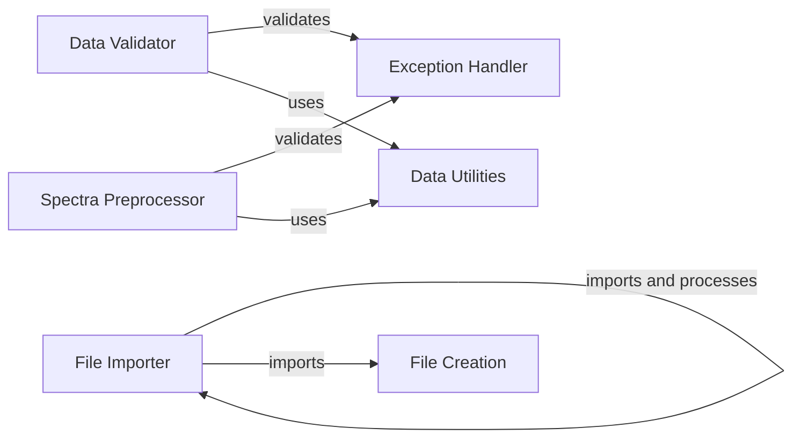

## Component Details

The Data Processing component is responsible for importing, validating, and preprocessing data within the DataHowLab ecosystem. It ensures that data from various file formats meets the required quality standards and is in the correct format before being used for further analysis or model training. The component includes functionalities for importing spectra and run files, validating data against predefined schemas, and preprocessing spectra data for model predictions. It handles exceptions related to invalid data and provides utility functions for data validation and conversion.

### File Importer
This component handles the import of various file types, including spectra and run files. It extracts data from the files and creates corresponding file database entities for further processing.

**Related Classes/Methods**:

- <a href="https://github.com/DataHow/datahowlab-sdk-python/blob/master/dhl_sdk/importers.py#L60-L87" target="_blank" rel="noopener noreferrer">`dhl_sdk.importers.SpectraFileImporter:import_file` (60:87)</a>
- <a href="https://github.com/DataHow/datahowlab-sdk-python/blob/master/dhl_sdk/importers.py#L37-L51" target="_blank" rel="noopener noreferrer">`dhl_sdk.importers.RunFileImporter:import_file` (37:51)</a>

### Data Validator
This component validates data against predefined schemas and rules. It checks for various conditions, such as data types, formats, and dependencies, and raises exceptions if validation fails.

**Related Classes/Methods**:

- <a href="https://github.com/DataHow/datahowlab-sdk-python/blob/master/dhl_sdk/validators.py#L114-L217" target="_blank" rel="noopener noreferrer">`dhl_sdk.validators.VariableValidator:validate` (114:217)</a>
- <a href="https://github.com/DataHow/datahowlab-sdk-python/blob/master/dhl_sdk/validators.py#L375-L534" target="_blank" rel="noopener noreferrer">`dhl_sdk.validators.RecipeFileValidator:validate` (375:534)</a>
- <a href="https://github.com/DataHow/datahowlab-sdk-python/blob/master/dhl_sdk/validators.py#L561-L675" target="_blank" rel="noopener noreferrer">`dhl_sdk.validators.ExperimentFileValidator:validate` (561:675)</a>
- <a href="https://github.com/DataHow/datahowlab-sdk-python/blob/master/dhl_sdk/validators.py#L695-L805" target="_blank" rel="noopener noreferrer">`dhl_sdk.validators.SpectraFileValidator:validate` (695:805)</a>

### Spectra Preprocessor
This component preprocesses spectra data, validating its format and converting it into a request format suitable for model predictions. It handles exceptions related to invalid spectra or inputs.

**Related Classes/Methods**:

- <a href="https://github.com/DataHow/datahowlab-sdk-python/blob/master/dhl_sdk/_input_processing.py#L102-L185" target="_blank" rel="noopener noreferrer">`dhl_sdk._input_processing.SpectraPreprocessor:validate` (102:185)</a>
- <a href="https://github.com/DataHow/datahowlab-sdk-python/blob/master/dhl_sdk/_input_processing.py#L187-L229" target="_blank" rel="noopener noreferrer">`dhl_sdk._input_processing.SpectraPreprocessor:format` (187:229)</a>

### Exception Handler
This component defines custom exceptions raised during data processing, such as ImportValidationException, InvalidSpectraException, and InvalidInputsException. These exceptions provide specific information about the errors encountered during import, validation, or preprocessing.

**Related Classes/Methods**:

- <a href="https://github.com/DataHow/datahowlab-sdk-python/blob/master/dhl_sdk/exceptions.py#L100-L105" target="_blank" rel="noopener noreferrer">`dhl_sdk.exceptions.ImportValidationException` (100:105)</a>
- <a href="https://github.com/DataHow/datahowlab-sdk-python/blob/master/dhl_sdk/exceptions.py#L22-L27" target="_blank" rel="noopener noreferrer">`dhl_sdk.exceptions.InvalidSpectraException` (22:27)</a>
- <a href="https://github.com/DataHow/datahowlab-sdk-python/blob/master/dhl_sdk/exceptions.py#L30-L35" target="_blank" rel="noopener noreferrer">`dhl_sdk.exceptions.InvalidInputsException` (30:35)</a>

### Data Utilities
This component provides utility functions for data processing, including spectra validation, data conversion, date format validation, and list element validation. These utilities are used by other components to perform common data manipulation tasks.

**Related Classes/Methods**:

- <a href="https://github.com/DataHow/datahowlab-sdk-python/blob/master/dhl_sdk/_spectra_utils.py#L55-L85" target="_blank" rel="noopener noreferrer">`dhl_sdk._spectra_utils._validate_spectra_format` (55:85)</a>
- <a href="https://github.com/DataHow/datahowlab-sdk-python/blob/master/dhl_sdk/_spectra_utils.py#L88-L153" target="_blank" rel="noopener noreferrer">`dhl_sdk._spectra_utils._convert_to_request` (88:153)</a>
- <a href="https://github.com/DataHow/datahowlab-sdk-python/blob/master/dhl_sdk/_utils.py#L176-L182" target="_blank" rel="noopener noreferrer">`dhl_sdk._utils.is_date_in_format` (176:182)</a>
- <a href="https://github.com/DataHow/datahowlab-sdk-python/blob/master/dhl_sdk/_utils.py#L160-L168" target="_blank" rel="noopener noreferrer">`dhl_sdk._utils.validate_list_elements` (160:168)</a>

### File Creation
This component is responsible for creating file database entities. It is invoked by different file importers.

**Related Classes/Methods**:

- <a href="https://github.com/DataHow/datahowlab-sdk-python/blob/master/dhl_sdk/db_entities.py#L633-L645" target="_blank" rel="noopener noreferrer">`dhl_sdk.db_entities.File:create_file` (633:645)</a>