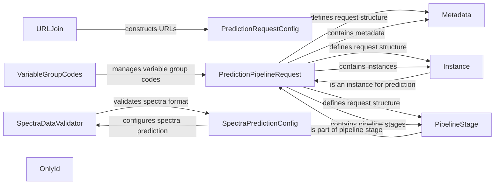

## Component Details

The Utilities component provides essential utility functions and data structures used throughout the SDK. It includes functionalities for constructing URLs, validating data formats (especially spectra data), managing configuration settings for prediction requests, and defining data structures for prediction pipelines. These utilities ensure data consistency, proper request formatting, and streamlined communication between different components of the SDK.

### URLJoin
The `urljoin` function constructs URLs by joining a base URL with a relative path, ensuring correct formatting regardless of trailing slashes.

**Related Classes/Methods**:

- <a href="https://github.com/DataHow/datahowlab-sdk-python/blob/master/dhl_sdk/_utils.py#L151-L157" target="_blank" rel="noopener noreferrer">`dhl_sdk._utils.urljoin` (151:157)</a>

### PredictionRequestConfig
The `PredictionRequestConfig` class manages configuration settings for prediction requests, encapsulating parameters like model IDs and input data formats for structured request definition and validation.

**Related Classes/Methods**:

- <a href="https://github.com/DataHow/datahowlab-sdk-python/blob/master/dhl_sdk/_utils.py#L82-L96" target="_blank" rel="noopener noreferrer">`dhl_sdk._utils.PredictionRequestConfig:new` (82:96)</a>

### SpectraDataValidator
The `_validate_spectra_format` function validates the format of spectra data, ensuring it conforms to the expected structure before prediction, checking for required fields and data types.

**Related Classes/Methods**:

- <a href="https://github.com/DataHow/datahowlab-sdk-python/blob/master/dhl_sdk/_spectra_utils.py#L55-L85" target="_blank" rel="noopener noreferrer">`dhl_sdk._spectra_utils._validate_spectra_format` (55:85)</a>

### VariableGroupCodes
The `VariableGroupCodes` class (singleton) stores and manages variable group codes for validating variable groups during import, ensuring consistency in assignments.

**Related Classes/Methods**:

- <a href="https://github.com/DataHow/datahowlab-sdk-python/blob/master/dhl_sdk/_utils.py#L40-L42" target="_blank" rel="noopener noreferrer">`dhl_sdk._utils.VariableGroupCodes.get_variable_group_codes` (40:42)</a>

### PredictionPipelineRequest
The `PredictionPipelineRequest` class defines the structure of requests sent to the prediction pipeline, including metadata, instances, and pipeline stages for standardized request formatting.

**Related Classes/Methods**:

- <a href="https://github.com/DataHow/datahowlab-sdk-python/blob/master/dhl_sdk/_utils.py#L137-L142" target="_blank" rel="noopener noreferrer">`dhl_sdk._utils.PredictionPipelineRequest` (137:142)</a>

### Metadata
The `Metadata` class represents metadata associated with a prediction request, storing information like timestamps and user identifiers to provide context for prediction results.

**Related Classes/Methods**:

- <a href="https://github.com/DataHow/datahowlab-sdk-python/blob/master/dhl_sdk/_utils.py#L121-L125" target="_blank" rel="noopener noreferrer">`dhl_sdk._utils.Metadata` (121:125)</a>

### OnlyId
The `OnlyId` class represents an object with only an ID, serving as a simple data structure for passing identifiers between components.

**Related Classes/Methods**:

- <a href="https://github.com/DataHow/datahowlab-sdk-python/blob/master/dhl_sdk/_utils.py#L107-L110" target="_blank" rel="noopener noreferrer">`dhl_sdk._utils.OnlyId` (107:110)</a>

### PipelineStage
The `PipelineStage` class represents a stage in the prediction pipeline, defining input and output data formats to ensure compatibility between pipeline components.

**Related Classes/Methods**:

- <a href="https://github.com/DataHow/datahowlab-sdk-python/blob/master/dhl_sdk/_utils.py#L128-L134" target="_blank" rel="noopener noreferrer">`dhl_sdk._utils.PipelineStage` (128:134)</a>

### Instance
The `Instance` class represents a single data instance for prediction, encapsulating input features and target variables for a prediction request.

**Related Classes/Methods**:

- <a href="https://github.com/DataHow/datahowlab-sdk-python/blob/master/dhl_sdk/_utils.py#L45-L71" target="_blank" rel="noopener noreferrer">`dhl_sdk._utils.Instance` (45:71)</a>

### SpectraPredictionConfig
The `SpectraPredictionConfig` class represents the configuration for spectra prediction, including parameters like wavelength ranges and spectral resolution for structured spectra prediction requests.

**Related Classes/Methods**:

- <a href="https://github.com/DataHow/datahowlab-sdk-python/blob/master/dhl_sdk/_utils.py#L99-L104" target="_blank" rel="noopener noreferrer">`dhl_sdk._utils.SpectraPredictionConfig` (99:104)</a>