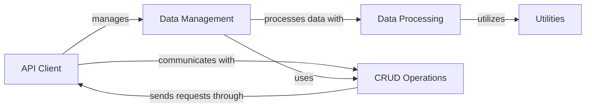

## Component Details

The DataHowLab SDK provides a Python interface for interacting with the DataHowLab API. It offers functionalities for managing data entities like experiments, products, and recipes, as well as data models and datasets. The SDK handles authentication, data validation, and data transformation to facilitate seamless communication with the DataHowLab platform. It also includes utilities for importing data from various file formats and preprocessing data for model predictions.

### API Client
The API Client component is responsible for managing the communication with the DataHowLab API. It handles authentication, constructs requests, and processes responses. It provides a unified interface for interacting with the API endpoints, abstracting away the underlying HTTP requests and response handling.

**Related Classes/Methods**:

- <a href="https://github.com/DataHow/datahowlab-sdk-python/blob/master/dhl_sdk/client.py#L38-L250" target="_blank" rel="noopener noreferrer">`dhl_sdk.client.Client` (38:250)</a>
- <a href="https://github.com/DataHow/datahowlab-sdk-python/blob/master/dhl_sdk/client.py#L253-L533" target="_blank" rel="noopener noreferrer">`dhl_sdk.client.DataHowLabClient` (253:533)</a>
- <a href="https://github.com/DataHow/datahowlab-sdk-python/blob/master/dhl_sdk/authentication.py#L30-L85" target="_blank" rel="noopener noreferrer">`dhl_sdk.authentication.APIKeyAuthentication` (30:85)</a>

### Data Management
The Data Management component encompasses the handling of data entities and models within the DataHowLab SDK. It defines the structure for various entities like Experiments, Products, Recipes, Datasets, and Models. This component provides functionalities for creating, validating, and retrieving these entities from the DataHowLab API, ensuring data integrity and consistency.

**Related Classes/Methods**:

- <a href="https://github.com/DataHow/datahowlab-sdk-python/blob/master/dhl_sdk/db_entities.py#L781-L1011" target="_blank" rel="noopener noreferrer">`dhl_sdk.db_entities.Experiment` (781:1011)</a>
- <a href="https://github.com/DataHow/datahowlab-sdk-python/blob/master/dhl_sdk/db_entities.py#L502-L576" target="_blank" rel="noopener noreferrer">`dhl_sdk.db_entities.Product` (502:576)</a>
- <a href="https://github.com/DataHow/datahowlab-sdk-python/blob/master/dhl_sdk/db_entities.py#L665-L778" target="_blank" rel="noopener noreferrer">`dhl_sdk.db_entities.Recipe` (665:778)</a>
- <a href="https://github.com/DataHow/datahowlab-sdk-python/blob/master/dhl_sdk/entities.py#L53-L120" target="_blank" rel="noopener noreferrer">`dhl_sdk.entities.Dataset` (53:120)</a>
- <a href="https://github.com/DataHow/datahowlab-sdk-python/blob/master/dhl_sdk/entities.py#L152-L230" target="_blank" rel="noopener noreferrer">`dhl_sdk.entities.Model` (152:230)</a>

### Data Processing
The Data Processing component focuses on transforming and validating data for use within the DataHowLab ecosystem. It includes functionalities for importing data from various file formats, preprocessing data for model predictions, and validating data against predefined schemas. This component ensures that data is in the correct format and meets the required quality standards before being used in further analysis or model training.

**Related Classes/Methods**:

- <a href="https://github.com/DataHow/datahowlab-sdk-python/blob/master/dhl_sdk/importers.py#L54-L152" target="_blank" rel="noopener noreferrer">`dhl_sdk.importers.SpectraFileImporter` (54:152)</a>
- <a href="https://github.com/DataHow/datahowlab-sdk-python/blob/master/dhl_sdk/validators.py#L111-L243" target="_blank" rel="noopener noreferrer">`dhl_sdk.validators.VariableValidator` (111:243)</a>
- <a href="https://github.com/DataHow/datahowlab-sdk-python/blob/master/dhl_sdk/_input_processing.py#L95-L229" target="_blank" rel="noopener noreferrer">`dhl_sdk._input_processing.SpectraPreprocessor` (95:229)</a>

### CRUD Operations
The CRUD Operations component provides the base functionality for performing Create, Read, Update, and Delete operations on DataHowLab entities. It interacts with the API Client to send requests and receive responses from the DataHowLab API, abstracting the underlying API calls and providing a consistent interface for data manipulation.

**Related Classes/Methods**:

- <a href="https://github.com/DataHow/datahowlab-sdk-python/blob/master/dhl_sdk/crud.py#L48-L90" target="_blank" rel="noopener noreferrer">`dhl_sdk.crud.CRUDClient` (48:90)</a>
- <a href="https://github.com/DataHow/datahowlab-sdk-python/blob/master/dhl_sdk/crud.py#L93-L144" target="_blank" rel="noopener noreferrer">`dhl_sdk.crud.Result` (93:144)</a>

### Utilities
The Utilities component provides general utility functions used throughout the SDK. It includes methods for URL joining, data validation, and other common tasks that support the functionality of other components.

**Related Classes/Methods**:

- <a href="https://github.com/DataHow/datahowlab-sdk-python/blob/master/dhl_sdk/_utils.py#L82-L96" target="_blank" rel="noopener noreferrer">`dhl_sdk._utils.PredictionRequestConfig:new` (82:96)</a>
- <a href="https://github.com/DataHow/datahowlab-sdk-python/blob/master/dhl_sdk/_spectra_utils.py#L55-L85" target="_blank" rel="noopener noreferrer">`dhl_sdk._spectra_utils._validate_spectra_format` (55:85)</a>