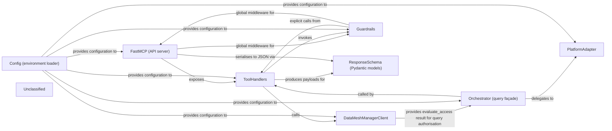

## Details

dataproduct‑mcp is a FastAPI‑based micro‑service that exposes four LLM‑tool endpoints for discovering, inspecting, requesting access to, and querying data products managed by an external Data‑Mesh Manager. The service boots a FastMCP instance that registers the tool handlers. Each handler validates input, invokes the DataMeshManagerClient to retrieve catalogue information and access status, and runs the Guardrails security layer (prompt‑injection sanitisation and read‑only SQL validation). For query execution, the handler delegates to an Orchestrator that checks the caller’s active access, optionally evaluates policy via the Data‑Mesh Manager, selects the appropriate PlatformAdapter (Snowflake, Databricks, or BigQuery), and forwards the SQL to the external data platform. Results are passed back through the guard‑rail sanitiser, formatted according to the predefined ResponseSchema, and returned as JSON to the calling LLM. All runtime configuration (API keys, connection parameters, feature flags) is loaded once at start‑up via the Config component.

### FastMCP (API server)
Starts the FastAPI‑compatible MCP, registers the four tool endpoints (dataproduct_search, dataproduct_get, dataproduct_request_access, dataproduct_query).

**Related Classes/Methods**:

- <a href="https://github.com/entropy-data/dataproduct-mcp/blob/main/src/dataproduct_mcp/server.py" target="_blank" rel="noopener noreferrer">`FastMCP`</a>

### ToolHandlers
Four @mcp.tool() coroutine functions (dataproduct_search, dataproduct_get, dataproduct_request_access, dataproduct_query) that validate input, call DataMeshManagerClient, invoke Guardrails, hand‑off query execution to the Orchestrator and format the response.

**Related Classes/Methods**:

- <a href="https://github.com/entropy-data/dataproduct-mcp/blob/main/src/dataproduct_mcp/server.py#L66-L155" target="_blank" rel="noopener noreferrer">`dataproduct_search`:66-155</a>
- <a href="https://github.com/entropy-data/dataproduct-mcp/blob/main/src/dataproduct_mcp/server.py#L158-L248" target="_blank" rel="noopener noreferrer">`dataproduct_get`:158-248</a>
- <a href="https://github.com/entropy-data/dataproduct-mcp/blob/main/src/dataproduct_mcp/server.py#L252-L296" target="_blank" rel="noopener noreferrer">`dataproduct_request_access`:252-296</a>
- <a href="https://github.com/entropy-data/dataproduct-mcp/blob/main/src/dataproduct_mcp/server.py#L299-L444" target="_blank" rel="noopener noreferrer">`dataproduct_query`:299-444</a>

### DataMeshManagerClient
HTTP client that talks to the external Data‑Mesh Manager service (search, get product, request access, evaluate access, get contracts, etc.).

**Related Classes/Methods**:

- <a href="https://github.com/entropy-data/dataproduct-mcp/blob/main/src/dataproduct_mcp/datameshmanager/datamesh_manager_client.py#L17-L441" target="_blank" rel="noopener noreferrer">`DataMeshManagerClient`:17-441</a>

### Orchestrator (query façade)
Embedded orchestration logic in dataproduct_query that selects the correct PlatformAdapter based on the output‑port type, verifies active access, runs read‑only guard‑rail checks and optional policy evaluation, then forwards the SQL to the chosen adapter.

**Related Classes/Methods**:

- <a href="https://github.com/entropy-data/dataproduct-mcp/blob/main/src/dataproduct_mcp/server.py" target="_blank" rel="noopener noreferrer">`orchestrator_logic`</a>

### PlatformAdapter
Three thin async helper functions (execute_snowflake_query, execute_databricks_query, execute_bigquery_query) that hide vendor‑specific client libraries behind a uniform execute_query(server_info, sql) signature.

**Related Classes/Methods**:

- <a href="https://github.com/entropy-data/dataproduct-mcp/blob/main/src/dataproduct_mcp/connections/snowflake_client.py#L179-L188" target="_blank" rel="noopener noreferrer">`execute_snowflake_query`:179-188</a>
- <a href="https://github.com/entropy-data/dataproduct-mcp/blob/main/src/dataproduct_mcp/connections/databricks_client.py#L174-L190" target="_blank" rel="noopener noreferrer">`execute_databricks_query`:174-190</a>
- <a href="https://github.com/entropy-data/dataproduct-mcp/blob/main/src/dataproduct_mcp/connections/bigquery_client.py#L81-L136" target="_blank" rel="noopener noreferrer">`execute_bigquery_query`:81-136</a>

### Guardrails
Functional module providing prompt‑injection sanitisation (prompt_injection.sanitize_prompt_injection) and read‑only SQL validation (readonly.validate_readonly_query). Called explicitly from each tool handler and registered as FastMCP middleware.

**Related Classes/Methods**:

- <a href="https://github.com/entropy-data/dataproduct-mcp/blob/main/src/dataproduct_mcp/guardrails/prompt_injection.py#L231-L259" target="_blank" rel="noopener noreferrer">`prompt_injection.sanitize_prompt_injection`:231-259</a>
- <a href="https://github.com/entropy-data/dataproduct-mcp/blob/main/src/dataproduct_mcp/guardrails/readonly.py#L25-L54" target="_blank" rel="noopener noreferrer">`readonly.validate_readonly_query`:25-54</a>

### Config (environment loader)
Implicit configuration performed at module import (dotenv.load_dotenv() in server.py) and accessed via os.getenv() throughout the code (feature flags, connection parameters, API keys).

**Related Classes/Methods**:

- <a href="https://github.com/entropy-data/dataproduct-mcp/blob/main/src/dataproduct_mcp/server.py" target="_blank" rel="noopener noreferrer">`dotenv.load_dotenv`</a>

### ResponseSchema (Pydantic models)
Defines the shape of each tool’s output (SearchResponse, GetResponse, AccessResponse, QueryResponse). Enforced by the FastMCP tool decorator and by the sanitize_prompt_injection helper.

**Related Classes/Methods**: _None_

### Unclassified
Component for all unclassified files and utility functions (Utility functions/External Libraries/Dependencies)

**Related Classes/Methods**: _None_

### [FAQ](https://github.com/CodeBoarding/GeneratedOnBoardings/tree/main?tab=readme-ov-file#faq)