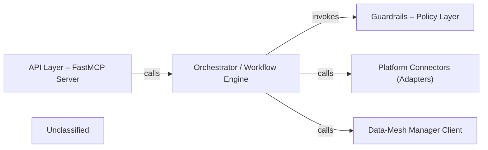

## Details

The Data‑Product MCP Server is a FastAPI‑based micro‑service exposing four LLM‑visible tools (search, get, request_access, query) via a FastMCP server. Incoming tool calls are routed to the Orchestrator, which implements a three‑step workflow: discovery of data products via the Data‑Mesh Manager client, policy enforcement through Guardrails (read‑only SQL validation and prompt‑injection sanitisation), and execution of the SQL query on the appropriate data platform using Platform Connectors (Snowflake, Databricks, or BigQuery). The orchestrated result is sanitised and returned to the LLM. This layered architecture isolates external catalogue interaction, security policy enforcement, and platform‑specific execution, facilitating maintainability and extensibility.

### API Layer – FastMCP Server [[Expand]](./API_Layer_FastMCP_Server.md)
Hosts a FastAPI‑style MCP (FastMCP) and registers the LLM‑visible tools (dataproduct_search, dataproduct_get, dataproduct_request_access, dataproduct_query). It forwards request payloads to the Orchestrator.

**Related Classes/Methods**:

- <a href="https://github.com/entropy-data/dataproduct-mcp/blob/main/src/dataproduct_mcp/server.py" target="_blank" rel="noopener noreferrer">`dataproduct_mcp.server`</a>

### Orchestrator / Workflow Engine [[Expand]](./Orchestrator_Workflow_Engine.md)
Implements the three‑step workflow (discover → govern → execute). Coordinates the Data‑Mesh Manager client, Guardrails, and Platform Connectors to fulfil tool requests.

**Related Classes/Methods**:

- <a href="https://github.com/entropy-data/dataproduct-mcp/blob/main/src/dataproduct_mcp/server.py" target="_blank" rel="noopener noreferrer">`dataproduct_mcp.server`</a>

### Guardrails – Policy Layer
Provides security‑policy enforcement: validates read‑only SQL and sanitises prompt‑injection strings.

**Related Classes/Methods**:

- <a href="https://github.com/entropy-data/dataproduct-mcp/blob/main/src/dataproduct_mcp/guardrails/__init__.py" target="_blank" rel="noopener noreferrer">`dataproduct_mcp.guardrails`</a>
- <a href="https://github.com/entropy-data/dataproduct-mcp/blob/main/src/dataproduct_mcp/guardrails/readonly.py" target="_blank" rel="noopener noreferrer">`dataproduct_mcp.guardrails.readonly`</a>
- <a href="https://github.com/entropy-data/dataproduct-mcp/blob/main/src/dataproduct_mcp/guardrails/prompt_injection.py" target="_blank" rel="noopener noreferrer">`dataproduct_mcp.guardrails.prompt_injection`</a>

### Platform Connectors (Adapters)
Uniform façade for the three supported data platforms. Each adapter parses connection info, builds a client, and runs the supplied SQL query.

**Related Classes/Methods**:

- <a href="https://github.com/entropy-data/dataproduct-mcp/blob/main/src/dataproduct_mcp/connections/snowflake_client.py" target="_blank" rel="noopener noreferrer">`dataproduct_mcp.connections.snowflake_client`</a>
- <a href="https://github.com/entropy-data/dataproduct-mcp/blob/main/src/dataproduct_mcp/connections/databricks_client.py" target="_blank" rel="noopener noreferrer">`dataproduct_mcp.connections.databricks_client`</a>
- <a href="https://github.com/entropy-data/dataproduct-mcp/blob/main/src/dataproduct_mcp/connections/bigquery_client.py" target="_blank" rel="noopener noreferrer">`dataproduct_mcp.connections.bigquery_client`</a>

### Data‑Mesh Manager Client
Thin wrapper around the external Data‑Mesh Manager REST API, providing discovery, metadata, access‑status, request, and evaluation operations.

**Related Classes/Methods**:

- <a href="https://github.com/entropy-data/dataproduct-mcp/blob/main/src/dataproduct_mcp/datameshmanager/datamesh_manager_client.py" target="_blank" rel="noopener noreferrer">`dataproduct_mcp.datameshmanager.datamesh_manager_client`</a>

### Unclassified
Component for all unclassified files and utility functions (Utility functions/External Libraries/Dependencies)

**Related Classes/Methods**: _None_

### [FAQ](https://github.com/CodeBoarding/GeneratedOnBoardings/tree/main?tab=readme-ov-file#faq)