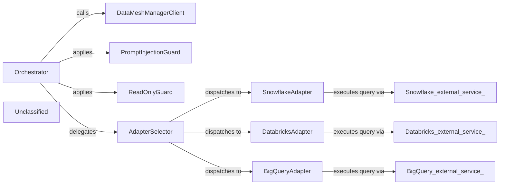

## Details

The Data‑Product MCP Server acts as a lightweight orchestration layer that exposes four LLM‑friendly tools (dataproduct_search, dataproduct_get, dataproduct_request_access, dataproduct_query). When a tool is invoked, the orchestrator first contacts the Data‑Mesh Manager Client to fetch product metadata and verify the caller’s access rights. All outbound responses are passed through the Prompt‑Injection Guard to strip any malicious content, while any user‑supplied SQL is vetted by the Read‑Only Guard to guarantee read‑only execution. For query execution, the orchestrator’s internal Adapter Selector inspects the output‑port’s declared platform (snowflake, databricks, or bigquery) and dispatches the request to the corresponding Platform Adapter. Each adapter maintains a pooled client (SnowflakeClient, DatabricksClient, or the BigQuery client) that talks to the native cloud data service, returns structured rows, and hands the result back to the orchestrator, which finally sanitises the payload before delivering it to the LLM. This clear separation—Orchestrator, Data‑Mesh client, Guard‑rails, and per‑platform adapters—provides a maintainable, secure, and extensible flow for data‑product discovery, governance, and execution.

### Orchestrator
Exposes the four MCP tools, coordinates discovery, governance, execution, and routes queries to the correct platform adapter.

**Related Classes/Methods**:

- `dataproduct_mcp.server`

### DataMeshManagerClient
Thin async HTTP wrapper around the external Data‑Mesh Manager service providing product metadata, contracts, and access‑status APIs.

**Related Classes/Methods**:

- <a href="https://github.com/entropy-data/dataproduct-mcp/blob/main/src/dataproduct_mcp/datameshmanager/datamesh_manager_client.py#L17-L441" target="_blank" rel="noopener noreferrer">`dataproduct_mcp.datameshmanager.datamesh_manager_client.DataMeshManagerClient`:17-441</a>

### PromptInjectionGuard
Sanitises every tool response to strip malicious prompt‑injection payloads.

**Related Classes/Methods**:

- <a href="https://github.com/entropy-data/dataproduct-mcp/blob/main/src/dataproduct_mcp/guardrails/prompt_injection.py#L231-L259" target="_blank" rel="noopener noreferrer">`dataproduct_mcp.guardrails.sanitize_prompt_injection`:231-259</a>

### ReadOnlyGuard
Validates that a user‑supplied SQL statement is read‑only before execution.

**Related Classes/Methods**:

- <a href="https://github.com/entropy-data/dataproduct-mcp/blob/main/src/dataproduct_mcp/guardrails/readonly.py#L25-L54" target="_blank" rel="noopener noreferrer">`dataproduct_mcp.guardrails.validate_readonly_query`:25-54</a>

### SnowflakeAdapter
Parses Snowflake connection info, pools a SnowflakeClient, and executes queries via execute_snowflake_query.

**Related Classes/Methods**:

- <a href="https://github.com/entropy-data/dataproduct-mcp/blob/main/src/dataproduct_mcp/connections/snowflake_client.py#L10-L172" target="_blank" rel="noopener noreferrer">`dataproduct_mcp.connections.snowflake_client.SnowflakeClient`:10-172</a>
- <a href="https://github.com/entropy-data/dataproduct-mcp/blob/main/src/dataproduct_mcp/connections/snowflake_client.py#L179-L188" target="_blank" rel="noopener noreferrer">`dataproduct_mcp.connections.snowflake_client.execute_snowflake_query`:179-188</a>

### DatabricksAdapter
Parses Databricks connection info, pools a DatabricksClient, and executes queries via execute_databricks_query.

**Related Classes/Methods**:

- <a href="https://github.com/entropy-data/dataproduct-mcp/blob/main/src/dataproduct_mcp/connections/databricks_client.py#L12-L167" target="_blank" rel="noopener noreferrer">`dataproduct_mcp.connections.databricks_client.DatabricksClient`:12-167</a>
- <a href="https://github.com/entropy-data/dataproduct-mcp/blob/main/src/dataproduct_mcp/connections/databricks_client.py#L174-L190" target="_blank" rel="noopener noreferrer">`dataproduct_mcp.connections.databricks_client.execute_databricks_query`:174-190</a>

### BigQueryAdapter
Parses BigQuery connection info and runs queries via execute_bigquery_query.

**Related Classes/Methods**:

- <a href="https://github.com/entropy-data/dataproduct-mcp/blob/main/src/dataproduct_mcp/connections/bigquery_client.py#L81-L136" target="_blank" rel="noopener noreferrer">`dataproduct_mcp.connections.bigquery_client.execute_bigquery_query`:81-136</a>

### AdapterSelector
Internal dispatch logic that maps the output‑port type to the appropriate platform adapter.

**Related Classes/Methods**:

- `dataproduct_mcp.server.adapter_selector`

### Unclassified
Component for all unclassified files and utility functions (Utility functions/External Libraries/Dependencies)

**Related Classes/Methods**: _None_

### [FAQ](https://github.com/CodeBoarding/GeneratedOnBoardings/tree/main?tab=readme-ov-file#faq)