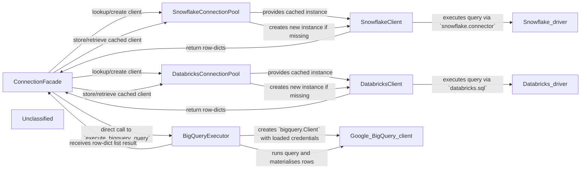

## Details

The dataproduct_mcp.connections package implements a lightweight, async‑first query layer for three cloud data platforms. Public callers use the three execute_*_query functions (the ConnectionFacade) to run SQL against Snowflake, Databricks, or BigQuery. For Snowflake and Databricks the facade first consults a per‑platform connection‑pool (module‑level dictionaries) that caches a single client instance per unique credential set; the client lazily establishes a driver connection, executes the query inside a ThreadPoolExecutor, and returns rows as plain dictionaries. BigQuery does not use a pool – the facade loads credentials, creates a bigquery.Client, runs the query, and returns the same DTO shape. This design keeps the public API simple, avoids any abstract base‑class or registry indirection, and makes it trivial to add a new platform by introducing a client class, a pool dict, and a thin wrapper function.

### ConnectionFacade
Public async API; provides the three execute_*_query functions that orchestrate pool lookup, client invocation and result return.

**Related Classes/Methods**:

- <a href="https://github.com/entropy-data/dataproduct-mcp/blob/main/src/dataproduct_mcp/connections/__init__.py" target="_blank" rel="noopener noreferrer">`dataproduct_mcp.connections.execute_snowflake_query`</a>
- <a href="https://github.com/entropy-data/dataproduct-mcp/blob/main/src/dataproduct_mcp/connections/__init__.py" target="_blank" rel="noopener noreferrer">`dataproduct_mcp.connections.execute_databricks_query`</a>
- <a href="https://github.com/entropy-data/dataproduct-mcp/blob/main/src/dataproduct_mcp/connections/bigquery_client.py" target="_blank" rel="noopener noreferrer">`dataproduct_mcp.connections.execute_bigquery_query`</a>

### SnowflakeConnectionPool
Module‑level dictionary that caches SnowflakeClient objects keyed by a hash of connection parameters.

**Related Classes/Methods**:

- <a href="https://github.com/entropy-data/dataproduct-mcp/blob/main/src/dataproduct_mcp/connections/__init__.py" target="_blank" rel="noopener noreferrer">`dataproduct_mcp.connections._snowflake_connections`</a>

### SnowflakeClient
Encapsulates Snowflake driver lifecycle, validates parameters and runs queries in a ThreadPoolExecutor, returning rows as dicts.

**Related Classes/Methods**:

- <a href="https://github.com/entropy-data/dataproduct-mcp/blob/main/src/dataproduct_mcp/connections/snowflake_client.py#L10-L172" target="_blank" rel="noopener noreferrer">`dataproduct_mcp.connections.snowflake_client.SnowflakeClient`:10-172</a>

### DatabricksConnectionPool
Module‑level dictionary that caches DatabricksClient objects keyed by a hash of connection parameters.

**Related Classes/Methods**:

- <a href="https://github.com/entropy-data/dataproduct-mcp/blob/main/src/dataproduct_mcp/connections/__init__.py" target="_blank" rel="noopener noreferrer">`dataproduct_mcp.connections._databricks_connections`</a>

### DatabricksClient
Encapsulates Databricks driver lifecycle, validates parameters and runs queries in a ThreadPoolExecutor, returning rows as dicts.

**Related Classes/Methods**:

- <a href="https://github.com/entropy-data/dataproduct-mcp/blob/main/src/dataproduct_mcp/connections/databricks_client.py#L12-L167" target="_blank" rel="noopener noreferrer">`dataproduct_mcp.connections.databricks_client.DatabricksClient`:12-167</a>

### BigQueryExecutor
Loads credentials, creates a google.cloud.bigquery.Client, runs the supplied SQL query and returns rows as dicts.

**Related Classes/Methods**:

- <a href="https://github.com/entropy-data/dataproduct-mcp/blob/main/src/dataproduct_mcp/connections/bigquery_client.py#L81-L136" target="_blank" rel="noopener noreferrer">`dataproduct_mcp.connections.bigquery_client.execute_bigquery_query`:81-136</a>

### Unclassified
Component for all unclassified files and utility functions (Utility functions/External Libraries/Dependencies)

**Related Classes/Methods**: _None_

### [FAQ](https://github.com/CodeBoarding/GeneratedOnBoardings/tree/main?tab=readme-ov-file#faq)