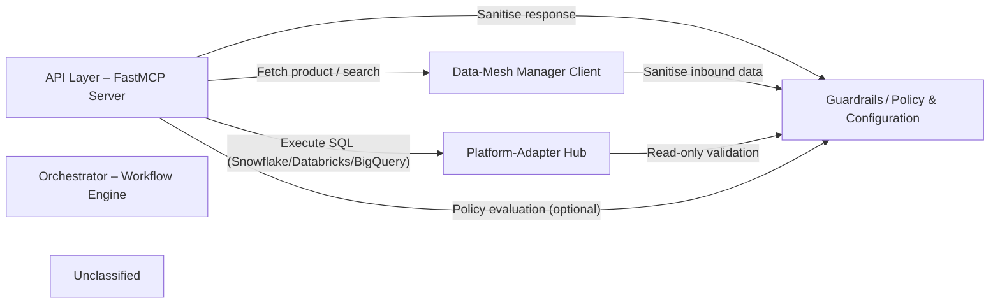

## Details

The Data‑Product MCP system is built around a FastMCP server that exposes four LLM‑driven tools. Incoming requests are orchestrated through a three‑stage workflow: discovery via the Data‑Mesh Manager Client, governance enforced by Guardrails (prompt‑injection sanitisation and read‑only validation), and execution via a Platform‑Adapter Hub that routes SQL queries to Snowflake, Databricks, or BigQuery. The orchestrator decides which downstream component to call, applies optional policy evaluation, and returns JSON responses, with all configuration supplied via environment variables.

### API Layer – FastMCP Server [[Expand]](./API_Layer_FastMCP_Server.md)
Exposes HTTP/LLM-tool endpoints, routes calls to the Orchestrator, applies guard‑rails, and returns JSON responses.

**Related Classes/Methods**:

- <a href="https://github.com/entropy-data/dataproduct-mcp/blob/main/src/dataproduct_mcp/server.py" target="_blank" rel="noopener noreferrer">`dataproduct_mcp.server:mcp`</a>

### Orchestrator – Workflow Engine [[Expand]](./Orchestrator_Workflow_Engine.md)
Coordinates discovery, governance, and execution steps; decides which downstream component to call.

**Related Classes/Methods**:

- <a href="https://github.com/entropy-data/dataproduct-mcp/blob/main/src/dataproduct_mcp/server.py" target="_blank" rel="noopener noreferrer">`dataproduct_mcp.server:dataproduct_search`</a>
- <a href="https://github.com/entropy-data/dataproduct-mcp/blob/main/src/dataproduct_mcp/server.py" target="_blank" rel="noopener noreferrer">`dataproduct_mcp.server:dataproduct_get`</a>
- <a href="https://github.com/entropy-data/dataproduct-mcp/blob/main/src/dataproduct_mcp/server.py" target="_blank" rel="noopener noreferrer">`dataproduct_mcp.server:dataproduct_request_access`</a>
- <a href="https://github.com/entropy-data/dataproduct-mcp/blob/main/src/dataproduct_mcp/server.py" target="_blank" rel="noopener noreferrer">`dataproduct_mcp.server:dataproduct_query`</a>

### Data‑Mesh Manager Client
Wraps the external Data‑Mesh Manager REST API (search, get, access‑status, request‑access, evaluate‑access, contracts).

**Related Classes/Methods**:

- <a href="https://github.com/entropy-data/dataproduct-mcp/blob/main/src/dataproduct_mcp/datameshmanager/datamesh_manager_client.py" target="_blank" rel="noopener noreferrer">`dataproduct_mcp.datameshmanager.datamesh_manager_client:DataMeshManagerClient`</a>

### Platform‑Adapter Hub [[Expand]](./Platform_Adapter_Hub.md)
Provides a uniform async execute_*_query interface; hides platform‑specific connection pooling and credential handling.

**Related Classes/Methods**:

- <a href="https://github.com/entropy-data/dataproduct-mcp/blob/main/src/dataproduct_mcp/connections/snowflake_client.py" target="_blank" rel="noopener noreferrer">`dataproduct_mcp.connections.snowflake_client:execute_snowflake_query`</a>
- <a href="https://github.com/entropy-data/dataproduct-mcp/blob/main/src/dataproduct_mcp/connections/databricks_client.py" target="_blank" rel="noopener noreferrer">`dataproduct_mcp.connections.databricks_client:execute_databricks_query`</a>
- <a href="https://github.com/entropy-data/dataproduct-mcp/blob/main/src/dataproduct_mcp/connections/bigquery_client.py" target="_blank" rel="noopener noreferrer">`dataproduct_mcp.connections.bigquery_client:execute_bigquery_query`</a>

### Guardrails / Policy & Configuration [[Expand]](./Guardrails_Policy_Configuration.md)
Enforces read‑only SQL, detects & redacts prompt‑injection attempts, and supplies runtime config via environment variables.

**Related Classes/Methods**:

- <a href="https://github.com/entropy-data/dataproduct-mcp/blob/main/src/dataproduct_mcp/guardrails/__init__.py" target="_blank" rel="noopener noreferrer">`dataproduct_mcp.guardrails:validate_readonly_query`</a>
- <a href="https://github.com/entropy-data/dataproduct-mcp/blob/main/src/dataproduct_mcp/guardrails/__init__.py" target="_blank" rel="noopener noreferrer">`dataproduct_mcp.guardrails:sanitize_prompt_injection`</a>

### Unclassified
Component for all unclassified files and utility functions (Utility functions/External Libraries/Dependencies)

**Related Classes/Methods**: _None_

### [FAQ](https://github.com/CodeBoarding/GeneratedOnBoardings/tree/main?tab=readme-ov-file#faq)