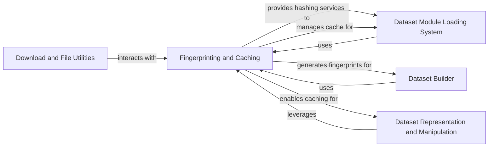

## Component Details

The Caching & Integrity component, also referred to as Fingerprinting and Caching, is crucial for optimizing data processing within the system. Its primary purpose is to ensure efficient data handling by managing cached versions of datasets and their transformations. This is achieved through a robust fingerprinting mechanism that detects changes in datasets or their processing steps, thereby invalidating or reusing existing caches. This component plays a vital role in maintaining data integrity and preventing redundant computations across various data operations.

### Fingerprinting and Caching
This component is responsible for generating unique fingerprints for dataset configurations and transformations, enabling efficient caching of processed data. It uses hashing mechanisms to determine if a dataset or a transformation has changed, thereby invalidating or reusing cached results. It also manages temporary cache directories.

**Related Classes/Methods**:

- <a href="https://github.com/huggingface/datasets/blob/master/src/datasets/fingerprint.py#L170-L197" target="_blank" rel="noopener noreferrer">`datasets.src.datasets.fingerprint.Hasher` (170:197)</a>
- <a href="https://github.com/huggingface/datasets/blob/master/src/datasets/fingerprint.py#L209-L220" target="_blank" rel="noopener noreferrer">`datasets.src.datasets.fingerprint.generate_fingerprint` (209:220)</a>
- <a href="https://github.com/huggingface/datasets/blob/master/src/datasets/fingerprint.py#L227-L274" target="_blank" rel="noopener noreferrer">`datasets.src.datasets.fingerprint.update_fingerprint` (227:274)</a>
- <a href="https://github.com/huggingface/datasets/blob/master/src/datasets/fingerprint.py#L136-L154" target="_blank" rel="noopener noreferrer">`datasets.src.datasets.fingerprint.is_caching_enabled` (136:154)</a>
- <a href="https://github.com/huggingface/datasets/blob/master/src/datasets/fingerprint.py#L157-L162" target="_blank" rel="noopener noreferrer">`datasets.src.datasets.fingerprint.get_temporary_cache_files_directory` (157:162)</a>
- <a href="https://github.com/huggingface/datasets/blob/master/src/datasets/fingerprint.py#L45-L68" target="_blank" rel="noopener noreferrer">`datasets.src.datasets.fingerprint._TempCacheDir` (45:68)</a>
- <a href="https://github.com/huggingface/datasets/blob/master/src/datasets/fingerprint.py#L352-L454" target="_blank" rel="noopener noreferrer">`datasets.src.datasets.fingerprint.fingerprint_transform` (352:454)</a>
- <a href="https://github.com/huggingface/datasets/blob/master/src/datasets/load.py#L263-L280" target="_blank" rel="noopener noreferrer">`datasets.src.datasets.load.files_to_hash` (263:280)</a>
- <a href="https://github.com/huggingface/datasets/blob/master/src/datasets/load.py#L1298-L1383" target="_blank" rel="noopener noreferrer">`datasets.src.datasets.load.CachedDatasetModuleFactory` (1298:1383)</a>

### Dataset Module Loading System
This component is responsible for dynamically loading dataset modules, which can originate from various sources like local scripts, local data files, packaged modules, or Hugging Face Hub repositories. It handles the logic for inferring the correct module based on the input path and data, managing caching, and ensuring remote code trust. It dispatches to specialized factory classes based on the dataset's origin.

**Related Classes/Methods**:

- <a href="https://github.com/huggingface/datasets/blob/master/src/datasets/load.py#L1386-L1670" target="_blank" rel="noopener noreferrer">`datasets.src.datasets.load.dataset_module_factory` (1386:1670)</a>

### Dataset Builder
This component represents the core logic for building and preparing a dataset. It encapsulates the dataset's configuration, information, and the process of downloading, processing, and caching data into Arrow format. It provides methods for accessing dataset information and converting the prepared data into a Dataset object.

**Related Classes/Methods**:

- <a href="https://github.com/huggingface/datasets/blob/master/src/datasets/builder.py#L210-L1393" target="_blank" rel="noopener noreferrer">`datasets.src.datasets.builder.DatasetBuilder` (210:1393)</a>

### Dataset Representation and Manipulation
This component defines the in-memory and on-disk representation of a dataset using Apache Arrow tables. It provides a rich API for various data transformations and manipulations, such as mapping, filtering, sorting, shuffling, and column operations. It also manages the caching of transformed datasets and integrates with fingerprinting for cache invalidation.

**Related Classes/Methods**:

- <a href="https://github.com/huggingface/datasets/blob/master/src/datasets/arrow_dataset.py#L630-L6214" target="_blank" rel="noopener noreferrer">`datasets.src.datasets.arrow_dataset.Dataset` (630:6214)</a>

### Download and File Utilities
This component provides utilities for downloading files, managing download configurations, handling paths (relative to absolute, remote URLs), and ensuring offline mode compliance. It also includes functionalities for copying files and directories for dynamic module loading.

**Related Classes/Methods**:

- <a href="https://github.com/huggingface/datasets/blob/master/src/datasets/download/download_config.py#L10-L81" target="_blank" rel="noopener noreferrer">`datasets.src.datasets.download.download_config.DownloadConfig` (10:81)</a>
- <a href="https://github.com/huggingface/datasets/blob/master/src/datasets/utils/file_utils.py#L143-L263" target="_blank" rel="noopener noreferrer">`datasets.src.datasets.utils.file_utils.cached_path` (143:263)</a>

### [FAQ](https://github.com/CodeBoarding/GeneratedOnBoardings/tree/main?tab=readme-ov-file#faq)