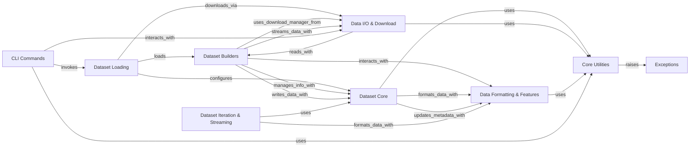

## Component Details

This graph illustrates the architecture of the `datasets` library, which is designed for efficient and flexible dataset management. The core functionality revolves around `Dataset Core` for data representation and `Dataset Builders` for constructing datasets from various sources. `Dataset Loading` orchestrates the process of acquiring and preparing datasets, relying heavily on `Data I/O & Download` for file operations and `Core Utilities` for foundational helper functions. Data can be iterated and streamed via `Dataset Iteration & Streaming`, and its schema and format are handled by `Data Formatting & Features`. `CLI Commands` provide user interaction, while `Exceptions` ensure robust error handling across the system.

### Core Utilities
Provides general-purpose helper functions and classes that support the core functionalities of the `datasets` library, including logging, file operations, version management, and import handling.

**Related Classes/Methods**:

- <a href="https://github.com/huggingface/datasets/blob/master/src/datasets/utils/logging.py#L85-L91" target="_blank" rel="noopener noreferrer">`datasets.src.datasets.utils.logging.get_logger` (85:91)</a>
- `datasets.src.datasets.utils.file_utils` (full file reference)
- <a href="https://github.com/huggingface/datasets/blob/master/src/datasets/utils/py_utils.py#L605-L675" target="_blank" rel="noopener noreferrer">`datasets.src.datasets.utils.py_utils.get_imports` (605:675)</a>
- <a href="https://github.com/huggingface/datasets/blob/master/src/datasets/utils/py_utils.py#L596-L602" target="_blank" rel="noopener noreferrer">`datasets.src.datasets.utils.py_utils.lock_importable_file` (596:602)</a>
- <a href="https://github.com/huggingface/datasets/blob/master/src/datasets/utils/info_utils.py#L94-L106" target="_blank" rel="noopener noreferrer">`datasets.src.datasets.utils.info_utils.is_small_dataset` (94:106)</a>
- `datasets.src.datasets.config` (full file reference)
- `datasets.src.datasets.__version__` (full file reference)
- `datasets.src.datasets.exceptions` (full file reference)
- `datasets.src.datasets.naming` (full file reference)
- `datasets.src.datasets.utils.typing.PathLike` (full file reference)
- <a href="https://github.com/huggingface/datasets/blob/master/src/datasets/utils/version.py#L30-L93" target="_blank" rel="noopener noreferrer">`datasets.src.datasets.utils.version.Version` (30:93)</a>

### Dataset Core
This component forms the backbone of dataset representation and management. It defines the core Dataset object, handles metadata (DatasetInfo, DatasetInfosDict), manages data file patterns, ensures data integrity through hashing and fingerprinting, and provides fundamental operations like concatenation and interleaving for Arrow-based datasets.

**Related Classes/Methods**:

- <a href="https://github.com/huggingface/datasets/blob/master/src/datasets/arrow_dataset.py#L630-L6214" target="_blank" rel="noopener noreferrer">`datasets.src.datasets.arrow_dataset.Dataset` (630:6214)</a>
- <a href="https://github.com/huggingface/datasets/blob/master/src/datasets/info.py#L92-L321" target="_blank" rel="noopener noreferrer">`datasets.src.datasets.info.DatasetInfo` (92:321)</a>
- <a href="https://github.com/huggingface/datasets/blob/master/src/datasets/info.py#L324-L430" target="_blank" rel="noopener noreferrer">`datasets.src.datasets.info.DatasetInfosDict` (324:430)</a>
- <a href="https://github.com/huggingface/datasets/blob/master/src/datasets/data_files.py#L517-L611" target="_blank" rel="noopener noreferrer">`datasets.src.datasets.data_files.DataFilesList` (517:611)</a>
- <a href="https://github.com/huggingface/datasets/blob/master/src/datasets/data_files.py#L387-L475" target="_blank" rel="noopener noreferrer">`datasets.src.datasets.data_files.get_data_patterns` (387:475)</a>
- <a href="https://github.com/huggingface/datasets/blob/master/src/datasets/keyhash.py#L87-L104" target="_blank" rel="noopener noreferrer">`datasets.src.datasets.keyhash.KeyHasher` (87:104)</a>
- <a href="https://github.com/huggingface/datasets/blob/master/src/datasets/fingerprint.py#L170-L197" target="_blank" rel="noopener noreferrer">`datasets.src.datasets.fingerprint.Hasher` (170:197)</a>
- <a href="https://github.com/huggingface/datasets/blob/master/src/datasets/fingerprint.py#L209-L220" target="_blank" rel="noopener noreferrer">`datasets.src.datasets.fingerprint.generate_fingerprint` (209:220)</a>
- <a href="https://github.com/huggingface/datasets/blob/master/src/datasets/fingerprint.py#L352-L454" target="_blank" rel="noopener noreferrer">`datasets.src.datasets.fingerprint.fingerprint_transform` (352:454)</a>
- <a href="https://github.com/huggingface/datasets/blob/master/src/datasets/arrow_writer.py#L341-L673" target="_blank" rel="noopener noreferrer">`datasets.src.datasets.arrow_writer.ArrowWriter` (341:673)</a>
- <a href="https://github.com/huggingface/datasets/blob/master/src/datasets/arrow_writer.py#L676-L677" target="_blank" rel="noopener noreferrer">`datasets.src.datasets.arrow_writer.ParquetWriter` (676:677)</a>

### Dataset Builders
This component provides the abstract and concrete implementations for building datasets from various raw data sources. It includes the base DatasetBuilder and specialized builders for different file formats like CSV, JSON, Parquet, and more, defining how data is processed and prepared for consumption.

**Related Classes/Methods**:

- <a href="https://github.com/huggingface/datasets/blob/master/src/datasets/builder.py#L210-L1393" target="_blank" rel="noopener noreferrer">`datasets.src.datasets.builder.DatasetBuilder` (210:1393)</a>
- <a href="https://github.com/huggingface/datasets/blob/master/src/datasets/builder.py#L1396-L1658" target="_blank" rel="noopener noreferrer">`datasets.src.datasets.builder.GeneratorBasedBuilder` (1396:1658)</a>
- <a href="https://github.com/huggingface/datasets/blob/master/src/datasets/builder.py#L1661-L1903" target="_blank" rel="noopener noreferrer">`datasets.src.datasets.builder.ArrowBasedBuilder` (1661:1903)</a>
- <a href="https://github.com/huggingface/datasets/blob/master/src/datasets/packaged_modules/csv/csv.py#L145-L198" target="_blank" rel="noopener noreferrer">`datasets.src.datasets.packaged_modules.csv.csv.Csv` (145:198)</a>
- <a href="https://github.com/huggingface/datasets/blob/master/src/datasets/packaged_modules/json/json.py#L58-L178" target="_blank" rel="noopener noreferrer">`datasets.src.datasets.packaged_modules.json.json.Json` (58:178)</a>
- <a href="https://github.com/huggingface/datasets/blob/master/src/datasets/packaged_modules/parquet/parquet.py#L29-L109" target="_blank" rel="noopener noreferrer">`datasets.src.datasets.packaged_modules.parquet.parquet.Parquet` (29:109)</a>
- <a href="https://github.com/huggingface/datasets/blob/master/src/datasets/packaged_modules/text/text.py#L28-L112" target="_blank" rel="noopener noreferrer">`datasets.src.datasets.packaged_modules.text.text.Text` (28:112)</a>
- <a href="https://github.com/huggingface/datasets/blob/master/src/datasets/packaged_modules/spark/spark.py#L113-L367" target="_blank" rel="noopener noreferrer">`datasets.src.datasets.packaged_modules.spark.spark.Spark` (113:367)</a>
- <a href="https://github.com/huggingface/datasets/blob/master/src/datasets/packaged_modules/arrow/arrow.py#L24-L79" target="_blank" rel="noopener noreferrer">`datasets.src.datasets.packaged_modules.arrow.arrow.Arrow` (24:79)</a>
- <a href="https://github.com/huggingface/datasets/blob/master/src/datasets/packaged_modules/sql/sql.py#L91-L119" target="_blank" rel="noopener noreferrer">`datasets.src.datasets.packaged_modules.sql.sql.Sql` (91:119)</a>
- <a href="https://github.com/huggingface/datasets/blob/master/src/datasets/packaged_modules/webdataset/webdataset.py#L19-L132" target="_blank" rel="noopener noreferrer">`datasets.src.datasets.packaged_modules.webdataset.webdataset.WebDataset` (19:132)</a>
- <a href="https://github.com/huggingface/datasets/blob/master/src/datasets/packaged_modules/generator/generator.py#L23-L33" target="_blank" rel="noopener noreferrer">`datasets.src.datasets.packaged_modules.generator.generator.Generator` (23:33)</a>
- <a href="https://github.com/huggingface/datasets/blob/master/src/datasets/packaged_modules/folder_based_builder/folder_based_builder.py#L40-L404" target="_blank" rel="noopener noreferrer">`datasets.src.datasets.packaged_modules.folder_based_builder.folder_based_builder.FolderBasedBuilder` (40:404)</a>
- <a href="https://github.com/huggingface/datasets/blob/master/src/datasets/packaged_modules/cache/cache.py#L98-L191" target="_blank" rel="noopener noreferrer">`datasets.src.datasets.packaged_modules.cache.cache.Cache` (98:191)</a>

### Dataset Loading
This component is responsible for the entire dataset loading workflow. It handles resolving dataset paths, downloading necessary scripts and data, initializing dynamic modules, and selecting the appropriate dataset builder factory based on the source (local, packaged, or Hugging Face Hub).

**Related Classes/Methods**:

- <a href="https://github.com/huggingface/datasets/blob/master/src/datasets/load.py#L1838-L2100" target="_blank" rel="noopener noreferrer">`datasets.src.datasets.load.load_dataset` (1838:2100)</a>
- <a href="https://github.com/huggingface/datasets/blob/master/src/datasets/load.py#L1386-L1670" target="_blank" rel="noopener noreferrer">`datasets.src.datasets.load.dataset_module_factory` (1386:1670)</a>
- <a href="https://github.com/huggingface/datasets/blob/master/src/datasets/load.py#L696-L777" target="_blank" rel="noopener noreferrer">`datasets.src.datasets.load.LocalDatasetModuleFactoryWithScript` (696:777)</a>
- <a href="https://github.com/huggingface/datasets/blob/master/src/datasets/load.py#L780-L885" target="_blank" rel="noopener noreferrer">`datasets.src.datasets.load.LocalDatasetModuleFactoryWithoutScript` (780:885)</a>
- <a href="https://github.com/huggingface/datasets/blob/master/src/datasets/load.py#L888-L926" target="_blank" rel="noopener noreferrer">`datasets.src.datasets.load.PackagedDatasetModuleFactory` (888:926)</a>
- <a href="https://github.com/huggingface/datasets/blob/master/src/datasets/load.py#L929-L1094" target="_blank" rel="noopener noreferrer">`datasets.src.datasets.load.HubDatasetModuleFactoryWithoutScript` (929:1094)</a>
- <a href="https://github.com/huggingface/datasets/blob/master/src/datasets/load.py#L1097-L1168" target="_blank" rel="noopener noreferrer">`datasets.src.datasets.load.HubDatasetModuleFactoryWithParquetExport` (1097:1168)</a>
- <a href="https://github.com/huggingface/datasets/blob/master/src/datasets/load.py#L1171-L1295" target="_blank" rel="noopener noreferrer">`datasets.src.datasets.load.HubDatasetModuleFactoryWithScript` (1171:1295)</a>
- <a href="https://github.com/huggingface/datasets/blob/master/src/datasets/load.py#L1298-L1383" target="_blank" rel="noopener noreferrer">`datasets.src.datasets.load.CachedDatasetModuleFactory` (1298:1383)</a>
- <a href="https://github.com/huggingface/datasets/blob/master/src/datasets/load.py#L241-L260" target="_blank" rel="noopener noreferrer">`datasets.src.datasets.load.get_dataset_builder_class` (241:260)</a>
- <a href="https://github.com/huggingface/datasets/blob/master/src/datasets/load.py#L578-L603" target="_blank" rel="noopener noreferrer">`datasets.src.datasets.load.infer_module_for_data_files` (578:603)</a>

### Data I/O & Download
This component manages all aspects of data input/output and downloading. It provides readers and writers for various data formats, handles file system interactions (local and remote), and orchestrates the downloading, caching, and extraction of dataset files.

**Related Classes/Methods**:

- <a href="https://github.com/huggingface/datasets/blob/master/src/datasets/io/text.py#L9-L60" target="_blank" rel="noopener noreferrer">`datasets.src.datasets.io.text.TextDatasetReader` (9:60)</a>
- <a href="https://github.com/huggingface/datasets/blob/master/src/datasets/io/json.py#L15-L69" target="_blank" rel="noopener noreferrer">`datasets.src.datasets.io.json.JsonDatasetReader` (15:69)</a>
- <a href="https://github.com/huggingface/datasets/blob/master/src/datasets/io/json.py#L72-L174" target="_blank" rel="noopener noreferrer">`datasets.src.datasets.io.json.JsonDatasetWriter` (72:174)</a>
- <a href="https://github.com/huggingface/datasets/blob/master/src/datasets/io/parquet.py#L17-L70" target="_blank" rel="noopener noreferrer">`datasets.src.datasets.io.parquet.ParquetDatasetReader` (17:70)</a>
- <a href="https://github.com/huggingface/datasets/blob/master/src/datasets/io/parquet.py#L73-L122" target="_blank" rel="noopener noreferrer">`datasets.src.datasets.io.parquet.ParquetDatasetWriter` (73:122)</a>
- <a href="https://github.com/huggingface/datasets/blob/master/src/datasets/io/csv.py#L15-L66" target="_blank" rel="noopener noreferrer">`datasets.src.datasets.io.csv.CsvDatasetReader` (15:66)</a>
- <a href="https://github.com/huggingface/datasets/blob/master/src/datasets/io/csv.py#L69-L145" target="_blank" rel="noopener noreferrer">`datasets.src.datasets.io.csv.CsvDatasetWriter` (69:145)</a>
- <a href="https://github.com/huggingface/datasets/blob/master/src/datasets/download/download_config.py#L10-L81" target="_blank" rel="noopener noreferrer">`datasets.src.datasets.download.download_config.DownloadConfig` (10:81)</a>
- <a href="https://github.com/huggingface/datasets/blob/master/src/datasets/download/streaming_download_manager.py#L47-L219" target="_blank" rel="noopener noreferrer">`datasets.src.datasets.download.streaming_download_manager.StreamingDownloadManager` (47:219)</a>
- <a href="https://github.com/huggingface/datasets/blob/master/src/datasets/download/download_manager.py#L71-L340" target="_blank" rel="noopener noreferrer">`datasets.src.datasets.download.download_manager.DownloadManager` (71:340)</a>
- `datasets.src.datasets.filesystems.is_remote_filesystem` (full file reference)
- `datasets.src.datasets.filesystems.rename` (full file reference)

### Dataset Iteration & Streaming
This component provides functionalities for iterating over datasets, especially in a streaming fashion. It includes various iterable classes for different data access patterns (shuffling, skipping, taking) and mechanisms to extend dataset builders for streaming capabilities.

**Related Classes/Methods**:

- <a href="https://github.com/huggingface/datasets/blob/master/src/datasets/iterable_dataset.py#L1962-L3394" target="_blank" rel="noopener noreferrer">`datasets.src.datasets.iterable_dataset.IterableDataset` (1962:3394)</a>
- <a href="https://github.com/huggingface/datasets/blob/master/src/datasets/iterable_dataset.py#L208-L242" target="_blank" rel="noopener noreferrer">`datasets.src.datasets.iterable_dataset.ExamplesIterable` (208:242)</a>
- <a href="https://github.com/huggingface/datasets/blob/master/src/datasets/iterable_dataset.py#L282-L346" target="_blank" rel="noopener noreferrer">`datasets.src.datasets.iterable_dataset.ArrowExamplesIterable` (282:346)</a>
- <a href="https://github.com/huggingface/datasets/blob/master/src/datasets/streaming.py#L112-L142" target="_blank" rel="noopener noreferrer">`datasets.src.datasets.streaming.extend_dataset_builder_for_streaming` (112:142)</a>

### Data Formatting & Features
This component is responsible for defining and managing the schema and types of data within a dataset (features). It also handles the conversion and formatting of data into various formats suitable for different machine learning frameworks (e.g., PyTorch, TensorFlow, JAX, NumPy, Pandas, Polars).

**Related Classes/Methods**:

- `datasets.src.datasets.formatting.get_formatter` (full file reference)
- <a href="https://github.com/huggingface/datasets/blob/master/src/datasets/formatting/jax_formatter.py#L38-L166" target="_blank" rel="noopener noreferrer">`datasets.src.datasets.formatting.jax_formatter.JaxFormatter` (38:166)</a>
- <a href="https://github.com/huggingface/datasets/blob/master/src/datasets/formatting/tf_formatter.py#L32-L121" target="_blank" rel="noopener noreferrer">`datasets.src.datasets.formatting.tf_formatter.TFFormatter` (32:121)</a>
- <a href="https://github.com/huggingface/datasets/blob/master/src/datasets/formatting/torch_formatter.py#L32-L122" target="_blank" rel="noopener noreferrer">`datasets.src.datasets.formatting.torch_formatter.TorchFormatter` (32:122)</a>
- <a href="https://github.com/huggingface/datasets/blob/master/src/datasets/formatting/np_formatter.py#L26-L112" target="_blank" rel="noopener noreferrer">`datasets.src.datasets.formatting.np_formatter.NumpyFormatter` (26:112)</a>
- <a href="https://github.com/huggingface/datasets/blob/master/src/datasets/formatting/polars_formatter.py#L100-L124" target="_blank" rel="noopener noreferrer">`datasets.src.datasets.formatting.polars_formatter.PolarsFormatter` (100:124)</a>
- <a href="https://github.com/huggingface/datasets/blob/master/src/datasets/features/features.py#L1753-L2296" target="_blank" rel="noopener noreferrer">`datasets.src.datasets.features.features.Features` (1753:2296)</a>
- <a href="https://github.com/huggingface/datasets/blob/master/src/datasets/features/image.py#L46-L283" target="_blank" rel="noopener noreferrer">`datasets.src.datasets.features.image.Image` (46:283)</a>
- <a href="https://github.com/huggingface/datasets/blob/master/src/datasets/features/audio.py#L21-L274" target="_blank" rel="noopener noreferrer">`datasets.src.datasets.features.audio.Audio` (21:274)</a>
- <a href="https://github.com/huggingface/datasets/blob/master/src/datasets/features/video.py#L27-L226" target="_blank" rel="noopener noreferrer">`datasets.src.datasets.features.video.Video` (27:226)</a>
- <a href="https://github.com/huggingface/datasets/blob/master/src/datasets/features/pdf.py#L30-L249" target="_blank" rel="noopener noreferrer">`datasets.src.datasets.features.pdf.Pdf` (30:249)</a>
- <a href="https://github.com/huggingface/datasets/blob/master/src/datasets/features/features.py#L954-L1148" target="_blank" rel="noopener noreferrer">`datasets.src.datasets.features.features.ClassLabel` (954:1148)</a>

### CLI Commands
This component defines the command-line interface for the datasets library, allowing users to perform various operations such as converting datasets, deleting from the Hugging Face Hub, testing dataset scripts, and more.

**Related Classes/Methods**:

- <a href="https://github.com/huggingface/datasets/blob/master/src/datasets/commands/datasets_cli.py#L16-L39" target="_blank" rel="noopener noreferrer">`datasets.src.datasets.commands.datasets_cli.main` (16:39)</a>
- <a href="https://github.com/huggingface/datasets/blob/master/src/datasets/commands/convert.py#L51-L195" target="_blank" rel="noopener noreferrer">`datasets.src.datasets.commands.convert.ConvertCommand` (51:195)</a>
- <a href="https://github.com/huggingface/datasets/blob/master/src/datasets/commands/delete_from_hub.py#L17-L42" target="_blank" rel="noopener noreferrer">`datasets.src.datasets.commands.delete_from_hub.DeleteFromHubCommand` (17:42)</a>
- <a href="https://github.com/huggingface/datasets/blob/master/src/datasets/commands/test.py#L37-L207" target="_blank" rel="noopener noreferrer">`datasets.src.datasets.commands.test.TestCommand` (37:207)</a>
- <a href="https://github.com/huggingface/datasets/blob/master/src/datasets/commands/convert_to_parquet.py#L17-L46" target="_blank" rel="noopener noreferrer">`datasets.src.datasets.commands.convert_to_parquet.ConvertToParquetCommand` (17:46)</a>

### Exceptions
This component defines custom exception classes used throughout the datasets library to signal specific errors and conditions, providing more granular error handling and user feedback.

**Related Classes/Methods**:

- `datasets.src.datasets.exceptions.EmptyDatasetError` (full file reference)
- `datasets.src.datasets.exceptions.SplitsNotFoundError` (full file reference)
- <a href="https://github.com/huggingface/datasets/blob/master/src/datasets/exceptions.py#L24-L25" target="_blank" rel="noopener noreferrer">`datasets.src.datasets.exceptions.DataFilesNotFoundError` (24:25)</a>
- <a href="https://github.com/huggingface/datasets/blob/master/src/datasets/exceptions.py#L53-L87" target="_blank" rel="noopener noreferrer">`datasets.src.datasets.exceptions.DatasetGenerationCastError` (53:87)</a>
- <a href="https://github.com/huggingface/datasets/blob/master/src/datasets/exceptions.py#L28-L34" target="_blank" rel="noopener noreferrer">`datasets.src.datasets.exceptions.DatasetNotFoundError` (28:34)</a>
- <a href="https://github.com/huggingface/datasets/blob/master/src/datasets/exceptions.py#L41-L42" target="_blank" rel="noopener noreferrer">`datasets.src.datasets.exceptions.ManualDownloadError` (41:42)</a>
- <a href="https://github.com/huggingface/datasets/blob/master/src/datasets/exceptions.py#L45-L46" target="_blank" rel="noopener noreferrer">`datasets.src.datasets.exceptions.FileFormatError` (45:46)</a>
- `datasets.src.datasets.exceptions.DatasetTransformationNotAllowedError` (full file reference)
- <a href="https://github.com/huggingface/datasets/blob/master/src/datasets/exceptions.py#L98-L99" target="_blank" rel="noopener noreferrer">`datasets.src.datasets.exceptions.ExpectedMoreDownloadedFilesError` (98:99)</a>
- <a href="https://github.com/huggingface/datasets/blob/master/src/datasets/exceptions.py#L94-L95" target="_blank" rel="noopener noreferrer">`datasets.src.datasets.exceptions.UnexpectedDownloadedFileError` (94:95)</a>
- <a href="https://github.com/huggingface/datasets/blob/master/src/datasets/exceptions.py#L102-L103" target="_blank" rel="noopener noreferrer">`datasets.src.datasets.exceptions.NonMatchingChecksumError` (102:103)</a>
- <a href="https://github.com/huggingface/datasets/blob/master/src/datasets/exceptions.py#L114-L115" target="_blank" rel="noopener noreferrer">`datasets.src.datasets.exceptions.ExpectedMoreSplitsError` (114:115)</a>
- <a href="https://github.com/huggingface/datasets/blob/master/src/datasets/exceptions.py#L110-L111" target="_blank" rel="noopener noreferrer">`datasets.src.datasets.exceptions.UnexpectedSplitsError` (110:111)</a>
- <a href="https://github.com/huggingface/datasets/blob/master/src/datasets/exceptions.py#L118-L119" target="_blank" rel="noopener noreferrer">`datasets.src.datasets.exceptions.NonMatchingSplitsSizesError` (118:119)</a>

### [FAQ](https://github.com/CodeBoarding/GeneratedOnBoardings/tree/main?tab=readme-ov-file#faq)