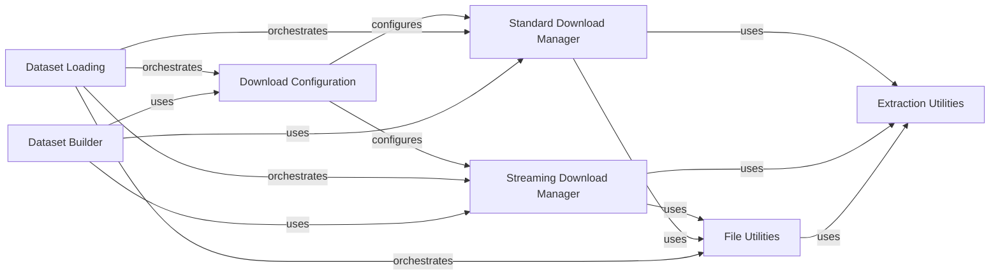

## Component Details

The Data Acquisition subsystem is responsible for managing the download, caching, and extraction of raw data from various sources. It supports both standard and streaming download modes, leveraging configuration settings for cache management and authentication. The core flow involves a download manager (either standard or streaming) utilizing file utilities for path handling and I/O, and extraction utilities for decompressing downloaded archives. This subsystem is orchestrated by higher-level components like Dataset Loading and Dataset Builder to prepare data for processing.

### Download Configuration
Defines and manages configuration settings for data downloads, including cache directories, force download flags, user agents, and authentication tokens.

**Related Classes/Methods**:

- <a href="https://github.com/huggingface/datasets/blob/master/src/datasets/download/download_config.py#L10-L81" target="_blank" rel="noopener noreferrer">`datasets.src.datasets.download.download_config.DownloadConfig` (10:81)</a>
- `datasets.src.datasets.download.download_config.DownloadMode` (full file reference)

### Standard Download Manager
Manages the standard (non-streaming) download of files, handling caching and checksum verification. It also orchestrates the extraction process for downloaded files.

**Related Classes/Methods**:

- <a href="https://github.com/huggingface/datasets/blob/master/src/datasets/download/download_manager.py#L71-L340" target="_blank" rel="noopener noreferrer">`datasets.src.datasets.download.download_manager.DownloadManager` (71:340)</a>

### Streaming Download Manager
Handles streaming downloads and on-the-fly extraction of data, particularly for large datasets or archives.

**Related Classes/Methods**:

- <a href="https://github.com/huggingface/datasets/blob/master/src/datasets/download/streaming_download_manager.py#L47-L219" target="_blank" rel="noopener noreferrer">`datasets.src.datasets.download.streaming_download_manager.StreamingDownloadManager` (47:219)</a>

### File Utilities
Provides foundational utilities for file system operations, path manipulation, caching, and I/O, supporting both local and remote files and various compression formats.

**Related Classes/Methods**:

- `datasets.src.datasets.utils.file_utils.resolve_pattern` (full file reference)
- <a href="https://github.com/huggingface/datasets/blob/master/src/datasets/utils/file_utils.py#L95-L96" target="_blank" rel="noopener noreferrer">`datasets.src.datasets.utils.file_utils.is_relative_path` (95:96)</a>
- <a href="https://github.com/huggingface/datasets/blob/master/src/datasets/utils/file_utils.py#L572-L596" target="_blank" rel="noopener noreferrer">`datasets.src.datasets.utils.file_utils.xjoin` (572:596)</a>
- <a href="https://github.com/huggingface/datasets/blob/master/src/datasets/utils/file_utils.py#L88-L92" target="_blank" rel="noopener noreferrer">`datasets.src.datasets.utils.file_utils.is_local_path` (88:92)</a>
- <a href="https://github.com/huggingface/datasets/blob/master/src/datasets/utils/file_utils.py#L854-L863" target="_blank" rel="noopener noreferrer">`datasets.src.datasets.utils.file_utils._prepare_path_and_storage_options` (854:863)</a>
- <a href="https://github.com/huggingface/datasets/blob/master/src/datasets/utils/file_utils.py#L651-L674" target="_blank" rel="noopener noreferrer">`datasets.src.datasets.utils.file_utils.xbasename` (651:674)</a>
- <a href="https://github.com/huggingface/datasets/blob/master/src/datasets/utils/file_utils.py#L105-L109" target="_blank" rel="noopener noreferrer">`datasets.src.datasets.utils.file_utils.url_or_path_join` (105:109)</a>
- <a href="https://github.com/huggingface/datasets/blob/master/src/datasets/utils/file_utils.py#L143-L263" target="_blank" rel="noopener noreferrer">`datasets.src.datasets.utils.file_utils.cached_path` (143:263)</a>
- <a href="https://github.com/huggingface/datasets/blob/master/src/datasets/utils/file_utils.py#L266-L281" target="_blank" rel="noopener noreferrer">`datasets.src.datasets.utils.file_utils.get_datasets_user_agent` (266:281)</a>
- <a href="https://github.com/huggingface/datasets/blob/master/src/datasets/utils/file_utils.py#L342-L426" target="_blank" rel="noopener noreferrer">`datasets.src.datasets.utils.file_utils.get_from_cache` (342:426)</a>
- <a href="https://github.com/huggingface/datasets/blob/master/src/datasets/utils/file_utils.py#L546-L569" target="_blank" rel="noopener noreferrer">`datasets.src.datasets.utils.file_utils._get_extraction_protocol` (546:569)</a>
- <a href="https://github.com/huggingface/datasets/blob/master/src/datasets/utils/file_utils.py#L518-L525" target="_blank" rel="noopener noreferrer">`datasets.src.datasets.utils.file_utils._get_path_extension` (518:525)</a>
- <a href="https://github.com/huggingface/datasets/blob/master/src/datasets/utils/file_utils.py#L99-L102" target="_blank" rel="noopener noreferrer">`datasets.src.datasets.utils.file_utils.relative_to_absolute_path` (99:102)</a>
- <a href="https://github.com/huggingface/datasets/blob/master/src/datasets/utils/file_utils.py#L119-L140" target="_blank" rel="noopener noreferrer">`datasets.src.datasets.utils.file_utils.hash_url_to_filename` (119:140)</a>
- <a href="https://github.com/huggingface/datasets/blob/master/src/datasets/utils/file_utils.py#L284-L291" target="_blank" rel="noopener noreferrer">`datasets.src.datasets.utils.file_utils.get_authentication_headers_for_url` (284:291)</a>
- <a href="https://github.com/huggingface/datasets/blob/master/src/datasets/utils/file_utils.py#L302-L305" target="_blank" rel="noopener noreferrer">`datasets.src.datasets.utils.file_utils.fsspec_head` (302:305)</a>
- <a href="https://github.com/huggingface/datasets/blob/master/src/datasets/utils/file_utils.py#L528-L543" target="_blank" rel="noopener noreferrer">`datasets.src.datasets.utils.file_utils._get_extraction_protocol_with_magic_number` (528:543)</a>
- <a href="https://github.com/huggingface/datasets/blob/master/src/datasets/utils/file_utils.py#L922-L966" target="_blank" rel="noopener noreferrer">`datasets.src.datasets.utils.file_utils.xopen` (922:966)</a>
- <a href="https://github.com/huggingface/datasets/blob/master/src/datasets/utils/file_utils.py#L1180-L1181" target="_blank" rel="noopener noreferrer">`datasets.src.datasets.utils.file_utils._as_str` (1180:1181)</a>
- <a href="https://github.com/huggingface/datasets/blob/master/src/datasets/utils/file_utils.py#L514-L515" target="_blank" rel="noopener noreferrer">`datasets.src.datasets.utils.file_utils.NonStreamableDatasetError` (514:515)</a>
- <a href="https://github.com/huggingface/datasets/blob/master/src/datasets/utils/file_utils.py#L819-L851" target="_blank" rel="noopener noreferrer">`datasets.src.datasets.utils.file_utils._add_retries_to_file_obj_read_method` (819:851)</a>
- <a href="https://github.com/huggingface/datasets/blob/master/src/datasets/utils/file_utils.py#L112-L116" target="_blank" rel="noopener noreferrer">`datasets.src.datasets.utils.file_utils.url_or_path_parent` (112:116)</a>
- <a href="https://github.com/huggingface/datasets/blob/master/src/datasets/utils/file_utils.py#L599-L627" target="_blank" rel="noopener noreferrer">`datasets.src.datasets.utils.file_utils.xdirname` (599:627)</a>
- <a href="https://github.com/huggingface/datasets/blob/master/src/datasets/utils/file_utils.py#L630-L648" target="_blank" rel="noopener noreferrer">`datasets.src.datasets.utils.file_utils.xexists` (630:648)</a>
- <a href="https://github.com/huggingface/datasets/blob/master/src/datasets/utils/file_utils.py#L677-L701" target="_blank" rel="noopener noreferrer">`datasets.src.datasets.utils.file_utils.xsplit` (677:701)</a>
- <a href="https://github.com/huggingface/datasets/blob/master/src/datasets/utils/file_utils.py#L704-L728" target="_blank" rel="noopener noreferrer">`datasets.src.datasets.utils.file_utils.xsplitext` (704:728)</a>
- <a href="https://github.com/huggingface/datasets/blob/master/src/datasets/utils/file_utils.py#L731-L748" target="_blank" rel="noopener noreferrer">`datasets.src.datasets.utils.file_utils.xisfile` (731:748)</a>
- <a href="https://github.com/huggingface/datasets/blob/master/src/datasets/utils/file_utils.py#L751-L776" target="_blank" rel="noopener noreferrer">`datasets.src.datasets.utils.file_utils.xgetsize` (751:776)</a>
- <a href="https://github.com/huggingface/datasets/blob/master/src/datasets/utils/file_utils.py#L779-L799" target="_blank" rel="noopener noreferrer">`datasets.src.datasets.utils.file_utils.xisdir` (779:799)</a>
- <a href="https://github.com/huggingface/datasets/blob/master/src/datasets/utils/file_utils.py#L802-L816" target="_blank" rel="noopener noreferrer">`datasets.src.datasets.utils.file_utils.xrelpath` (802:816)</a>
- <a href="https://github.com/huggingface/datasets/blob/master/src/datasets/utils/file_utils.py#L866-L919" target="_blank" rel="noopener noreferrer">`datasets.src.datasets.utils.file_utils._prepare_single_hop_path_and_storage_options` (866:919)</a>
- <a href="https://github.com/huggingface/datasets/blob/master/src/datasets/utils/file_utils.py#L969-L991" target="_blank" rel="noopener noreferrer">`datasets.src.datasets.utils.file_utils.xlistdir` (969:991)</a>
- <a href="https://github.com/huggingface/datasets/blob/master/src/datasets/utils/file_utils.py#L994-L1017" target="_blank" rel="noopener noreferrer">`datasets.src.datasets.utils.file_utils.xglob` (994:1017)</a>
- <a href="https://github.com/huggingface/datasets/blob/master/src/datasets/utils/file_utils.py#L1020-L1045" target="_blank" rel="noopener noreferrer">`datasets.src.datasets.utils.file_utils.xwalk` (1020:1045)</a>
- <a href="https://github.com/huggingface/datasets/blob/master/src/datasets/utils/file_utils.py#L1048-L1177" target="_blank" rel="noopener noreferrer">`datasets.src.datasets.utils.file_utils.xPath` (1048:1177)</a>
- <a href="https://github.com/huggingface/datasets/blob/master/src/datasets/utils/file_utils.py#L1061-L1070" target="_blank" rel="noopener noreferrer">`datasets.src.datasets.utils.file_utils.xPath.exists` (1061:1070)</a>
- <a href="https://github.com/huggingface/datasets/blob/master/src/datasets/utils/file_utils.py#L1072-L1098" target="_blank" rel="noopener noreferrer">`datasets.src.datasets.utils.file_utils.xPath.glob` (1072:1098)</a>
- <a href="https://github.com/huggingface/datasets/blob/master/src/datasets/utils/file_utils.py#L1100-L1109" target="_blank" rel="noopener noreferrer">`datasets.src.datasets.utils.file_utils.xPath.rglob` (1100:1109)</a>
- <a href="https://github.com/huggingface/datasets/blob/master/src/datasets/utils/file_utils.py#L1112-L1118" target="_blank" rel="noopener noreferrer">`datasets.src.datasets.utils.file_utils.xPath.parent` (1112:1118)</a>
- <a href="https://github.com/huggingface/datasets/blob/master/src/datasets/utils/file_utils.py#L1147-L1157" target="_blank" rel="noopener noreferrer">`datasets.src.datasets.utils.file_utils.xPath.open` (1147:1157)</a>
- <a href="https://github.com/huggingface/datasets/blob/master/src/datasets/utils/file_utils.py#L1159-L1168" target="_blank" rel="noopener noreferrer">`datasets.src.datasets.utils.file_utils.xPath.joinpath` (1159:1168)</a>
- <a href="https://github.com/huggingface/datasets/blob/master/src/datasets/utils/file_utils.py#L1170-L1171" target="_blank" rel="noopener noreferrer">`datasets.src.datasets.utils.file_utils.xPath.__truediv__` (1170:1171)</a>
- <a href="https://github.com/huggingface/datasets/blob/master/src/datasets/utils/file_utils.py#L1173-L1177" target="_blank" rel="noopener noreferrer">`datasets.src.datasets.utils.file_utils.xPath.with_suffix` (1173:1177)</a>
- <a href="https://github.com/huggingface/datasets/blob/master/src/datasets/utils/file_utils.py#L1184-L1191" target="_blank" rel="noopener noreferrer">`datasets.src.datasets.utils.file_utils.xgzip_open` (1184:1191)</a>
- <a href="https://github.com/huggingface/datasets/blob/master/src/datasets/utils/file_utils.py#L1194-L1201" target="_blank" rel="noopener noreferrer">`datasets.src.datasets.utils.file_utils.xnumpy_load` (1194:1201)</a>
- <a href="https://github.com/huggingface/datasets/blob/master/src/datasets/utils/file_utils.py#L1204-L1213" target="_blank" rel="noopener noreferrer">`datasets.src.datasets.utils.file_utils.xpandas_read_csv` (1204:1213)</a>
- <a href="https://github.com/huggingface/datasets/blob/master/src/datasets/utils/file_utils.py#L1216-L1231" target="_blank" rel="noopener noreferrer">`datasets.src.datasets.utils.file_utils.xpandas_read_excel` (1216:1231)</a>
- <a href="https://github.com/huggingface/datasets/blob/master/src/datasets/utils/file_utils.py#L1234-L1241" target="_blank" rel="noopener noreferrer">`datasets.src.datasets.utils.file_utils.xpyarrow_parquet_read_table` (1234:1241)</a>
- <a href="https://github.com/huggingface/datasets/blob/master/src/datasets/utils/file_utils.py#L1244-L1250" target="_blank" rel="noopener noreferrer">`datasets.src.datasets.utils.file_utils.xsio_loadmat` (1244:1250)</a>
- <a href="https://github.com/huggingface/datasets/blob/master/src/datasets/utils/file_utils.py#L1253-L1268" target="_blank" rel="noopener noreferrer">`datasets.src.datasets.utils.file_utils.xet_parse` (1253:1268)</a>
- <a href="https://github.com/huggingface/datasets/blob/master/src/datasets/utils/file_utils.py#L1271-L1286" target="_blank" rel="noopener noreferrer">`datasets.src.datasets.utils.file_utils.xxml_dom_minidom_parse` (1271:1286)</a>
- <a href="https://github.com/huggingface/datasets/blob/master/src/datasets/utils/file_utils.py#L1289-L1351" target="_blank" rel="noopener noreferrer">`datasets.src.datasets.utils.file_utils.ArchiveIterable` (1289:1351)</a>
- <a href="https://github.com/huggingface/datasets/blob/master/src/datasets/utils/file_utils.py#L1325-L1330" target="_blank" rel="noopener noreferrer">`datasets.src.datasets.utils.file_utils.ArchiveIterable._iter_from_fileobj` (1325:1330)</a>
- <a href="https://github.com/huggingface/datasets/blob/master/src/datasets/utils/file_utils.py#L1310-L1322" target="_blank" rel="noopener noreferrer">`datasets.src.datasets.utils.file_utils.ArchiveIterable._iter_zip` (1310:1322)</a>
- <a href="https://github.com/huggingface/datasets/blob/master/src/datasets/utils/file_utils.py#L1293-L1307" target="_blank" rel="noopener noreferrer">`datasets.src.datasets.utils.file_utils.ArchiveIterable._iter_tar` (1293:1307)</a>
- <a href="https://github.com/huggingface/datasets/blob/master/src/datasets/utils/file_utils.py#L1333-L1343" target="_blank" rel="noopener noreferrer">`datasets.src.datasets.utils.file_utils.ArchiveIterable._iter_from_urlpath` (1333:1343)</a>
- <a href="https://github.com/huggingface/datasets/blob/master/src/datasets/utils/file_utils.py#L1346-L1347" target="_blank" rel="noopener noreferrer">`datasets.src.datasets.utils.file_utils.ArchiveIterable.from_buf` (1346:1347)</a>
- <a href="https://github.com/huggingface/datasets/blob/master/src/datasets/utils/file_utils.py#L1350-L1351" target="_blank" rel="noopener noreferrer">`datasets.src.datasets.utils.file_utils.ArchiveIterable.from_urlpath` (1350:1351)</a>
- <a href="https://github.com/huggingface/datasets/blob/master/src/datasets/utils/file_utils.py#L1354-L1383" target="_blank" rel="noopener noreferrer">`datasets.src.datasets.utils.file_utils.FilesIterable` (1354:1383)</a>
- <a href="https://github.com/huggingface/datasets/blob/master/src/datasets/utils/file_utils.py#L1358-L1379" target="_blank" rel="noopener noreferrer">`datasets.src.datasets.utils.file_utils.FilesIterable._iter_from_urlpaths` (1358:1379)</a>
- <a href="https://github.com/huggingface/datasets/blob/master/src/datasets/utils/file_utils.py#L65-L81" target="_blank" rel="noopener noreferrer">`datasets.src.datasets.utils.file_utils.init_hf_modules` (65:81)</a>

### Extraction Utilities
Provides the functionality for extracting compressed files. It identifies the appropriate extractor based on file format and manages the extraction process, often interacting with file locking mechanisms to prevent conflicts.

**Related Classes/Methods**:

- `datasets.src.datasets.utils.extract` (full file reference)
- <a href="https://github.com/huggingface/datasets/blob/master/src/datasets/utils/extract.py#L42-L49" target="_blank" rel="noopener noreferrer">`datasets.src.datasets.utils.extract.ExtractManager.extract` (42:49)</a>
- <a href="https://github.com/huggingface/datasets/blob/master/src/datasets/utils/extract.py#L312-L317" target="_blank" rel="noopener noreferrer">`datasets.src.datasets.utils.extract.Extractor.infer_extractor_format` (312:317)</a>
- <a href="https://github.com/huggingface/datasets/blob/master/src/datasets/utils/extract.py#L29-L35" target="_blank" rel="noopener noreferrer">`datasets.src.datasets.utils.extract.ExtractManager._get_output_path` (29:35)</a>
- <a href="https://github.com/huggingface/datasets/blob/master/src/datasets/utils/extract.py#L37-L40" target="_blank" rel="noopener noreferrer">`datasets.src.datasets.utils.extract.ExtractManager._do_extract` (37:40)</a>
- <a href="https://github.com/huggingface/datasets/blob/master/src/datasets/utils/extract.py#L320-L332" target="_blank" rel="noopener noreferrer">`datasets.src.datasets.utils.extract.Extractor.extract` (320:332)</a>
- <a href="https://github.com/huggingface/datasets/blob/master/src/datasets/utils/extract.py#L123-L127" target="_blank" rel="noopener noreferrer">`datasets.src.datasets.utils.extract.TarExtractor.extract` (123:127)</a>
- <a href="https://github.com/huggingface/datasets/blob/master/src/datasets/utils/extract.py#L87-L120" target="_blank" rel="noopener noreferrer">`datasets.src.datasets.utils.extract.TarExtractor.safemembers` (87:120)</a>
- <a href="https://github.com/huggingface/datasets/blob/master/src/datasets/utils/extract.py#L148-L182" target="_blank" rel="noopener noreferrer">`datasets.src.datasets.utils.extract.ZipExtractor.is_extractable` (148:182)</a>
- <a href="https://github.com/huggingface/datasets/blob/master/src/datasets/utils/extract.py#L71-L78" target="_blank" rel="noopener noreferrer">`datasets.src.datasets.utils.extract.MagicNumberBaseExtractor.is_extractable` (71:78)</a>
- <a href="https://github.com/huggingface/datasets/blob/master/src/datasets/utils/extract.py#L284-L290" target="_blank" rel="noopener noreferrer">`datasets.src.datasets.utils.extract.Extractor._get_magic_number_max_length` (284:290)</a>
- <a href="https://github.com/huggingface/datasets/blob/master/src/datasets/utils/extract.py#L293-L297" target="_blank" rel="noopener noreferrer">`datasets.src.datasets.utils.extract.Extractor._read_magic_number` (293:297)</a>

### Dataset Loading
Orchestrates the overall data loading process, including initiating downloads and managing the flow of data acquisition.

**Related Classes/Methods**:

- <a href="https://github.com/huggingface/datasets/blob/master/src/datasets/load.py#L296-L340" target="_blank" rel="noopener noreferrer">`datasets.src.datasets.load:_download_additional_modules` (296:340)</a>

### Dataset Builder
Utilizes the data acquisition components to build and prepare datasets.

**Related Classes/Methods**: _None_

### [FAQ](https://github.com/CodeBoarding/GeneratedOnBoardings/tree/main?tab=readme-ov-file#faq)