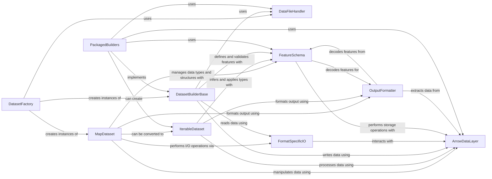

## Component Details

The Data I/O & Processing subsystem is responsible for the fundamental operations of reading, writing, and transforming data within the project. Its main flow involves identifying data file patterns, managing data structures (like Arrow tables), loading dataset modules from various sources, and providing APIs for both map-style and iterable-style datasets. It also handles format-specific I/O, defines and manages feature schemas, and formats output for different machine learning frameworks. The purpose of this subsystem is to provide a robust and flexible foundation for data handling, enabling efficient and versatile data loading, manipulation, and preparation for machine learning tasks.

### DataFileHandler
Manages the identification, sanitization, and resolution of data file patterns, and organizes them into lists and dictionaries for dataset loading.

**Related Classes/Methods**:

- <a href="https://github.com/huggingface/datasets/blob/master/src/datasets/data_files.py#L118-L153" target="_blank" rel="noopener noreferrer">`datasets.src.datasets.data_files.sanitize_patterns` (118:153)</a>
- <a href="https://github.com/huggingface/datasets/blob/master/src/datasets/data_files.py#L387-L475" target="_blank" rel="noopener noreferrer">`datasets.src.datasets.data_files.get_data_patterns` (387:475)</a>
- <a href="https://github.com/huggingface/datasets/blob/master/src/datasets/data_files.py#L517-L611" target="_blank" rel="noopener noreferrer">`datasets.src.datasets.data_files.DataFilesList` (517:611)</a>
- <a href="https://github.com/huggingface/datasets/blob/master/src/datasets/data_files.py#L614-L704" target="_blank" rel="noopener noreferrer">`datasets.src.datasets.data_files.DataFilesDict` (614:704)</a>
- <a href="https://github.com/huggingface/datasets/blob/master/src/datasets/data_files.py#L760-L795" target="_blank" rel="noopener noreferrer">`datasets.src.datasets.data_files.DataFilesPatternsDict` (760:795)</a>

### ArrowDataLayer
Provides the fundamental capabilities for handling Arrow tables, including in-memory and memory-mapped representations, concatenation, and various data manipulation operations like casting, flattening, and embedding storage. It also includes functionalities for writing and reading Arrow data.

**Related Classes/Methods**:

- <a href="https://github.com/huggingface/datasets/blob/master/src/datasets/arrow_writer.py#L341-L673" target="_blank" rel="noopener noreferrer">`datasets.src.datasets.arrow_writer.ArrowWriter` (341:673)</a>
- <a href="https://github.com/huggingface/datasets/blob/master/src/datasets/arrow_reader.py#L285-L329" target="_blank" rel="noopener noreferrer">`datasets.src.datasets.arrow_reader.ArrowReader` (285:329)</a>
- `datasets.src.datasets.table` (full file reference)

### DatasetFactory
Responsible for discovering and loading dataset modules from various sources, including local paths, Hugging Face Hub, and packaged modules. It handles the creation of builder configurations and infers modules based on data files.

**Related Classes/Methods**:

- <a href="https://github.com/huggingface/datasets/blob/master/src/datasets/load.py#L503-L537" target="_blank" rel="noopener noreferrer">`datasets.src.datasets.load:infer_module_for_data_files_list` (503:537)</a>
- <a href="https://github.com/huggingface/datasets/blob/master/src/datasets/load.py#L540-L575" target="_blank" rel="noopener noreferrer">`datasets.src.datasets.load:infer_module_for_data_files_list_in_archives` (540:575)</a>
- <a href="https://github.com/huggingface/datasets/blob/master/src/datasets/load.py#L578-L603" target="_blank" rel="noopener noreferrer">`datasets.src.datasets.load:infer_module_for_data_files` (578:603)</a>
- <a href="https://github.com/huggingface/datasets/blob/master/src/datasets/load.py#L780-L885" target="_blank" rel="noopener noreferrer">`datasets.src.datasets.load.LocalDatasetModuleFactoryWithoutScript` (780:885)</a>
- <a href="https://github.com/huggingface/datasets/blob/master/src/datasets/load.py#L888-L926" target="_blank" rel="noopener noreferrer">`datasets.src.datasets.load.PackagedDatasetModuleFactory` (888:926)</a>
- <a href="https://github.com/huggingface/datasets/blob/master/src/datasets/load.py#L929-L1094" target="_blank" rel="noopener noreferrer">`datasets.src.datasets.load.HubDatasetModuleFactoryWithoutScript` (929:1094)</a>
- <a href="https://github.com/huggingface/datasets/blob/master/src/datasets/load.py#L1097-L1168" target="_blank" rel="noopener noreferrer">`datasets.src.datasets.load.HubDatasetModuleFactoryWithParquetExport` (1097:1168)</a>
- <a href="https://github.com/huggingface/datasets/blob/master/src/datasets/load.py#L1171-L1295" target="_blank" rel="noopener noreferrer">`datasets.src.datasets.load.HubDatasetModuleFactoryWithScript` (1171:1295)</a>
- <a href="https://github.com/huggingface/datasets/blob/master/src/datasets/load.py#L682-L688" target="_blank" rel="noopener noreferrer">`datasets.src.datasets.load.DatasetModule` (682:688)</a>

### MapDataset
Represents the primary API for map-style datasets, allowing for data loading from various formats, saving to disk, and performing transformations like mapping, filtering, sorting, shuffling, and column manipulations. It also supports pushing datasets to the Hugging Face Hub.

**Related Classes/Methods**:

- <a href="https://github.com/huggingface/datasets/blob/master/src/datasets/dataset_dict.py#L52-L1910" target="_blank" rel="noopener noreferrer">`datasets.src.datasets.dataset_dict.DatasetDict` (52:1910)</a>
- <a href="https://github.com/huggingface/datasets/blob/master/src/datasets/arrow_dataset.py#L630-L6214" target="_blank" rel="noopener noreferrer">`datasets.src.datasets.arrow_dataset.Dataset` (630:6214)</a>

### IterableDataset
Provides an API for iterable-style datasets, enabling efficient processing of large datasets that don't fit into memory. It supports various iteration strategies and transformations for streaming data.

**Related Classes/Methods**:

- <a href="https://github.com/huggingface/datasets/blob/master/src/datasets/iterable_dataset.py#L1962-L3394" target="_blank" rel="noopener noreferrer">`datasets.src.datasets.iterable_dataset.IterableDataset` (1962:3394)</a>
- <a href="https://github.com/huggingface/datasets/blob/master/src/datasets/iterable_dataset.py#L282-L346" target="_blank" rel="noopener noreferrer">`datasets.src.datasets.iterable_dataset.ArrowExamplesIterable` (282:346)</a>
- <a href="https://github.com/huggingface/datasets/blob/master/src/datasets/iterable_dataset.py#L1008-L1389" target="_blank" rel="noopener noreferrer">`datasets.src.datasets.iterable_dataset.MappedExamplesIterable` (1008:1389)</a>
- <a href="https://github.com/huggingface/datasets/blob/master/src/datasets/iterable_dataset.py#L1814-L1911" target="_blank" rel="noopener noreferrer">`datasets.src.datasets.iterable_dataset.FormattedExamplesIterable` (1814:1911)</a>

### DatasetBuilderBase
Defines the abstract base for dataset builders, which are responsible for generating and preparing dataset splits. It includes functionalities for handling different data formats and managing the dataset generation process.

**Related Classes/Methods**:

- <a href="https://github.com/huggingface/datasets/blob/master/src/datasets/builder.py#L210-L1393" target="_blank" rel="noopener noreferrer">`datasets.src.datasets.builder.DatasetBuilder` (210:1393)</a>
- <a href="https://github.com/huggingface/datasets/blob/master/src/datasets/builder.py#L1396-L1658" target="_blank" rel="noopener noreferrer">`datasets.src.datasets.builder.GeneratorBasedBuilder` (1396:1658)</a>
- <a href="https://github.com/huggingface/datasets/blob/master/src/datasets/builder.py#L1661-L1903" target="_blank" rel="noopener noreferrer">`datasets.src.datasets.builder.ArrowBasedBuilder` (1661:1903)</a>

### FormatSpecificIO
Handles reading from and writing to various data formats such as CSV, JSON, Parquet, Text, Spark, and SQL. It provides specialized readers and writers for each format.

**Related Classes/Methods**:

- `datasets.src.datasets.io` (full file reference)
- <a href="https://github.com/huggingface/datasets/blob/master/src/datasets/io/text.py#L9-L60" target="_blank" rel="noopener noreferrer">`datasets.src.datasets.io.text.TextDatasetReader` (9:60)</a>
- <a href="https://github.com/huggingface/datasets/blob/master/src/datasets/io/spark.py#L11-L57" target="_blank" rel="noopener noreferrer">`datasets.src.datasets.io.spark.SparkDatasetReader` (11:57)</a>
- <a href="https://github.com/huggingface/datasets/blob/master/src/datasets/io/json.py#L15-L69" target="_blank" rel="noopener noreferrer">`datasets.src.datasets.io.json.JsonDatasetReader` (15:69)</a>
- <a href="https://github.com/huggingface/datasets/blob/master/src/datasets/io/json.py#L72-L174" target="_blank" rel="noopener noreferrer">`datasets.src.datasets.io.json.JsonDatasetWriter` (72:174)</a>
- <a href="https://github.com/huggingface/datasets/blob/master/src/datasets/io/sql.py#L17-L53" target="_blank" rel="noopener noreferrer">`datasets.src.datasets.io.sql.SqlDatasetReader` (17:53)</a>
- <a href="https://github.com/huggingface/datasets/blob/master/src/datasets/io/sql.py#L56-L124" target="_blank" rel="noopener noreferrer">`datasets.src.datasets.io.sql.SqlDatasetWriter` (56:124)</a>
- <a href="https://github.com/huggingface/datasets/blob/master/src/datasets/io/parquet.py#L17-L70" target="_blank" rel="noopener noreferrer">`datasets.src.datasets.io.parquet.ParquetDatasetReader` (17:70)</a>
- <a href="https://github.com/huggingface/datasets/blob/master/src/datasets/io/parquet.py#L73-L122" target="_blank" rel="noopener noreferrer">`datasets.src.datasets.io.parquet.ParquetDatasetWriter` (73:122)</a>
- <a href="https://github.com/huggingface/datasets/blob/master/src/datasets/io/csv.py#L15-L66" target="_blank" rel="noopener noreferrer">`datasets.src.datasets.io.csv.CsvDatasetReader` (15:66)</a>
- <a href="https://github.com/huggingface/datasets/blob/master/src/datasets/io/csv.py#L69-L145" target="_blank" rel="noopener noreferrer">`datasets.src.datasets.io.csv.CsvDatasetWriter` (69:145)</a>
- <a href="https://github.com/huggingface/datasets/blob/master/src/datasets/io/generator.py#L8-L59" target="_blank" rel="noopener noreferrer">`datasets.src.datasets.io.generator.GeneratorDatasetInputStream` (8:59)</a>

### FeatureSchema
Manages the definition, encoding, and decoding of dataset features, including specialized types like images, audio, video, and PDFs. It provides utilities for type inference, casting, and embedding storage.

**Related Classes/Methods**:

- <a href="https://github.com/huggingface/datasets/blob/master/src/datasets/features/pdf.py#L30-L249" target="_blank" rel="noopener noreferrer">`datasets.src.datasets.features.pdf.Pdf` (30:249)</a>
- <a href="https://github.com/huggingface/datasets/blob/master/src/datasets/features/video.py#L27-L226" target="_blank" rel="noopener noreferrer">`datasets.src.datasets.features.video.Video` (27:226)</a>
- <a href="https://github.com/huggingface/datasets/blob/master/src/datasets/features/features.py#L471-L543" target="_blank" rel="noopener noreferrer">`datasets.src.datasets.features.features.Value` (471:543)</a>
- <a href="https://github.com/huggingface/datasets/blob/master/src/datasets/features/features.py#L954-L1148" target="_blank" rel="noopener noreferrer">`datasets.src.datasets.features.features.ClassLabel` (954:1148)</a>
- <a href="https://github.com/huggingface/datasets/blob/master/src/datasets/features/features.py#L1753-L2296" target="_blank" rel="noopener noreferrer">`datasets.src.datasets.features.features.Features` (1753:2296)</a>
- <a href="https://github.com/huggingface/datasets/blob/master/src/datasets/features/audio.py#L21-L274" target="_blank" rel="noopener noreferrer">`datasets.src.datasets.features.audio.Audio` (21:274)</a>
- <a href="https://github.com/huggingface/datasets/blob/master/src/datasets/features/image.py#L46-L283" target="_blank" rel="noopener noreferrer">`datasets.src.datasets.features.image.Image` (46:283)</a>

### OutputFormatter
Provides mechanisms for formatting dataset examples, columns, and batches into different data structures and tensor types (Numpy, Pandas, PyTorch, TensorFlow, JAX, Polars, Python). It handles data extraction and feature decoding.

**Related Classes/Methods**:

- `datasets.src.datasets.formatting` (full file reference)
- <a href="https://github.com/huggingface/datasets/blob/master/src/datasets/formatting/jax_formatter.py#L38-L166" target="_blank" rel="noopener noreferrer">`datasets.src.datasets.formatting.jax_formatter.JaxFormatter` (38:166)</a>
- <a href="https://github.com/huggingface/datasets/blob/master/src/datasets/formatting/tf_formatter.py#L32-L121" target="_blank" rel="noopener noreferrer">`datasets.src.datasets.formatting.tf_formatter.TFFormatter` (32:121)</a>
- <a href="https://github.com/huggingface/datasets/blob/master/src/datasets/formatting/torch_formatter.py#L32-L122" target="_blank" rel="noopener noreferrer">`datasets.src.datasets.formatting.torch_formatter.TorchFormatter` (32:122)</a>
- <a href="https://github.com/huggingface/datasets/blob/master/src/datasets/formatting/np_formatter.py#L26-L112" target="_blank" rel="noopener noreferrer">`datasets.src.datasets.formatting.np_formatter.NumpyFormatter` (26:112)</a>
- <a href="https://github.com/huggingface/datasets/blob/master/src/datasets/formatting/polars_formatter.py#L100-L124" target="_blank" rel="noopener noreferrer">`datasets.src.datasets.formatting.polars_formatter.PolarsFormatter` (100:124)</a>

### PackagedBuilders
A collection of pre-defined dataset builders for common data formats and folder structures, enabling easy loading and processing of datasets like CSV, JSON, Parquet, Text, ImageFolder, AudioFolder, etc.

**Related Classes/Methods**:

- `datasets.src.datasets.packaged_modules._EXTENSION_TO_MODULE` (full file reference)
- `datasets.src.datasets.packaged_modules._MODULE_TO_EXTENSIONS` (full file reference)
- `datasets.src.datasets.packaged_modules._MODULE_TO_METADATA_FILE_NAMES` (full file reference)
- <a href="https://github.com/huggingface/datasets/blob/master/src/datasets/packaged_modules/csv/csv.py#L145-L198" target="_blank" rel="noopener noreferrer">`datasets.src.datasets.packaged_modules.csv.csv.Csv` (145:198)</a>
- <a href="https://github.com/huggingface/datasets/blob/master/src/datasets/packaged_modules/json/json.py#L58-L178" target="_blank" rel="noopener noreferrer">`datasets.src.datasets.packaged_modules.json.json.Json` (58:178)</a>
- <a href="https://github.com/huggingface/datasets/blob/master/src/datasets/packaged_modules/parquet/parquet.py#L29-L109" target="_blank" rel="noopener noreferrer">`datasets.src.datasets.packaged_modules.parquet.parquet.Parquet` (29:109)</a>
- <a href="https://github.com/huggingface/datasets/blob/master/src/datasets/packaged_modules/text/text.py#L28-L112" target="_blank" rel="noopener noreferrer">`datasets.src.datasets.packaged_modules.text.text.Text` (28:112)</a>
- <a href="https://github.com/huggingface/datasets/blob/master/src/datasets/packaged_modules/imagefolder/imagefolder.py#L19-L23" target="_blank" rel="noopener noreferrer">`datasets.src.datasets.packaged_modules.imagefolder.imagefolder.ImageFolder` (19:23)</a>
- <a href="https://github.com/huggingface/datasets/blob/master/src/datasets/packaged_modules/audiofolder/audiofolder.py#L19-L23" target="_blank" rel="noopener noreferrer">`datasets.src.datasets.packaged_modules.audiofolder.audiofolder.AudioFolder` (19:23)</a>
- <a href="https://github.com/huggingface/datasets/blob/master/src/datasets/packaged_modules/pdffolder/pdffolder.py#L19-L23" target="_blank" rel="noopener noreferrer">`datasets.src.datasets.packaged_modules.pdffolder.pdffolder.PdfFolder` (19:23)</a>
- <a href="https://github.com/huggingface/datasets/blob/master/src/datasets/packaged_modules/videofolder/videofolder.py#L19-L23" target="_blank" rel="noopener noreferrer">`datasets.src.datasets.packaged_modules.videofolder.videofolder.VideoFolder` (19:23)</a>
- <a href="https://github.com/huggingface/datasets/blob/master/src/datasets/packaged_modules/sql/sql.py#L91-L119" target="_blank" rel="noopener noreferrer">`datasets.src.datasets.packaged_modules.sql.sql.Sql` (91:119)</a>
- <a href="https://github.com/huggingface/datasets/blob/master/src/datasets/packaged_modules/spark/spark.py#L113-L367" target="_blank" rel="noopener noreferrer">`datasets.src.datasets.packaged_modules.spark.spark.Spark` (113:367)</a>
- <a href="https://github.com/huggingface/datasets/blob/master/src/datasets/packaged_modules/webdataset/webdataset.py#L19-L132" target="_blank" rel="noopener noreferrer">`datasets.src.datasets.packaged_modules.webdataset.webdataset.WebDataset` (19:132)</a>
- <a href="https://github.com/huggingface/datasets/blob/master/src/datasets/packaged_modules/xml/xml.py#L24-L68" target="_blank" rel="noopener noreferrer">`datasets.src.datasets.packaged_modules.xml.xml.Xml` (24:68)</a>
- <a href="https://github.com/huggingface/datasets/blob/master/src/datasets/packaged_modules/generator/generator.py#L23-L33" target="_blank" rel="noopener noreferrer">`datasets.src.datasets.packaged_modules.generator.generator.Generator` (23:33)</a>
- <a href="https://github.com/huggingface/datasets/blob/master/src/datasets/packaged_modules/pandas/pandas.py#L23-L65" target="_blank" rel="noopener noreferrer">`datasets.src.datasets.packaged_modules.pandas.pandas.Pandas` (23:65)</a>

### [FAQ](https://github.com/CodeBoarding/GeneratedOnBoardings/tree/main?tab=readme-ov-file#faq)