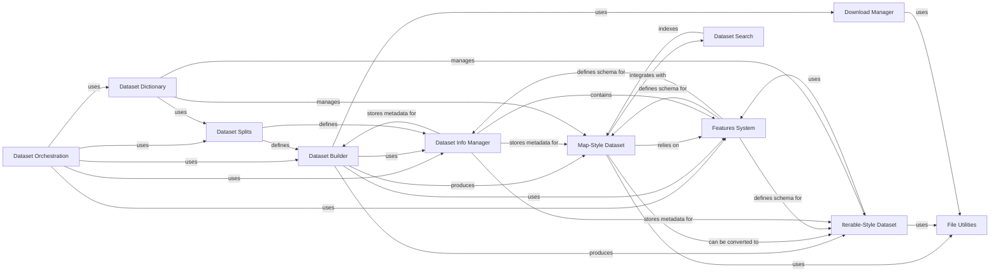

## Component Details

This graph illustrates the architecture of the Dataset Orchestration subsystem, which is responsible for the entire lifecycle of datasets, from loading and management to providing access and integrating search capabilities. The core flow involves the Dataset Orchestration component utilizing the Dataset Builder to construct datasets, which can be either Map-Style or Iterable-Style. These datasets are then managed by the Dataset Dictionary, which handles different splits defined by the Dataset Splits component. Metadata and schema information are provided by the Dataset Info Manager and Features System, respectively. Data downloading is handled by the Download Manager, which relies on File Utilities for low-level file operations. Finally, the Dataset Search component enables efficient querying of Map-Style datasets.

### Dataset Orchestration
The central component responsible for loading, managing, and providing access to datasets, including handling different dataset types (map-style, iterable-style), managing splits, and integrating search capabilities. It orchestrates the entire dataset loading and preparation workflow.

**Related Classes/Methods**:

- <a href="https://github.com/huggingface/datasets/blob/master/src/datasets/load.py#L1386-L1670" target="_blank" rel="noopener noreferrer">`datasets.src.datasets.load:dataset_module_factory` (1386:1670)</a>
- <a href="https://github.com/huggingface/datasets/blob/master/src/datasets/load.py#L1673-L1835" target="_blank" rel="noopener noreferrer">`datasets.src.datasets.load:load_dataset_builder` (1673:1835)</a>
- <a href="https://github.com/huggingface/datasets/blob/master/src/datasets/load.py#L1838-L2100" target="_blank" rel="noopener noreferrer">`datasets.src.datasets.load:load_dataset` (1838:2100)</a>
- <a href="https://github.com/huggingface/datasets/blob/master/src/datasets/load.py#L2103-L2150" target="_blank" rel="noopener noreferrer">`datasets.src.datasets.load:load_from_disk` (2103:2150)</a>
- <a href="https://github.com/huggingface/datasets/blob/master/src/datasets/load.py#L166-L180" target="_blank" rel="noopener noreferrer">`datasets.src.datasets.load:import_main_class` (166:180)</a>
- <a href="https://github.com/huggingface/datasets/blob/master/src/datasets/load.py#L201-L238" target="_blank" rel="noopener noreferrer">`datasets.src.datasets.load:configure_builder_class` (201:238)</a>
- <a href="https://github.com/huggingface/datasets/blob/master/src/datasets/load.py#L241-L260" target="_blank" rel="noopener noreferrer">`datasets.src.datasets.load:get_dataset_builder_class` (241:260)</a>
- <a href="https://github.com/huggingface/datasets/blob/master/src/datasets/load.py#L696-L777" target="_blank" rel="noopener noreferrer">`datasets.src.datasets.load.LocalDatasetModuleFactoryWithScript` (696:777)</a>
- <a href="https://github.com/huggingface/datasets/blob/master/src/datasets/load.py#L780-L885" target="_blank" rel="noopener noreferrer">`datasets.src.datasets.load.LocalDatasetModuleFactoryWithoutScript` (780:885)</a>
- <a href="https://github.com/huggingface/datasets/blob/master/src/datasets/load.py#L888-L926" target="_blank" rel="noopener noreferrer">`datasets.src.datasets.load.PackagedDatasetModuleFactory` (888:926)</a>
- <a href="https://github.com/huggingface/datasets/blob/master/src/datasets/load.py#L929-L1094" target="_blank" rel="noopener noreferrer">`datasets.src.datasets.load.HubDatasetModuleFactoryWithoutScript` (929:1094)</a>
- <a href="https://github.com/huggingface/datasets/blob/master/src/datasets/load.py#L1097-L1168" target="_blank" rel="noopener noreferrer">`datasets.src.datasets.load.HubDatasetModuleFactoryWithParquetExport` (1097:1168)</a>
- <a href="https://github.com/huggingface/datasets/blob/master/src/datasets/load.py#L1171-L1295" target="_blank" rel="noopener noreferrer">`datasets.src.datasets.load.HubDatasetModuleFactoryWithScript` (1171:1295)</a>
- <a href="https://github.com/huggingface/datasets/blob/master/src/datasets/load.py#L1298-L1383" target="_blank" rel="noopener noreferrer">`datasets.src.datasets.load.CachedDatasetModuleFactory` (1298:1383)</a>

### Dataset Builder
Defines the blueprint and logic for constructing a dataset, managing configurations, handling download and preparation, and converting data into Dataset or IterableDataset objects.

**Related Classes/Methods**:

- <a href="https://github.com/huggingface/datasets/blob/master/src/datasets/builder.py#L210-L1393" target="_blank" rel="noopener noreferrer">`datasets.src.datasets.builder.DatasetBuilder` (210:1393)</a>
- <a href="https://github.com/huggingface/datasets/blob/master/src/datasets/builder.py#L97-L207" target="_blank" rel="noopener noreferrer">`datasets.src.datasets.builder.BuilderConfig` (97:207)</a>
- <a href="https://github.com/huggingface/datasets/blob/master/src/datasets/builder.py#L1396-L1658" target="_blank" rel="noopener noreferrer">`datasets.src.datasets.builder.GeneratorBasedBuilder` (1396:1658)</a>
- <a href="https://github.com/huggingface/datasets/blob/master/src/datasets/builder.py#L1661-L1903" target="_blank" rel="noopener noreferrer">`datasets.src.datasets.builder.ArrowBasedBuilder` (1661:1903)</a>

### Map-Style Dataset
Represents a dataset stored in an Apache Arrow table format, providing efficient in-memory data manipulation capabilities with a rich API for various data operations.

**Related Classes/Methods**:

- <a href="https://github.com/huggingface/datasets/blob/master/src/datasets/arrow_dataset.py#L630-L6214" target="_blank" rel="noopener noreferrer">`datasets.src.datasets.arrow_dataset.Dataset` (630:6214)</a>

### Iterable-Style Dataset
Provides a lazy-loading and streaming interface for datasets, enabling efficient processing of very large datasets that may not fit into memory with on-the-fly transformations.

**Related Classes/Methods**:

- <a href="https://github.com/huggingface/datasets/blob/master/src/datasets/iterable_dataset.py#L1962-L3394" target="_blank" rel="noopener noreferrer">`datasets.src.datasets.iterable_dataset.IterableDataset` (1962:3394)</a>
- <a href="https://github.com/huggingface/datasets/blob/master/src/datasets/iterable_dataset.py#L208-L242" target="_blank" rel="noopener noreferrer">`datasets.src.datasets.iterable_dataset.ExamplesIterable` (208:242)</a>
- <a href="https://github.com/huggingface/datasets/blob/master/src/datasets/iterable_dataset.py#L282-L346" target="_blank" rel="noopener noreferrer">`datasets.src.datasets.iterable_dataset.ArrowExamplesIterable` (282:346)</a>
- <a href="https://github.com/huggingface/datasets/blob/master/src/datasets/iterable_dataset.py#L1008-L1389" target="_blank" rel="noopener noreferrer">`datasets.src.datasets.iterable_dataset.MappedExamplesIterable` (1008:1389)</a>
- <a href="https://github.com/huggingface/datasets/blob/master/src/datasets/iterable_dataset.py#L1417-L1491" target="_blank" rel="noopener noreferrer">`datasets.src.datasets.iterable_dataset.FilteredExamplesIterable` (1417:1491)</a>
- <a href="https://github.com/huggingface/datasets/blob/master/src/datasets/iterable_dataset.py#L1494-L1562" target="_blank" rel="noopener noreferrer">`datasets.src.datasets.iterable_dataset.BufferShuffledExamplesIterable` (1494:1562)</a>
- <a href="https://github.com/huggingface/datasets/blob/master/src/datasets/iterable_dataset.py#L1565-L1637" target="_blank" rel="noopener noreferrer">`datasets.src.datasets.iterable_dataset.SkipExamplesIterable` (1565:1637)</a>
- <a href="https://github.com/huggingface/datasets/blob/master/src/datasets/iterable_dataset.py#L1640-L1686" target="_blank" rel="noopener noreferrer">`datasets.src.datasets.iterable_dataset.RepeatExamplesIterable` (1640:1686)</a>
- <a href="https://github.com/huggingface/datasets/blob/master/src/datasets/iterable_dataset.py#L1689-L1767" target="_blank" rel="noopener noreferrer">`datasets.src.datasets.iterable_dataset.TakeExamplesIterable` (1689:1767)</a>
- <a href="https://github.com/huggingface/datasets/blob/master/src/datasets/iterable_dataset.py#L646-L746" target="_blank" rel="noopener noreferrer">`datasets.src.datasets.iterable_dataset.CyclingMultiSourcesExamplesIterable` (646:746)</a>
- <a href="https://github.com/huggingface/datasets/blob/master/src/datasets/iterable_dataset.py#L912-L992" target="_blank" rel="noopener noreferrer">`datasets.src.datasets.iterable_dataset.RandomlyCyclingMultiSourcesExamplesIterable` (912:992)</a>
- <a href="https://github.com/huggingface/datasets/blob/master/src/datasets/iterable_dataset.py#L749-L821" target="_blank" rel="noopener noreferrer">`datasets.src.datasets.iterable_dataset.VerticallyConcatenatedMultiSourcesExamplesIterable` (749:821)</a>
- <a href="https://github.com/huggingface/datasets/blob/master/src/datasets/iterable_dataset.py#L834-L909" target="_blank" rel="noopener noreferrer">`datasets.src.datasets.iterable_dataset.HorizontallyConcatenatedMultiSourcesExamplesIterable` (834:909)</a>

### Dataset Dictionary
Manages collections of datasets, typically representing different splits (e.g., "train", "validation", "test") of a single dataset, providing a dictionary-like interface for access and manipulation.

**Related Classes/Methods**:

- <a href="https://github.com/huggingface/datasets/blob/master/src/datasets/dataset_dict.py#L52-L1910" target="_blank" rel="noopener noreferrer">`datasets.src.datasets.dataset_dict.DatasetDict` (52:1910)</a>
- <a href="https://github.com/huggingface/datasets/blob/master/src/datasets/dataset_dict.py#L1913-L2371" target="_blank" rel="noopener noreferrer">`datasets.src.datasets.dataset_dict.IterableDatasetDict` (1913:2371)</a>

### Download Manager
Handles all aspects of data downloading and extraction, supporting various download modes, managing a cache, and ensuring data integrity.

**Related Classes/Methods**:

- <a href="https://github.com/huggingface/datasets/blob/master/src/datasets/download/download_manager.py#L71-L340" target="_blank" rel="noopener noreferrer">`datasets.src.datasets.download.download_manager.DownloadManager` (71:340)</a>
- <a href="https://github.com/huggingface/datasets/blob/master/src/datasets/download/download_manager.py#L50-L68" target="_blank" rel="noopener noreferrer">`datasets.src.datasets.download.download_manager.DownloadMode` (50:68)</a>

### Features System
Defines the structural and type information for dataset columns, supporting various primitive and complex data types and ensuring data consistency through encoding and decoding mechanisms.

**Related Classes/Methods**:

- <a href="https://github.com/huggingface/datasets/blob/master/src/datasets/features/features.py#L1753-L2296" target="_blank" rel="noopener noreferrer">`datasets.src.datasets.features.features.Features` (1753:2296)</a>
- <a href="https://github.com/huggingface/datasets/blob/master/src/datasets/features/features.py#L471-L543" target="_blank" rel="noopener noreferrer">`datasets.src.datasets.features.features.Value` (471:543)</a>
- <a href="https://github.com/huggingface/datasets/blob/master/src/datasets/features/features.py#L954-L1148" target="_blank" rel="noopener noreferrer">`datasets.src.datasets.features.features.ClassLabel` (954:1148)</a>
- <a href="https://github.com/huggingface/datasets/blob/master/src/datasets/features/features.py#L1152-L1178" target="_blank" rel="noopener noreferrer">`datasets.src.datasets.features.features.Sequence` (1152:1178)</a>
- <a href="https://github.com/huggingface/datasets/blob/master/src/datasets/features/features.py#L559-L580" target="_blank" rel="noopener noreferrer">`datasets.src.datasets.features.features.Array2D` (559:580)</a>
- <a href="https://github.com/huggingface/datasets/blob/master/src/datasets/features/features.py#L584-L605" target="_blank" rel="noopener noreferrer">`datasets.src.datasets.features.features.Array3D` (584:605)</a>
- <a href="https://github.com/huggingface/datasets/blob/master/src/datasets/features/features.py#L609-L630" target="_blank" rel="noopener noreferrer">`datasets.src.datasets.features.features.Array4D` (609:630)</a>
- <a href="https://github.com/huggingface/datasets/blob/master/src/datasets/features/features.py#L634-L655" target="_blank" rel="noopener noreferrer">`datasets.src.datasets.features.features.Array5D` (634:655)</a>
- <a href="https://github.com/huggingface/datasets/blob/master/src/datasets/features/audio.py#L21-L274" target="_blank" rel="noopener noreferrer">`datasets.src.datasets.features.audio.Audio` (21:274)</a>
- <a href="https://github.com/huggingface/datasets/blob/master/src/datasets/features/image.py#L46-L283" target="_blank" rel="noopener noreferrer">`datasets.src.datasets.features.image.Image` (46:283)</a>
- <a href="https://github.com/huggingface/datasets/blob/master/src/datasets/features/video.py#L27-L226" target="_blank" rel="noopener noreferrer">`datasets.src.datasets.features.video.Video` (27:226)</a>
- <a href="https://github.com/huggingface/datasets/blob/master/src/datasets/features/pdf.py#L30-L249" target="_blank" rel="noopener noreferrer">`datasets.src.datasets.features.pdf.Pdf` (30:249)</a>
- <a href="https://github.com/huggingface/datasets/blob/master/src/datasets/features/translation.py#L12-L48" target="_blank" rel="noopener noreferrer">`datasets.src.datasets.features.translation.Translation` (12:48)</a>
- <a href="https://github.com/huggingface/datasets/blob/master/src/datasets/features/translation.py#L52-L129" target="_blank" rel="noopener noreferrer">`datasets.src.datasets.features.translation.TranslationVariableLanguages` (52:129)</a>
- <a href="https://github.com/huggingface/datasets/blob/master/src/datasets/features/features.py#L1182-L1196" target="_blank" rel="noopener noreferrer">`datasets.src.datasets.features.features.LargeList` (1182:1196)</a>

### Dataset Info Manager
Stores and manages comprehensive metadata about a dataset, including its description, citation, features, splits, and size statistics, crucial for understanding and verifying the dataset.

**Related Classes/Methods**:

- <a href="https://github.com/huggingface/datasets/blob/master/src/datasets/info.py#L92-L321" target="_blank" rel="noopener noreferrer">`datasets.src.datasets.info.DatasetInfo` (92:321)</a>
- <a href="https://github.com/huggingface/datasets/blob/master/src/datasets/info.py#L324-L430" target="_blank" rel="noopener noreferrer">`datasets.src.datasets.info.DatasetInfosDict` (324:430)</a>
- <a href="https://github.com/huggingface/datasets/blob/master/src/datasets/info.py#L76-L88" target="_blank" rel="noopener noreferrer">`datasets.src.datasets.info.PostProcessedInfo` (76:88)</a>
- <a href="https://github.com/huggingface/datasets/blob/master/src/datasets/info.py#L56-L58" target="_blank" rel="noopener noreferrer">`datasets.src.datasets.info.SupervisedKeysData` (56:58)</a>

### File Utilities
A foundational utility module extending standard Python file system operations to support local paths and remote URLs, handling file caching, network requests, and archive extraction.

**Related Classes/Methods**:

- <a href="https://github.com/huggingface/datasets/blob/master/src/datasets/utils/file_utils.py#L143-L263" target="_blank" rel="noopener noreferrer">`datasets.src.datasets.utils.file_utils.cached_path` (143:263)</a>
- <a href="https://github.com/huggingface/datasets/blob/master/src/datasets/utils/file_utils.py#L922-L966" target="_blank" rel="noopener noreferrer">`datasets.src.datasets.utils.file_utils.xopen` (922:966)</a>
- <a href="https://github.com/huggingface/datasets/blob/master/src/datasets/utils/file_utils.py#L572-L596" target="_blank" rel="noopener noreferrer">`datasets.src.datasets.utils.file_utils.xjoin` (572:596)</a>
- <a href="https://github.com/huggingface/datasets/blob/master/src/datasets/utils/file_utils.py#L630-L648" target="_blank" rel="noopener noreferrer">`datasets.src.datasets.utils.file_utils.xexists` (630:648)</a>
- <a href="https://github.com/huggingface/datasets/blob/master/src/datasets/utils/file_utils.py#L994-L1017" target="_blank" rel="noopener noreferrer">`datasets.src.datasets.utils.file_utils.xglob` (994:1017)</a>
- <a href="https://github.com/huggingface/datasets/blob/master/src/datasets/utils/file_utils.py#L731-L748" target="_blank" rel="noopener noreferrer">`datasets.src.datasets.utils.file_utils.xisfile` (731:748)</a>
- <a href="https://github.com/huggingface/datasets/blob/master/src/datasets/utils/file_utils.py#L779-L799" target="_blank" rel="noopener noreferrer">`datasets.src.datasets.utils.file_utils.xisdir` (779:799)</a>
- <a href="https://github.com/huggingface/datasets/blob/master/src/datasets/utils/file_utils.py#L651-L674" target="_blank" rel="noopener noreferrer">`datasets.src.datasets.utils.file_utils.xbasename` (651:674)</a>
- <a href="https://github.com/huggingface/datasets/blob/master/src/datasets/utils/file_utils.py#L704-L728" target="_blank" rel="noopener noreferrer">`datasets.src.datasets.utils.file_utils.xsplitext` (704:728)</a>
- <a href="https://github.com/huggingface/datasets/blob/master/src/datasets/utils/file_utils.py#L1020-L1045" target="_blank" rel="noopener noreferrer">`datasets.src.datasets.utils.file_utils.xwalk` (1020:1045)</a>
- <a href="https://github.com/huggingface/datasets/blob/master/src/datasets/utils/file_utils.py#L751-L776" target="_blank" rel="noopener noreferrer">`datasets.src.datasets.utils.file_utils.xgetsize` (751:776)</a>
- <a href="https://github.com/huggingface/datasets/blob/master/src/datasets/utils/file_utils.py#L65-L81" target="_blank" rel="noopener noreferrer">`datasets.src.datasets.utils.file_utils.init_hf_modules` (65:81)</a>
- <a href="https://github.com/huggingface/datasets/blob/master/src/datasets/utils/file_utils.py#L84-L85" target="_blank" rel="noopener noreferrer">`datasets.src.datasets.utils.file_utils.is_remote_url` (84:85)</a>
- <a href="https://github.com/huggingface/datasets/blob/master/src/datasets/utils/file_utils.py#L88-L92" target="_blank" rel="noopener noreferrer">`datasets.src.datasets.utils.file_utils.is_local_path` (88:92)</a>
- <a href="https://github.com/huggingface/datasets/blob/master/src/datasets/utils/file_utils.py#L95-L96" target="_blank" rel="noopener noreferrer">`datasets.src.datasets.utils.file_utils.is_relative_path` (95:96)</a>
- <a href="https://github.com/huggingface/datasets/blob/master/src/datasets/utils/file_utils.py#L99-L102" target="_blank" rel="noopener noreferrer">`datasets.src.datasets.utils.file_utils.relative_to_absolute_path` (99:102)</a>
- <a href="https://github.com/huggingface/datasets/blob/master/src/datasets/utils/file_utils.py#L105-L109" target="_blank" rel="noopener noreferrer">`datasets.src.datasets.utils.file_utils.url_or_path_join` (105:109)</a>
- <a href="https://github.com/huggingface/datasets/blob/master/src/datasets/utils/file_utils.py#L112-L116" target="_blank" rel="noopener noreferrer">`datasets.src.datasets.utils.file_utils.url_or_path_parent` (112:116)</a>
- <a href="https://github.com/huggingface/datasets/blob/master/src/datasets/utils/file_utils.py#L119-L140" target="_blank" rel="noopener noreferrer">`datasets.src.datasets.utils.file_utils.hash_url_to_filename` (119:140)</a>
- <a href="https://github.com/huggingface/datasets/blob/master/src/datasets/utils/file_utils.py#L266-L281" target="_blank" rel="noopener noreferrer">`datasets.src.datasets.utils.file_utils.get_datasets_user_agent` (266:281)</a>
- <a href="https://github.com/huggingface/datasets/blob/master/src/datasets/utils/file_utils.py#L284-L291" target="_blank" rel="noopener noreferrer">`datasets.src.datasets.utils.file_utils.get_authentication_headers_for_url` (284:291)</a>
- <a href="https://github.com/huggingface/datasets/blob/master/src/datasets/utils/file_utils.py#L294-L299" target="_blank" rel="noopener noreferrer">`datasets.src.datasets.utils.file_utils._raise_if_offline_mode_is_enabled` (294:299)</a>
- <a href="https://github.com/huggingface/datasets/blob/master/src/datasets/utils/file_utils.py#L302-L305" target="_blank" rel="noopener noreferrer">`datasets.src.datasets.utils.file_utils.fsspec_head` (302:305)</a>
- <a href="https://github.com/huggingface/datasets/blob/master/src/datasets/utils/file_utils.py#L308-L311" target="_blank" rel="noopener noreferrer">`datasets.src.datasets.utils.file_utils.stack_multiprocessing_download_progress_bars` (308:311)</a>
- <a href="https://github.com/huggingface/datasets/blob/master/src/datasets/utils/file_utils.py#L324-L339" target="_blank" rel="noopener noreferrer">`datasets.src.datasets.utils.file_utils.fsspec_get` (324:339)</a>
- <a href="https://github.com/huggingface/datasets/blob/master/src/datasets/utils/file_utils.py#L342-L426" target="_blank" rel="noopener noreferrer">`datasets.src.datasets.utils.file_utils.get_from_cache` (342:426)</a>
- <a href="https://github.com/huggingface/datasets/blob/master/src/datasets/utils/file_utils.py#L445-L446" target="_blank" rel="noopener noreferrer">`datasets.src.datasets.utils.file_utils.estimate_dataset_size` (445:446)</a>
- <a href="https://github.com/huggingface/datasets/blob/master/src/datasets/utils/file_utils.py#L449-L459" target="_blank" rel="noopener noreferrer">`datasets.src.datasets.utils.file_utils.readline` (449:459)</a>
- <a href="https://github.com/huggingface/datasets/blob/master/src/datasets/utils/file_utils.py#L518-L525" target="_blank" rel="noopener noreferrer">`datasets.src.datasets.utils.file_utils._get_path_extension` (518:525)</a>
- <a href="https://github.com/huggingface/datasets/blob/master/src/datasets/utils/file_utils.py#L528-L543" target="_blank" rel="noopener noreferrer">`datasets.src.datasets.utils.file_utils._get_extraction_protocol_with_magic_number` (528:543)</a>
- <a href="https://github.com/huggingface/datasets/blob/master/src/datasets/utils/file_utils.py#L546-L569" target="_blank" rel="noopener noreferrer">`datasets.src.datasets.utils.file_utils._get_extraction_protocol` (546:569)</a>
- <a href="https://github.com/huggingface/datasets/blob/master/src/datasets/utils/file_utils.py#L819-L851" target="_blank" rel="noopener noreferrer">`datasets.src.datasets.utils.file_utils._add_retries_to_file_obj_read_method` (819:851)</a>
- <a href="https://github.com/huggingface/datasets/blob/master/src/datasets/utils/file_utils.py#L854-L863" target="_blank" rel="noopener noreferrer">`datasets.src.datasets.utils.file_utils._prepare_path_and_storage_options` (854:863)</a>
- <a href="https://github.com/huggingface/datasets/blob/master/src/datasets/utils/file_utils.py#L866-L919" target="_blank" rel="noopener noreferrer">`datasets.src.datasets.utils.file_utils._prepare_single_hop_path_and_storage_options` (866:919)</a>
- <a href="https://github.com/huggingface/datasets/blob/master/src/datasets/utils/file_utils.py#L1184-L1191" target="_blank" rel="noopener noreferrer">`datasets.src.datasets.utils.file_utils.xgzip_open` (1184:1191)</a>
- <a href="https://github.com/huggingface/datasets/blob/master/src/datasets/utils/file_utils.py#L1194-L1201" target="_blank" rel="noopener noreferrer">`datasets.src.datasets.utils.file_utils.xnumpy_load` (1194:1201)</a>
- <a href="https://github.com/huggingface/datasets/blob/master/src/datasets/utils/file_utils.py#L1204-L1213" target="_blank" rel="noopener noreferrer">`datasets.src.datasets.utils.file_utils.xpandas_read_csv` (1204:1213)</a>
- <a href="https://github.com/huggingface/datasets/blob/master/src/datasets/utils/file_utils.py#L1216-L1231" target="_blank" rel="noopener noreferrer">`datasets.src.datasets.utils.file_utils.xpandas_read_excel` (1216:1231)</a>
- <a href="https://github.com/huggingface/datasets/blob/master/src/datasets/utils/file_utils.py#L1234-L1241" target="_blank" rel="noopener noreferrer">`datasets.src.datasets.utils.file_utils.xpyarrow_parquet_read_table` (1234:1241)</a>
- <a href="https://github.com/huggingface/datasets/blob/master/src/datasets/utils/file_utils.py#L1244-L1250" target="_blank" rel="noopener noreferrer">`datasets.src.datasets.utils.file_utils.xsio_loadmat` (1244:1250)</a>
- <a href="https://github.com/huggingface/datasets/blob/master/src/datasets/utils/file_utils.py#L1253-L1268" target="_blank" rel="noopener noreferrer">`datasets.src.datasets.utils.file_utils.xet_parse` (1253:1268)</a>
- <a href="https://github.com/huggingface/datasets/blob/master/src/datasets/utils/file_utils.py#L1271-L1286" target="_blank" rel="noopener noreferrer">`datasets.src.datasets.utils.file_utils.xxml_dom_minidom_parse` (1271:1286)</a>
- <a href="https://github.com/huggingface/datasets/blob/master/src/datasets/utils/file_utils.py#L1289-L1351" target="_blank" rel="noopener noreferrer">`datasets.src.datasets.utils.file_utils.ArchiveIterable` (1289:1351)</a>
- <a href="https://github.com/huggingface/datasets/blob/master/src/datasets/utils/file_utils.py#L1354-L1383" target="_blank" rel="noopener noreferrer">`datasets.src.datasets.utils.file_utils.FilesIterable` (1354:1383)</a>
- <a href="https://github.com/huggingface/datasets/blob/master/src/datasets/utils/file_utils.py#L1048-L1177" target="_blank" rel="noopener noreferrer">`datasets.src.datasets.utils.file_utils.xPath` (1048:1177)</a>

### Dataset Splits
Manages the definition and handling of dataset splits, providing classes and utilities for defining split information and reading data according to splits.

**Related Classes/Methods**:

- <a href="https://github.com/huggingface/datasets/blob/master/src/datasets/splits.py#L406-L451" target="_blank" rel="noopener noreferrer">`datasets.src.datasets.splits.Split` (406:451)</a>
- <a href="https://github.com/huggingface/datasets/blob/master/src/datasets/splits.py#L314-L388" target="_blank" rel="noopener noreferrer">`datasets.src.datasets.splits.NamedSplit` (314:388)</a>
- <a href="https://github.com/huggingface/datasets/blob/master/src/datasets/splits.py#L391-L403" target="_blank" rel="noopener noreferrer">`datasets.src.datasets.splits.NamedSplitAll` (391:403)</a>
- <a href="https://github.com/huggingface/datasets/blob/master/src/datasets/splits.py#L276-L289" target="_blank" rel="noopener noreferrer">`datasets.src.datasets.splits._SplitMerged` (276:289)</a>
- <a href="https://github.com/huggingface/datasets/blob/master/src/datasets/splits.py#L292-L311" target="_blank" rel="noopener noreferrer">`datasets.src.datasets.splits._SubSplit` (292:311)</a>
- <a href="https://github.com/huggingface/datasets/blob/master/src/datasets/splits.py#L32-L55" target="_blank" rel="noopener noreferrer">`datasets.src.datasets.splits.SplitInfo` (32:55)</a>
- <a href="https://github.com/huggingface/datasets/blob/master/src/datasets/splits.py#L602-L635" target="_blank" rel="noopener noreferrer">`datasets.src.datasets.splits.SplitGenerator` (602:635)</a>
- <a href="https://github.com/huggingface/datasets/blob/master/src/datasets/splits.py#L464-L516" target="_blank" rel="noopener noreferrer">`datasets.src.datasets.splits.SplitReadInstruction` (464:516)</a>

### Dataset Search
Provides capabilities for searching within datasets, enabling efficient data retrieval based on specific criteria, including implementations for various indexing and search mechanisms.

**Related Classes/Methods**:

- `datasets.src.datasets.search` (full file reference)
- <a href="https://github.com/huggingface/datasets/blob/master/src/datasets/search.py#L98-L212" target="_blank" rel="noopener noreferrer">`datasets.src.datasets.search.ElasticSearchIndex` (98:212)</a>
- <a href="https://github.com/huggingface/datasets/blob/master/src/datasets/search.py#L215-L414" target="_blank" rel="noopener noreferrer">`datasets.src.datasets.search.FaissIndex` (215:414)</a>
- <a href="https://github.com/huggingface/datasets/blob/master/src/datasets/search.py#L60-L95" target="_blank" rel="noopener noreferrer">`datasets.src.datasets.search.BaseIndex` (60:95)</a>

### [FAQ](https://github.com/CodeBoarding/GeneratedOnBoardings/tree/main?tab=readme-ov-file#faq)