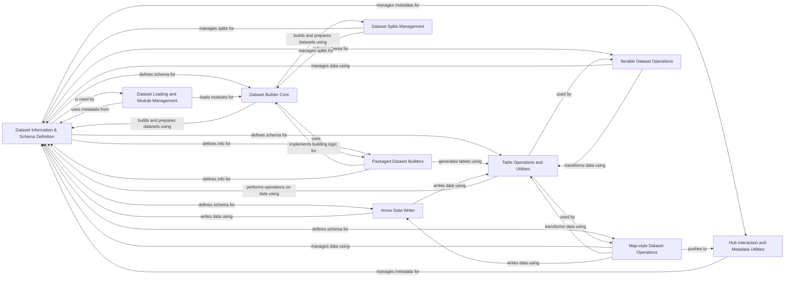

## Component Details

This graph illustrates the core components involved in defining, managing, loading, building, and operating on datasets within the system. The central purpose is to provide a robust framework for handling various dataset types, their schemas, and metadata, facilitating efficient data preparation, storage, and access. The flow generally starts with defining dataset information and schema, which then informs the loading and building processes. Once built, datasets can be manipulated and accessed through map-style or iterable operations, leveraging underlying Arrow table utilities and data writing capabilities. Interactions with the Hugging Face Hub are also managed for metadata and dataset sharing.

### Dataset Information & Schema Definition
Manages the overall structural and descriptive information of a dataset. This includes defining the dataset's schema (data types and structure of features) and storing essential metadata such as dataset name, description, homepage, license, and checksums for data integrity. It also handles configurations related to metadata.

**Related Classes/Methods**:

- <a href="https://github.com/huggingface/datasets/blob/master/src/datasets/info.py#L92-L321" target="_blank" rel="noopener noreferrer">`datasets.src.datasets.info.DatasetInfo` (92:321)</a>
- <a href="https://github.com/huggingface/datasets/blob/master/src/datasets/info.py#L324-L430" target="_blank" rel="noopener noreferrer">`datasets.src.datasets.info.DatasetInfosDict` (324:430)</a>
- <a href="https://github.com/huggingface/datasets/blob/master/src/datasets/features/features.py#L1753-L2296" target="_blank" rel="noopener noreferrer">`datasets.src.datasets.features.features.Features` (1753:2296)</a>
- <a href="https://github.com/huggingface/datasets/blob/master/src/datasets/utils/metadata.py#L46-L189" target="_blank" rel="noopener noreferrer">`datasets.src.datasets.utils.metadata.MetadataConfigs` (46:189)</a>
- <a href="https://github.com/huggingface/datasets/blob/master/src/datasets/load.py#L606-L660" target="_blank" rel="noopener noreferrer">`datasets.src.datasets.load:create_builder_configs_from_metadata_configs` (606:660)</a>
- <a href="https://github.com/huggingface/datasets/blob/master/src/datasets/load.py#L664-L678" target="_blank" rel="noopener noreferrer">`datasets.src.datasets.load:BuilderConfigsParameters` (664:678)</a>
- <a href="https://github.com/huggingface/datasets/blob/master/src/datasets/features/audio.py#L21-L274" target="_blank" rel="noopener noreferrer">`datasets.src.datasets.features.audio.Audio` (21:274)</a>
- <a href="https://github.com/huggingface/datasets/blob/master/src/datasets/features/image.py#L46-L283" target="_blank" rel="noopener noreferrer">`datasets.src.datasets.features.image.Image` (46:283)</a>
- <a href="https://github.com/huggingface/datasets/blob/master/src/datasets/features/pdf.py#L30-L249" target="_blank" rel="noopener noreferrer">`datasets.src.datasets.features.pdf.Pdf` (30:249)</a>
- <a href="https://github.com/huggingface/datasets/blob/master/src/datasets/features/video.py#L27-L226" target="_blank" rel="noopener noreferrer">`datasets.src.datasets.features.video.Video` (27:226)</a>
- <a href="https://github.com/huggingface/datasets/blob/master/src/datasets/features/translation.py#L12-L48" target="_blank" rel="noopener noreferrer">`datasets.src.datasets.features.translation.Translation` (12:48)</a>

### Dataset Loading and Module Management
This component is responsible for loading dataset modules and creating builder configurations. It handles the logic for inferring modules from data files, sanitizing patterns, and importing main classes for dataset builders, supporting both local and hub-based datasets.

**Related Classes/Methods**:

- <a href="https://github.com/huggingface/datasets/blob/master/src/datasets/load.py#L606-L660" target="_blank" rel="noopener noreferrer">`datasets.src.datasets.load.create_builder_configs_from_metadata_configs` (606:660)</a>
- <a href="https://github.com/huggingface/datasets/blob/master/src/datasets/load.py#L780-L885" target="_blank" rel="noopener noreferrer">`datasets.src.datasets.load.LocalDatasetModuleFactoryWithoutScript` (780:885)</a>
- <a href="https://github.com/huggingface/datasets/blob/master/src/datasets/load.py#L929-L1094" target="_blank" rel="noopener noreferrer">`datasets.src.datasets.load.HubDatasetModuleFactoryWithoutScript` (929:1094)</a>
- <a href="https://github.com/huggingface/datasets/blob/master/src/datasets/load.py#L1097-L1168" target="_blank" rel="noopener noreferrer">`datasets.src.datasets.load.HubDatasetModuleFactoryWithParquetExport` (1097:1168)</a>
- <a href="https://github.com/huggingface/datasets/blob/master/src/datasets/load.py#L166-L180" target="_blank" rel="noopener noreferrer">`datasets.src.datasets.load.import_main_class` (166:180)</a>
- <a href="https://github.com/huggingface/datasets/blob/master/src/datasets/load.py#L578-L603" target="_blank" rel="noopener noreferrer">`datasets.src.datasets.load.infer_module_for_data_files` (578:603)</a>
- <a href="https://github.com/huggingface/datasets/blob/master/src/datasets/load.py#L682-L688" target="_blank" rel="noopener noreferrer">`datasets.src.datasets.load.DatasetModule` (682:688)</a>
- <a href="https://github.com/huggingface/datasets/blob/master/src/datasets/load.py#L664-L678" target="_blank" rel="noopener noreferrer">`datasets.src.datasets.load.BuilderConfigsParameters` (664:678)</a>

### Dataset Builder Core
This is the core component for building and preparing datasets. It manages the dataset configuration, download and preparation processes, split generation, and saving of dataset information. It interacts with various other components for features, splits, and file system operations.

**Related Classes/Methods**:

- <a href="https://github.com/huggingface/datasets/blob/master/src/datasets/builder.py#L210-L1393" target="_blank" rel="noopener noreferrer">`datasets.src.datasets.builder.DatasetBuilder` (210:1393)</a>
- <a href="https://github.com/huggingface/datasets/blob/master/src/datasets/builder.py#L535-L623" target="_blank" rel="noopener noreferrer">`datasets.src.datasets.builder.DatasetBuilder._create_builder_config` (535:623)</a>
- <a href="https://github.com/huggingface/datasets/blob/master/src/datasets/builder.py#L521-L533" target="_blank" rel="noopener noreferrer">`datasets.src.datasets.builder.DatasetBuilder.get_exported_dataset_info` (521:533)</a>
- <a href="https://github.com/huggingface/datasets/blob/master/src/datasets/builder.py#L703-L712" target="_blank" rel="noopener noreferrer">`datasets.src.datasets.builder.DatasetBuilder._info` (703:712)</a>
- <a href="https://github.com/huggingface/datasets/blob/master/src/datasets/builder.py#L668-L700" target="_blank" rel="noopener noreferrer">`datasets.src.datasets.builder.DatasetBuilder._build_cache_dir` (668:700)</a>
- <a href="https://github.com/huggingface/datasets/blob/master/src/datasets/builder.py#L507-L519" target="_blank" rel="noopener noreferrer">`datasets.src.datasets.builder.DatasetBuilder.get_all_exported_dataset_infos` (507:519)</a>
- <a href="https://github.com/huggingface/datasets/blob/master/src/datasets/builder.py#L722-L945" target="_blank" rel="noopener noreferrer">`datasets.src.datasets.builder.DatasetBuilder.download_and_prepare` (722:945)</a>
- <a href="https://github.com/huggingface/datasets/blob/master/src/datasets/builder.py#L960-L1023" target="_blank" rel="noopener noreferrer">`datasets.src.datasets.builder.DatasetBuilder._download_and_prepare` (960:1023)</a>
- <a href="https://github.com/huggingface/datasets/blob/master/src/datasets/builder.py#L1041-L1042" target="_blank" rel="noopener noreferrer">`datasets.src.datasets.builder.DatasetBuilder._load_info` (1041:1042)</a>
- <a href="https://github.com/huggingface/datasets/blob/master/src/datasets/builder.py#L1053-L1060" target="_blank" rel="noopener noreferrer">`datasets.src.datasets.builder.DatasetBuilder._save_infos` (1053:1060)</a>
- <a href="https://github.com/huggingface/datasets/blob/master/src/datasets/builder.py#L1142-L1209" target="_blank" rel="noopener noreferrer">`datasets.src.datasets.builder.DatasetBuilder._build_single_dataset` (1142:1209)</a>
- <a href="https://github.com/huggingface/datasets/blob/master/src/datasets/builder.py#L1025-L1039" target="_blank" rel="noopener noreferrer">`datasets.src.datasets.builder.DatasetBuilder.download_post_processing_resources` (1025:1039)</a>
- <a href="https://github.com/huggingface/datasets/blob/master/src/datasets/builder.py#L947-L958" target="_blank" rel="noopener noreferrer">`datasets.src.datasets.builder.DatasetBuilder._check_manual_download` (947:958)</a>
- <a href="https://github.com/huggingface/datasets/blob/master/src/datasets/builder.py#L1062-L1065" target="_blank" rel="noopener noreferrer">`datasets.src.datasets.builder.DatasetBuilder._make_split_generators_kwargs` (1062:1065)</a>
- <a href="https://github.com/huggingface/datasets/blob/master/src/datasets/builder.py#L1310-L1354" target="_blank" rel="noopener noreferrer">`datasets.src.datasets.builder.DatasetBuilder._split_generators` (1310:1354)</a>
- <a href="https://github.com/huggingface/datasets/blob/master/src/datasets/builder.py#L1357-L1384" target="_blank" rel="noopener noreferrer">`datasets.src.datasets.builder.DatasetBuilder._prepare_split` (1357:1384)</a>
- <a href="https://github.com/huggingface/datasets/blob/master/src/datasets/builder.py#L1211-L1238" target="_blank" rel="noopener noreferrer">`datasets.src.datasets.builder.DatasetBuilder._as_dataset` (1211:1238)</a>
- <a href="https://github.com/huggingface/datasets/blob/master/src/datasets/builder.py#L1299-L1301" target="_blank" rel="noopener noreferrer">`datasets.src.datasets.builder.DatasetBuilder._post_processing_resources` (1299:1301)</a>
- <a href="https://github.com/huggingface/datasets/blob/master/src/datasets/builder.py#L1295-L1297" target="_blank" rel="noopener noreferrer">`datasets.src.datasets.builder.DatasetBuilder._post_process` (1295:1297)</a>

### Packaged Dataset Builders
This component comprises a collection of specialized dataset builders designed to handle specific file formats or data sources. Each builder provides its own logic for defining dataset information, casting tables, and generating tables from various input files like CSV, JSON, Parquet, XML, Text, Pandas, Arrow, SQL, WebDataset, and folder-based structures.

**Related Classes/Methods**:

- <a href="https://github.com/huggingface/datasets/blob/master/src/datasets/packaged_modules/csv/csv.py#L145-L198" target="_blank" rel="noopener noreferrer">`datasets.src.datasets.packaged_modules.csv.csv.Csv` (145:198)</a>
- <a href="https://github.com/huggingface/datasets/blob/master/src/datasets/packaged_modules/pandas/pandas.py#L23-L65" target="_blank" rel="noopener noreferrer">`datasets.src.datasets.packaged_modules.pandas.pandas.Pandas` (23:65)</a>
- <a href="https://github.com/huggingface/datasets/blob/master/src/datasets/packaged_modules/xml/xml.py#L24-L68" target="_blank" rel="noopener noreferrer">`datasets.src.datasets.packaged_modules.xml.xml.Xml` (24:68)</a>
- <a href="https://github.com/huggingface/datasets/blob/master/src/datasets/packaged_modules/text/text.py#L28-L112" target="_blank" rel="noopener noreferrer">`datasets.src.datasets.packaged_modules.text.text.Text` (28:112)</a>
- <a href="https://github.com/huggingface/datasets/blob/master/src/datasets/packaged_modules/spark/spark.py#L113-L367" target="_blank" rel="noopener noreferrer">`datasets.src.datasets.packaged_modules.spark.spark.Spark` (113:367)</a>
- <a href="https://github.com/huggingface/datasets/blob/master/src/datasets/packaged_modules/arrow/arrow.py#L24-L79" target="_blank" rel="noopener noreferrer">`datasets.src.datasets.packaged_modules.arrow.arrow.Arrow` (24:79)</a>
- <a href="https://github.com/huggingface/datasets/blob/master/src/datasets/packaged_modules/folder_based_builder/folder_based_builder.py#L40-L404" target="_blank" rel="noopener noreferrer">`datasets.src.datasets.packaged_modules.folder_based_builder.folder_based_builder.FolderBasedBuilder` (40:404)</a>
- <a href="https://github.com/huggingface/datasets/blob/master/src/datasets/packaged_modules/parquet/parquet.py#L29-L109" target="_blank" rel="noopener noreferrer">`datasets.src.datasets.packaged_modules.parquet.parquet.Parquet` (29:109)</a>
- <a href="https://github.com/huggingface/datasets/blob/master/src/datasets/packaged_modules/generator/generator.py#L23-L33" target="_blank" rel="noopener noreferrer">`datasets.src.datasets.packaged_modules.generator.generator.Generator` (23:33)</a>
- <a href="https://github.com/huggingface/datasets/blob/master/src/datasets/packaged_modules/sql/sql.py#L91-L119" target="_blank" rel="noopener noreferrer">`datasets.src.datasets.packaged_modules.sql.sql.Sql` (91:119)</a>
- <a href="https://github.com/huggingface/datasets/blob/master/src/datasets/packaged_modules/webdataset/webdataset.py#L19-L132" target="_blank" rel="noopener noreferrer">`datasets.src.datasets.packaged_modules.webdataset.webdataset.WebDataset` (19:132)</a>
- <a href="https://github.com/huggingface/datasets/blob/master/src/datasets/packaged_modules/json/json.py#L58-L178" target="_blank" rel="noopener noreferrer">`datasets.src.datasets.packaged_modules.json.json.Json` (58:178)</a>
- <a href="https://github.com/huggingface/datasets/blob/master/src/datasets/packaged_modules/cache/cache.py#L98-L191" target="_blank" rel="noopener noreferrer">`datasets.src.datasets.packaged_modules.cache.cache.Cache` (98:191)</a>

### Dataset Splits Management
This component is responsible for managing information about dataset splits (e.g., train, validation, test). It handles the creation, manipulation, and serialization of split definitions and their associated metadata.

**Related Classes/Methods**:

- <a href="https://github.com/huggingface/datasets/blob/master/src/datasets/splits.py#L519-L598" target="_blank" rel="noopener noreferrer">`datasets.src.datasets.splits.SplitDict` (519:598)</a>
- <a href="https://github.com/huggingface/datasets/blob/master/src/datasets/splits.py#L602-L635" target="_blank" rel="noopener noreferrer">`datasets.src.datasets.splits.SplitGenerator` (602:635)</a>
- <a href="https://github.com/huggingface/datasets/blob/master/src/datasets/splits.py#L32-L55" target="_blank" rel="noopener noreferrer">`datasets.src.datasets.splits.SplitInfo` (32:55)</a>
- <a href="https://github.com/huggingface/datasets/blob/master/src/datasets/splits.py#L314-L388" target="_blank" rel="noopener noreferrer">`datasets.src.datasets.splits.NamedSplit` (314:388)</a>
- <a href="https://github.com/huggingface/datasets/blob/master/src/datasets/splits.py#L406-L451" target="_blank" rel="noopener noreferrer">`datasets.src.datasets.splits.Split` (406:451)</a>

### Hub Interaction and Metadata Utilities
This component facilitates interactions with the Hugging Face Hub, including deleting datasets and managing metadata configurations for dataset cards. It provides utilities for handling user agents, download configurations, and cached paths.

**Related Classes/Methods**:

- <a href="https://github.com/huggingface/datasets/blob/master/src/datasets/hub.py#L105-L174" target="_blank" rel="noopener noreferrer">`datasets.src.datasets.hub.delete_from_hub` (105:174)</a>
- <a href="https://github.com/huggingface/datasets/blob/master/src/datasets/utils/metadata.py#L46-L189" target="_blank" rel="noopener noreferrer">`datasets.src.datasets.utils.metadata.MetadataConfigs` (46:189)</a>
- <a href="https://github.com/huggingface/datasets/blob/master/src/datasets/utils/metadata.py#L103-L139" target="_blank" rel="noopener noreferrer">`datasets.src.datasets.utils.metadata.MetadataConfigs._from_exported_parquet_files_and_dataset_infos` (103:139)</a>
- <a href="https://github.com/huggingface/datasets/blob/master/src/datasets/utils/metadata.py#L52-L100" target="_blank" rel="noopener noreferrer">`datasets.src.datasets.utils.metadata.MetadataConfigs._raise_if_data_files_field_not_valid` (52:100)</a>
- <a href="https://github.com/huggingface/datasets/blob/master/src/datasets/utils/metadata.py#L179-L189" target="_blank" rel="noopener noreferrer">`datasets.src.datasets.utils.metadata.MetadataConfigs.get_default_config_name` (179:189)</a>
- <a href="https://github.com/huggingface/datasets/blob/master/src/datasets/utils/_dataset_viewer.py#L62-L95" target="_blank" rel="noopener noreferrer">`datasets.src.datasets.utils._dataset_viewer.get_exported_dataset_infos` (62:95)</a>
- <a href="https://github.com/huggingface/datasets/blob/master/src/datasets/utils/_dataset_viewer.py#L26-L59" target="_blank" rel="noopener noreferrer">`datasets.src.datasets.utils._dataset_viewer.get_exported_parquet_files` (26:59)</a>

### Arrow Data Writer
This component is responsible for writing data into Apache Arrow format. It handles batch writing, schema inference, and finalization of Arrow files, including metadata building and duplicate key checking. It also manages typed sequences for efficient data handling.

**Related Classes/Methods**:

- <a href="https://github.com/huggingface/datasets/blob/master/src/datasets/arrow_writer.py#L341-L673" target="_blank" rel="noopener noreferrer">`datasets.src.datasets.arrow_writer.ArrowWriter` (341:673)</a>
- <a href="https://github.com/huggingface/datasets/blob/master/src/datasets/arrow_writer.py#L96-L316" target="_blank" rel="noopener noreferrer">`datasets.src.datasets.arrow_writer.TypedSequence` (96:316)</a>
- <a href="https://github.com/huggingface/datasets/blob/master/src/datasets/arrow_writer.py#L319-L338" target="_blank" rel="noopener noreferrer">`datasets.src.datasets.arrow_writer.OptimizedTypedSequence` (319:338)</a>
- <a href="https://github.com/huggingface/datasets/blob/master/src/datasets/arrow_writer.py#L53-L89" target="_blank" rel="noopener noreferrer">`datasets.src.datasets.arrow_writer.get_writer_batch_size` (53:89)</a>
- <a href="https://github.com/huggingface/datasets/blob/master/src/datasets/arrow_writer.py#L92-L93" target="_blank" rel="noopener noreferrer">`datasets.src.datasets.arrow_writer.SchemaInferenceError` (92:93)</a>

### Table Operations and Utilities
This component provides a set of utilities and operations for manipulating Apache Arrow tables. It includes functionalities for casting arrays and tables to different features/schemas, embedding array storage, flattening tables, and visiting table structures.

**Related Classes/Methods**:

- <a href="https://github.com/huggingface/datasets/blob/master/src/datasets/table.py#L1274-L1744" target="_blank" rel="noopener noreferrer">`datasets.src.datasets.table.ConcatenationTable` (1274:1744)</a>
- <a href="https://github.com/huggingface/datasets/blob/master/src/datasets/table.py#L639-L983" target="_blank" rel="noopener noreferrer">`datasets.src.datasets.table.InMemoryTable` (639:983)</a>
- <a href="https://github.com/huggingface/datasets/blob/master/src/datasets/table.py#L154-L626" target="_blank" rel="noopener noreferrer">`datasets.src.datasets.table.Table` (154:626)</a>
- <a href="https://github.com/huggingface/datasets/blob/master/src/datasets/table.py#L1955-L2109" target="_blank" rel="noopener noreferrer">`datasets.src.datasets.table.cast_array_to_feature` (1955:2109)</a>
- <a href="https://github.com/huggingface/datasets/blob/master/src/datasets/table.py#L2113-L2174" target="_blank" rel="noopener noreferrer">`datasets.src.datasets.table.embed_array_storage` (2113:2174)</a>
- <a href="https://github.com/huggingface/datasets/blob/master/src/datasets/table.py#L2224-L2253" target="_blank" rel="noopener noreferrer">`datasets.src.datasets.table.cast_table_to_schema` (2224:2253)</a>
- <a href="https://github.com/huggingface/datasets/blob/master/src/datasets/table.py#L2256-L2275" target="_blank" rel="noopener noreferrer">`datasets.src.datasets.table.embed_table_storage` (2256:2275)</a>
- <a href="https://github.com/huggingface/datasets/blob/master/src/datasets/table.py#L2278-L2297" target="_blank" rel="noopener noreferrer">`datasets.src.datasets.table.table_cast` (2278:2297)</a>
- <a href="https://github.com/huggingface/datasets/blob/master/src/datasets/table.py#L2300-L2339" target="_blank" rel="noopener noreferrer">`datasets.src.datasets.table.table_flatten` (2300:2339)</a>
- <a href="https://github.com/huggingface/datasets/blob/master/src/datasets/table.py#L2342-L2378" target="_blank" rel="noopener noreferrer">`datasets.src.datasets.table.table_visitor` (2342:2378)</a>
- <a href="https://github.com/huggingface/datasets/blob/master/src/datasets/table.py#L1808-L1818" target="_blank" rel="noopener noreferrer">`datasets.src.datasets.table._combine_list_array_offsets_with_mask` (1808:1818)</a>
- <a href="https://github.com/huggingface/datasets/blob/master/src/datasets/table.py#L1803-L1805" target="_blank" rel="noopener noreferrer">`datasets.src.datasets.table._are_list_values_of_length` (1803:1805)</a>
- <a href="https://github.com/huggingface/datasets/blob/master/src/datasets/table.py#L1821-L1831" target="_blank" rel="noopener noreferrer">`datasets.src.datasets.table._storage_type` (1821:1831)</a>
- <a href="https://github.com/huggingface/datasets/blob/master/src/datasets/table.py#L1842-L1951" target="_blank" rel="noopener noreferrer">`datasets.src.datasets.table.array_cast` (1842:1951)</a>
- <a href="https://github.com/huggingface/datasets/blob/master/src/datasets/table.py#L1834-L1838" target="_blank" rel="noopener noreferrer">`datasets.src.datasets.table._short_str` (1834:1838)</a>
- <a href="https://github.com/huggingface/datasets/blob/master/src/datasets/table.py#L2177-L2199" target="_blank" rel="noopener noreferrer">`datasets.src.datasets.table.CastError` (2177:2199)</a>
- <a href="https://github.com/huggingface/datasets/blob/master/src/datasets/table.py#L53-L60" target="_blank" rel="noopener noreferrer">`datasets.src.datasets.table.read_schema_from_file` (53:60)</a>
- <a href="https://github.com/huggingface/datasets/blob/master/src/datasets/table.py#L1747-L1767" target="_blank" rel="noopener noreferrer">`datasets.src.datasets.table.concat_tables` (1747:1767)</a>

### Map-style Dataset Operations
This component represents datasets that can be accessed by index, typically backed by Apache Arrow tables. It provides methods for initializing, transforming (flattening, casting columns, removing/renaming columns, filtering), adding data, and pushing datasets to the Hugging Face Hub. It also handles concatenation and interleaving of map-style datasets.

**Related Classes/Methods**:

- <a href="https://github.com/huggingface/datasets/blob/master/src/datasets/arrow_dataset.py#L630-L6214" target="_blank" rel="noopener noreferrer">`datasets.src.datasets.arrow_dataset.Dataset` (630:6214)</a>
- <a href="https://github.com/huggingface/datasets/blob/master/src/datasets/arrow_dataset.py#L155-L224" target="_blank" rel="noopener noreferrer">`datasets.src.datasets.arrow_dataset.DatasetInfoMixin` (155:224)</a>
- <a href="https://github.com/huggingface/datasets/blob/master/src/datasets/arrow_dataset.py#L583-L596" target="_blank" rel="noopener noreferrer">`datasets.src.datasets.arrow_dataset.update_metadata_with_features` (583:596)</a>
- <a href="https://github.com/huggingface/datasets/blob/master/src/datasets/arrow_dataset.py#L599-L608" target="_blank" rel="noopener noreferrer">`datasets.src.datasets.arrow_dataset._check_table` (599:608)</a>
- <a href="https://github.com/huggingface/datasets/blob/master/src/datasets/arrow_dataset.py#L611-L616" target="_blank" rel="noopener noreferrer">`datasets.src.datasets.arrow_dataset._check_column_names` (611:616)</a>
- <a href="https://github.com/huggingface/datasets/blob/master/src/datasets/arrow_dataset.py#L536-L537" target="_blank" rel="noopener noreferrer">`datasets.src.datasets.arrow_dataset.DatasetTransformationNotAllowedError` (536:537)</a>
- <a href="https://github.com/huggingface/datasets/blob/master/src/datasets/arrow_dataset.py#L6217-L6328" target="_blank" rel="noopener noreferrer">`datasets.src.datasets.arrow_dataset._concatenate_map_style_datasets` (6217:6328)</a>
- <a href="https://github.com/huggingface/datasets/blob/master/src/datasets/arrow_dataset.py#L6331-L6434" target="_blank" rel="noopener noreferrer">`datasets.src.datasets.arrow_dataset._interleave_map_style_datasets` (6331:6434)</a>

### Iterable Dataset Operations
This component represents datasets that are designed for iteration, often used for large datasets that cannot fit into memory. It provides methods for inferring features, converting to Arrow format, and performing transformations like renaming columns, selecting columns, decoding, and batching. It also supports concatenation and interleaving of iterable datasets.

**Related Classes/Methods**:

- <a href="https://github.com/huggingface/datasets/blob/master/src/datasets/iterable_dataset.py#L1962-L3394" target="_blank" rel="noopener noreferrer">`datasets.src.datasets.iterable_dataset.IterableDataset` (1962:3394)</a>
- <a href="https://github.com/huggingface/datasets/blob/master/src/datasets/iterable_dataset.py#L1814-L1911" target="_blank" rel="noopener noreferrer">`datasets.src.datasets.iterable_dataset.FormattedExamplesIterable` (1814:1911)</a>
- <a href="https://github.com/huggingface/datasets/blob/master/src/datasets/iterable_dataset.py#L282-L346" target="_blank" rel="noopener noreferrer">`datasets.src.datasets.iterable_dataset.ArrowExamplesIterable` (282:346)</a>
- <a href="https://github.com/huggingface/datasets/blob/master/src/datasets/iterable_dataset.py#L555-L597" target="_blank" rel="noopener noreferrer">`datasets.src.datasets.iterable_dataset.SelectColumnsIterable` (555:597)</a>
- <a href="https://github.com/huggingface/datasets/blob/master/src/datasets/iterable_dataset.py#L749-L821" target="_blank" rel="noopener noreferrer">`datasets.src.datasets.iterable_dataset.VerticallyConcatenatedMultiSourcesExamplesIterable` (749:821)</a>
- <a href="https://github.com/huggingface/datasets/blob/master/src/datasets/iterable_dataset.py#L834-L909" target="_blank" rel="noopener noreferrer">`datasets.src.datasets.iterable_dataset.HorizontallyConcatenatedMultiSourcesExamplesIterable` (834:909)</a>
- <a href="https://github.com/huggingface/datasets/blob/master/src/datasets/iterable_dataset.py#L646-L746" target="_blank" rel="noopener noreferrer">`datasets.src.datasets.iterable_dataset.CyclingMultiSourcesExamplesIterable` (646:746)</a>
- <a href="https://github.com/huggingface/datasets/blob/master/src/datasets/iterable_dataset.py#L912-L992" target="_blank" rel="noopener noreferrer">`datasets.src.datasets.iterable_dataset.RandomlyCyclingMultiSourcesExamplesIterable` (912:992)</a>
- <a href="https://github.com/huggingface/datasets/blob/master/src/datasets/iterable_dataset.py#L80-L87" target="_blank" rel="noopener noreferrer">`datasets.src.datasets.iterable_dataset._infer_features_from_batch` (80:87)</a>
- <a href="https://github.com/huggingface/datasets/blob/master/src/datasets/iterable_dataset.py#L106-L135" target="_blank" rel="noopener noreferrer">`datasets.src.datasets.iterable_dataset._convert_to_arrow` (106:135)</a>
- <a href="https://github.com/huggingface/datasets/blob/master/src/datasets/iterable_dataset.py#L1935-L1944" target="_blank" rel="noopener noreferrer">`datasets.src.datasets.iterable_dataset._maybe_share_with_torch_persistent_workers` (1935:1944)</a>
- <a href="https://github.com/huggingface/datasets/blob/master/src/datasets/iterable_dataset.py#L1926-L1932" target="_blank" rel="noopener noreferrer">`datasets.src.datasets.iterable_dataset._maybe_add_torch_iterable_dataset_parent_class` (1926:1932)</a>
- <a href="https://github.com/huggingface/datasets/blob/master/src/datasets/iterable_dataset.py#L3397-L3479" target="_blank" rel="noopener noreferrer">`datasets.src.datasets.iterable_dataset._concatenate_iterable_datasets` (3397:3479)</a>
- <a href="https://github.com/huggingface/datasets/blob/master/src/datasets/iterable_dataset.py#L3482-L3547" target="_blank" rel="noopener noreferrer">`datasets.src.datasets.iterable_dataset._interleave_iterable_datasets` (3482:3547)</a>

### [FAQ](https://github.com/CodeBoarding/GeneratedOnBoardings/tree/main?tab=readme-ov-file#faq)