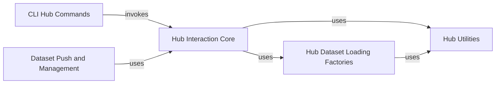

## Component Details

This graph illustrates the architecture of the Hugging Face Hub Integration subsystem within the `datasets` library. It outlines how various components interact to facilitate operations like dataset loading, pushing, conversion, and deletion on the Hugging Face Hub. The core interaction with the Hub is managed by the 'Hub Interaction Core', which is utilized by other components such as 'Hub Dataset Loading Factories' for different loading strategies, 'Dataset Push and Management' for uploading data, and 'CLI Hub Commands' for command-line operations. 'Hub Utilities' provide auxiliary functions used across these components.

### Hub Interaction Core
Manages the fundamental interactions with the Hugging Face Hub, including authentication, API calls for dataset operations (upload, download, delete), and handling dataset card metadata.

**Related Classes/Methods**:

- `datasets.src.datasets.hub` (full file reference)
- `huggingface_hub.HfApi` (full file reference)
- `huggingface_hub.DatasetCard` (full file reference)
- `huggingface_hub.DatasetCardData` (full file reference)
- <a href="https://github.com/huggingface/datasets/blob/master/src/datasets/hub.py#L23-L102" target="_blank" rel="noopener noreferrer">`datasets.src.datasets.hub:convert_to_parquet` (23:102)</a>
- <a href="https://github.com/huggingface/datasets/blob/master/src/datasets/hub.py#L105-L174" target="_blank" rel="noopener noreferrer">`datasets.src.datasets.hub:delete_from_hub` (105:174)</a>
- <a href="https://github.com/huggingface/datasets/blob/master/src/datasets/hub.py#L177-L230" target="_blank" rel="noopener noreferrer">`datasets.src.datasets.hub._delete_files` (177:230)</a>

### Hub Dataset Loading Factories
Provides specialized factories for loading datasets from the Hugging Face Hub, differentiating between datasets with and without loading scripts, and those optimized for Parquet export.

**Related Classes/Methods**:

- <a href="https://github.com/huggingface/datasets/blob/master/src/datasets/load.py#L929-L1094" target="_blank" rel="noopener noreferrer">`datasets.src.datasets.load.HubDatasetModuleFactoryWithoutScript` (929:1094)</a>
- <a href="https://github.com/huggingface/datasets/blob/master/src/datasets/load.py#L1097-L1168" target="_blank" rel="noopener noreferrer">`datasets.src.datasets.load.HubDatasetModuleFactoryWithParquetExport` (1097:1168)</a>
- <a href="https://github.com/huggingface/datasets/blob/master/src/datasets/load.py#L1171-L1295" target="_blank" rel="noopener noreferrer">`datasets.src.datasets.load.HubDatasetModuleFactoryWithScript` (1171:1295)</a>
- <a href="https://github.com/huggingface/datasets/blob/master/src/datasets/load.py#L283-L293" target="_blank" rel="noopener noreferrer">`datasets.src.datasets.load:increase_load_count` (283:293)</a>

### Hub Utilities
Offers utility functions specifically for interacting with the Hugging Face Hub, such as generating dataset URLs and managing dataset viewer functionalities.

**Related Classes/Methods**:

- `datasets.src.datasets.utils.hub.hf_dataset_url` (full file reference)
- `datasets.src.datasets.utils._dataset_viewer` (full file reference)

### Dataset Push and Management
Handles the pushing of dataset content and metadata to the Hugging Face Hub, including checking dataset types and features before upload.

**Related Classes/Methods**:

- <a href="https://github.com/huggingface/datasets/blob/master/src/datasets/dataset_dict.py#L1604-L1910" target="_blank" rel="noopener noreferrer">`datasets.src.datasets.dataset_dict.DatasetDict:push_to_hub` (1604:1910)</a>
- <a href="https://github.com/huggingface/datasets/blob/master/src/datasets/arrow_dataset.py#L5476-L5826" target="_blank" rel="noopener noreferrer">`datasets.src.datasets.arrow_dataset.Dataset:push_to_hub` (5476:5826)</a>
- <a href="https://github.com/huggingface/datasets/blob/master/src/datasets/arrow_dataset.py#L5395-L5474" target="_blank" rel="noopener noreferrer">`datasets.src.datasets.arrow_dataset.Dataset._push_parquet_shards_to_hub` (5395:5474)</a>

### CLI Hub Commands
Provides command-line interface functionalities for direct interaction with the Hugging Face Hub, such as converting datasets to Parquet and deleting datasets.

**Related Classes/Methods**:

- <a href="https://github.com/huggingface/datasets/blob/master/src/datasets/commands/delete_from_hub.py#L8-L14" target="_blank" rel="noopener noreferrer">`datasets.src.datasets.commands.delete_from_hub:_command_factory` (8:14)</a>
- <a href="https://github.com/huggingface/datasets/blob/master/src/datasets/commands/delete_from_hub.py#L41-L42" target="_blank" rel="noopener noreferrer">`datasets.src.datasets.commands.delete_from_hub.DeleteFromHubCommand:run` (41:42)</a>
- <a href="https://github.com/huggingface/datasets/blob/master/src/datasets/commands/convert_to_parquet.py#L8-L14" target="_blank" rel="noopener noreferrer">`datasets.src.datasets.commands.convert_to_parquet:_command_factory` (8:14)</a>
- <a href="https://github.com/huggingface/datasets/blob/master/src/datasets/commands/convert_to_parquet.py#L43-L46" target="_blank" rel="noopener noreferrer">`datasets.src.datasets.commands.convert_to_parquet.ConvertToParquetCommand:run` (43:46)</a>

### [FAQ](https://github.com/CodeBoarding/GeneratedOnBoardings/tree/main?tab=readme-ov-file#faq)