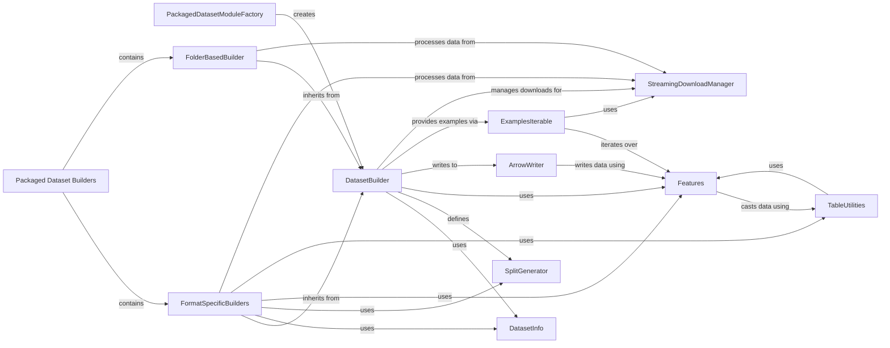

## Component Details

The 'Packaged Dataset Builders' subsystem in the `datasets` library provides a streamlined approach to loading common data formats like CSV, JSON, and Parquet without requiring users to write custom data loading scripts. It leverages a factory pattern to identify and instantiate the appropriate pre-implemented `DatasetBuilder` based on file extensions, orchestrating the entire data lifecycle from configuration and downloading to preparation into an efficient Apache Arrow format. This subsystem significantly simplifies data ingestion for a wide range of standard datasets.

### Packaged Dataset Builders
Represents the collection of pre-implemented dataset builders for various common data formats (e.g., CSV, JSON, Parquet). These builders simplify the process of loading these data types without requiring custom scripts.

**Related Classes/Methods**:

- `datasets.src.datasets.packaged_modules._PACKAGED_DATASETS_MODULES` (full file reference)
- <a href="https://github.com/huggingface/datasets/blob/master/src/datasets/packaged_modules/folder_based_builder/folder_based_builder.py#L40-L404" target="_blank" rel="noopener noreferrer">`datasets.src.datasets.packaged_modules.folder_based_builder.FolderBasedBuilder` (40:404)</a>
- <a href="https://github.com/huggingface/datasets/blob/master/src/datasets/load.py#L888-L926" target="_blank" rel="noopener noreferrer">`datasets.src.datasets.load.PackagedDatasetModuleFactory` (888:926)</a>

### DatasetBuilder
The foundational abstract class for all datasets within the `datasets` library. It orchestrates the entire dataset lifecycle, including configuration, data downloading, preparation (converting raw data into a standardized format like Apache Arrow), and providing access to the processed dataset. Subclasses implement specific logic for different data formats or sources.

**Related Classes/Methods**:

- <a href="https://github.com/huggingface/datasets/blob/master/src/datasets/builder.py#L210-L1393" target="_blank" rel="noopener noreferrer">`datasets.builder.DatasetBuilder` (210:1393)</a>
- <a href="https://github.com/huggingface/datasets/blob/master/src/datasets/builder.py#L97-L207" target="_blank" rel="noopener noreferrer">`datasets.builder.BuilderConfig` (97:207)</a>

### DatasetInfo
A dataclass that encapsulates comprehensive metadata about a dataset. This includes static information like description, citation, and homepage, as well as dynamically computed details such as features, splits (train, test, validation), download checksums, and various size metrics (download size, dataset size, total size in bytes). It is crucial for documenting and verifying dataset integrity.

**Related Classes/Methods**:

- <a href="https://github.com/huggingface/datasets/blob/master/src/datasets/info.py#L92-L321" target="_blank" rel="noopener noreferrer">`datasets.info.DatasetInfo` (92:321)</a>

### SplitGenerator
A class used within `DatasetBuilder` subclasses to define how data should be generated for specific dataset splits (e.g., 'train', 'test'). It specifies the name of the split and any keyword arguments (`gen_kwargs`) that should be passed to the `_generate_examples` or `_generate_tables` method for that particular split.

**Related Classes/Methods**:

- <a href="https://github.com/huggingface/datasets/blob/master/src/datasets/splits.py#L602-L635" target="_blank" rel="noopener noreferrer">`datasets.splits.SplitGenerator` (602:635)</a>

### Features
A specialized dictionary that defines the schema and data types for a dataset's columns. It supports various feature types, including scalar values, class labels, nested dictionaries, lists, and specialized types for audio, image, and video data. It also provides methods for encoding and decoding examples to conform to the defined schema.

**Related Classes/Methods**:

- <a href="https://github.com/huggingface/datasets/blob/master/src/datasets/features/features.py#L1753-L2296" target="_blank" rel="noopener noreferrer">`datasets.features.features.Features` (1753:2296)</a>
- <a href="https://github.com/huggingface/datasets/blob/master/src/datasets/features/features.py#L471-L543" target="_blank" rel="noopener noreferrer">`datasets.features.features.Value` (471:543)</a>
- <a href="https://github.com/huggingface/datasets/blob/master/src/datasets/features/features.py#L954-L1148" target="_blank" rel="noopener noreferrer">`datasets.features.features.ClassLabel` (954:1148)</a>
- <a href="https://github.com/huggingface/datasets/blob/master/src/datasets/features/features.py#L1152-L1178" target="_blank" rel="noopener noreferrer">`datasets.features.features.Sequence` (1152:1178)</a>
- <a href="https://github.com/huggingface/datasets/blob/master/src/datasets/features/features.py#L1182-L1196" target="_blank" rel="noopener noreferrer">`datasets.features.features.LargeList` (1182:1196)</a>
- <a href="https://github.com/huggingface/datasets/blob/master/src/datasets/features/features.py#L559-L580" target="_blank" rel="noopener noreferrer">`datasets.features.features.Array2D` (559:580)</a>
- <a href="https://github.com/huggingface/datasets/blob/master/src/datasets/features/features.py#L584-L605" target="_blank" rel="noopener noreferrer">`datasets.features.features.Array3D` (584:605)</a>
- <a href="https://github.com/huggingface/datasets/blob/master/src/datasets/features/features.py#L609-L630" target="_blank" rel="noopener noreferrer">`datasets.features.features.Array4D` (609:630)</a>
- <a href="https://github.com/huggingface/datasets/blob/master/src/datasets/features/features.py#L634-L655" target="_blank" rel="noopener noreferrer">`datasets.features.features.Array5D` (634:655)</a>
- `datasets.features.features.Audio` (full file reference)
- `datasets.features.features.Image` (full file reference)
- `datasets.features.features.Video` (full file reference)
- `datasets.features.features.Pdf` (full file reference)
- `datasets.features.features.Translation` (full file reference)
- `datasets.features.features.TranslationVariableLanguages` (full file reference)

### ArrowWriter
A component responsible for writing dataset examples or tables into Apache Arrow files. It handles schema inference, batching of data, and can perform checks for duplicate keys. It is a key part of the data preparation phase, converting in-memory data structures into efficient on-disk Arrow format.

**Related Classes/Methods**:

- <a href="https://github.com/huggingface/datasets/blob/master/src/datasets/arrow_writer.py#L341-L673" target="_blank" rel="noopener noreferrer">`datasets.arrow_writer.ArrowWriter` (341:673)</a>
- <a href="https://github.com/huggingface/datasets/blob/master/src/datasets/arrow_writer.py#L676-L677" target="_blank" rel="noopener noreferrer">`datasets.arrow_writer.ParquetWriter` (676:677)</a>

### ExamplesIterable
The base class for iterables that provide examples for `IterableDataset` in streaming mode. Its subclasses (like `ExamplesIterable` for example-based generators and `ArrowExamplesIterable` for Arrow table-based generators) handle the actual iteration over data sources, and can be composed with operations like shuffling and sharding.

**Related Classes/Methods**:

- <a href="https://github.com/huggingface/datasets/blob/master/src/datasets/iterable_dataset.py#L138-L205" target="_blank" rel="noopener noreferrer">`datasets.iterable_dataset._BaseExamplesIterable` (138:205)</a>
- <a href="https://github.com/huggingface/datasets/blob/master/src/datasets/iterable_dataset.py#L208-L242" target="_blank" rel="noopener noreferrer">`datasets.iterable_dataset.ExamplesIterable` (208:242)</a>
- <a href="https://github.com/huggingface/datasets/blob/master/src/datasets/iterable_dataset.py#L282-L346" target="_blank" rel="noopener noreferrer">`datasets.iterable_dataset.ArrowExamplesIterable` (282:346)</a>
- `datasets.iterable_dataset.SparkExamplesIterable` (full file reference)
- <a href="https://github.com/huggingface/datasets/blob/master/src/datasets/iterable_dataset.py#L419-L552" target="_blank" rel="noopener noreferrer">`datasets.iterable_dataset.RebatchedArrowExamplesIterable` (419:552)</a>
- <a href="https://github.com/huggingface/datasets/blob/master/src/datasets/iterable_dataset.py#L555-L597" target="_blank" rel="noopener noreferrer">`datasets.iterable_dataset.SelectColumnsIterable` (555:597)</a>
- <a href="https://github.com/huggingface/datasets/blob/master/src/datasets/iterable_dataset.py#L600-L643" target="_blank" rel="noopener noreferrer">`datasets.iterable_dataset.StepExamplesIterable` (600:643)</a>
- <a href="https://github.com/huggingface/datasets/blob/master/src/datasets/iterable_dataset.py#L646-L746" target="_blank" rel="noopener noreferrer">`datasets.iterable_dataset.CyclingMultiSourcesExamplesIterable` (646:746)</a>
- <a href="https://github.com/huggingface/datasets/blob/master/src/datasets/iterable_dataset.py#L749-L821" target="_blank" rel="noopener noreferrer">`datasets.iterable_dataset.VerticallyConcatenatedMultiSourcesExamplesIterable` (749:821)</a>
- <a href="https://github.com/huggingface/datasets/blob/master/src/datasets/iterable_dataset.py#L834-L909" target="_blank" rel="noopener noreferrer">`datasets.iterable_dataset.HorizontallyConcatenatedMultiSourcesExamplesIterable` (834:909)</a>
- <a href="https://github.com/huggingface/datasets/blob/master/src/datasets/iterable_dataset.py#L912-L992" target="_blank" rel="noopener noreferrer">`datasets.iterable_dataset.RandomlyCyclingMultiSourcesExamplesIterable` (912:992)</a>
- <a href="https://github.com/huggingface/datasets/blob/master/src/datasets/iterable_dataset.py#L1008-L1389" target="_blank" rel="noopener noreferrer">`datasets.iterable_dataset.MappedExamplesIterable` (1008:1389)</a>
- <a href="https://github.com/huggingface/datasets/blob/master/src/datasets/iterable_dataset.py#L1417-L1491" target="_blank" rel="noopener noreferrer">`datasets.iterable_dataset.FilteredExamplesIterable` (1417:1491)</a>
- <a href="https://github.com/huggingface/datasets/blob/master/src/datasets/iterable_dataset.py#L1494-L1562" target="_blank" rel="noopener noreferrer">`datasets.iterable_dataset.BufferShuffledExamplesIterable` (1494:1562)</a>
- <a href="https://github.com/huggingface/datasets/blob/master/src/datasets/iterable_dataset.py#L1640-L1686" target="_blank" rel="noopener noreferrer">`datasets.iterable_dataset.RepeatExamplesIterable` (1640:1686)</a>
- <a href="https://github.com/huggingface/datasets/blob/master/src/datasets/iterable_dataset.py#L1689-L1767" target="_blank" rel="noopener noreferrer">`datasets.iterable_dataset.TakeExamplesIterable` (1689:1767)</a>
- <a href="https://github.com/huggingface/datasets/blob/master/src/datasets/iterable_dataset.py#L1962-L3394" target="_blank" rel="noopener noreferrer">`datasets.iterable_dataset.IterableDataset` (1962:3394)</a>

### StreamingDownloadManager
A specialized download manager designed for streaming data. Unlike the standard `DownloadManager`, it doesn't fully download and extract files. Instead, it provides URLs or paths that can be opened directly for on-the-fly data access, especially useful for large remote datasets or archives.

**Related Classes/Methods**:

- <a href="https://github.com/huggingface/datasets/blob/master/src/datasets/download/streaming_download_manager.py#L47-L219" target="_blank" rel="noopener noreferrer">`datasets.download.streaming_download_manager.StreamingDownloadManager` (47:219)</a>

### PackagedDatasetModuleFactory
A factory class responsible for identifying and loading dataset builder modules that are pre-packaged with the `datasets` library (e.g., for CSV, JSON, Parquet files). It infers the appropriate builder based on the provided data files' extensions and prepares the necessary arguments for the builder's instantiation.

**Related Classes/Methods**:

- <a href="https://github.com/huggingface/datasets/blob/master/src/datasets/load.py#L888-L926" target="_blank" rel="noopener noreferrer">`datasets.src.datasets.load.PackagedDatasetModuleFactory` (888:926)</a>

### FolderBasedBuilder
An abstract base class for dataset builders that process data organized in a folder structure, commonly used for image, audio, and video datasets. It provides common logic for inferring labels from directory names and reading associated metadata files, simplifying the creation of format-specific builders like `ImageFolder`.

**Related Classes/Methods**:

- <a href="https://github.com/huggingface/datasets/blob/master/src/datasets/packaged_modules/folder_based_builder/folder_based_builder.py#L40-L404" target="_blank" rel="noopener noreferrer">`datasets.src.datasets.packaged_modules.folder_based_builder.folder_based_builder.FolderBasedBuilder` (40:404)</a>

### FormatSpecificBuilders
A collection of concrete `DatasetBuilder` implementations tailored for specific data formats. These builders (e.g., `Csv`, `Pandas`, `Xml`, `Text`, `Spark`, `Arrow`, `Parquet`, `Json`, `WebDataset`, `Generator`, `AudioFolder`, `PdfFolder`, `Sql`) define how to read and process data from their respective formats, often inheriting from `GeneratorBasedBuilder` or `ArrowBasedBuilder`.

**Related Classes/Methods**:

- <a href="https://github.com/huggingface/datasets/blob/master/src/datasets/packaged_modules/csv/csv.py#L145-L198" target="_blank" rel="noopener noreferrer">`datasets.src.datasets.packaged_modules.csv.csv.Csv` (145:198)</a>
- <a href="https://github.com/huggingface/datasets/blob/master/src/datasets/packaged_modules/pandas/pandas.py#L23-L65" target="_blank" rel="noopener noreferrer">`datasets.src.datasets.packaged_modules.pandas.pandas.Pandas` (23:65)</a>
- <a href="https://github.com/huggingface/datasets/blob/master/src/datasets/packaged_modules/xml/xml.py#L24-L68" target="_blank" rel="noopener noreferrer">`datasets.src.datasets.packaged_modules.xml.xml.Xml` (24:68)</a>
- <a href="https://github.com/huggingface/datasets/blob/master/src/datasets/packaged_modules/imagefolder/imagefolder.py#L19-L23" target="_blank" rel="noopener noreferrer">`datasets.src.datasets.packaged_modules.imagefolder.imagefolder.ImageFolder` (19:23)</a>
- <a href="https://github.com/huggingface/datasets/blob/master/src/datasets/packaged_modules/text/text.py#L28-L112" target="_blank" rel="noopener noreferrer">`datasets.src.datasets.packaged_modules.text.text.Text` (28:112)</a>
- <a href="https://github.com/huggingface/datasets/blob/master/src/datasets/packaged_modules/spark/spark.py#L113-L367" target="_blank" rel="noopener noreferrer">`datasets.src.datasets.packaged_modules.spark.spark.Spark` (113:367)</a>
- <a href="https://github.com/huggingface/datasets/blob/master/src/datasets/packaged_modules/arrow/arrow.py#L24-L79" target="_blank" rel="noopener noreferrer">`datasets.src.datasets.packaged_modules.arrow.arrow.Arrow` (24:79)</a>
- <a href="https://github.com/huggingface/datasets/blob/master/src/datasets/packaged_modules/parquet/parquet.py#L29-L109" target="_blank" rel="noopener noreferrer">`datasets.src.datasets.packaged_modules.parquet.parquet.Parquet` (29:109)</a>
- <a href="https://github.com/huggingface/datasets/blob/master/src/datasets/packaged_modules/generator/generator.py#L23-L33" target="_blank" rel="noopener noreferrer">`datasets.src.datasets.packaged_modules.generator.generator.Generator` (23:33)</a>
- <a href="https://github.com/huggingface/datasets/blob/master/src/datasets/packaged_modules/audiofolder/audiofolder.py#L19-L23" target="_blank" rel="noopener noreferrer">`datasets.src.datasets.packaged_modules.audiofolder.audiofolder.AudioFolder` (19:23)</a>
- <a href="https://github.com/huggingface/datasets/blob/master/src/datasets/packaged_modules/pdffolder/pdffolder.py#L19-L23" target="_blank" rel="noopener noreferrer">`datasets.src.datasets.packaged_modules.pdffolder.pdffolder.PdfFolder` (19:23)</a>
- <a href="https://github.com/huggingface/datasets/blob/master/src/datasets/packaged_modules/sql/sql.py#L91-L119" target="_blank" rel="noopener noreferrer">`datasets.src.datasets.packaged_modules.sql.sql.Sql` (91:119)</a>
- <a href="https://github.com/huggingface/datasets/blob/master/src/datasets/packaged_modules/webdataset/webdataset.py#L19-L132" target="_blank" rel="noopener noreferrer">`datasets.src.datasets.packaged_modules.webdataset.webdataset.WebDataset` (19:132)</a>
- <a href="https://github.com/huggingface/datasets/blob/master/src/datasets/packaged_modules/json/json.py#L58-L178" target="_blank" rel="noopener noreferrer">`datasets.src.datasets.packaged_modules.json.json.Json` (58:178)</a>
- <a href="https://github.com/huggingface/datasets/blob/master/src/datasets/packaged_modules/cache/cache.py#L98-L191" target="_blank" rel="noopener noreferrer">`datasets.src.datasets.packaged_modules.cache.cache.Cache` (98:191)</a>

### TableUtilities
A set of utility functions and classes for manipulating Apache Arrow `Table` objects. This includes functionalities for casting tables to different schemas, flattening nested structures, combining chunks, and performing various data transformations efficiently. These utilities are crucial for ensuring data consistency and optimizing data processing within the library.

**Related Classes/Methods**:

- <a href="https://github.com/huggingface/datasets/blob/master/src/datasets/table.py#L2278-L2297" target="_blank" rel="noopener noreferrer">`datasets.table.table_cast` (2278:2297)</a>
- <a href="https://github.com/huggingface/datasets/blob/master/src/datasets/table.py#L154-L626" target="_blank" rel="noopener noreferrer">`datasets.table.Table` (154:626)</a>
- <a href="https://github.com/huggingface/datasets/blob/master/src/datasets/table.py#L639-L983" target="_blank" rel="noopener noreferrer">`datasets.table.InMemoryTable` (639:983)</a>
- <a href="https://github.com/huggingface/datasets/blob/master/src/datasets/table.py#L990-L1264" target="_blank" rel="noopener noreferrer">`datasets.table.MemoryMappedTable` (990:1264)</a>
- <a href="https://github.com/huggingface/datasets/blob/master/src/datasets/table.py#L1274-L1744" target="_blank" rel="noopener noreferrer">`datasets.table.ConcatenationTable` (1274:1744)</a>

### [FAQ](https://github.com/CodeBoarding/GeneratedOnBoardings/tree/main?tab=readme-ov-file#faq)