```mermaid
graph LR
    Dataset_Orchestration["Dataset Orchestration"]
    Data_I_O_Processing["Data I-O & Processing"]
    Dataset_Schema_Metadata["Dataset Schema & Metadata"]
    Data_Acquisition["Data Acquisition"]
    Caching_Integrity["Caching & Integrity"]
    Hugging_Face_Hub_Integration["Hugging Face Hub Integration"]
    Packaged_Dataset_Builders["Packaged Dataset Builders"]
    Core_Utilities["Core Utilities"]
    Dataset_Orchestration -- "manages" --> Data_I_O_Processing
    Dataset_Orchestration -- "utilizes" --> Dataset_Schema_Metadata
    Dataset_Orchestration -- "initiates" --> Data_Acquisition
    Dataset_Orchestration -- "leverages" --> Caching_Integrity
    Dataset_Orchestration -- "interacts with" --> Hugging_Face_Hub_Integration
    Dataset_Orchestration -- "loads from" --> Packaged_Dataset_Builders
    Dataset_Orchestration -- "depends on" --> Core_Utilities
    Data_I_O_Processing -- "processes data for" --> Dataset_Orchestration
    Data_I_O_Processing -- "obtains data from" --> Data_Acquisition
    Data_I_O_Processing -- "adheres to" --> Dataset_Schema_Metadata
    Data_I_O_Processing -- "depends on" --> Core_Utilities
    Dataset_Schema_Metadata -- "informs" --> Dataset_Orchestration
    Dataset_Schema_Metadata -- "guides" --> Data_I_O_Processing
    Dataset_Schema_Metadata -- "is sourced from" --> Hugging_Face_Hub_Integration
    Dataset_Schema_Metadata -- "depends on" --> Core_Utilities
    Data_Acquisition -- "provides raw data to" --> Data_I_O_Processing
    Data_Acquisition -- "is controlled by" --> Dataset_Orchestration
    Data_Acquisition -- "uses" --> Caching_Integrity
    Data_Acquisition -- "retrieves from" --> Hugging_Face_Hub_Integration
    Data_Acquisition -- "depends on" --> Core_Utilities
    Caching_Integrity -- "optimizes" --> Dataset_Orchestration
    Caching_Integrity -- "supports" --> Data_Acquisition
    Caching_Integrity -- "depends on" --> Core_Utilities
    Hugging_Face_Hub_Integration -- "provides datasets to" --> Data_Acquisition
    Hugging_Face_Hub_Integration -- "publishes metadata to" --> Dataset_Schema_Metadata
    Hugging_Face_Hub_Integration -- "is accessed by" --> Dataset_Orchestration
    Hugging_Face_Hub_Integration -- "depends on" --> Core_Utilities
    Packaged_Dataset_Builders -- "are used by" --> Dataset_Orchestration
    Packaged_Dataset_Builders -- "define data structures for" --> Dataset_Schema_Metadata
    Packaged_Dataset_Builders -- "utilize" --> Data_Acquisition
    Packaged_Dataset_Builders -- "depend on" --> Core_Utilities
    Core_Utilities -- "supports" --> Dataset_Orchestration
    Core_Utilities -- "supports" --> Data_I_O_Processing
    Core_Utilities -- "supports" --> Dataset_Schema_Metadata
    Core_Utilities -- "supports" --> Data_Acquisition
    Core_Utilities -- "supports" --> Caching_Integrity
    Core_Utilities -- "supports" --> Hugging_Face_Hub_Integration
    Core_Utilities -- "supports" --> Packaged_Dataset_Builders
    click Dataset_Orchestration href "https://github.com/CodeBoarding/GeneratedOnBoardings/blob/main/datasets/Dataset Orchestration.md" "Details"
    click Data_I_O_Processing href "https://github.com/CodeBoarding/GeneratedOnBoardings/blob/main/datasets/Data I-O & Processing.md" "Details"
    click Dataset_Schema_Metadata href "https://github.com/CodeBoarding/GeneratedOnBoardings/blob/main/datasets/Dataset Schema & Metadata.md" "Details"
    click Data_Acquisition href "https://github.com/CodeBoarding/GeneratedOnBoardings/blob/main/datasets/Data Acquisition.md" "Details"
    click Caching_Integrity href "https://github.com/CodeBoarding/GeneratedOnBoardings/blob/main/datasets/Caching & Integrity.md" "Details"
    click Hugging_Face_Hub_Integration href "https://github.com/CodeBoarding/GeneratedOnBoardings/blob/main/datasets/Hugging Face Hub Integration.md" "Details"
    click Packaged_Dataset_Builders href "https://github.com/CodeBoarding/GeneratedOnBoardings/blob/main/datasets/Packaged Dataset Builders.md" "Details"
    click Core_Utilities href "https://github.com/CodeBoarding/GeneratedOnBoardings/blob/main/datasets/Core Utilities.md" "Details"
```

## Component Details

The `datasets` library provides a comprehensive framework for efficiently loading, processing, and managing datasets for machine learning tasks. Its main flow involves orchestrating the loading of datasets, handling data acquisition from various sources, processing and transforming data into usable formats, managing dataset schema and metadata, and leveraging caching for performance. It also integrates seamlessly with the Hugging Face Hub for dataset discovery and sharing, all supported by a robust set of core utilities.

### Dataset Orchestration
The central component responsible for loading, managing, and providing access to datasets, including handling different dataset types (map-style, iterable-style), managing splits, and integrating search capabilities.

**Related Classes/Methods**:

- <a href="https://github.com/huggingface/datasets/blob/master/src/datasets/load.py#L1386-L1670" target="_blank" rel="noopener noreferrer">`datasets.src.datasets.load:dataset_module_factory` (1386:1670)</a>
- <a href="https://github.com/huggingface/datasets/blob/master/src/datasets/load.py#L1673-L1835" target="_blank" rel="noopener noreferrer">`datasets.src.datasets.load:load_dataset_builder` (1673:1835)</a>
- <a href="https://github.com/huggingface/datasets/blob/master/src/datasets/load.py#L1838-L2100" target="_blank" rel="noopener noreferrer">`datasets.src.datasets.load:load_dataset` (1838:2100)</a>
- <a href="https://github.com/huggingface/datasets/blob/master/src/datasets/load.py#L2103-L2150" target="_blank" rel="noopener noreferrer">`datasets.src.datasets.load:load_from_disk` (2103:2150)</a>
- <a href="https://github.com/huggingface/datasets/blob/master/src/datasets/load.py#L166-L180" target="_blank" rel="noopener noreferrer">`datasets.src.datasets.load:import_main_class` (166:180)</a>
- <a href="https://github.com/huggingface/datasets/blob/master/src/datasets/load.py#L201-L238" target="_blank" rel="noopener noreferrer">`datasets.src.datasets.load:configure_builder_class` (201:238)</a>
- <a href="https://github.com/huggingface/datasets/blob/master/src/datasets/load.py#L241-L260" target="_blank" rel="noopener noreferrer">`datasets.src.datasets.load:get_dataset_builder_class` (241:260)</a>
- <a href="https://github.com/huggingface/datasets/blob/master/src/datasets/arrow_dataset.py#L630-L6214" target="_blank" rel="noopener noreferrer">`datasets.src.datasets.arrow_dataset.Dataset` (630:6214)</a>
- <a href="https://github.com/huggingface/datasets/blob/master/src/datasets/iterable_dataset.py#L1962-L3394" target="_blank" rel="noopener noreferrer">`datasets.src.datasets.iterable_dataset.IterableDataset` (1962:3394)</a>
- <a href="https://github.com/huggingface/datasets/blob/master/src/datasets/dataset_dict.py#L52-L1910" target="_blank" rel="noopener noreferrer">`datasets.src.datasets.dataset_dict.DatasetDict` (52:1910)</a>
- <a href="https://github.com/huggingface/datasets/blob/master/src/datasets/dataset_dict.py#L1913-L2371" target="_blank" rel="noopener noreferrer">`datasets.src.datasets.dataset_dict.IterableDatasetDict` (1913:2371)</a>
- <a href="https://github.com/huggingface/datasets/blob/master/src/datasets/builder.py#L210-L1393" target="_blank" rel="noopener noreferrer">`datasets.src.datasets.builder.DatasetBuilder` (210:1393)</a>
- <a href="https://github.com/huggingface/datasets/blob/master/src/datasets/builder.py#L97-L207" target="_blank" rel="noopener noreferrer">`datasets.src.datasets.builder.BuilderConfig` (97:207)</a>
- <a href="https://github.com/huggingface/datasets/blob/master/src/datasets/splits.py#L406-L451" target="_blank" rel="noopener noreferrer">`datasets.src.datasets.splits.Split` (406:451)</a>
- `datasets.src.datasets.search` (full file reference)

### Data I-O & Processing
Handles the low-level reading, writing, and transformation of data, including inferring file formats, managing data patterns, and converting data into various formats for machine learning frameworks.

**Related Classes/Methods**:

- <a href="https://github.com/huggingface/datasets/blob/master/src/datasets/load.py#L503-L537" target="_blank" rel="noopener noreferrer">`datasets.src.datasets.load:infer_module_for_data_files_list` (503:537)</a>
- <a href="https://github.com/huggingface/datasets/blob/master/src/datasets/load.py#L540-L575" target="_blank" rel="noopener noreferrer">`datasets.src.datasets.load:infer_module_for_data_files_list_in_archives` (540:575)</a>
- <a href="https://github.com/huggingface/datasets/blob/master/src/datasets/load.py#L578-L603" target="_blank" rel="noopener noreferrer">`datasets.src.datasets.load:infer_module_for_data_files` (578:603)</a>
- <a href="https://github.com/huggingface/datasets/blob/master/src/datasets/data_files.py#L614-L704" target="_blank" rel="noopener noreferrer">`datasets.src.datasets.data_files.DataFilesDict` (614:704)</a>
- <a href="https://github.com/huggingface/datasets/blob/master/src/datasets/data_files.py#L517-L611" target="_blank" rel="noopener noreferrer">`datasets.src.datasets.data_files.DataFilesList` (517:611)</a>
- <a href="https://github.com/huggingface/datasets/blob/master/src/datasets/data_files.py#L760-L795" target="_blank" rel="noopener noreferrer">`datasets.src.datasets.data_files.DataFilesPatternsDict` (760:795)</a>
- <a href="https://github.com/huggingface/datasets/blob/master/src/datasets/data_files.py#L387-L475" target="_blank" rel="noopener noreferrer">`datasets.src.datasets.data_files.get_data_patterns` (387:475)</a>
- <a href="https://github.com/huggingface/datasets/blob/master/src/datasets/data_files.py#L118-L153" target="_blank" rel="noopener noreferrer">`datasets.src.datasets.data_files.sanitize_patterns` (118:153)</a>
- `datasets.src.datasets.packaged_modules._EXTENSION_TO_MODULE` (full file reference)
- `datasets.src.datasets.packaged_modules._MODULE_TO_EXTENSIONS` (full file reference)
- `datasets.src.datasets.packaged_modules._MODULE_TO_METADATA_FILE_NAMES` (full file reference)
- `datasets.src.datasets.formatting` (full file reference)
- `datasets.src.datasets.table` (full file reference)
- <a href="https://github.com/huggingface/datasets/blob/master/src/datasets/arrow_writer.py#L341-L673" target="_blank" rel="noopener noreferrer">`datasets.src.datasets.arrow_writer.ArrowWriter` (341:673)</a>
- <a href="https://github.com/huggingface/datasets/blob/master/src/datasets/arrow_reader.py#L285-L329" target="_blank" rel="noopener noreferrer">`datasets.src.datasets.arrow_reader.ArrowReader` (285:329)</a>
- `datasets.src.datasets.io` (full file reference)

### Dataset Schema & Metadata
Defines and manages the structural information and schema of a dataset, including dataset information (DatasetInfo) and feature definitions (Features), crucial for understanding data content and types.

**Related Classes/Methods**:

- <a href="https://github.com/huggingface/datasets/blob/master/src/datasets/info.py#L92-L321" target="_blank" rel="noopener noreferrer">`datasets.src.datasets.info.DatasetInfo` (92:321)</a>
- <a href="https://github.com/huggingface/datasets/blob/master/src/datasets/info.py#L324-L430" target="_blank" rel="noopener noreferrer">`datasets.src.datasets.info.DatasetInfosDict` (324:430)</a>
- <a href="https://github.com/huggingface/datasets/blob/master/src/datasets/features/features.py#L1753-L2296" target="_blank" rel="noopener noreferrer">`datasets.src.datasets.features.features.Features` (1753:2296)</a>
- <a href="https://github.com/huggingface/datasets/blob/master/src/datasets/utils/metadata.py#L46-L189" target="_blank" rel="noopener noreferrer">`datasets.src.datasets.utils.metadata.MetadataConfigs` (46:189)</a>
- <a href="https://github.com/huggingface/datasets/blob/master/src/datasets/load.py#L606-L660" target="_blank" rel="noopener noreferrer">`datasets.src.datasets.load:create_builder_configs_from_metadata_configs` (606:660)</a>
- <a href="https://github.com/huggingface/datasets/blob/master/src/datasets/load.py#L664-L678" target="_blank" rel="noopener noreferrer">`datasets.src.datasets.load:BuilderConfigsParameters` (664:678)</a>
- <a href="https://github.com/huggingface/datasets/blob/master/src/datasets/features/audio.py#L21-L274" target="_blank" rel="noopener noreferrer">`datasets.src.datasets.features.audio.Audio` (21:274)</a>
- <a href="https://github.com/huggingface/datasets/blob/master/src/datasets/features/image.py#L46-L283" target="_blank" rel="noopener noreferrer">`datasets.src.datasets.features.image.Image` (46:283)</a>
- <a href="https://github.com/huggingface/datasets/blob/master/src/datasets/features/pdf.py#L30-L249" target="_blank" rel="noopener noreferrer">`datasets.src.datasets.features.pdf.Pdf` (30:249)</a>
- <a href="https://github.com/huggingface/datasets/blob/master/src/datasets/features/video.py#L27-L226" target="_blank" rel="noopener noreferrer">`datasets.src.datasets.features.video.Video` (27:226)</a>
- <a href="https://github.com/huggingface/datasets/blob/master/src/datasets/features/translation.py#L12-L48" target="_blank" rel="noopener noreferrer">`datasets.src.datasets.features.translation.Translation` (12:48)</a>

### Data Acquisition
Manages the acquisition of raw data, including downloading files from remote sources, managing local caches, and extracting content from compressed archives, supporting both standard and streaming downloads.

**Related Classes/Methods**:

- <a href="https://github.com/huggingface/datasets/blob/master/src/datasets/download/download_manager.py#L71-L340" target="_blank" rel="noopener noreferrer">`datasets.src.datasets.download.download_manager.DownloadManager` (71:340)</a>
- <a href="https://github.com/huggingface/datasets/blob/master/src/datasets/download/streaming_download_manager.py#L47-L219" target="_blank" rel="noopener noreferrer">`datasets.src.datasets.download.streaming_download_manager.StreamingDownloadManager` (47:219)</a>
- <a href="https://github.com/huggingface/datasets/blob/master/src/datasets/download/download_config.py#L10-L81" target="_blank" rel="noopener noreferrer">`datasets.src.datasets.download.download_config.DownloadConfig` (10:81)</a>
- `datasets.src.datasets.download.download_config.DownloadMode` (full file reference)
- <a href="https://github.com/huggingface/datasets/blob/master/src/datasets/utils/file_utils.py#L143-L263" target="_blank" rel="noopener noreferrer">`datasets.src.datasets.utils.file_utils.cached_path` (143:263)</a>
- <a href="https://github.com/huggingface/datasets/blob/master/src/datasets/utils/file_utils.py#L65-L81" target="_blank" rel="noopener noreferrer">`datasets.src.datasets.utils.file_utils.init_hf_modules` (65:81)</a>
- `datasets.src.datasets.utils.extract` (full file reference)
- <a href="https://github.com/huggingface/datasets/blob/master/src/datasets/load.py#L296-L340" target="_blank" rel="noopener noreferrer">`datasets.src.datasets.load:_download_additional_modules` (296:340)</a>

### Caching & Integrity
Ensures efficient data processing by managing cached versions of datasets and their transformations, using fingerprinting to detect changes and invalidate caches, ensuring data integrity and avoiding redundant computations.

**Related Classes/Methods**:

- <a href="https://github.com/huggingface/datasets/blob/master/src/datasets/fingerprint.py#L170-L197" target="_blank" rel="noopener noreferrer">`datasets.src.datasets.fingerprint.Hasher` (170:197)</a>
- <a href="https://github.com/huggingface/datasets/blob/master/src/datasets/load.py#L263-L280" target="_blank" rel="noopener noreferrer">`datasets.src.datasets.load:files_to_hash` (263:280)</a>
- <a href="https://github.com/huggingface/datasets/blob/master/src/datasets/load.py#L1298-L1383" target="_blank" rel="noopener noreferrer">`datasets.src.datasets.load.CachedDatasetModuleFactory` (1298:1383)</a>

### Hugging Face Hub Integration
Facilitates seamless interaction with the Hugging Face Hub, enabling discovery, download, upload, and management of datasets hosted on the hub, handling authentication and revision management.

**Related Classes/Methods**:

- `datasets.src.datasets.hub` (full file reference)
- `huggingface_hub.HfApi` (full file reference)
- `huggingface_hub.DatasetCard` (full file reference)
- `huggingface_hub.DatasetCardData` (full file reference)
- `datasets.src.datasets.utils.hub.hf_dataset_url` (full file reference)
- <a href="https://github.com/huggingface/datasets/blob/master/src/datasets/load.py#L929-L1094" target="_blank" rel="noopener noreferrer">`datasets.src.datasets.load.HubDatasetModuleFactoryWithoutScript` (929:1094)</a>
- <a href="https://github.com/huggingface/datasets/blob/master/src/datasets/load.py#L1097-L1168" target="_blank" rel="noopener noreferrer">`datasets.src.datasets.load.HubDatasetModuleFactoryWithParquetExport` (1097:1168)</a>
- <a href="https://github.com/huggingface/datasets/blob/master/src/datasets/load.py#L1171-L1295" target="_blank" rel="noopener noreferrer">`datasets.src.datasets.load.HubDatasetModuleFactoryWithScript` (1171:1295)</a>
- <a href="https://github.com/huggingface/datasets/blob/master/src/datasets/load.py#L283-L293" target="_blank" rel="noopener noreferrer">`datasets.src.datasets.load:increase_load_count` (283:293)</a>
- `datasets.src.datasets.utils._dataset_viewer` (full file reference)

### Packaged Dataset Builders
Represents the collection of pre-implemented dataset builders for various common data formats (e.g., CSV, JSON, Parquet). These builders simplify the process of loading these data types without requiring custom scripts.

**Related Classes/Methods**:

- `datasets.src.datasets.packaged_modules._PACKAGED_DATASETS_MODULES` (full file reference)
- <a href="https://github.com/huggingface/datasets/blob/master/src/datasets/packaged_modules/folder_based_builder/folder_based_builder.py#L40-L404" target="_blank" rel="noopener noreferrer">`datasets.src.datasets.packaged_modules.folder_based_builder.FolderBasedBuilder` (40:404)</a>
- <a href="https://github.com/huggingface/datasets/blob/master/src/datasets/load.py#L888-L926" target="_blank" rel="noopener noreferrer">`datasets.src.datasets.load.PackagedDatasetModuleFactory` (888:926)</a>

### Core Utilities
Provides general-purpose helper functions and classes that support the core functionalities of the `datasets` library, including logging, file operations, version management, and import handling.

**Related Classes/Methods**:

- <a href="https://github.com/huggingface/datasets/blob/master/src/datasets/utils/logging.py#L85-L91" target="_blank" rel="noopener noreferrer">`datasets.src.datasets.utils.logging.get_logger` (85:91)</a>
- `datasets.src.datasets.utils.file_utils` (full file reference)
- <a href="https://github.com/huggingface/datasets/blob/master/src/datasets/utils/py_utils.py#L605-L675" target="_blank" rel="noopener noreferrer">`datasets.src.datasets.utils.py_utils.get_imports` (605:675)</a>
- <a href="https://github.com/huggingface/datasets/blob/master/src/datasets/utils/py_utils.py#L596-L602" target="_blank" rel="noopener noreferrer">`datasets.src.datasets.utils.py_utils.lock_importable_file` (596:602)</a>
- <a href="https://github.com/huggingface/datasets/blob/master/src/datasets/utils/info_utils.py#L94-L106" target="_blank" rel="noopener noreferrer">`datasets.src.datasets.utils.info_utils.is_small_dataset` (94:106)</a>
- `datasets.src.datasets.config` (full file reference)
- `datasets.src.datasets.__version__` (full file reference)
- `datasets.src.datasets.exceptions` (full file reference)
- `datasets.src.datasets.naming` (full file reference)
- `datasets.src.datasets.utils.typing.PathLike` (full file reference)
- <a href="https://github.com/huggingface/datasets/blob/master/src/datasets/utils/version.py#L30-L93" target="_blank" rel="noopener noreferrer">`datasets.src.datasets.utils.version.Version` (30:93)</a>

### [FAQ](https://github.com/CodeBoarding/GeneratedOnBoardings/tree/main?tab=readme-ov-file#faq)