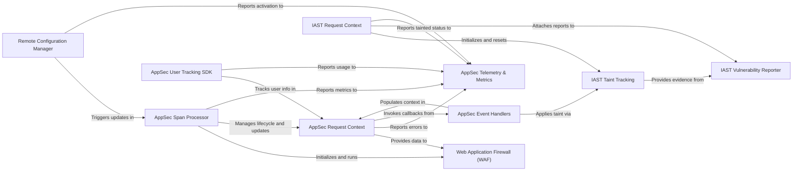

## Component Details

The Application Security (AppSec) & IAST subsystem provides runtime application security features, including a Web Application Firewall (WAF) for threat detection and blocking, and Interactive Application Security Testing (IAST) for vulnerability identification. Its main purpose is to enhance application security by integrating security logic directly into the tracing core, managing security contexts per request, tracking tainted data, reporting vulnerabilities, and allowing dynamic configuration updates.

### AppSec Request Context
Manages the security context for a given request, including WAF interactions, blocking, and storing request-related data. It acts as a central hub for AppSec data during a request.

**Related Classes/Methods**:

- <a href="https://github.com/DataDog/dd-trace-py/blob/master/ddtrace/appsec/_asm_request_context.py#L77-L107" target="_blank" rel="noopener noreferrer">`ddtrace.appsec._asm_request_context.ASM_Environment` (77:107)</a>
- <a href="https://github.com/DataDog/dd-trace-py/blob/master/ddtrace/appsec/_asm_request_context.py#L110-L111" target="_blank" rel="noopener noreferrer">`ddtrace.appsec._asm_request_context._get_asm_context` (110:111)</a>
- <a href="https://github.com/DataDog/dd-trace-py/blob/master/ddtrace/appsec/_asm_request_context.py#L114-L115" target="_blank" rel="noopener noreferrer">`ddtrace.appsec._asm_request_context.in_asm_context` (114:115)</a>
- <a href="https://github.com/DataDog/dd-trace-py/blob/master/ddtrace/appsec/_asm_request_context.py#L118-L122" target="_blank" rel="noopener noreferrer">`ddtrace.appsec._asm_request_context.is_blocked` (118:122)</a>
- <a href="https://github.com/DataDog/dd-trace-py/blob/master/ddtrace/appsec/_asm_request_context.py#L125-L129" target="_blank" rel="noopener noreferrer">`ddtrace.appsec._asm_request_context.get_blocked` (125:129)</a>
- <a href="https://github.com/DataDog/dd-trace-py/blob/master/ddtrace/appsec/_asm_request_context.py#L176-L183" target="_blank" rel="noopener noreferrer">`ddtrace.appsec._asm_request_context.set_blocked` (176:183)</a>
- <a href="https://github.com/DataDog/dd-trace-py/blob/master/ddtrace/appsec/_asm_request_context.py#L296-L305" target="_blank" rel="noopener noreferrer">`ddtrace.appsec._asm_request_context.set_waf_address` (296:305)</a>
- <a href="https://github.com/DataDog/dd-trace-py/blob/master/ddtrace/appsec/_asm_request_context.py#L320-L321" target="_blank" rel="noopener noreferrer">`ddtrace.appsec._asm_request_context.get_waf_address` (320:321)</a>
- <a href="https://github.com/DataDog/dd-trace-py/blob/master/ddtrace/appsec/_asm_request_context.py#L342-L343" target="_blank" rel="noopener noreferrer">`ddtrace.appsec._asm_request_context.set_waf_callback` (342:343)</a>
- <a href="https://github.com/DataDog/dd-trace-py/blob/master/ddtrace/appsec/_asm_request_context.py#L354-L363" target="_blank" rel="noopener noreferrer">`ddtrace.appsec._asm_request_context.call_waf_callback` (354:363)</a>
- <a href="https://github.com/DataDog/dd-trace-py/blob/master/ddtrace/appsec/_asm_request_context.py#L516-L525" target="_blank" rel="noopener noreferrer">`ddtrace.appsec._asm_request_context.start_context` (516:525)</a>
- <a href="https://github.com/DataDog/dd-trace-py/blob/master/ddtrace/appsec/_asm_request_context.py#L528-L531" target="_blank" rel="noopener noreferrer">`ddtrace.appsec._asm_request_context.end_context` (528:531)</a>
- <a href="https://github.com/DataDog/dd-trace-py/blob/master/ddtrace/appsec/_asm_request_context.py#L448-L494" target="_blank" rel="noopener noreferrer">`ddtrace.appsec._asm_request_context.set_waf_telemetry_results` (448:494)</a>
- <a href="https://github.com/DataDog/dd-trace-py/blob/master/ddtrace/appsec/_asm_request_context.py#L504-L513" target="_blank" rel="noopener noreferrer">`ddtrace.appsec._asm_request_context.store_waf_results_data` (504:513)</a>

### IAST Request Context
Manages the IAST (In-App Security Testing) context for a request, including enabling/disabling IAST, setting endpoints, and managing stack traces. It's the core for IAST request-specific data.

**Related Classes/Methods**:

- `ddtrace.appsec._iast` (1:9999)
- <a href="https://github.com/DataDog/dd-trace-py/blob/master/ddtrace/appsec/_iast/_iast_request_context_base.py#L1-L9999" target="_blank" rel="noopener noreferrer">`ddtrace.appsec._iast._iast_request_context_base.IASTEnvironment` (1:9999)</a>
- <a href="https://github.com/DataDog/dd-trace-py/blob/master/ddtrace/appsec/_iast/_iast_request_context_base.py#L1-L9999" target="_blank" rel="noopener noreferrer">`ddtrace.appsec._iast._iast_request_context_base._get_iast_env` (1:9999)</a>
- <a href="https://github.com/DataDog/dd-trace-py/blob/master/ddtrace/appsec/_iast/_iast_request_context_base.py#L32-L35" target="_blank" rel="noopener noreferrer">`ddtrace.appsec._iast._iast_request_context_base.start_iast_context` (32:35)</a>
- <a href="https://github.com/DataDog/dd-trace-py/blob/master/ddtrace/appsec/_iast/_iast_request_context_base.py#L38-L43" target="_blank" rel="noopener noreferrer">`ddtrace.appsec._iast._iast_request_context_base.end_iast_context` (38:43)</a>
- <a href="https://github.com/DataDog/dd-trace-py/blob/master/ddtrace/appsec/_iast/_iast_request_context_base.py#L63-L68" target="_blank" rel="noopener noreferrer">`ddtrace.appsec._iast._iast_request_context_base.set_iast_request_enabled` (63:68)</a>
- <a href="https://github.com/DataDog/dd-trace-py/blob/master/ddtrace/appsec/_iast/_iast_request_context_base.py#L71-L80" target="_blank" rel="noopener noreferrer">`ddtrace.appsec._iast._iast_request_context_base.set_iast_request_endpoint` (71:80)</a>
- <a href="https://github.com/DataDog/dd-trace-py/blob/master/ddtrace/appsec/_iast/_iast_request_context_base.py#L50-L54" target="_blank" rel="noopener noreferrer">`ddtrace.appsec._iast._iast_request_context_base.get_iast_stacktrace_reported` (50:54)</a>
- <a href="https://github.com/DataDog/dd-trace-py/blob/master/ddtrace/appsec/_iast/_iast_request_context_base.py#L57-L60" target="_blank" rel="noopener noreferrer">`ddtrace.appsec._iast._iast_request_context_base.set_iast_stacktrace_reported` (57:60)</a>

### AppSec Span Processor
The primary component responsible for integrating AppSec logic into the tracing pipeline. It initializes and runs the WAF, updates rules, and manages the AppSec request lifecycle.

**Related Classes/Methods**:

- <a href="https://github.com/DataDog/dd-trace-py/blob/master/ddtrace/appsec/_processor.py#L76-L371" target="_blank" rel="noopener noreferrer">`ddtrace.appsec._processor.AppSecSpanProcessor` (76:371)</a>
- <a href="https://github.com/DataDog/dd-trace-py/blob/master/ddtrace/appsec/_processor.py#L87-L115" target="_blank" rel="noopener noreferrer">`ddtrace.appsec._processor.AppSecSpanProcessor:__post_init__` (87:115)</a>
- <a href="https://github.com/DataDog/dd-trace-py/blob/master/ddtrace/appsec/_processor.py#L117-L132" target="_blank" rel="noopener noreferrer">`ddtrace.appsec._processor.AppSecSpanProcessor:delayed_init` (117:132)</a>
- <a href="https://github.com/DataDog/dd-trace-py/blob/master/ddtrace/appsec/_processor.py#L143-L154" target="_blank" rel="noopener noreferrer">`ddtrace.appsec._processor.AppSecSpanProcessor:_update_rules` (143:154)</a>
- <a href="https://github.com/DataDog/dd-trace-py/blob/master/ddtrace/appsec/_processor.py#L176-L213" target="_blank" rel="noopener noreferrer">`ddtrace.appsec._processor.AppSecSpanProcessor:on_span_start` (176:213)</a>
- <a href="https://github.com/DataDog/dd-trace-py/blob/master/ddtrace/appsec/_processor.py#L215-L362" target="_blank" rel="noopener noreferrer">`ddtrace.appsec._processor.AppSecSpanProcessor:_waf_action` (215:362)</a>
- <a href="https://github.com/DataDog/dd-trace-py/blob/master/ddtrace/appsec/_processor.py#L367-L371" target="_blank" rel="noopener noreferrer">`ddtrace.appsec._processor.AppSecSpanProcessor:on_span_finish` (367:371)</a>

### Web Application Firewall (WAF)
The interface to the underlying Web Application Firewall engine. It processes request data against security rules and returns detection results.

**Related Classes/Methods**:

- <a href="https://github.com/DataDog/dd-trace-py/blob/master/ddtrace/appsec/_ddwaf/waf.py#L1-L9999" target="_blank" rel="noopener noreferrer">`ddtrace.appsec._ddwaf.waf` (1:9999)</a>
- <a href="https://github.com/DataDog/dd-trace-py/blob/master/ddtrace/appsec/_ddwaf/waf.py#L44-L200" target="_blank" rel="noopener noreferrer">`ddtrace.appsec._ddwaf.waf.DDWaf` (44:200)</a>
- <a href="https://github.com/DataDog/dd-trace-py/blob/master/ddtrace/appsec/_ddwaf/waf.py#L47-L79" target="_blank" rel="noopener noreferrer">`ddtrace.appsec._ddwaf.waf.DDWaf:__init__` (47:79)</a>
- <a href="https://github.com/DataDog/dd-trace-py/blob/master/ddtrace/appsec/_ddwaf/waf.py#L111-L143" target="_blank" rel="noopener noreferrer">`ddtrace.appsec._ddwaf.waf.DDWaf:update_rules` (111:143)</a>
- <a href="https://github.com/DataDog/dd-trace-py/blob/master/ddtrace/appsec/_ddwaf/waf.py#L156-L192" target="_blank" rel="noopener noreferrer">`ddtrace.appsec._ddwaf.waf.DDWaf:run` (156:192)</a>
- <a href="https://github.com/DataDog/dd-trace-py/blob/master/ddtrace/appsec/_ddwaf/waf.py#L145-L151" target="_blank" rel="noopener noreferrer">`ddtrace.appsec._ddwaf.waf.DDWaf:_at_request_start` (145:151)</a>
- <a href="https://github.com/DataDog/dd-trace-py/blob/master/ddtrace/appsec/_ddwaf/waf.py#L153-L154" target="_blank" rel="noopener noreferrer">`ddtrace.appsec._ddwaf.waf.DDWaf:_at_request_end` (153:154)</a>

### AppSec Telemetry & Metrics
Responsible for collecting, aggregating, and reporting various telemetry and metrics related to AppSec and IAST, providing insights into security feature usage and performance.

**Related Classes/Methods**:

- <a href="https://github.com/DataDog/dd-trace-py/blob/master/ddtrace/appsec/_metrics.py#L1-L9999" target="_blank" rel="noopener noreferrer">`ddtrace.appsec._metrics` (1:9999)</a>
- <a href="https://github.com/DataDog/dd-trace-py/blob/master/ddtrace/appsec/_metrics.py#L33-L53" target="_blank" rel="noopener noreferrer">`ddtrace.appsec._metrics._set_waf_error_log` (33:53)</a>
- <a href="https://github.com/DataDog/dd-trace-py/blob/master/ddtrace/appsec/_metrics.py#L56-L70" target="_blank" rel="noopener noreferrer">`ddtrace.appsec._metrics._set_waf_updates_metric` (56:70)</a>
- <a href="https://github.com/DataDog/dd-trace-py/blob/master/ddtrace/appsec/_metrics.py#L73-L87" target="_blank" rel="noopener noreferrer">`ddtrace.appsec._metrics._set_waf_init_metric` (73:87)</a>
- <a href="https://github.com/DataDog/dd-trace-py/blob/master/ddtrace/appsec/_metrics.py#L103-L130" target="_blank" rel="noopener noreferrer">`ddtrace.appsec._metrics._report_waf_truncations` (103:130)</a>
- <a href="https://github.com/DataDog/dd-trace-py/blob/master/ddtrace/appsec/_metrics.py#L133-L153" target="_blank" rel="noopener noreferrer">`ddtrace.appsec._metrics._report_waf_run_error` (133:153)</a>
- <a href="https://github.com/DataDog/dd-trace-py/blob/master/ddtrace/appsec/_metrics.py#L156-L193" target="_blank" rel="noopener noreferrer">`ddtrace.appsec._metrics._set_waf_request_metrics` (156:193)</a>
- <a href="https://github.com/DataDog/dd-trace-py/blob/master/ddtrace/appsec/_metrics.py#L196-L210" target="_blank" rel="noopener noreferrer">`ddtrace.appsec._metrics._report_api_security` (196:210)</a>
- <a href="https://github.com/DataDog/dd-trace-py/blob/master/ddtrace/appsec/_metrics.py#L213-L223" target="_blank" rel="noopener noreferrer">`ddtrace.appsec._metrics._report_rasp_skipped` (213:223)</a>
- <a href="https://github.com/DataDog/dd-trace-py/blob/master/ddtrace/appsec/_metrics.py#L226-L237" target="_blank" rel="noopener noreferrer">`ddtrace.appsec._metrics._report_ato_sdk_usage` (226:237)</a>
- <a href="https://github.com/DataDog/dd-trace-py/blob/master/ddtrace/appsec/_iast/_metrics.py#L49-L69" target="_blank" rel="noopener noreferrer">`ddtrace.appsec._iast._metrics._set_iast_error_metric` (49:69)</a>
- <a href="https://github.com/DataDog/dd-trace-py/blob/master/ddtrace/appsec/_iast/_metrics.py#L73-L78" target="_blank" rel="noopener noreferrer">`ddtrace.appsec._iast._metrics._set_metric_iast_instrumented_source` (73:78)</a>
- <a href="https://github.com/DataDog/dd-trace-py/blob/master/ddtrace/appsec/_iast/_metrics.py#L110-L113" target="_blank" rel="noopener noreferrer">`ddtrace.appsec._iast._metrics._set_metric_iast_request_tainted` (110:113)</a>

### AppSec Event Handlers
A collection of functions that subscribe to internal tracing events (e.g., request start, response end) to inject AppSec-specific logic, such as setting WAF input addresses or handling blocking.

**Related Classes/Methods**:

- <a href="https://github.com/DataDog/dd-trace-py/blob/master/ddtrace/appsec/_handlers.py#L1-L9999" target="_blank" rel="noopener noreferrer">`ddtrace.appsec._handlers` (1:9999)</a>
- <a href="https://github.com/DataDog/dd-trace-py/blob/master/ddtrace/appsec/_handlers.py#L300-L314" target="_blank" rel="noopener noreferrer">`ddtrace.appsec._handlers.listen` (300:314)</a>
- <a href="https://github.com/DataDog/dd-trace-py/blob/master/ddtrace/appsec/_handlers.py#L41-L77" target="_blank" rel="noopener noreferrer">`ddtrace.appsec._handlers:_on_set_http_meta` (41:77)</a>
- <a href="https://github.com/DataDog/dd-trace-py/blob/master/ddtrace/appsec/_handlers.py#L83-L114" target="_blank" rel="noopener noreferrer">`ddtrace.appsec._handlers:_on_asgi_request_parse_body` (83:114)</a>
- <a href="https://github.com/DataDog/dd-trace-py/blob/master/ddtrace/appsec/_handlers.py#L194-L231" target="_blank" rel="noopener noreferrer">`ddtrace.appsec._handlers:_wsgi_make_block_content` (194:231)</a>
- <a href="https://github.com/DataDog/dd-trace-py/blob/master/ddtrace/appsec/_handlers.py#L234-L274" target="_blank" rel="noopener noreferrer">`ddtrace.appsec._handlers:_asgi_make_block_content` (234:274)</a>
- <a href="https://github.com/DataDog/dd-trace-py/blob/master/ddtrace/appsec/_handlers.py#L277-L293" target="_blank" rel="noopener noreferrer">`ddtrace.appsec._handlers:_on_flask_blocked_request` (277:293)</a>
- <a href="https://github.com/DataDog/dd-trace-py/blob/master/ddtrace/appsec/_handlers.py#L296-L297" target="_blank" rel="noopener noreferrer">`ddtrace.appsec._handlers:_on_start_response_blocked` (296:297)</a>
- <a href="https://github.com/DataDog/dd-trace-py/blob/master/ddtrace/appsec/_iast/_handlers.py#L37-L54" target="_blank" rel="noopener noreferrer">`ddtrace.appsec._iast._handlers:_on_request_init` (37:54)</a>
- <a href="https://github.com/DataDog/dd-trace-py/blob/master/ddtrace/appsec/_iast/_handlers.py#L57-L130" target="_blank" rel="noopener noreferrer">`ddtrace.appsec._iast._handlers:_on_flask_patch` (57:130)</a>
- <a href="https://github.com/DataDog/dd-trace-py/blob/master/ddtrace/appsec/_iast/_handlers.py#L133-L145" target="_blank" rel="noopener noreferrer">`ddtrace.appsec._iast._handlers:_iast_on_wrapped_view` (133:145)</a>
- <a href="https://github.com/DataDog/dd-trace-py/blob/master/ddtrace/appsec/_iast/_handlers.py#L148-L152" target="_blank" rel="noopener noreferrer">`ddtrace.appsec._iast._handlers:_on_wsgi_environ` (148:152)</a>
- <a href="https://github.com/DataDog/dd-trace-py/blob/master/ddtrace/appsec/_iast/_handlers.py#L155-L179" target="_blank" rel="noopener noreferrer">`ddtrace.appsec._iast._handlers:_on_django_patch` (155:179)</a>

### IAST Taint Tracking
Manages the propagation of 'taint' through data within the application, marking data originating from untrusted sources. This includes functions for tainting objects and managing tainted data structures.

**Related Classes/Methods**:

- <a href="https://github.com/DataDog/dd-trace-py/blob/master/ddtrace/appsec/_iast/_taint_tracking/_taint_objects.py#L20-L32" target="_blank" rel="noopener noreferrer">`ddtrace.appsec._iast._taint_tracking._taint_objects.taint_pyobject` (20:32)</a>
- <a href="https://github.com/DataDog/dd-trace-py/blob/master/ddtrace/appsec/_iast/_taint_tracking/_taint_objects_base.py#L89-L99" target="_blank" rel="noopener noreferrer">`ddtrace.appsec._iast._taint_tracking._taint_objects_base.is_pyobject_tainted` (89:99)</a>
- <a href="https://github.com/DataDog/dd-trace-py/blob/master/ddtrace/appsec/_iast/_taint_utils.py#L87-L140" target="_blank" rel="noopener noreferrer">`ddtrace.appsec._iast._taint_utils.taint_structure` (87:140)</a>
- <a href="https://github.com/DataDog/dd-trace-py/blob/master/ddtrace/appsec/_iast/_taint_utils.py#L150-L329" target="_blank" rel="noopener noreferrer">`ddtrace.appsec._iast._taint_utils.LazyTaintList` (150:329)</a>
- <a href="https://github.com/DataDog/dd-trace-py/blob/master/ddtrace/appsec/_iast/_taint_utils.py#L332-L516" target="_blank" rel="noopener noreferrer">`ddtrace.appsec._iast._taint_utils.LazyTaintDict` (332:516)</a>

### IAST Vulnerability Reporter
Gathers information about detected IAST vulnerabilities, formats them, and attaches them to the relevant spans for reporting.

**Related Classes/Methods**:

- <a href="https://github.com/DataDog/dd-trace-py/blob/master/ddtrace/appsec/_iast/reporter.py#L141-L403" target="_blank" rel="noopener noreferrer">`ddtrace.appsec._iast.reporter.IastSpanReporter` (141:403)</a>
- <a href="https://github.com/DataDog/dd-trace-py/blob/master/ddtrace/appsec/_iast/reporter.py#L306-L317" target="_blank" rel="noopener noreferrer">`ddtrace.appsec._iast.reporter.IastSpanReporter:add_ranges_to_evidence_and_extract_sources` (306:317)</a>
- <a href="https://github.com/DataDog/dd-trace-py/blob/master/ddtrace/appsec/_iast/reporter.py#L319-L350" target="_blank" rel="noopener noreferrer">`ddtrace.appsec._iast.reporter.IastSpanReporter:build_and_scrub_value_parts` (319:350)</a>
- <a href="https://github.com/DataDog/dd-trace-py/blob/master/ddtrace/appsec/_iast/reporter.py#L166-L174" target="_blank" rel="noopener noreferrer">`ddtrace.appsec._iast.reporter.IastSpanReporter:_append_vulnerability` (166:174)</a>
- <a href="https://github.com/DataDog/dd-trace-py/blob/master/ddtrace/appsec/_iast/reporter.py#L98-L117" target="_blank" rel="noopener noreferrer">`ddtrace.appsec._iast.reporter.Vulnerability` (98:117)</a>
- <a href="https://github.com/DataDog/dd-trace-py/blob/master/ddtrace/appsec/_iast/reporter.py#L40-L62" target="_blank" rel="noopener noreferrer">`ddtrace.appsec._iast.reporter.Evidence` (40:62)</a>
- <a href="https://github.com/DataDog/dd-trace-py/blob/master/ddtrace/appsec/_iast/reporter.py#L121-L137" target="_blank" rel="noopener noreferrer">`ddtrace.appsec._iast.reporter.Source` (121:137)</a>

### Remote Configuration Manager
Handles dynamic configuration updates for AppSec features, allowing for remote enabling/disabling of security modules and rule updates without application restarts.

**Related Classes/Methods**:

- <a href="https://github.com/DataDog/dd-trace-py/blob/master/ddtrace/appsec/_remoteconfiguration.py#L1-L9999" target="_blank" rel="noopener noreferrer">`ddtrace.appsec._remoteconfiguration` (1:9999)</a>
- <a href="https://github.com/DataDog/dd-trace-py/blob/master/ddtrace/appsec/_remoteconfiguration.py#L32-L41" target="_blank" rel="noopener noreferrer">`ddtrace.appsec._remoteconfiguration.AppSecRC` (32:41)</a>
- <a href="https://github.com/DataDog/dd-trace-py/blob/master/ddtrace/appsec/_remoteconfiguration.py#L48-L82" target="_blank" rel="noopener noreferrer">`ddtrace.appsec._remoteconfiguration:enable_appsec_rc` (48:82)</a>
- <a href="https://github.com/DataDog/dd-trace-py/blob/master/ddtrace/appsec/_remoteconfiguration.py#L85-L90" target="_blank" rel="noopener noreferrer">`ddtrace.appsec._remoteconfiguration:disable_appsec_rc` (85:90)</a>
- <a href="https://github.com/DataDog/dd-trace-py/blob/master/ddtrace/appsec/_remoteconfiguration.py#L93-L116" target="_blank" rel="noopener noreferrer">`ddtrace.appsec._remoteconfiguration:_appsec_callback` (93:116)</a>
- <a href="https://github.com/DataDog/dd-trace-py/blob/master/ddtrace/appsec/_remoteconfiguration.py#L137-L158" target="_blank" rel="noopener noreferrer">`ddtrace.appsec._remoteconfiguration:_process_asm_features` (137:158)</a>

### AppSec User Tracking SDK
Provides an API for applications to explicitly track user login/signup events and associate user information with traces, enhancing security monitoring.

**Related Classes/Methods**:

- <a href="https://github.com/DataDog/dd-trace-py/blob/master/ddtrace/appsec/track_user_sdk.py#L1-L9999" target="_blank" rel="noopener noreferrer">`ddtrace.appsec.track_user_sdk` (1:9999)</a>
- <a href="https://github.com/DataDog/dd-trace-py/blob/master/ddtrace/appsec/track_user_sdk.py#L22-L30" target="_blank" rel="noopener noreferrer">`ddtrace.appsec.track_user_sdk:track_login_success` (22:30)</a>
- <a href="https://github.com/DataDog/dd-trace-py/blob/master/ddtrace/appsec/track_user_sdk.py#L33-L43" target="_blank" rel="noopener noreferrer">`ddtrace.appsec.track_user_sdk:track_login_failure` (33:43)</a>
- <a href="https://github.com/DataDog/dd-trace-py/blob/master/ddtrace/appsec/track_user_sdk.py#L46-L58" target="_blank" rel="noopener noreferrer">`ddtrace.appsec.track_user_sdk:track_signup` (46:58)</a>
- <a href="https://github.com/DataDog/dd-trace-py/blob/master/ddtrace/appsec/track_user_sdk.py#L61-L91" target="_blank" rel="noopener noreferrer">`ddtrace.appsec.track_user_sdk:track_user` (61:91)</a>
- <a href="https://github.com/DataDog/dd-trace-py/blob/master/ddtrace/appsec/track_user_sdk.py#L94-L102" target="_blank" rel="noopener noreferrer">`ddtrace.appsec.track_user_sdk:track_custom_event` (94:102)</a>
- <a href="https://github.com/DataDog/dd-trace-py/blob/master/ddtrace/appsec/_trace_utils.py#L1-L9999" target="_blank" rel="noopener noreferrer">`ddtrace.appsec._trace_utils` (1:9999)</a>
- <a href="https://github.com/DataDog/dd-trace-py/blob/master/ddtrace/appsec/_trace_utils.py#L119-L177" target="_blank" rel="noopener noreferrer">`ddtrace.appsec._trace_utils:track_user_login_success_event` (119:177)</a>
- <a href="https://github.com/DataDog/dd-trace-py/blob/master/ddtrace/appsec/_trace_utils.py#L180-L230" target="_blank" rel="noopener noreferrer">`ddtrace.appsec._trace_utils:track_user_login_failure_event` (180:230)</a>
- <a href="https://github.com/DataDog/dd-trace-py/blob/master/ddtrace/appsec/_trace_utils.py#L233-L269" target="_blank" rel="noopener noreferrer">`ddtrace.appsec._trace_utils:track_user_signup_event` (233:269)</a>
- <a href="https://github.com/DataDog/dd-trace-py/blob/master/ddtrace/appsec/_trace_utils.py#L272-L302" target="_blank" rel="noopener noreferrer">`ddtrace.appsec._trace_utils:track_custom_event` (272:302)</a>
- <a href="https://github.com/DataDog/dd-trace-py/blob/master/ddtrace/appsec/_trace_utils.py#L305-L325" target="_blank" rel="noopener noreferrer">`ddtrace.appsec._trace_utils:should_block_user` (305:325)</a>
- <a href="https://github.com/DataDog/dd-trace-py/blob/master/ddtrace/appsec/_trace_utils.py#L328-L339" target="_blank" rel="noopener noreferrer">`ddtrace.appsec._trace_utils:block_request` (328:339)</a>

### [FAQ](https://github.com/CodeBoarding/GeneratedOnBoardings/tree/main?tab=readme-ov-file#faq)