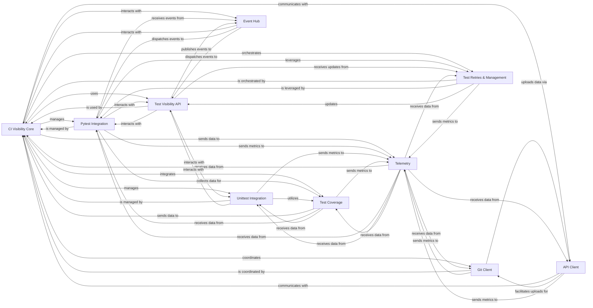

## Component Details

The CI Visibility subsystem integrates with CI/CD pipelines to provide detailed insights into test execution. It encompasses core orchestration, framework-specific integrations (Pytest, Unittest), API interactions for data fetching and reporting, Git metadata handling, code coverage collection, and advanced features like test retries and early flake detection. The system leverages an event hub for internal communication and a telemetry component for metrics reporting, aiming to enhance test efficiency and provide comprehensive visibility into the testing process.

### CI Visibility Core
This central component orchestrates the entire CI Visibility process. It initializes the specialized `CIVisibilityTracer`, manages test sessions, and coordinates with other components for data collection and reporting. It acts as the primary service for CI Visibility.

**Related Classes/Methods**:

- `ddtrace.internal.ci_visibility.recorder.CIVisibility` (full file reference)
- `ddtrace.internal.ci_visibility.recorder.CIVisibilityTracer` (full file reference)
- <a href="https://github.com/DataDog/dd-trace-py/blob/master/ddtrace/internal/ci_visibility/context.py#L18-L46" target="_blank" rel="noopener noreferrer">`ddtrace.internal.ci_visibility.context.CIContextProvider` (18:46)</a>

### Pytest Integration
This component provides deep integration with the Pytest testing framework. It intercepts Pytest hooks to initiate, manage, and finalize spans for test sessions, modules, suites, and individual tests. It also handles Pytest-specific features like test parameter encoding and integrates with test visibility features such as retries and coverage.

**Related Classes/Methods**:

- `ddtrace.contrib.internal.pytest.plugin` (full file reference)
- `ddtrace.contrib.internal.pytest._plugin_v1` (full file reference)
- `ddtrace.contrib.internal.pytest._plugin_v2` (full file reference)
- `ddtrace.contrib.internal.pytest._utils` (full file reference)
- `ddtrace.contrib.internal.pytest._atr_utils` (full file reference)
- `ddtrace.contrib.internal.pytest._efd_utils` (full file reference)
- `ddtrace.contrib.internal.pytest._attempt_to_fix` (full file reference)
- `ddtrace.contrib.internal.pytest._retry_utils` (full file reference)
- `ddtrace.contrib.internal.pytest._benchmark_utils` (full file reference)
- `ddtrace.contrib.internal.pytest._report_links` (full file reference)
- `ddtrace.contrib.internal.pytest_bdd.plugin` (full file reference)
- `ddtrace.contrib.internal.pytest_bdd._plugin` (full file reference)
- `ddtrace.contrib.internal.pytest_benchmark.plugin` (full file reference)
- `ddtrace.contrib.internal.pytest_benchmark._plugin` (full file reference)

### Unittest Integration
This component provides integration with the Python `unittest` framework. It patches `unittest` functionalities to trace test execution, manage test spans, and report test results, including handling skipped tests and test coverage.

**Related Classes/Methods**:

- <a href="https://github.com/DataDog/dd-trace-py/blob/master/ddtrace/contrib/internal/unittest/patch.py#L408-L430" target="_blank" rel="noopener noreferrer">`ddtrace.contrib.internal.unittest.patch` (408:430)</a>

### Test Visibility API
This component defines the abstract API for interacting with test visibility entities like sessions, modules, suites, and tests. It provides methods for starting, finishing, and updating the status of these entities, serving as a bridge between the integration components and the core CI Visibility logic. It also defines the data structures for test item IDs and source file information.

**Related Classes/Methods**:

- <a href="https://github.com/DataDog/dd-trace-py/blob/master/ddtrace/internal/test_visibility/api.py#L32-L56" target="_blank" rel="noopener noreferrer">`ddtrace.internal.test_visibility.api.InternalTestBase` (32:56)</a>
- <a href="https://github.com/DataDog/dd-trace-py/blob/master/ddtrace/internal/test_visibility/api.py#L59-L142" target="_blank" rel="noopener noreferrer">`ddtrace.internal.test_visibility.api.InternalTestSession` (59:142)</a>
- <a href="https://github.com/DataDog/dd-trace-py/blob/master/ddtrace/internal/test_visibility/api.py#L153-L243" target="_blank" rel="noopener noreferrer">`ddtrace.internal.test_visibility.api.InternalTest` (153:243)</a>
- <a href="https://github.com/DataDog/dd-trace-py/blob/master/ddtrace/internal/ci_visibility/api/_base.py#L123-L532" target="_blank" rel="noopener noreferrer">`ddtrace.internal.ci_visibility.api._base.TestVisibilityItemBase` (123:532)</a>
- <a href="https://github.com/DataDog/dd-trace-py/blob/master/ddtrace/internal/ci_visibility/api/_base.py#L542-L663" target="_blank" rel="noopener noreferrer">`ddtrace.internal.ci_visibility.api._base.TestVisibilityParentItem` (542:663)</a>
- <a href="https://github.com/DataDog/dd-trace-py/blob/master/ddtrace/internal/ci_visibility/api/_module.py#L26-L89" target="_blank" rel="noopener noreferrer">`ddtrace.internal.ci_visibility.api._module.TestVisibilityModule` (26:89)</a>
- <a href="https://github.com/DataDog/dd-trace-py/blob/master/ddtrace/internal/ci_visibility/api/_session.py#L29-L202" target="_blank" rel="noopener noreferrer">`ddtrace.internal.ci_visibility.api._session.TestVisibilitySession` (29:202)</a>
- <a href="https://github.com/DataDog/dd-trace-py/blob/master/ddtrace/internal/ci_visibility/api/_suite.py#L29-L101" target="_blank" rel="noopener noreferrer">`ddtrace.internal.ci_visibility.api._suite.TestVisibilitySuite` (29:101)</a>
- <a href="https://github.com/DataDog/dd-trace-py/blob/master/ddtrace/internal/ci_visibility/api/_test.py#L49-L597" target="_blank" rel="noopener noreferrer">`ddtrace.internal.ci_visibility.api._test.TestVisibilityTest` (49:597)</a>
- <a href="https://github.com/DataDog/dd-trace-py/blob/master/ddtrace/internal/test_visibility/coverage_lines.py#L14-L86" target="_blank" rel="noopener noreferrer">`ddtrace.internal.test_visibility.coverage_lines.CoverageLines` (14:86)</a>
- <a href="https://github.com/DataDog/dd-trace-py/blob/master/ddtrace/ext/test_visibility/_item_ids.py#L29-L38" target="_blank" rel="noopener noreferrer">`ddtrace.ext.test_visibility._item_ids.TestId` (29:38)</a>
- <a href="https://github.com/DataDog/dd-trace-py/blob/master/ddtrace/ext/test_visibility/_item_ids.py#L13-L19" target="_blank" rel="noopener noreferrer">`ddtrace.ext.test_visibility._item_ids.TestModuleId` (13:19)</a>
- <a href="https://github.com/DataDog/dd-trace-py/blob/master/ddtrace/ext/test_visibility/_item_ids.py#L23-L25" target="_blank" rel="noopener noreferrer">`ddtrace.ext.test_visibility._item_ids.TestSuiteId` (23:25)</a>
- <a href="https://github.com/DataDog/dd-trace-py/blob/master/ddtrace/ext/test_visibility/_test_visibility_base.py#L56-L61" target="_blank" rel="noopener noreferrer">`ddtrace.ext.test_visibility._test_visibility_base._TestVisibilityChildItemIdBase` (56:61)</a>
- <a href="https://github.com/DataDog/dd-trace-py/blob/master/ddtrace/ext/test_visibility/_test_visibility_base.py#L30-L37" target="_blank" rel="noopener noreferrer">`ddtrace.ext.test_visibility._test_visibility_base._TestVisibilityRootItemIdBase` (30:37)</a>
- <a href="https://github.com/DataDog/dd-trace-py/blob/master/ddtrace/ext/test_visibility/_test_visibility_base.py#L44-L49" target="_blank" rel="noopener noreferrer">`ddtrace.ext.test_visibility._test_visibility_base._TestVisibilityIdBase` (44:49)</a>
- <a href="https://github.com/DataDog/dd-trace-py/blob/master/ddtrace/ext/test_visibility/api.py#L52-L58" target="_blank" rel="noopener noreferrer">`ddtrace.ext.test_visibility.api.TestStatus` (52:58)</a>
- <a href="https://github.com/DataDog/dd-trace-py/blob/master/ddtrace/ext/test_visibility/api.py#L72-L75" target="_blank" rel="noopener noreferrer">`ddtrace.ext.test_visibility.api.TestSourceFileInfo` (72:75)</a>

### Git Client
This component is responsible for interacting with Git repositories to extract and upload Git metadata, such as commit information and packfiles, to the Datadog CI Visibility backend. It also handles the serialization of Git data.

**Related Classes/Methods**:

- <a href="https://github.com/DataDog/dd-trace-py/blob/master/ddtrace/internal/ci_visibility/git_client.py#L81-L446" target="_blank" rel="noopener noreferrer">`ddtrace.internal.ci_visibility.git_client.CIVisibilityGitClient` (81:446)</a>
- <a href="https://github.com/DataDog/dd-trace-py/blob/master/ddtrace/internal/ci_visibility/git_client.py#L449-L505" target="_blank" rel="noopener noreferrer">`ddtrace.internal.ci_visibility.git_client.CIVisibilityGitClientSerializerV1` (449:505)</a>
- <a href="https://github.com/DataDog/dd-trace-py/blob/master/ddtrace/internal/ci_visibility/git_data.py#L8-L12" target="_blank" rel="noopener noreferrer">`ddtrace.internal.ci_visibility.git_data.GitData` (8:12)</a>

### API Client
This component handles communication with the Datadog CI Visibility API. It fetches settings (including ITR, EFD, and test management settings), skippable items, and known tests, and is responsible for making HTTP requests to the backend. It supports both agentless and EVP proxy modes.

**Related Classes/Methods**:

- <a href="https://github.com/DataDog/dd-trace-py/blob/master/ddtrace/internal/ci_visibility/_api_client.py#L237-L641" target="_blank" rel="noopener noreferrer">`ddtrace.internal.ci_visibility._api_client._TestVisibilityAPIClientBase` (237:641)</a>
- <a href="https://github.com/DataDog/dd-trace-py/blob/master/ddtrace/internal/ci_visibility/_api_client.py#L644-L675" target="_blank" rel="noopener noreferrer">`ddtrace.internal.ci_visibility._api_client.AgentlessTestVisibilityAPIClient` (644:675)</a>
- <a href="https://github.com/DataDog/dd-trace-py/blob/master/ddtrace/internal/ci_visibility/_api_client.py#L678-L700" target="_blank" rel="noopener noreferrer">`ddtrace.internal.ci_visibility._api_client.EVPProxyTestVisibilityAPIClient` (678:700)</a>
- <a href="https://github.com/DataDog/dd-trace-py/blob/master/ddtrace/internal/ci_visibility/_api_client.py#L87-L93" target="_blank" rel="noopener noreferrer">`ddtrace.internal.ci_visibility._api_client.EarlyFlakeDetectionSettings` (87:93)</a>
- <a href="https://github.com/DataDog/dd-trace-py/blob/master/ddtrace/internal/ci_visibility/_api_client.py#L127-L130" target="_blank" rel="noopener noreferrer">`ddtrace.internal.ci_visibility._api_client.ITRData` (127:130)</a>
- <a href="https://github.com/DataDog/dd-trace-py/blob/master/ddtrace/internal/ci_visibility/_api_client.py#L97-L101" target="_blank" rel="noopener noreferrer">`ddtrace.internal.ci_visibility._api_client.TestManagementSettings` (97:101)</a>
- <a href="https://github.com/DataDog/dd-trace-py/blob/master/ddtrace/internal/ci_visibility/_api_client.py#L114-L123" target="_blank" rel="noopener noreferrer">`ddtrace.internal.ci_visibility._api_client.TestVisibilityAPISettings` (114:123)</a>
- <a href="https://github.com/DataDog/dd-trace-py/blob/master/ddtrace/internal/ci_visibility/_api_client.py#L138-L142" target="_blank" rel="noopener noreferrer">`ddtrace.internal.ci_visibility._api_client._SkippableResponseDataItemAttributes` (138:142)</a>
- <a href="https://github.com/DataDog/dd-trace-py/blob/master/ddtrace/internal/ci_visibility/_api_client.py#L133-L135" target="_blank" rel="noopener noreferrer">`ddtrace.internal.ci_visibility._api_client._SkippableResponseMeta` (133:135)</a>

### Test Coverage
This component manages the collection, processing, and reporting of code coverage data during test execution. It integrates with the CI Visibility system to associate coverage information with test spans and uses module watchdogs for code collection.

**Related Classes/Methods**:

- `ddtrace.internal.ci_visibility.coverage` (full file reference)
- `ddtrace.internal.coverage.installer` (full file reference)
- <a href="https://github.com/DataDog/dd-trace-py/blob/master/ddtrace/internal/coverage/code.py#L38-L404" target="_blank" rel="noopener noreferrer">`ddtrace.internal.coverage.code.ModuleCodeCollector` (38:404)</a>
- <a href="https://github.com/DataDog/dd-trace-py/blob/master/ddtrace/contrib/internal/coverage/patch.py#L30-L41" target="_blank" rel="noopener noreferrer">`ddtrace.contrib.internal.coverage.patch` (30:41)</a>
- `ddtrace.contrib.internal.coverage.utils` (full file reference)
- <a href="https://github.com/DataDog/dd-trace-py/blob/master/ddtrace/internal/coverage/threading_coverage.py#L37-L80" target="_blank" rel="noopener noreferrer">`ddtrace.internal.coverage.threading_coverage.CoverageCollectingThread` (37:80)</a>

### Test Retries & Management
This component implements the logic for Automatic Test Retries (ATR), Early Flake Detection (EFD), and Attempt-to-Fix functionalities. It defines the outcomes for retries and determines when tests should be retried, tracking retry attempts, and managing the final status of tests based on these features.

**Related Classes/Methods**:

- `ddtrace.internal.test_visibility._atr_mixins` (full file reference)
- `ddtrace.internal.test_visibility._efd_mixins` (full file reference)
- `ddtrace.internal.test_visibility._attempt_to_fix_mixins` (full file reference)
- `ddtrace.contrib.internal.pytest._atr_utils` (full file reference)
- `ddtrace.contrib.internal.pytest._efd_utils` (full file reference)
- `ddtrace.contrib.internal.pytest._attempt_to_fix` (full file reference)
- `ddtrace.contrib.internal.pytest._retry_utils` (full file reference)

### Telemetry
This component is responsible for collecting and reporting various telemetry metrics related to CI Visibility operations, API requests, events, and Git commands. It uses a periodic service to send telemetry data.

**Related Classes/Methods**:

- `ddtrace.internal.ci_visibility.telemetry` (full file reference)
- <a href="https://github.com/DataDog/dd-trace-py/blob/master/ddtrace/internal/telemetry/writer.py#L137-L720" target="_blank" rel="noopener noreferrer">`ddtrace.internal.telemetry.writer.TelemetryWriter` (137:720)</a>
- `ddtrace.internal.ci_visibility.telemetry.api_request` (full file reference)
- `ddtrace.internal.ci_visibility.telemetry.coverage` (full file reference)
- `ddtrace.internal.ci_visibility.telemetry.early_flake_detection` (full file reference)
- `ddtrace.internal.ci_visibility.telemetry.events` (full file reference)
- `ddtrace.internal.ci_visibility.telemetry.git` (full file reference)
- `ddtrace.internal.ci_visibility.telemetry.itr` (full file reference)
- `ddtrace.internal.ci_visibility.telemetry.payload` (full file reference)
- `ddtrace.internal.ci_visibility.telemetry.test_management` (full file reference)

### Event Hub
This component acts as a central event dispatching and handling system within the `ddtrace` library. It allows different parts of the CI Visibility subsystem, as well as other `ddtrace` components, to communicate and react to events, such as test session starts, test finishes, and data stash operations.

**Related Classes/Methods**:

- `ddtrace.internal.core.event_hub` (full file reference)
- `ddtrace.internal.core.event_hub.PubSub` (full file reference)

### [FAQ](https://github.com/CodeBoarding/GeneratedOnBoardings/tree/main?tab=readme-ov-file#faq)