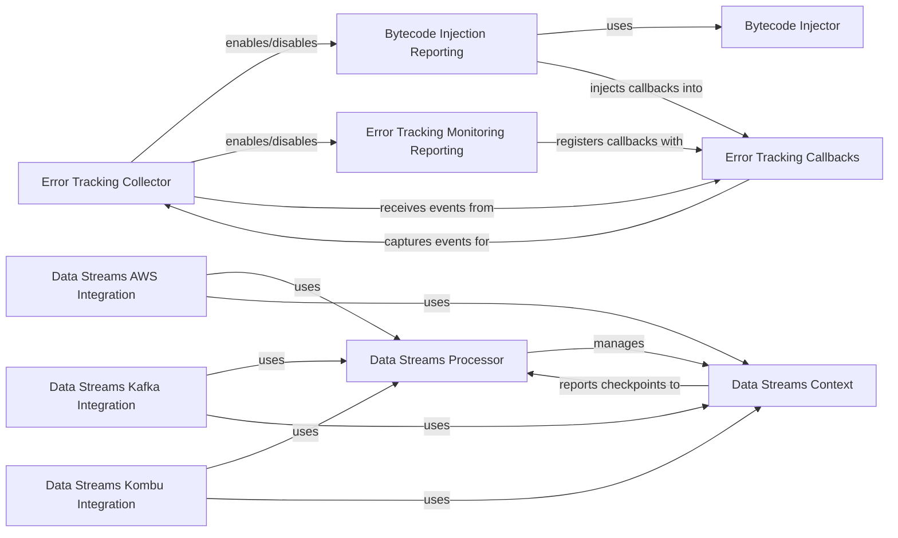

## Component Details

This graph illustrates the architecture of the Data Streams & Error Tracking subsystem. The Data Streams components are responsible for tracking data flow and latency across distributed messaging systems, with specific integrations for AWS, Kafka, and Kombu. The core Data Streams Processor aggregates statistics, while the Data Streams Context manages individual pathway information. The Error Tracking components focus on capturing and reporting handled exceptions. The Error Tracking Collector orchestrates the reporting mechanism, choosing between Bytecode Injection Reporting (for older Python versions) and Error Tracking Monitoring Reporting (for newer Python versions). Both reporting mechanisms utilize Error Tracking Callbacks to process and format exception data, and the Bytecode Injection Reporting further relies on the Bytecode Injector for code instrumentation.

### Data Streams Processor
This component is responsible for aggregating data stream statistics (pathway latencies, edge latencies, payload sizes, Kafka offsets) and periodically flushing them to the Datadog Agent. It manages the lifecycle of DataStreamsCtx objects and handles data serialization and compression before submission. It operates as a periodic service.

**Related Classes/Methods**:

- <a href="https://github.com/DataDog/dd-trace-py/blob/master/ddtrace/internal/datastreams/processor.py#L118-L408" target="_blank" rel="noopener noreferrer">`ddtrace.internal.datastreams.processor.DataStreamsProcessor` (118:408)</a>
- <a href="https://github.com/DataDog/dd-trace-py/blob/master/ddtrace/internal/datastreams/processor.py#L95-L103" target="_blank" rel="noopener noreferrer">`ddtrace.internal.datastreams.processor.PathwayStats` (95:103)</a>
- <a href="https://github.com/DataDog/dd-trace-py/blob/master/ddtrace/internal/datastreams/processor.py#L73-L92" target="_blank" rel="noopener noreferrer">`ddtrace.internal.datastreams.processor.SumCount` (73:92)</a>
- `ddtrace.internal.datastreams.processor.PartitionKey` (full file reference)
- `ddtrace.internal.datastreams.processor.ConsumerPartitionKey` (full file reference)
- `ddtrace.internal.datastreams.processor.Bucket` (full file reference)
- <a href="https://github.com/DataDog/dd-trace-py/blob/master/ddtrace/internal/datastreams/processor.py#L508-L544" target="_blank" rel="noopener noreferrer">`ddtrace.internal.datastreams.processor.DsmPathwayCodec` (508:544)</a>

### Data Streams Context
This component encapsulates the context of a data stream pathway, including encoding/decoding pathway information (hash, start times) and computing pathway hashes. It facilitates setting checkpoints within a data stream and interacts with the Data Streams Processor to record this checkpoint data.

**Related Classes/Methods**:

- <a href="https://github.com/DataDog/dd-trace-py/blob/master/ddtrace/internal/datastreams/processor.py#L411-L505" target="_blank" rel="noopener noreferrer">`ddtrace.internal.datastreams.processor.DataStreamsCtx` (411:505)</a>

### Error Tracking Collector
This service component manages the activation and deactivation of handled exception reporting. It dynamically selects the appropriate reporting mechanism (bytecode injection for Python 3.10/3.11 or sys.monitoring for Python 3.12+) and registers callbacks to capture exception events, which are then processed and attached to spans.

**Related Classes/Methods**:

- <a href="https://github.com/DataDog/dd-trace-py/blob/master/ddtrace/errortracking/_handled_exceptions/collector.py#L37-L124" target="_blank" rel="noopener noreferrer">`ddtrace.errortracking._handled_exceptions.collector.HandledExceptionCollector` (37:124)</a>
- <a href="https://github.com/DataDog/dd-trace-py/blob/master/ddtrace/errortracking/_handled_exceptions/collector.py#L17-L28" target="_blank" rel="noopener noreferrer">`ddtrace.errortracking._handled_exceptions.collector._add_span_events` (17:28)</a>
- <a href="https://github.com/DataDog/dd-trace-py/blob/master/ddtrace/errortracking/_handled_exceptions/collector.py#L31-L34" target="_blank" rel="noopener noreferrer">`ddtrace.errortracking._handled_exceptions.collector._on_span_exception` (31:34)</a>

### Bytecode Injection Reporting
This component is responsible for instrumenting Python modules and objects by injecting bytecode to report handled exceptions, specifically for Python versions 3.10 and 3.11. It utilizes a ModuleWatchdog to monitor module imports and selectively instruments user code or third-party libraries based on configuration.

**Related Classes/Methods**:

- `ddtrace.errortracking._handled_exceptions.bytecode_reporting` (full file reference)
- <a href="https://github.com/DataDog/dd-trace-py/blob/master/ddtrace/errortracking/_handled_exceptions/bytecode_reporting.py#L20-L21" target="_blank" rel="noopener noreferrer">`ddtrace.errortracking._handled_exceptions.bytecode_reporting._install_bytecode_injection_reporting` (20:21)</a>
- <a href="https://github.com/DataDog/dd-trace-py/blob/master/ddtrace/errortracking/_handled_exceptions/bytecode_reporting.py#L24-L101" target="_blank" rel="noopener noreferrer">`ddtrace.errortracking._handled_exceptions.bytecode_reporting.HandledExceptionReportingInjector` (24:101)</a>
- <a href="https://github.com/DataDog/dd-trace-py/blob/master/ddtrace/errortracking/_handled_exceptions/bytecode_reporting.py#L107-L116" target="_blank" rel="noopener noreferrer">`ddtrace.errortracking._handled_exceptions.bytecode_reporting.instrument_main` (107:116)</a>
- <a href="https://github.com/DataDog/dd-trace-py/blob/master/ddtrace/errortracking/_handled_exceptions/bytecode_reporting.py#L119-L133" target="_blank" rel="noopener noreferrer">`ddtrace.errortracking._handled_exceptions.bytecode_reporting.InjectionHandledExceptionReportingWatchdog` (119:133)</a>

### Bytecode Injector
This component provides the core functionality for bytecode manipulation and injection. It identifies specific bytecode offsets within functions where exception handling occurs and injects a callback to report these handled exceptions, with version-specific logic for Python 3.10 and 3.11.

**Related Classes/Methods**:

- <a href="https://github.com/DataDog/dd-trace-py/blob/master/ddtrace/errortracking/_handled_exceptions/bytecode_injector.py#L37-L63" target="_blank" rel="noopener noreferrer">`ddtrace.errortracking._handled_exceptions.bytecode_injector._inject_handled_exception_reporting` (37:63)</a>
- <a href="https://github.com/DataDog/dd-trace-py/blob/master/ddtrace/errortracking/_handled_exceptions/bytecode_injector.py#L66-L145" target="_blank" rel="noopener noreferrer">`ddtrace.errortracking._handled_exceptions.bytecode_injector._find_except_bytecode_indexes_3_10` (66:145)</a>
- <a href="https://github.com/DataDog/dd-trace-py/blob/master/ddtrace/errortracking/_handled_exceptions/bytecode_injector.py#L148-L204" target="_blank" rel="noopener noreferrer">`ddtrace.errortracking._handled_exceptions.bytecode_injector._find_except_bytecode_indexes_3_11` (148:204)</a>

### Data Streams AWS Integration
This component provides specific integrations for AWS services (SQS, SNS, Kinesis) to enable data streams monitoring. It handles the injection and extraction of data stream context into/from messages and calculates payload sizes for these services.

**Related Classes/Methods**:

- <a href="https://github.com/DataDog/dd-trace-py/blob/master/ddtrace/internal/datastreams/botocore.py#L50-L75" target="_blank" rel="noopener noreferrer">`ddtrace.internal.datastreams.botocore.inject_context` (50:75)</a>
- <a href="https://github.com/DataDog/dd-trace-py/blob/master/ddtrace/internal/datastreams/botocore.py#L78-L86" target="_blank" rel="noopener noreferrer">`ddtrace.internal.datastreams.botocore.calculate_sqs_payload_size` (78:86)</a>
- <a href="https://github.com/DataDog/dd-trace-py/blob/master/ddtrace/internal/datastreams/botocore.py#L89-L96" target="_blank" rel="noopener noreferrer">`ddtrace.internal.datastreams.botocore.calculate_sns_payload_size` (89:96)</a>
- <a href="https://github.com/DataDog/dd-trace-py/blob/master/ddtrace/internal/datastreams/botocore.py#L99-L107" target="_blank" rel="noopener noreferrer">`ddtrace.internal.datastreams.botocore.calculate_kinesis_payload_size` (99:107)</a>
- <a href="https://github.com/DataDog/dd-trace-py/blob/master/ddtrace/internal/datastreams/botocore.py#L110-L115" target="_blank" rel="noopener noreferrer">`ddtrace.internal.datastreams.botocore.handle_kinesis_produce` (110:115)</a>
- <a href="https://github.com/DataDog/dd-trace-py/blob/master/ddtrace/internal/datastreams/botocore.py#L118-L127" target="_blank" rel="noopener noreferrer">`ddtrace.internal.datastreams.botocore.handle_sqs_sns_produce` (118:127)</a>
- <a href="https://github.com/DataDog/dd-trace-py/blob/master/ddtrace/internal/datastreams/botocore.py#L184-L196" target="_blank" rel="noopener noreferrer">`ddtrace.internal.datastreams.botocore.handle_sqs_receive` (184:196)</a>
- <a href="https://github.com/DataDog/dd-trace-py/blob/master/ddtrace/internal/datastreams/botocore.py#L203-L219" target="_blank" rel="noopener noreferrer">`ddtrace.internal.datastreams.botocore.record_data_streams_path_for_kinesis_stream` (203:219)</a>
- <a href="https://github.com/DataDog/dd-trace-py/blob/master/ddtrace/internal/datastreams/botocore.py#L222-L226" target="_blank" rel="noopener noreferrer">`ddtrace.internal.datastreams.botocore.handle_kinesis_receive` (222:226)</a>
- <a href="https://github.com/DataDog/dd-trace-py/blob/master/ddtrace/internal/datastreams/botocore.py#L16-L25" target="_blank" rel="noopener noreferrer">`ddtrace.internal.datastreams.botocore.get_queue_name` (16:25)</a>
- <a href="https://github.com/DataDog/dd-trace-py/blob/master/ddtrace/internal/datastreams/botocore.py#L28-L36" target="_blank" rel="noopener noreferrer">`ddtrace.internal.datastreams.botocore.get_topic_arn` (28:36)</a>
- <a href="https://github.com/DataDog/dd-trace-py/blob/master/ddtrace/internal/datastreams/botocore.py#L39-L47" target="_blank" rel="noopener noreferrer">`ddtrace.internal.datastreams.botocore.get_stream` (39:47)</a>
- <a href="https://github.com/DataDog/dd-trace-py/blob/master/ddtrace/internal/datastreams/botocore.py#L137-L181" target="_blank" rel="noopener noreferrer">`ddtrace.internal.datastreams.botocore.get_datastreams_context` (137:181)</a>

### Data Streams Kafka Integration
This component provides specific integrations for Kafka to enable data streams monitoring. It manages the injection and extraction of data stream context into/from Kafka message headers, calculates payload sizes, and tracks Kafka produce and commit offsets.

**Related Classes/Methods**:

- <a href="https://github.com/DataDog/dd-trace-py/blob/master/ddtrace/internal/datastreams/kafka.py#L25-L77" target="_blank" rel="noopener noreferrer">`ddtrace.internal.datastreams.kafka.dsm_kafka_message_produce` (25:77)</a>
- <a href="https://github.com/DataDog/dd-trace-py/blob/master/ddtrace/internal/datastreams/kafka.py#L80-L116" target="_blank" rel="noopener noreferrer">`ddtrace.internal.datastreams.kafka.dsm_kafka_message_consume` (80:116)</a>
- <a href="https://github.com/DataDog/dd-trace-py/blob/master/ddtrace/internal/datastreams/kafka.py#L119-L134" target="_blank" rel="noopener noreferrer">`ddtrace.internal.datastreams.kafka.dsm_kafka_message_commit` (119:134)</a>

### Data Streams Kombu Integration
This component provides specific integrations for Kombu (RabbitMQ) to enable data streams monitoring. It handles the injection and extraction of data stream context into/from Kombu message headers and calculates payload sizes.

**Related Classes/Methods**:

- <a href="https://github.com/DataDog/dd-trace-py/blob/master/ddtrace/internal/datastreams/kombu.py#L15-L37" target="_blank" rel="noopener noreferrer">`ddtrace.internal.datastreams.kombu.handle_kombu_produce` (15:37)</a>
- <a href="https://github.com/DataDog/dd-trace-py/blob/master/ddtrace/internal/datastreams/kombu.py#L40-L49" target="_blank" rel="noopener noreferrer">`ddtrace.internal.datastreams.kombu.handle_kombu_consume` (40:49)</a>

### Error Tracking Callbacks
This component defines the callback functions used by the error tracking system to process and generate SpanEvent objects for handled exceptions. It includes logic for formatting and caching tracebacks to optimize performance.

**Related Classes/Methods**:

- <a href="https://github.com/DataDog/dd-trace-py/blob/master/ddtrace/errortracking/_handled_exceptions/callbacks.py#L30-L60" target="_blank" rel="noopener noreferrer">`ddtrace.errortracking._handled_exceptions.callbacks._generate_span_event` (30:60)</a>
- <a href="https://github.com/DataDog/dd-trace-py/blob/master/ddtrace/errortracking/_handled_exceptions/callbacks.py#L63-L66" target="_blank" rel="noopener noreferrer">`ddtrace.errortracking._handled_exceptions.callbacks._default_bytecode_exc_callback` (63:66)</a>
- <a href="https://github.com/DataDog/dd-trace-py/blob/master/ddtrace/errortracking/_handled_exceptions/callbacks.py#L69-L73" target="_blank" rel="noopener noreferrer">`ddtrace.errortracking._handled_exceptions.callbacks._default_errortracking_exc_callback` (69:73)</a>
- <a href="https://github.com/DataDog/dd-trace-py/blob/master/ddtrace/errortracking/_handled_exceptions/callbacks.py#L18-L27" target="_blank" rel="noopener noreferrer">`ddtrace.errortracking._handled_exceptions.callbacks._get_formatted_traceback` (18:27)</a>

### Error Tracking Monitoring Reporting
This component implements handled exception reporting using sys.monitoring for Python 3.12 and newer. It registers a callback with sys.monitoring to intercept handled exceptions and filters them based on configured modules or code types (user, third-party, stdlib) before reporting.

**Related Classes/Methods**:

- <a href="https://github.com/DataDog/dd-trace-py/blob/master/ddtrace/errortracking/_handled_exceptions/monitoring_reporting.py#L21-L63" target="_blank" rel="noopener noreferrer">`ddtrace.errortracking._handled_exceptions.monitoring_reporting.create_should_report_exception_optimized` (21:63)</a>
- <a href="https://github.com/DataDog/dd-trace-py/blob/master/ddtrace/errortracking/_handled_exceptions/monitoring_reporting.py#L75-L77" target="_blank" rel="noopener noreferrer">`ddtrace.errortracking._handled_exceptions.monitoring_reporting.cached_should_report_exception` (75:77)</a>
- <a href="https://github.com/DataDog/dd-trace-py/blob/master/ddtrace/errortracking/_handled_exceptions/monitoring_reporting.py#L80-L97" target="_blank" rel="noopener noreferrer">`ddtrace.errortracking._handled_exceptions.monitoring_reporting._install_sys_monitoring_reporting` (80:97)</a>
- <a href="https://github.com/DataDog/dd-trace-py/blob/master/ddtrace/errortracking/_handled_exceptions/monitoring_reporting.py#L100-L101" target="_blank" rel="noopener noreferrer">`ddtrace.errortracking._handled_exceptions.monitoring_reporting._disable_monitoring` (100:101)</a>
- <a href="https://github.com/DataDog/dd-trace-py/blob/master/ddtrace/errortracking/_handled_exceptions/monitoring_reporting.py#L104-L137" target="_blank" rel="noopener noreferrer">`ddtrace.errortracking._handled_exceptions.monitoring_reporting.MonitorHandledExceptionReportingWatchdog` (104:137)</a>

### [FAQ](https://github.com/CodeBoarding/GeneratedOnBoardings/tree/main?tab=readme-ov-file#faq)