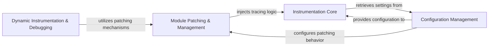

## Component Details

The Instrumentation & Configuration subsystem is responsible for dynamically injecting tracing logic into application code and providing a centralized system for configuring the tracer's behavior and features. It achieves this through module patching, bytecode injection, and a robust configuration management system. These core functionalities enable the tracing core to operate effectively by providing the necessary instrumentation points and behavioral parameters.

### Module Patching & Management
Handles the dynamic instrumentation of modules by patching them at import time or during runtime. It ensures that the tracing logic is injected into the application's dependencies without requiring manual code changes.

**Related Classes/Methods**:

- <a href="https://github.com/DataDog/dd-trace-py/blob/master/ddtrace/_monkey.py#L365-L400" target="_blank" rel="noopener noreferrer">`ddtrace._monkey.patch` (365:400)</a>
- <a href="https://github.com/DataDog/dd-trace-py/blob/master/ddtrace/internal/module.py#L449-L706" target="_blank" rel="noopener noreferrer">`ddtrace.internal.module.ModuleWatchdog` (449:706)</a>

### Configuration Management
Manages the various configuration settings for the ddtrace library, including integration-specific settings, global tracing parameters, and remote configuration updates. It provides a centralized way to control the behavior of the tracer and other components.

**Related Classes/Methods**:

- <a href="https://github.com/DataDog/dd-trace-py/blob/master/ddtrace/settings/_config.py#L393-L868" target="_blank" rel="noopener noreferrer">`ddtrace.settings._config.Config` (393:868)</a>
- <a href="https://github.com/DataDog/dd-trace-py/blob/master/ddtrace/settings/integration.py#L12-L142" target="_blank" rel="noopener noreferrer">`ddtrace.settings.integration.IntegrationConfig` (12:142)</a>
- <a href="https://github.com/DataDog/dd-trace-py/blob/master/ddtrace/settings/asm.py#L62-L291" target="_blank" rel="noopener noreferrer">`ddtrace.settings.asm.ASMConfig` (62:291)</a>

### Dynamic Instrumentation & Debugging
This component enables dynamic instrumentation and debugging features. It allows for the injection and ejection of probes into running code, facilitating the collection of debugging signals and the modification of program behavior at runtime. It leverages bytecode injection for its functionality.

**Related Classes/Methods**:

- `ddtrace.internal.bytecode_injection` (full file reference)

### Instrumentation Core
This component is responsible for the fundamental aspects of tracing, including span creation, context management, and interaction with span processors. It acts as the central hub for all tracing activities within the application.

**Related Classes/Methods**:

- `ddtrace._trace.tracer._start_span` (full file reference)
- `ddtrace._trace.tracer.trace` (full file reference)
- `ddtrace._trace.tracer.configure` (full file reference)

### [FAQ](https://github.com/CodeBoarding/GeneratedOnBoardings/tree/main?tab=readme-ov-file#faq)