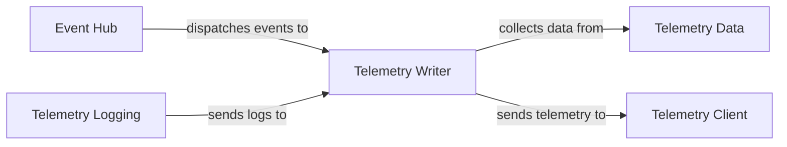

## Component Details

The Internal Event & Telemetry System provides a central publish-subscribe mechanism for internal communication and a system for collecting and reporting internal operational metrics, configurations, and errors of the tracer itself. The main flow involves components dispatching events to the Event Hub, which then notifies registered listeners. The Telemetry Writer, a key listener, collects various types of telemetry data (metrics, logs, configurations, integration changes, dependencies) and periodically sends them to the Datadog agent or directly to the intake.

### Event Hub
The central communication backbone, enabling decoupled components to interact through event publishing and subscription. It manages the flow of events and provides context management functionalities.

**Related Classes/Methods**:

- <a href="https://github.com/DataDog/dd-trace-py/blob/master/ddtrace/internal/core/event_hub.py#L1-L99" target="_blank" rel="noopener noreferrer">`ddtrace.internal.core.event_hub.EventHub` (1:99)</a>
- <a href="https://github.com/DataDog/dd-trace-py/blob/master/ddtrace/internal/core/event_hub.py#L54-L61" target="_blank" rel="noopener noreferrer">`ddtrace.internal.core.event_hub.on` (54:61)</a>
- <a href="https://github.com/DataDog/dd-trace-py/blob/master/ddtrace/internal/core/event_hub.py#L91-L111" target="_blank" rel="noopener noreferrer">`ddtrace.internal.core.event_hub.dispatch` (91:111)</a>
- <a href="https://github.com/DataDog/dd-trace-py/blob/master/ddtrace/internal/core/event_hub.py#L114-L140" target="_blank" rel="noopener noreferrer">`ddtrace.internal.core.event_hub.dispatch_with_results` (114:140)</a>
- <a href="https://github.com/DataDog/dd-trace-py/blob/master/ddtrace/internal/core/event_hub.py#L71-L88" target="_blank" rel="noopener noreferrer">`ddtrace.internal.core.event_hub.reset` (71:88)</a>

### Telemetry Writer
Responsible for gathering and sending operational metrics and logs about the `dd-trace-py` library's internal state and performance. It provides APIs for adding various types of telemetry data and periodically flushes them to the Datadog agent.

**Related Classes/Methods**:

- <a href="https://github.com/DataDog/dd-trace-py/blob/master/ddtrace/internal/telemetry/writer.py#L137-L720" target="_blank" rel="noopener noreferrer">`ddtrace.internal.telemetry.writer.TelemetryWriter` (137:720)</a>
- <a href="https://github.com/DataDog/dd-trace-py/blob/master/ddtrace/internal/telemetry/writer.py#L632-L639" target="_blank" rel="noopener noreferrer">`ddtrace.internal.telemetry.writer.TelemetryWriter.reset_queues` (632:639)</a>
- <a href="https://github.com/DataDog/dd-trace-py/blob/master/ddtrace/internal/telemetry/writer.py#L210-L228" target="_blank" rel="noopener noreferrer">`ddtrace.internal.telemetry.writer.TelemetryWriter.enable` (210:228)</a>
- <a href="https://github.com/DataDog/dd-trace-py/blob/master/ddtrace/internal/telemetry/writer.py#L532-L543" target="_blank" rel="noopener noreferrer">`ddtrace.internal.telemetry.writer.TelemetryWriter.add_count_metric` (532:543)</a>
- <a href="https://github.com/DataDog/dd-trace-py/blob/master/ddtrace/internal/telemetry/writer.py#L483-L504" target="_blank" rel="noopener noreferrer">`ddtrace.internal.telemetry.writer.TelemetryWriter.add_log` (483:504)</a>
- <a href="https://github.com/DataDog/dd-trace-py/blob/master/ddtrace/internal/telemetry/writer.py#L545-L558" target="_blank" rel="noopener noreferrer">`ddtrace.internal.telemetry.writer.TelemetryWriter.add_distribution_metric` (545:558)</a>
- <a href="https://github.com/DataDog/dd-trace-py/blob/master/ddtrace/internal/telemetry/writer.py#L434-L445" target="_blank" rel="noopener noreferrer">`ddtrace.internal.telemetry.writer.TelemetryWriter.product_activated` (434:445)</a>

### Telemetry Data
Provides utility functions for collecting and formatting various types of data for telemetry, such as application information, host details, and imported dependencies.

**Related Classes/Methods**:

- <a href="https://github.com/DataDog/dd-trace-py/blob/master/ddtrace/internal/telemetry/data.py#L1-L90" target="_blank" rel="noopener noreferrer">`ddtrace.internal.telemetry.data` (1:90)</a>
- <a href="https://github.com/DataDog/dd-trace-py/blob/master/ddtrace/internal/telemetry/data.py#L73-L91" target="_blank" rel="noopener noreferrer">`ddtrace.internal.telemetry.data.update_imported_dependencies` (73:91)</a>
- <a href="https://github.com/DataDog/dd-trace-py/blob/master/ddtrace/internal/telemetry/data.py#L94-L99" target="_blank" rel="noopener noreferrer">`ddtrace.internal.telemetry.data.get_application` (94:99)</a>
- <a href="https://github.com/DataDog/dd-trace-py/blob/master/ddtrace/internal/telemetry/data.py#L105-L119" target="_blank" rel="noopener noreferrer">`ddtrace.internal.telemetry.data.get_host_info` (105:119)</a>
- <a href="https://github.com/DataDog/dd-trace-py/blob/master/ddtrace/internal/telemetry/data.py#L126-L132" target="_blank" rel="noopener noreferrer">`ddtrace.internal.telemetry.data.get_python_config_vars` (126:132)</a>

### Telemetry Logging
Handles the logging of internal `ddtrace` events and exceptions, specifically capturing errors and integration-related logs to be sent as telemetry data.

**Related Classes/Methods**:

- <a href="https://github.com/DataDog/dd-trace-py/blob/master/ddtrace/internal/telemetry/logging.py#L1-L66" target="_blank" rel="noopener noreferrer">`ddtrace.internal.telemetry.logging` (1:66)</a>
- <a href="https://github.com/DataDog/dd-trace-py/blob/master/ddtrace/internal/telemetry/logging.py#L9-L73" target="_blank" rel="noopener noreferrer">`ddtrace.internal.telemetry.logging.DDTelemetryLogHandler` (9:73)</a>
- <a href="https://github.com/DataDog/dd-trace-py/blob/master/ddtrace/internal/telemetry/logging.py#L16-L43" target="_blank" rel="noopener noreferrer">`ddtrace.internal.telemetry.logging.DDTelemetryLogHandler.emit` (16:43)</a>

### Telemetry Client
Manages the HTTP communication with the Datadog agent or directly with the telemetry intake, responsible for sending telemetry event payloads.

**Related Classes/Methods**:

- <a href="https://github.com/DataDog/dd-trace-py/blob/master/ddtrace/internal/telemetry/writer.py#L63-L134" target="_blank" rel="noopener noreferrer">`ddtrace.internal.telemetry.writer._TelemetryClient` (63:134)</a>
- <a href="https://github.com/DataDog/dd-trace-py/blob/master/ddtrace/internal/telemetry/writer.py#L87-L113" target="_blank" rel="noopener noreferrer">`ddtrace.internal.telemetry.writer._TelemetryClient.send_event` (87:113)</a>

### [FAQ](https://github.com/CodeBoarding/GeneratedOnBoardings/tree/main?tab=readme-ov-file#faq)