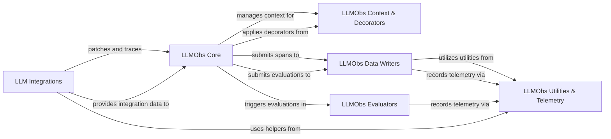

## Component Details

The LLM Observability (LLMObs) subsystem provides comprehensive tracing and monitoring capabilities for interactions with Large Language Models. Its main purpose is to capture input/output, token usage, and evaluation metrics, offering deep insights into LLM operations. The system integrates with various LLM libraries, processes and writes observability data, manages tracing contexts, and facilitates the evaluation of LLM traces.

### LLM Integrations
This component encompasses various modules responsible for integrating Datadog's LLM Observability with different LLM libraries and frameworks such as Anthropic, Botocore (Bedrock), Google Generative AI (Gemini), Langchain, Langgraph, LiteLLM, OpenAI, OpenAI Agents, and VertexAI. It patches the respective libraries to capture LLM-related operations and forward them to the LLMObs Core.

**Related Classes/Methods**:

- <a href="https://github.com/DataDog/dd-trace-py/blob/master/ddtrace/contrib/internal/anthropic/patch.py#L190-L204" target="_blank" rel="noopener noreferrer">`ddtrace.contrib.internal.anthropic.patch` (190:204)</a>
- `ddtrace.contrib.internal.anthropic.utils` (full file reference)
- `ddtrace.contrib.internal.anthropic._streaming` (full file reference)
- <a href="https://github.com/DataDog/dd-trace-py/blob/master/ddtrace/contrib/internal/botocore/patch.py#L140-L150" target="_blank" rel="noopener noreferrer">`ddtrace.contrib.internal.botocore.patch` (140:150)</a>
- `ddtrace.contrib.internal.botocore.services.bedrock` (full file reference)
- <a href="https://github.com/DataDog/dd-trace-py/blob/master/ddtrace/contrib/internal/google_generativeai/patch.py#L104-L115" target="_blank" rel="noopener noreferrer">`ddtrace.contrib.internal.google_generativeai.patch` (104:115)</a>
- `ddtrace.contrib.internal.google_generativeai._utils` (full file reference)
- `ddtrace.contrib.internal.langchain.patch` (full file reference)
- `ddtrace.contrib.internal.langchain.utils` (full file reference)
- <a href="https://github.com/DataDog/dd-trace-py/blob/master/ddtrace/contrib/internal/langgraph/patch.py#L310-L334" target="_blank" rel="noopener noreferrer">`ddtrace.contrib.internal.langgraph.patch` (310:334)</a>
- <a href="https://github.com/DataDog/dd-trace-py/blob/master/ddtrace/contrib/internal/litellm/patch.py#L165-L184" target="_blank" rel="noopener noreferrer">`ddtrace.contrib.internal.litellm.patch` (165:184)</a>
- `ddtrace.contrib.internal.litellm.utils` (full file reference)
- <a href="https://github.com/DataDog/dd-trace-py/blob/master/ddtrace/contrib/internal/openai/patch.py#L88-L134" target="_blank" rel="noopener noreferrer">`ddtrace.contrib.internal.openai.patch` (88:134)</a>
- `ddtrace.contrib.internal.openai.utils` (full file reference)
- <a href="https://github.com/DataDog/dd-trace-py/blob/master/ddtrace/contrib/internal/openai_agents/patch.py#L25-L36" target="_blank" rel="noopener noreferrer">`ddtrace.contrib.internal.openai_agents.patch` (25:36)</a>
- `ddtrace.contrib.internal.openai_agents.processor` (full file reference)
- <a href="https://github.com/DataDog/dd-trace-py/blob/master/ddtrace/contrib/internal/vertexai/patch.py#L128-L141" target="_blank" rel="noopener noreferrer">`ddtrace.contrib.internal.vertexai.patch` (128:141)</a>
- `ddtrace.contrib.internal.vertexai._utils` (full file reference)
- <a href="https://github.com/DataDog/dd-trace-py/blob/master/ddtrace/llmobs/_integrations/anthropic.py#L30-L190" target="_blank" rel="noopener noreferrer">`ddtrace.llmobs._integrations.anthropic.AnthropicIntegration` (30:190)</a>
- <a href="https://github.com/DataDog/dd-trace-py/blob/master/ddtrace/llmobs/_integrations/bedrock.py#L24-L269" target="_blank" rel="noopener noreferrer">`ddtrace.llmobs._integrations.bedrock.BedrockIntegration` (24:269)</a>
- <a href="https://github.com/DataDog/dd-trace-py/blob/master/ddtrace/llmobs/_integrations/crewai.py#L28-L286" target="_blank" rel="noopener noreferrer">`ddtrace.llmobs._integrations.crewai.CrewAIIntegration` (28:286)</a>
- <a href="https://github.com/DataDog/dd-trace-py/blob/master/ddtrace/llmobs/_integrations/gemini.py#L24-L110" target="_blank" rel="noopener noreferrer">`ddtrace.llmobs._integrations.gemini.GeminiIntegration` (24:110)</a>
- <a href="https://github.com/DataDog/dd-trace-py/blob/master/ddtrace/llmobs/_integrations/langchain.py#L105-L727" target="_blank" rel="noopener noreferrer">`ddtrace.llmobs._integrations.langchain.LangChainIntegration` (105:727)</a>
- <a href="https://github.com/DataDog/dd-trace-py/blob/master/ddtrace/llmobs/_integrations/langgraph.py#L24-L144" target="_blank" rel="noopener noreferrer">`ddtrace.llmobs._integrations.langgraph.LangGraphIntegration` (24:144)</a>
- <a href="https://github.com/DataDog/dd-trace-py/blob/master/ddtrace/llmobs/_integrations/litellm.py#L50-L230" target="_blank" rel="noopener noreferrer">`ddtrace.llmobs._integrations.litellm.LiteLLMIntegration` (50:230)</a>
- <a href="https://github.com/DataDog/dd-trace-py/blob/master/ddtrace/llmobs/_integrations/openai.py#L29-L170" target="_blank" rel="noopener noreferrer">`ddtrace.llmobs._integrations.openai.OpenAIIntegration` (29:170)</a>
- <a href="https://github.com/DataDog/dd-trace-py/blob/master/ddtrace/llmobs/_integrations/openai_agents.py#L41-L298" target="_blank" rel="noopener noreferrer">`ddtrace.llmobs._integrations.openai_agents.OpenAIAgentsIntegration` (41:298)</a>
- <a href="https://github.com/DataDog/dd-trace-py/blob/master/ddtrace/llmobs/_integrations/vertexai.py#L25-L140" target="_blank" rel="noopener noreferrer">`ddtrace.llmobs._integrations.vertexai.VertexAIIntegration` (25:140)</a>

### LLMObs Core
This is the central component of the LLM Observability subsystem. It is responsible for enabling and disabling LLM tracing, managing LLM spans, handling annotations, and coordinating with other LLMObs components like writers and evaluators. It acts as the main interface for LLM observability features.

**Related Classes/Methods**:

- <a href="https://github.com/DataDog/dd-trace-py/blob/master/ddtrace/llmobs/_llmobs.py#L20-L30" target="_blank" rel="noopener noreferrer">`ddtrace.llmobs._llmobs.LLMObs` (20:30)</a>

### LLMObs Context & Decorators
This component provides the mechanisms for managing the LLM observability context, allowing for the activation and deactivation of LLM spans. It also includes decorators that simplify the process of tracing LLM operations by automatically creating and managing spans.

**Related Classes/Methods**:

- <a href="https://github.com/DataDog/dd-trace-py/blob/master/ddtrace/llmobs/_context.py#L20-L60" target="_blank" rel="noopener noreferrer">`ddtrace.llmobs._context.LLMObsContextProvider` (20:60)</a>
- `ddtrace.llmobs.decorators` (full file reference)

### LLMObs Data Writers
This component is responsible for collecting, encoding, and sending LLM observability data, such as LLM spans and evaluation metrics, to the Datadog backend. It includes base classes for writers and specific implementations for different types of data.

**Related Classes/Methods**:

- <a href="https://github.com/DataDog/dd-trace-py/blob/master/ddtrace/llmobs/_writer.py#L95-L247" target="_blank" rel="noopener noreferrer">`ddtrace.llmobs._writer.BaseLLMObsWriter` (95:247)</a>
- <a href="https://github.com/DataDog/dd-trace-py/blob/master/ddtrace/llmobs/_writer.py#L266-L293" target="_blank" rel="noopener noreferrer">`ddtrace.llmobs._writer.LLMObsSpanWriter` (266:293)</a>
- <a href="https://github.com/DataDog/dd-trace-py/blob/master/ddtrace/llmobs/_writer.py#L250-L263" target="_blank" rel="noopener noreferrer">`ddtrace.llmobs._writer.LLMObsEvalMetricWriter` (250:263)</a>
- <a href="https://github.com/DataDog/dd-trace-py/blob/master/ddtrace/llmobs/_log_writer.py#L38-L120" target="_blank" rel="noopener noreferrer">`ddtrace.llmobs._log_writer.V2LogWriter` (38:120)</a>

### LLMObs Evaluators
This component provides the framework for evaluating LLM traces and submitting evaluation metrics. It includes a runner for enqueuing evaluations and specific evaluators for different metrics, such as Ragas-based evaluations.

**Related Classes/Methods**:

- <a href="https://github.com/DataDog/dd-trace-py/blob/master/ddtrace/llmobs/_evaluators/runner.py#L30-L133" target="_blank" rel="noopener noreferrer">`ddtrace.llmobs._evaluators.runner.EvaluatorRunner` (30:133)</a>
- <a href="https://github.com/DataDog/dd-trace-py/blob/master/ddtrace/llmobs/_evaluators/sampler.py#L48-L114" target="_blank" rel="noopener noreferrer">`ddtrace.llmobs._evaluators.sampler.EvaluatorRunnerSampler` (48:114)</a>
- <a href="https://github.com/DataDog/dd-trace-py/blob/master/ddtrace/llmobs/_evaluators/sampler.py#L19-L45" target="_blank" rel="noopener noreferrer">`ddtrace.llmobs._evaluators.sampler.EvaluatorRunnerSamplingRule` (19:45)</a>
- <a href="https://github.com/DataDog/dd-trace-py/blob/master/ddtrace/llmobs/_evaluators/ragas/answer_relevancy.py#L16-L148" target="_blank" rel="noopener noreferrer">`ddtrace.llmobs._evaluators.ragas.answer_relevancy.RagasAnswerRelevancyEvaluator` (16:148)</a>
- <a href="https://github.com/DataDog/dd-trace-py/blob/master/ddtrace/llmobs/_evaluators/ragas/base.py#L20-L83" target="_blank" rel="noopener noreferrer">`ddtrace.llmobs._evaluators.ragas.base.RagasDependencies` (20:83)</a>
- <a href="https://github.com/DataDog/dd-trace-py/blob/master/ddtrace/llmobs/_evaluators/ragas/base.py#L100-L229" target="_blank" rel="noopener noreferrer">`ddtrace.llmobs._evaluators.ragas.base.BaseRagasEvaluator` (100:229)</a>
- <a href="https://github.com/DataDog/dd-trace-py/blob/master/ddtrace/llmobs/_evaluators/ragas/context_precision.py#L17-L155" target="_blank" rel="noopener noreferrer">`ddtrace.llmobs._evaluators.ragas.context_precision.RagasContextPrecisionEvaluator` (17:155)</a>
- <a href="https://github.com/DataDog/dd-trace-py/blob/master/ddtrace/llmobs/_evaluators/ragas/faithfulness.py#L20-L253" target="_blank" rel="noopener noreferrer">`ddtrace.llmobs._evaluators.ragas.faithfulness.RagasFaithfulnessEvaluator` (20:253)</a>

### LLMObs Utilities & Telemetry
This component provides a collection of utility functions used across the LLM Observability subsystem, including safe JSON handling, attribute retrieval, and span link management. It also handles the recording and reporting of internal telemetry metrics related to LLM observability.

**Related Classes/Methods**:

- `ddtrace.llmobs._utils` (full file reference)
- `ddtrace.llmobs._telemetry` (full file reference)
- `ddtrace.llmobs._integrations.utils` (full file reference)

### [FAQ](https://github.com/CodeBoarding/GeneratedOnBoardings/tree/main?tab=readme-ov-file#faq)