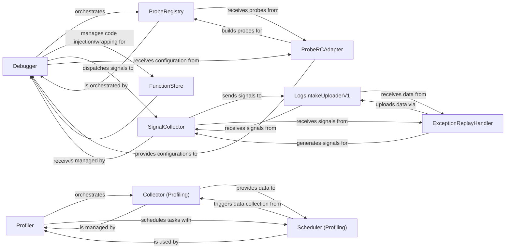

## Component Details

The Live Debugging & Profiling subsystem provides dynamic code instrumentation, runtime data capture, and performance profiling capabilities. The core flow involves the Debugger orchestrating live debugging probes, collecting signals via the SignalCollector, and uploading them through the LogsIntakeUploaderV1. Concurrently, the Profiler manages various data collectors and schedules profiling tasks to identify performance bottlenecks.

### Debugger
The central orchestrator of the dynamic instrumentation (live debugging) subsystem. It manages the lifecycle of probes, handles remote configuration updates, injects and ejects debugging hooks into functions, wraps functions, and dispatches collected debugging signals.

**Related Classes/Methods**:

- <a href="https://github.com/DataDog/dd-trace-py/blob/master/ddtrace/debugging/_debugger.py#L189-L600" target="_blank" rel="noopener noreferrer">`ddtrace.debugging._debugger.Debugger` (189:600)</a>

### ProbeRegistry
Manages the state and lifecycle of all active debugging probes. It keeps track of probes that are pending, installed, emitting, or have encountered errors, and provides methods for registering, unregistering, and updating probe statuses.

**Related Classes/Methods**:

- `ddtrace.debugging._probe.registry` (full file reference)

### LogsIntakeUploaderV1
Responsible for collecting and asynchronously uploading debugging signals (such as logs, metrics, and snapshots) to the Datadog intake endpoint. It buffers signals and handles retries for network operations.

**Related Classes/Methods**:

- <a href="https://github.com/DataDog/dd-trace-py/blob/master/ddtrace/debugging/_uploader.py#L30-L147" target="_blank" rel="noopener noreferrer">`ddtrace.debugging._uploader.LogsIntakeUploaderV1` (30:147)</a>

### SignalCollector
Collects various debugging signals (logs, metrics, snapshots) generated during code execution and prepares them for uploading.

**Related Classes/Methods**:

- `ddtrace.debugging._signal.collector` (full file reference)

### FunctionStore
Manages the injection, ejection, and wrapping of debugging hooks into Python functions' bytecode. It maintains a record of modified functions to allow for restoration.

**Related Classes/Methods**:

- <a href="https://github.com/DataDog/dd-trace-py/blob/master/ddtrace/debugging/_function/store.py#L27-L108" target="_blank" rel="noopener noreferrer">`ddtrace.debugging._function.store.FunctionStore` (27:108)</a>

### ProbeRCAdapter
Acts as an adapter between the Remote Configuration Management (RCM) system and the debugger. It subscribes to RCM updates for live debugging probes, processes the configurations, and dispatches events to the Debugger.

**Related Classes/Methods**:

- <a href="https://github.com/DataDog/dd-trace-py/blob/master/ddtrace/debugging/_probe/remoteconfig.py#L360-L367" target="_blank" rel="noopener noreferrer">`ddtrace.debugging._probe.remoteconfig.ProbeRCAdapter` (360:367)</a>

### Profiler
The central orchestrator for the profiling subsystem. It manages the lifecycle of various collectors (CPU, memory, etc.) and schedules the collection and serialization of profiling data.

**Related Classes/Methods**:

- <a href="https://github.com/DataDog/dd-trace-py/blob/master/ddtrace/profiling/profiler.py#L35-L99" target="_blank" rel="noopener noreferrer">`ddtrace.profiling.profiler.Profiler` (35:99)</a>

### Collector (Profiling)
An abstract base component for various profiling data collectors (e.g., CPU, memory, lock, PyTorch). Concrete implementations collect specific types of runtime data.

**Related Classes/Methods**:

- `ddtrace.profiling.collector` (full file reference)

### Scheduler (Profiling)
Responsible for periodically triggering the collection of profiling data from active collectors and serializing the collected data for submission.

**Related Classes/Methods**:

- `ddtrace.profiling.scheduler` (full file reference)

### ExceptionReplayHandler
Handles the capture and replay of exceptions, including collecting relevant snapshots and uploading them for analysis.

**Related Classes/Methods**:

- <a href="https://github.com/DataDog/dd-trace-py/blob/master/ddtrace/debugging/_exception/replay.py#L222-L344" target="_blank" rel="noopener noreferrer">`ddtrace.debugging._exception.replay.SpanExceptionHandler` (222:344)</a>

### [FAQ](https://github.com/CodeBoarding/GeneratedOnBoardings/tree/main?tab=readme-ov-file#faq)