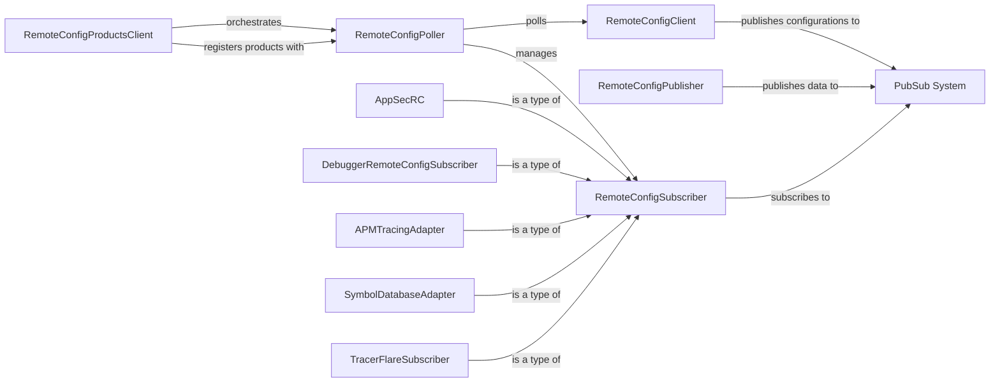

## Component Details

The Remote Configuration subsystem facilitates dynamic updates to the tracer's configuration from a remote source. It enables features such as real-time AppSec rule updates, dynamic sampling adjustments, and live debugging capabilities by periodically fetching configurations from a remote agent, validating them, and distributing them to various product-specific subscribers. This system ensures that the tracer can adapt its behavior and features dynamically without requiring a restart.

### RemoteConfigPoller
The RemoteConfigPoller is a periodic service responsible for initiating remote configuration updates. It periodically fetches configurations from the `RemoteConfigClient` and, upon receiving updates, triggers the distribution of these configurations to registered product subscribers via the `PubSub System`. It also manages the lifecycle of these subscribers, including starting and stopping them based on product updates and forks.

**Related Classes/Methods**:

- <a href="https://github.com/DataDog/dd-trace-py/blob/master/ddtrace/internal/remoteconfig/worker.py#L22-L201" target="_blank" rel="noopener noreferrer">`ddtrace.internal.remoteconfig.worker.RemoteConfigPoller` (22:201)</a>
- <a href="https://github.com/DataDog/dd-trace-py/blob/master/ddtrace/internal/remoteconfig/worker.py#L31-L38" target="_blank" rel="noopener noreferrer">`ddtrace.internal.remoteconfig.worker.RemoteConfigPoller.__init__` (31:38)</a>
- <a href="https://github.com/DataDog/dd-trace-py/blob/master/ddtrace/internal/remoteconfig/worker.py#L71-L72" target="_blank" rel="noopener noreferrer">`ddtrace.internal.remoteconfig.worker.RemoteConfigPoller.periodic` (71:72)</a>
- <a href="https://github.com/DataDog/dd-trace-py/blob/master/ddtrace/internal/remoteconfig/worker.py#L74-L84" target="_blank" rel="noopener noreferrer">`ddtrace.internal.remoteconfig.worker.RemoteConfigPoller.enable` (74:84)</a>
- <a href="https://github.com/DataDog/dd-trace-py/blob/master/ddtrace/internal/remoteconfig/worker.py#L86-L97" target="_blank" rel="noopener noreferrer">`ddtrace.internal.remoteconfig.worker.RemoteConfigPoller.reset_at_fork` (86:97)</a>
- <a href="https://github.com/DataDog/dd-trace-py/blob/master/ddtrace/internal/remoteconfig/worker.py#L99-L100" target="_blank" rel="noopener noreferrer">`ddtrace.internal.remoteconfig.worker.RemoteConfigPoller.start_subscribers_by_product` (99:100)</a>
- <a href="https://github.com/DataDog/dd-trace-py/blob/master/ddtrace/internal/remoteconfig/worker.py#L107-L118" target="_blank" rel="noopener noreferrer">`ddtrace.internal.remoteconfig.worker.RemoteConfigPoller.stop_subscribers` (107:118)</a>
- <a href="https://github.com/DataDog/dd-trace-py/blob/master/ddtrace/internal/remoteconfig/worker.py#L120-L127" target="_blank" rel="noopener noreferrer">`ddtrace.internal.remoteconfig.worker.RemoteConfigPoller.disable` (120:127)</a>
- <a href="https://github.com/DataDog/dd-trace-py/blob/master/ddtrace/internal/remoteconfig/worker.py#L129-L135" target="_blank" rel="noopener noreferrer">`ddtrace.internal.remoteconfig.worker.RemoteConfigPoller._stop_service` (129:135)</a>
- <a href="https://github.com/DataDog/dd-trace-py/blob/master/ddtrace/internal/remoteconfig/worker.py#L137-L142" target="_blank" rel="noopener noreferrer">`ddtrace.internal.remoteconfig.worker.RemoteConfigPoller.update_product_callback` (137:142)</a>
- <a href="https://github.com/DataDog/dd-trace-py/blob/master/ddtrace/internal/remoteconfig/worker.py#L144-L179" target="_blank" rel="noopener noreferrer">`ddtrace.internal.remoteconfig.worker.RemoteConfigPoller.register` (144:179)</a>
- <a href="https://github.com/DataDog/dd-trace-py/blob/master/ddtrace/internal/remoteconfig/worker.py#L181-L191" target="_blank" rel="noopener noreferrer">`ddtrace.internal.remoteconfig.worker.RemoteConfigPoller.unregister` (181:191)</a>
- <a href="https://github.com/DataDog/dd-trace-py/blob/master/ddtrace/internal/remoteconfig/worker.py#L193-L194" target="_blank" rel="noopener noreferrer">`ddtrace.internal.remoteconfig.worker.RemoteConfigPoller.get_registered` (193:194)</a>

### RemoteConfigClient
The RemoteConfigClient handles the communication with the Datadog agent to retrieve remote configurations. It is responsible for constructing the request payload with client and product states, sending HTTP requests to the agent, processing the received responses, and validating the integrity of the configurations. Once validated, it publishes the new configurations to the `PubSub System`.

**Related Classes/Methods**:

- `ddtrace.internal.remoteconfig.client` (full file reference)
- <a href="https://github.com/DataDog/dd-trace-py/blob/master/ddtrace/internal/remoteconfig/client.py#L202-L605" target="_blank" rel="noopener noreferrer">`ddtrace.internal.remoteconfig.client.RemoteConfigClient` (202:605)</a>
- <a href="https://github.com/DataDog/dd-trace-py/blob/master/ddtrace/internal/remoteconfig/client.py#L208-L248" target="_blank" rel="noopener noreferrer">`ddtrace.internal.remoteconfig.client.RemoteConfigClient.__init__` (208:248)</a>
- <a href="https://github.com/DataDog/dd-trace-py/blob/master/ddtrace/internal/remoteconfig/client.py#L268-L275" target="_blank" rel="noopener noreferrer">`ddtrace.internal.remoteconfig.client.RemoteConfigClient.update_product_callback` (268:275)</a>
- <a href="https://github.com/DataDog/dd-trace-py/blob/master/ddtrace/internal/remoteconfig/client.py#L290-L294" target="_blank" rel="noopener noreferrer">`ddtrace.internal.remoteconfig.client.RemoteConfigClient.is_subscriber_running` (290:294)</a>
- <a href="https://github.com/DataDog/dd-trace-py/blob/master/ddtrace/internal/remoteconfig/client.py#L364-L376" target="_blank" rel="noopener noreferrer">`ddtrace.internal.remoteconfig.client.RemoteConfigClient._build_payload` (364:376)</a>
- <a href="https://github.com/DataDog/dd-trace-py/blob/master/ddtrace/internal/remoteconfig/client.py#L422-L447" target="_blank" rel="noopener noreferrer">`ddtrace.internal.remoteconfig.client.RemoteConfigClient._remove_previously_applied_configurations` (422:447)</a>
- <a href="https://github.com/DataDog/dd-trace-py/blob/master/ddtrace/internal/remoteconfig/client.py#L449-L478" target="_blank" rel="noopener noreferrer">`ddtrace.internal.remoteconfig.client.RemoteConfigClient._load_new_configurations` (449:478)</a>
- <a href="https://github.com/DataDog/dd-trace-py/blob/master/ddtrace/internal/remoteconfig/client.py#L542-L584" target="_blank" rel="noopener noreferrer">`ddtrace.internal.remoteconfig.client.RemoteConfigClient._process_response` (542:584)</a>
- <a href="https://github.com/DataDog/dd-trace-py/blob/master/ddtrace/internal/remoteconfig/client.py#L586-L605" target="_blank" rel="noopener noreferrer">`ddtrace.internal.remoteconfig.client.RemoteConfigClient.request` (586:605)</a>
- <a href="https://github.com/DataDog/dd-trace-py/blob/master/ddtrace/internal/remoteconfig/client.py#L253-L256" target="_blank" rel="noopener noreferrer">`ddtrace.internal.remoteconfig.client.RemoteConfigClient.renew_id` (253:256)</a>
- <a href="https://github.com/DataDog/dd-trace-py/blob/master/ddtrace/internal/remoteconfig/client.py#L258-L262" target="_blank" rel="noopener noreferrer">`ddtrace.internal.remoteconfig.client.RemoteConfigClient.register_product` (258:262)</a>
- <a href="https://github.com/DataDog/dd-trace-py/blob/master/ddtrace/internal/remoteconfig/client.py#L264-L266" target="_blank" rel="noopener noreferrer">`ddtrace.internal.remoteconfig.client.RemoteConfigClient.add_capabilities` (264:266)</a>
- <a href="https://github.com/DataDog/dd-trace-py/blob/master/ddtrace/internal/remoteconfig/client.py#L277-L281" target="_blank" rel="noopener noreferrer">`ddtrace.internal.remoteconfig.client.RemoteConfigClient.start_products` (277:281)</a>
- <a href="https://github.com/DataDog/dd-trace-py/blob/master/ddtrace/internal/remoteconfig/client.py#L283-L284" target="_blank" rel="noopener noreferrer">`ddtrace.internal.remoteconfig.client.RemoteConfigClient.unregister_product` (283:284)</a>
- <a href="https://github.com/DataDog/dd-trace-py/blob/master/ddtrace/internal/remoteconfig/client.py#L286-L288" target="_blank" rel="noopener noreferrer">`ddtrace.internal.remoteconfig.client.RemoteConfigClient.get_pubsubs` (286:288)</a>
- <a href="https://github.com/DataDog/dd-trace-py/blob/master/ddtrace/internal/remoteconfig/client.py#L296-L297" target="_blank" rel="noopener noreferrer">`ddtrace.internal.remoteconfig.client.RemoteConfigClient.reset_products` (296:297)</a>
- <a href="https://github.com/DataDog/dd-trace-py/blob/master/ddtrace/internal/remoteconfig/client.py#L299-L337" target="_blank" rel="noopener noreferrer">`ddtrace.internal.remoteconfig.client.RemoteConfigClient._send_request` (299:337)</a>
- <a href="https://github.com/DataDog/dd-trace-py/blob/master/ddtrace/internal/remoteconfig/client.py#L340-L362" target="_blank" rel="noopener noreferrer">`ddtrace.internal.remoteconfig.client.RemoteConfigClient._extract_target_file` (340:362)</a>
- <a href="https://github.com/DataDog/dd-trace-py/blob/master/ddtrace/internal/remoteconfig/client.py#L378-L408" target="_blank" rel="noopener noreferrer">`ddtrace.internal.remoteconfig.client.RemoteConfigClient._build_state` (378:408)</a>
- <a href="https://github.com/DataDog/dd-trace-py/blob/master/ddtrace/internal/remoteconfig/client.py#L411-L420" target="_blank" rel="noopener noreferrer">`ddtrace.internal.remoteconfig.client.RemoteConfigClient._apply_callback` (411:420)</a>
- <a href="https://github.com/DataDog/dd-trace-py/blob/master/ddtrace/internal/remoteconfig/client.py#L480-L493" target="_blank" rel="noopener noreferrer">`ddtrace.internal.remoteconfig.client.RemoteConfigClient._add_apply_config_to_cache` (480:493)</a>
- <a href="https://github.com/DataDog/dd-trace-py/blob/master/ddtrace/internal/remoteconfig/client.py#L495-L503" target="_blank" rel="noopener noreferrer">`ddtrace.internal.remoteconfig.client.RemoteConfigClient._validate_config_exists_in_target_paths` (495:503)</a>
- <a href="https://github.com/DataDog/dd-trace-py/blob/master/ddtrace/internal/remoteconfig/client.py#L506-L515" target="_blank" rel="noopener noreferrer">`ddtrace.internal.remoteconfig.client.RemoteConfigClient._validate_signed_target_files` (506:515)</a>
- <a href="https://github.com/DataDog/dd-trace-py/blob/master/ddtrace/internal/remoteconfig/client.py#L517-L519" target="_blank" rel="noopener noreferrer">`ddtrace.internal.remoteconfig.client.RemoteConfigClient._publish_configuration` (517:519)</a>
- <a href="https://github.com/DataDog/dd-trace-py/blob/master/ddtrace/internal/remoteconfig/client.py#L521-L540" target="_blank" rel="noopener noreferrer">`ddtrace.internal.remoteconfig.client.RemoteConfigClient._process_targets` (521:540)</a>

### RemoteConfigPublisher
The RemoteConfigPublisher is a base class for components that publish remote configuration payloads. It provides methods to append configuration content and metadata, and to dispatch this data through a shared data connector to the `PubSub System`.

**Related Classes/Methods**:

- <a href="https://github.com/DataDog/dd-trace-py/blob/master/ddtrace/internal/remoteconfig/_publishers.py#L39-L59" target="_blank" rel="noopener noreferrer">`ddtrace.internal.remoteconfig._publishers.RemoteConfigPublisher` (39:59)</a>
- <a href="https://github.com/DataDog/dd-trace-py/blob/master/ddtrace/internal/remoteconfig/_publishers.py#L44-L47" target="_blank" rel="noopener noreferrer">`ddtrace.internal.remoteconfig._publishers.RemoteConfigPublisher.__init__` (44:47)</a>
- <a href="https://github.com/DataDog/dd-trace-py/blob/master/ddtrace/internal/remoteconfig/_publishers.py#L49-L50" target="_blank" rel="noopener noreferrer">`ddtrace.internal.remoteconfig._publishers.RemoteConfigPublisher.append` (49:50)</a>
- <a href="https://github.com/DataDog/dd-trace-py/blob/master/ddtrace/internal/remoteconfig/_publishers.py#L52-L59" target="_blank" rel="noopener noreferrer">`ddtrace.internal.remoteconfig._publishers.RemoteConfigPublisher.dispatch` (52:59)</a>

### RemoteConfigSubscriber
The RemoteConfigSubscriber is a base class for components that subscribe to and process remote configuration updates. It defines the mechanism for periodically reading configuration data from a shared data connector and executing a registered callback function with the received payloads.

**Related Classes/Methods**:

- `ddtrace.internal.remoteconfig._subscribers` (full file reference)
- <a href="https://github.com/DataDog/dd-trace-py/blob/master/ddtrace/internal/remoteconfig/_subscribers.py#L16-L53" target="_blank" rel="noopener noreferrer">`ddtrace.internal.remoteconfig._subscribers.RemoteConfigSubscriber` (16:53)</a>
- <a href="https://github.com/DataDog/dd-trace-py/blob/master/ddtrace/internal/remoteconfig/_subscribers.py#L17-L26" target="_blank" rel="noopener noreferrer">`ddtrace.internal.remoteconfig._subscribers.RemoteConfigSubscriber.__init__` (17:26)</a>
- <a href="https://github.com/DataDog/dd-trace-py/blob/master/ddtrace/internal/remoteconfig/_subscribers.py#L37-L43" target="_blank" rel="noopener noreferrer">`ddtrace.internal.remoteconfig._subscribers.RemoteConfigSubscriber.periodic` (37:43)</a>
- <a href="https://github.com/DataDog/dd-trace-py/blob/master/ddtrace/internal/remoteconfig/_subscribers.py#L28-L31" target="_blank" rel="noopener noreferrer">`ddtrace.internal.remoteconfig._subscribers.RemoteConfigSubscriber._exec_callback` (28:31)</a>
- <a href="https://github.com/DataDog/dd-trace-py/blob/master/ddtrace/internal/remoteconfig/_subscribers.py#L33-L35" target="_blank" rel="noopener noreferrer">`ddtrace.internal.remoteconfig._subscribers.RemoteConfigSubscriber._get_data_from_connector_and_exec` (33:35)</a>

### PubSub System
This abstract component defines the publish-subscribe pattern for remote configurations. It consists of `PubSub` (the abstract base for publishers and subscribers) and `PublisherSubscriberConnector` (the concrete mechanism for inter-component communication). It ensures decoupled communication, allowing various products to receive and react to configuration changes.

**Related Classes/Methods**:

- <a href="https://github.com/DataDog/dd-trace-py/blob/master/ddtrace/internal/remoteconfig/_pubsub.py#L84-L114" target="_blank" rel="noopener noreferrer">`ddtrace.internal.remoteconfig._pubsub.PubSub` (84:114)</a>
- <a href="https://github.com/DataDog/dd-trace-py/blob/master/ddtrace/internal/remoteconfig/_connectors.py#L41-L96" target="_blank" rel="noopener noreferrer">`ddtrace.internal.remoteconfig._connectors.PublisherSubscriberConnector` (41:96)</a>

### AppSecRC
The `AppSecRC` component is a concrete implementation of a `PubSub` and `RemoteConfigSubscriber` specifically for Application Security (AppSec) configurations. It receives AppSec-related updates from the remote configuration system and dynamically enables or disables AppSec features, rules, and data within the tracer.

**Related Classes/Methods**:

- <a href="https://github.com/DataDog/dd-trace-py/blob/master/ddtrace/appsec/_remoteconfiguration.py#L32-L41" target="_blank" rel="noopener noreferrer">`ddtrace.appsec._remoteconfiguration.AppSecRC` (32:41)</a>
- <a href="https://github.com/DataDog/dd-trace-py/blob/master/ddtrace/appsec/_remoteconfiguration.py#L37-L41" target="_blank" rel="noopener noreferrer">`ddtrace.appsec._remoteconfiguration.AppSecRC.__init__` (37:41)</a>
- <a href="https://github.com/DataDog/dd-trace-py/blob/master/ddtrace/appsec/_remoteconfiguration.py#L44-L45" target="_blank" rel="noopener noreferrer">`ddtrace.appsec._remoteconfiguration._forksafe_appsec_rc` (44:45)</a>
- <a href="https://github.com/DataDog/dd-trace-py/blob/master/ddtrace/appsec/_remoteconfiguration.py#L48-L82" target="_blank" rel="noopener noreferrer">`ddtrace.appsec._remoteconfiguration.enable_appsec_rc` (48:82)</a>
- <a href="https://github.com/DataDog/dd-trace-py/blob/master/ddtrace/appsec/_remoteconfiguration.py#L85-L90" target="_blank" rel="noopener noreferrer">`ddtrace.appsec._remoteconfiguration.disable_appsec_rc` (85:90)</a>
- <a href="https://github.com/DataDog/dd-trace-py/blob/master/ddtrace/appsec/_remoteconfiguration.py#L171-L188" target="_blank" rel="noopener noreferrer">`ddtrace.appsec._remoteconfiguration._preprocess_results_appsec_1click_activation` (171:188)</a>

### DebuggerRemoteConfigSubscriber
The `DebuggerRemoteConfigSubscriber` is a concrete `RemoteConfigSubscriber` that handles remote configuration updates for the Debugger feature. It receives dynamic instrumentation probes (line and function probes) and instructs the `Debugger` to inject or eject these probes into the application's code, enabling live debugging capabilities.

**Related Classes/Methods**:

- <a href="https://github.com/DataDog/dd-trace-py/blob/master/ddtrace/debugging/_probe/remoteconfig.py#L283-L357" target="_blank" rel="noopener noreferrer">`ddtrace.debugging._probe.remoteconfig.DebuggerRemoteConfigSubscriber` (283:357)</a>
- <a href="https://github.com/DataDog/dd-trace-py/blob/master/ddtrace/debugging/_probe/remoteconfig.py#L290-L298" target="_blank" rel="noopener noreferrer">`ddtrace.debugging._probe.remoteconfig.DebuggerRemoteConfigSubscriber.__init__` (290:298)</a>

### APMTracingAdapter
The `APMTracingAdapter` is a concrete `PubSub` implementation that processes remote configuration updates related to APM tracing. It receives configuration changes and dispatches them to the APM tracing event hub, allowing for dynamic adjustments to tracing behavior, such as sampling rates or feature flags.

**Related Classes/Methods**:

- <a href="https://github.com/DataDog/dd-trace-py/blob/master/ddtrace/internal/remoteconfig/products/apm_tracing.py#L36-L43" target="_blank" rel="noopener noreferrer">`ddtrace.internal.remoteconfig.products.apm_tracing.APMTracingAdapter` (36:43)</a>
- <a href="https://github.com/DataDog/dd-trace-py/blob/master/ddtrace/internal/remoteconfig/products/apm_tracing.py#L41-L43" target="_blank" rel="noopener noreferrer">`ddtrace.internal.remoteconfig.products.apm_tracing.APMTracingAdapter.__init__` (41:43)</a>
- <a href="https://github.com/DataDog/dd-trace-py/blob/master/ddtrace/internal/remoteconfig/products/apm_tracing.py#L50-L67" target="_blank" rel="noopener noreferrer">`ddtrace.internal.remoteconfig.products.apm_tracing.start` (50:67)</a>
- <a href="https://github.com/DataDog/dd-trace-py/blob/master/ddtrace/internal/remoteconfig/products/apm_tracing.py#L74-L78" target="_blank" rel="noopener noreferrer">`ddtrace.internal.remoteconfig.products.apm_tracing.stop` (74:78)</a>

### SymbolDatabaseAdapter
The `SymbolDatabaseAdapter` is a concrete `PubSub` implementation responsible for handling remote configuration updates for the Symbol Database. It receives signals to enable or disable the Symbol Database Uploader, which is used for collecting and sending symbol information.

**Related Classes/Methods**:

- <a href="https://github.com/DataDog/dd-trace-py/blob/master/ddtrace/internal/symbol_db/remoteconfig.py#L71-L78" target="_blank" rel="noopener noreferrer">`ddtrace.internal.symbol_db.remoteconfig.SymbolDatabaseAdapter` (71:78)</a>
- <a href="https://github.com/DataDog/dd-trace-py/blob/master/ddtrace/internal/symbol_db/remoteconfig.py#L76-L78" target="_blank" rel="noopener noreferrer">`ddtrace.internal.symbol_db.remoteconfig.SymbolDatabaseAdapter.__init__` (76:78)</a>
- <a href="https://github.com/DataDog/dd-trace-py/blob/master/ddtrace/internal/symbol_db/__init__.py#L9-L32" target="_blank" rel="noopener noreferrer">`ddtrace.internal.symbol_db.__init__:bootstrap` (9:32)</a>
- <a href="https://github.com/DataDog/dd-trace-py/blob/master/ddtrace/internal/symbol_db/__init__.py#L35-L37" target="_blank" rel="noopener noreferrer">`ddtrace.internal.symbol_db.__init__:restart` (35:37)</a>

### TracerFlareSubscriber
The `TracerFlareSubscriber` is a concrete `RemoteConfigSubscriber` that processes remote configuration commands for the tracer flare functionality. It receives instructions to prepare and generate diagnostic tracer flares, which are used for troubleshooting and support.

**Related Classes/Methods**:

- <a href="https://github.com/DataDog/dd-trace-py/blob/master/ddtrace/internal/flare/_subscribers.py#L18-L78" target="_blank" rel="noopener noreferrer">`ddtrace.internal.flare._subscribers.TracerFlareSubscriber` (18:78)</a>
- <a href="https://github.com/DataDog/dd-trace-py/blob/master/ddtrace/internal/flare/_subscribers.py#L19-L29" target="_blank" rel="noopener noreferrer">`ddtrace.internal.flare._subscribers.TracerFlareSubscriber.__init__` (19:29)</a>

### RemoteConfigProductsClient
The `RemoteConfigProductsClient` is a high-level component that orchestrates the registration and management of various remote configuration products. It interacts with the `RemoteConfigPoller` to enable and disable it, and ensures that product-specific restarts are handled correctly based on remote configuration requirements.

**Related Classes/Methods**:

- `ddtrace.internal.remoteconfig.products.client` (full file reference)
- <a href="https://github.com/DataDog/dd-trace-py/blob/master/ddtrace/internal/remoteconfig/products/client.py#L6-L16" target="_blank" rel="noopener noreferrer">`ddtrace.internal.remoteconfig.products.client._register_rc_products` (6:16)</a>
- <a href="https://github.com/DataDog/dd-trace-py/blob/master/ddtrace/internal/remoteconfig/products/client.py#L23-L28" target="_blank" rel="noopener noreferrer">`ddtrace.internal.remoteconfig.products.client.start` (23:28)</a>
- <a href="https://github.com/DataDog/dd-trace-py/blob/master/ddtrace/internal/remoteconfig/products/client.py#L31-L35" target="_blank" rel="noopener noreferrer">`ddtrace.internal.remoteconfig.products.client.restart` (31:35)</a>
- <a href="https://github.com/DataDog/dd-trace-py/blob/master/ddtrace/internal/remoteconfig/products/client.py#L38-L42" target="_blank" rel="noopener noreferrer">`ddtrace.internal.remoteconfig.products.client.stop` (38:42)</a>

### [FAQ](https://github.com/CodeBoarding/GeneratedOnBoardings/tree/main?tab=readme-ov-file#faq)