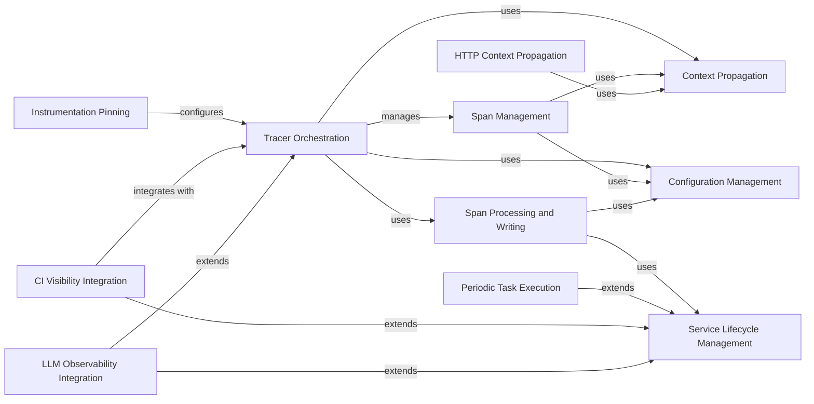

## Component Details

The Tracing Core subsystem is the foundational component responsible for creating, managing, and finalizing distributed traces and spans. It encompasses the orchestration of tracers, the lifecycle management of individual spans, and the propagation of trace contexts across different services. Key functionalities include span processing, sampling, and writing trace data to the agent, along with integrations for CI visibility and LLM observability. The system relies on a robust configuration management and service lifecycle framework to ensure efficient and reliable tracing operations.

### Tracer Orchestration
The central component for distributed tracing, managing the lifecycle of traces and spans. It coordinates with context providers, samplers, and span processors to ensure proper trace propagation and processing.

**Related Classes/Methods**:

- <a href="https://github.com/DataDog/dd-trace-py/blob/master/ddtrace/_trace/tracer.py#L153-L968" target="_blank" rel="noopener noreferrer">`ddtrace._trace.tracer.Tracer` (153:968)</a>
- <a href="https://github.com/DataDog/dd-trace-py/blob/master/ddtrace/_trace/tracer.py#L675-L731" target="_blank" rel="noopener noreferrer">`ddtrace._trace.tracer.Tracer.trace` (675:731)</a>
- <a href="https://github.com/DataDog/dd-trace-py/blob/master/ddtrace/_trace/tracer.py#L351-L413" target="_blank" rel="noopener noreferrer">`ddtrace._trace.tracer.Tracer.configure` (351:413)</a>
- <a href="https://github.com/DataDog/dd-trace-py/blob/master/ddtrace/_trace/tracer.py#L462-L473" target="_blank" rel="noopener noreferrer">`ddtrace._trace.tracer.Tracer._start_span_after_shutdown` (462:473)</a>
- <a href="https://github.com/DataDog/dd-trace-py/blob/master/ddtrace/_trace/tracer.py#L733-L755" target="_blank" rel="noopener noreferrer">`ddtrace._trace.tracer.Tracer.current_root_span` (733:755)</a>
- <a href="https://github.com/DataDog/dd-trace-py/blob/master/ddtrace/_trace/tracer.py#L757-L765" target="_blank" rel="noopener noreferrer">`ddtrace._trace.tracer.Tracer.current_span` (757:765)</a>
- <a href="https://github.com/DataDog/dd-trace-py/blob/master/ddtrace/_trace/tracer.py#L289-L297" target="_blank" rel="noopener noreferrer">`ddtrace._trace.tracer.Tracer._activate_context` (289:297)</a>
- <a href="https://github.com/DataDog/dd-trace-py/blob/master/ddtrace/_trace/tracer.py#L311-L321" target="_blank" rel="noopener noreferrer">`ddtrace._trace.tracer.Tracer.current_trace_context` (311:321)</a>
- <a href="https://github.com/DataDog/dd-trace-py/blob/master/ddtrace/_trace/tracer.py#L323-L349" target="_blank" rel="noopener noreferrer">`ddtrace._trace.tracer.Tracer.get_log_correlation_context` (323:349)</a>
- <a href="https://github.com/DataDog/dd-trace-py/blob/master/ddtrace/_trace/tracer.py#L439-L460" target="_blank" rel="noopener noreferrer">`ddtrace._trace.tracer.Tracer._recreate` (439:460)</a>
- <a href="https://github.com/DataDog/dd-trace-py/blob/master/ddtrace/_trace/tracer.py#L475-L639" target="_blank" rel="noopener noreferrer">`ddtrace._trace.tracer.Tracer._start_span` (475:639)</a>
- <a href="https://github.com/DataDog/dd-trace-py/blob/master/ddtrace/_trace/tracer.py#L643-L661" target="_blank" rel="noopener noreferrer">`ddtrace._trace.tracer.Tracer._on_span_finish` (643:661)</a>
- <a href="https://github.com/DataDog/dd-trace-py/blob/master/ddtrace/_trace/tracer.py#L829-L938" target="_blank" rel="noopener noreferrer">`ddtrace._trace.tracer.Tracer.wrap` (829:938)</a>
- <a href="https://github.com/DataDog/dd-trace-py/blob/master/ddtrace/_trace/tracer.py#L91-L150" target="_blank" rel="noopener noreferrer">`ddtrace._trace.tracer._default_span_processors_factory` (91:150)</a>

### Span Management
Responsible for creating, managing, and finalizing individual spans, which represent units of work within a trace. It handles setting tags, metrics, error information, and linking spans to other spans or contexts.

**Related Classes/Methods**:

- <a href="https://github.com/DataDog/dd-trace-py/blob/master/ddtrace/_trace/span.py#L108-L809" target="_blank" rel="noopener noreferrer">`ddtrace._trace.span.Span` (108:809)</a>
- <a href="https://github.com/DataDog/dd-trace-py/blob/master/ddtrace/_trace/span.py#L437-L443" target="_blank" rel="noopener noreferrer">`ddtrace._trace.span.Span.set_tags` (437:443)</a>
- <a href="https://github.com/DataDog/dd-trace-py/blob/master/ddtrace/_trace/span.py#L475-L481" target="_blank" rel="noopener noreferrer">`ddtrace._trace.span.Span.set_metrics` (475:481)</a>
- <a href="https://github.com/DataDog/dd-trace-py/blob/master/ddtrace/_trace/span.py#L487-L490" target="_blank" rel="noopener noreferrer">`ddtrace._trace.span.Span._add_event` (487:490)</a>
- <a href="https://github.com/DataDog/dd-trace-py/blob/master/ddtrace/_trace/span.py#L711-L730" target="_blank" rel="noopener noreferrer">`ddtrace._trace.span.Span.set_link` (711:730)</a>
- <a href="https://github.com/DataDog/dd-trace-py/blob/master/ddtrace/_trace/span.py#L602-L642" target="_blank" rel="noopener noreferrer">`ddtrace._trace.span.Span.record_exception` (602:642)</a>
- <a href="https://github.com/DataDog/dd-trace-py/blob/master/ddtrace/_trace/span.py#L335-L404" target="_blank" rel="noopener noreferrer">`ddtrace._trace.span.Span.set_tag` (335:404)</a>
- <a href="https://github.com/DataDog/dd-trace-py/blob/master/ddtrace/_trace/span.py#L306-L315" target="_blank" rel="noopener noreferrer">`ddtrace._trace.span.Span.finish` (306:315)</a>
- <a href="https://github.com/DataDog/dd-trace-py/blob/master/ddtrace/_trace/span.py#L560-L600" target="_blank" rel="noopener noreferrer">`ddtrace._trace.span.Span.set_exc_info` (560:600)</a>
- <a href="https://github.com/DataDog/dd-trace-py/blob/master/ddtrace/_trace/span.py#L327-L333" target="_blank" rel="noopener noreferrer">`ddtrace._trace.span.Span._override_sampling_decision` (327:333)</a>
- <a href="https://github.com/DataDog/dd-trace-py/blob/master/ddtrace/_trace/span.py#L670-L674" target="_blank" rel="noopener noreferrer">`ddtrace._trace.span.Span.context` (670:674)</a>
- <a href="https://github.com/DataDog/dd-trace-py/blob/master/ddtrace/_trace/span.py#L693-L709" target="_blank" rel="noopener noreferrer">`ddtrace._trace.span.Span.link_span` (693:709)</a>
- <a href="https://github.com/DataDog/dd-trace-py/blob/master/ddtrace/_trace/span.py#L732-L748" target="_blank" rel="noopener noreferrer">`ddtrace._trace.span.Span._add_span_pointer` (732:748)</a>
- <a href="https://github.com/DataDog/dd-trace-py/blob/master/ddtrace/_trace/span.py#L750-L768" target="_blank" rel="noopener noreferrer">`ddtrace._trace.span.Span._set_link_or_append_pointer` (750:768)</a>
- <a href="https://github.com/DataDog/dd-trace-py/blob/master/ddtrace/_trace/span.py#L770-L779" target="_blank" rel="noopener noreferrer">`ddtrace._trace.span.Span.finish_with_ancestors` (770:779)</a>

### Context Propagation
Handles the propagation and activation of trace contexts. It provides mechanisms to store and retrieve the active span and trace context, ensuring that spans are correctly nested and correlated across different parts of an application.

**Related Classes/Methods**:

- <a href="https://github.com/DataDog/dd-trace-py/blob/master/ddtrace/_trace/context.py#L42-L302" target="_blank" rel="noopener noreferrer">`ddtrace._trace.context.Context` (42:302)</a>
- <a href="https://github.com/DataDog/dd-trace-py/blob/master/ddtrace/_trace/context.py#L233-L243" target="_blank" rel="noopener noreferrer">`ddtrace._trace.context.Context.copy` (233:243)</a>
- <a href="https://github.com/DataDog/dd-trace-py/blob/master/ddtrace/_trace/context.py#L245-L256" target="_blank" rel="noopener noreferrer">`ddtrace._trace.context.Context._with_baggage_item` (245:256)</a>
- <a href="https://github.com/DataDog/dd-trace-py/blob/master/ddtrace/_trace/provider.py#L23-L78" target="_blank" rel="noopener noreferrer">`ddtrace._trace.provider.BaseContextProvider` (23:78)</a>
- <a href="https://github.com/DataDog/dd-trace-py/blob/master/ddtrace/_trace/provider.py#L41-L42" target="_blank" rel="noopener noreferrer">`ddtrace._trace.provider.BaseContextProvider.activate` (41:42)</a>
- <a href="https://github.com/DataDog/dd-trace-py/blob/master/ddtrace/_trace/provider.py#L45-L46" target="_blank" rel="noopener noreferrer">`ddtrace._trace.provider.BaseContextProvider.active` (45:46)</a>
- <a href="https://github.com/DataDog/dd-trace-py/blob/master/ddtrace/_trace/provider.py#L81-L123" target="_blank" rel="noopener noreferrer">`ddtrace._trace.provider.DefaultContextProvider` (81:123)</a>
- <a href="https://github.com/DataDog/dd-trace-py/blob/master/ddtrace/_trace/provider.py#L96-L99" target="_blank" rel="noopener noreferrer">`ddtrace._trace.provider.DefaultContextProvider.activate` (96:99)</a>
- <a href="https://github.com/DataDog/dd-trace-py/blob/master/ddtrace/_trace/provider.py#L101-L106" target="_blank" rel="noopener noreferrer">`ddtrace._trace.provider.DefaultContextProvider.active` (101:106)</a>
- <a href="https://github.com/DataDog/dd-trace-py/blob/master/ddtrace/_trace/provider.py#L108-L123" target="_blank" rel="noopener noreferrer">`ddtrace._trace.provider.DefaultContextProvider._update_active` (108:123)</a>

### Instrumentation Pinning
The Pinning component allows for dynamic configuration and retrieval of tracing settings for instrumented libraries and frameworks. It provides a flexible way to associate tracing behavior with specific objects or modules, enabling fine-grained control over how different parts of an application are traced.

**Related Classes/Methods**:

- <a href="https://github.com/DataDog/dd-trace-py/blob/master/ddtrace/_trace/pin.py#L23-L248" target="_blank" rel="noopener noreferrer">`ddtrace._trace.pin.Pin` (23:248)</a>
- <a href="https://github.com/DataDog/dd-trace-py/blob/master/ddtrace/_trace/pin.py#L95-L118" target="_blank" rel="noopener noreferrer">`ddtrace._trace.pin.Pin.get_from` (95:118)</a>
- <a href="https://github.com/DataDog/dd-trace-py/blob/master/ddtrace/_trace/pin.py#L182-L200" target="_blank" rel="noopener noreferrer">`ddtrace._trace.pin.Pin.onto` (182:200)</a>
- <a href="https://github.com/DataDog/dd-trace-py/blob/master/ddtrace/_trace/pin.py#L75-L92" target="_blank" rel="noopener noreferrer">`ddtrace._trace.pin.Pin._find` (75:92)</a>
- <a href="https://github.com/DataDog/dd-trace-py/blob/master/ddtrace/_trace/pin.py#L121-L132" target="_blank" rel="noopener noreferrer">`ddtrace._trace.pin.Pin._get_config` (121:132)</a>
- <a href="https://github.com/DataDog/dd-trace-py/blob/master/ddtrace/_trace/pin.py#L135-L151" target="_blank" rel="noopener noreferrer">`ddtrace._trace.pin.Pin.override` (135:151)</a>
- <a href="https://github.com/DataDog/dd-trace-py/blob/master/ddtrace/_trace/pin.py#L154-L176" target="_blank" rel="noopener noreferrer">`ddtrace._trace.pin.Pin._override` (154:176)</a>
- <a href="https://github.com/DataDog/dd-trace-py/blob/master/ddtrace/_trace/pin.py#L202-L212" target="_blank" rel="noopener noreferrer">`ddtrace._trace.pin.Pin.remove_from` (202:212)</a>
- <a href="https://github.com/DataDog/dd-trace-py/blob/master/ddtrace/_trace/pin.py#L214-L221" target="_blank" rel="noopener noreferrer">`ddtrace._trace.pin.Pin.clone` (214:221)</a>
- <a href="https://github.com/DataDog/dd-trace-py/blob/master/ddtrace/_trace/pin.py#L223-L248" target="_blank" rel="noopener noreferrer">`ddtrace._trace.pin.Pin._clone` (223:248)</a>

### Service Lifecycle Management
This foundational component provides a generic framework for managing the lifecycle of various services within the tracing library. It defines methods for starting, stopping, and enabling/disabling services, ensuring proper resource management and graceful shutdown.

**Related Classes/Methods**:

- <a href="https://github.com/DataDog/dd-trace-py/blob/master/ddtrace/internal/service.py#L28-L105" target="_blank" rel="noopener noreferrer">`ddtrace.internal.service.Service` (28:105)</a>
- <a href="https://github.com/DataDog/dd-trace-py/blob/master/ddtrace/internal/service.py#L49-L61" target="_blank" rel="noopener noreferrer">`ddtrace.internal.service.Service.start` (49:61)</a>
- <a href="https://github.com/DataDog/dd-trace-py/blob/master/ddtrace/internal/service.py#L76-L86" target="_blank" rel="noopener noreferrer">`ddtrace.internal.service.Service.stop` (76:86)</a>
- <a href="https://github.com/DataDog/dd-trace-py/blob/master/ddtrace/internal/service.py#L31-L33" target="_blank" rel="noopener noreferrer">`ddtrace.internal.service.Service.__init__` (31:33)</a>
- <a href="https://github.com/DataDog/dd-trace-py/blob/master/ddtrace/internal/service.py#L64-L74" target="_blank" rel="noopener noreferrer">`ddtrace.internal.service.Service._start_service` (64:74)</a>
- <a href="https://github.com/DataDog/dd-trace-py/blob/master/ddtrace/internal/service.py#L89-L99" target="_blank" rel="noopener noreferrer">`ddtrace.internal.service.Service._stop_service` (89:99)</a>

### Periodic Task Execution
Building upon the Service Lifecycle Management component, this component provides a specialized framework for services that require periodic execution. It handles the scheduling and execution of recurring tasks, such as sending telemetry data or polling for remote configurations.

**Related Classes/Methods**:

- <a href="https://github.com/DataDog/dd-trace-py/blob/master/ddtrace/internal/periodic.py#L31-L87" target="_blank" rel="noopener noreferrer">`ddtrace.internal.periodic.PeriodicService` (31:87)</a>
- <a href="https://github.com/DataDog/dd-trace-py/blob/master/ddtrace/internal/periodic.py#L34-L37" target="_blank" rel="noopener noreferrer">`ddtrace.internal.periodic.PeriodicService.__init__` (34:37)</a>
- <a href="https://github.com/DataDog/dd-trace-py/blob/master/ddtrace/internal/periodic.py#L55-L64" target="_blank" rel="noopener noreferrer">`ddtrace.internal.periodic.PeriodicService._start_service` (55:64)</a>
- <a href="https://github.com/DataDog/dd-trace-py/blob/master/ddtrace/internal/periodic.py#L66-L71" target="_blank" rel="noopener noreferrer">`ddtrace.internal.periodic.PeriodicService._stop_service` (66:71)</a>
- `ddtrace.internal.periodic.PeriodicService.enable` (full file reference)
- `ddtrace.internal.periodic.PeriodicService.disable` (full file reference)
- <a href="https://github.com/DataDog/dd-trace-py/blob/master/ddtrace/internal/periodic.py#L85-L87" target="_blank" rel="noopener noreferrer">`ddtrace.internal.periodic.PeriodicService.periodic` (85:87)</a>
- <a href="https://github.com/DataDog/dd-trace-py/blob/master/ddtrace/internal/periodic.py#L99-L120" target="_blank" rel="noopener noreferrer">`ddtrace.internal.periodic.ForksafeAwakeablePeriodicService` (99:120)</a>

### HTTP Context Propagation
This component is responsible for injecting and extracting trace context information into and from HTTP headers. It supports various propagation formats (e.g., Datadog, B3) to ensure that traces can be continued across different services and systems that communicate via HTTP.

**Related Classes/Methods**:

- `ddtrace.propagation.http.HTTPPropagator` (full file reference)
- `ddtrace.propagation.http.HTTPPropagator.inject` (full file reference)
- `ddtrace.propagation.http.HTTPPropagator.extract` (full file reference)
- `ddtrace.propagation.http._DatadogMultiHeader` (full file reference)
- `ddtrace.propagation.http._DatadogMultiHeader._inject` (full file reference)
- `ddtrace.propagation.http._DatadogMultiHeader._extract` (full file reference)
- `ddtrace.propagation.http._B3MultiHeader` (full file reference)
- `ddtrace.propagation.http._B3MultiHeader._extract` (full file reference)
- `ddtrace.propagation.http._B3SingleHeader` (full file reference)
- `ddtrace.propagation.http._B3SingleHeader._extract` (full file reference)
- `ddtrace.propagation.http._TraceContext` (full file reference)
- `ddtrace.propagation.http._TraceContext._get_context` (full file reference)
- `ddtrace.propagation.http._BaggageHeader` (full file reference)
- `ddtrace.propagation.http._BaggageHeader._extract` (full file reference)

### Configuration Management
This component centralizes the configuration settings for the tracing library. It provides mechanisms to load, store, and retrieve various configuration parameters, including service names, sampling rates, and feature flags. It also handles dynamic configuration updates.

**Related Classes/Methods**:

- <a href="https://github.com/DataDog/dd-trace-py/blob/master/ddtrace/settings/_config.py#L393-L868" target="_blank" rel="noopener noreferrer">`ddtrace.settings._config.Config` (393:868)</a>
- <a href="https://github.com/DataDog/dd-trace-py/blob/master/ddtrace/settings/_config.py#L431-L654" target="_blank" rel="noopener noreferrer">`ddtrace.settings._config.Config.__init__` (431:654)</a>
- <a href="https://github.com/DataDog/dd-trace-py/blob/master/ddtrace/settings/_config.py#L724-L746" target="_blank" rel="noopener noreferrer">`ddtrace.settings._config.Config._get_service` (724:746)</a>
- <a href="https://github.com/DataDog/dd-trace-py/blob/master/ddtrace/settings/_config.py#L667-L671" target="_blank" rel="noopener noreferrer">`ddtrace.settings._config.Config._add_extra_service` (667:671)</a>
- <a href="https://github.com/DataDog/dd-trace-py/blob/master/ddtrace/settings/_config.py#L673-L680" target="_blank" rel="noopener noreferrer">`ddtrace.settings._config.Config._get_extra_services` (673:680)</a>

### CI Visibility Integration
This component focuses on integrating tracing with Continuous Integration (CI) environments. It enables the collection of trace data during CI test runs, providing insights into test performance and failures. It interacts with the core tracing components to capture relevant information.

**Related Classes/Methods**:

- `ddtrace.internal.ci_visibility.recorder.CIVisibility` (full file reference)
- `ddtrace.internal.ci_visibility.recorder.CIVisibility.__init__` (full file reference)
- `ddtrace.internal.ci_visibility.recorder.CIVisibility.enable` (full file reference)
- `ddtrace.internal.ci_visibility.recorder.CIVisibility.disable` (full file reference)
- `ddtrace.internal.ci_visibility.recorder.CIVisibility._start_service` (full file reference)
- `ddtrace.internal.ci_visibility.recorder.CIVisibility._stop_service` (full file reference)
- `ddtrace.internal.ci_visibility.recorder.CIVisibilityTracer` (full file reference)
- `ddtrace.internal.ci_visibility.recorder.CIVisibilityTracer.__init__` (full file reference)
- <a href="https://github.com/DataDog/dd-trace-py/blob/master/ddtrace/contrib/internal/unittest/patch.py#L78-L82" target="_blank" rel="noopener noreferrer">`ddtrace.contrib.internal.unittest.patch:_enable_unittest_if_not_started` (78:82)</a>
- <a href="https://github.com/DataDog/dd-trace-py/blob/master/ddtrace/contrib/internal/unittest/patch.py#L433-L453" target="_blank" rel="noopener noreferrer">`ddtrace.contrib.internal.unittest.patch:unpatch` (433:453)</a>
- <a href="https://github.com/DataDog/dd-trace-py/blob/master/ddtrace/contrib/internal/unittest/patch.py#L633-L671" target="_blank" rel="noopener noreferrer">`ddtrace.contrib.internal.unittest.patch:_start_test_session_span` (633:671)</a>
- <a href="https://github.com/DataDog/dd-trace-py/blob/master/ddtrace/contrib/internal/unittest/patch.py#L811-L822" target="_blank" rel="noopener noreferrer">`ddtrace.contrib.internal.unittest.patch:_finish_test_session_span` (811:822)</a>

### LLM Observability Integration
This component provides specialized tracing capabilities for applications that utilize Large Language Models (LLMs). It extends the core tracing functionality to capture LLM-specific metrics and events, enabling detailed observability into LLM interactions and performance.

**Related Classes/Methods**:

- `ddtrace.llmobs._llmobs.LLMObs` (full file reference)
- `ddtrace.llmobs._llmobs.LLMObs.__init__` (full file reference)
- `ddtrace.llmobs._llmobs.LLMObs._start_service` (full file reference)
- `ddtrace.llmobs._llmobs.LLMObs._stop_service` (full file reference)
- `ddtrace.llmobs._llmobs.LLMObs.enable` (full file reference)
- `ddtrace.llmobs._llmobs.LLMObs.disable` (full file reference)
- `ddtrace.llmobs._llmobs.LLMObs.annotation_context` (full file reference)
- `ddtrace.llmobs._llmobs.LLMObs._current_span` (full file reference)
- `ddtrace.llmobs._llmobs.LLMObs._current_trace_context` (full file reference)
- `ddtrace.llmobs._llmobs.LLMObs._activate_llmobs_span` (full file reference)
- `ddtrace.llmobs._llmobs.LLMObs._start_span` (full file reference)
- `ddtrace.llmobs._llmobs.LLMObs._activate_llmobs_distributed_context` (full file reference)
- <a href="https://github.com/DataDog/dd-trace-py/blob/master/ddtrace/llmobs/_context.py#L20-L60" target="_blank" rel="noopener noreferrer">`ddtrace.llmobs._context.LLMObsContextProvider` (20:60)</a>
- <a href="https://github.com/DataDog/dd-trace-py/blob/master/ddtrace/llmobs/_context.py#L26-L28" target="_blank" rel="noopener noreferrer">`ddtrace.llmobs._context.LLMObsContextProvider.__init__` (26:28)</a>
- <a href="https://github.com/DataDog/dd-trace-py/blob/master/ddtrace/llmobs/_context.py#L50-L53" target="_blank" rel="noopener noreferrer">`ddtrace.llmobs._context.LLMObsContextProvider.activate` (50:53)</a>
- <a href="https://github.com/DataDog/dd-trace-py/blob/master/ddtrace/llmobs/_context.py#L55-L60" target="_blank" rel="noopener noreferrer">`ddtrace.llmobs._context.LLMObsContextProvider.active` (55:60)</a>

### Span Processing and Writing
Responsible for processing, aggregating, and sending spans to the tracing agent or other configured destinations. This includes applying sampling decisions and various span transformations.

**Related Classes/Methods**:

- `ddtrace._trace.processor.SpanProcessor` (full file reference)
- `ddtrace._trace.processor.SpanAggregator` (full file reference)
- `ddtrace.internal.writer.TraceWriter` (full file reference)
- `ddtrace.internal.writer.AgentWriter` (full file reference)
- `ddtrace.internal.writer.HTTPWriter` (full file reference)
- <a href="https://github.com/DataDog/dd-trace-py/blob/master/ddtrace/_trace/sampler.py#L55-L221" target="_blank" rel="noopener noreferrer">`ddtrace._trace.sampler.DatadogSampler` (55:221)</a>
- <a href="https://github.com/DataDog/dd-trace-py/blob/master/ddtrace/_trace/sampler.py#L33-L52" target="_blank" rel="noopener noreferrer">`ddtrace._trace.sampler.RateSampler` (33:52)</a>

### [FAQ](https://github.com/CodeBoarding/GeneratedOnBoardings/tree/main?tab=readme-ov-file#faq)