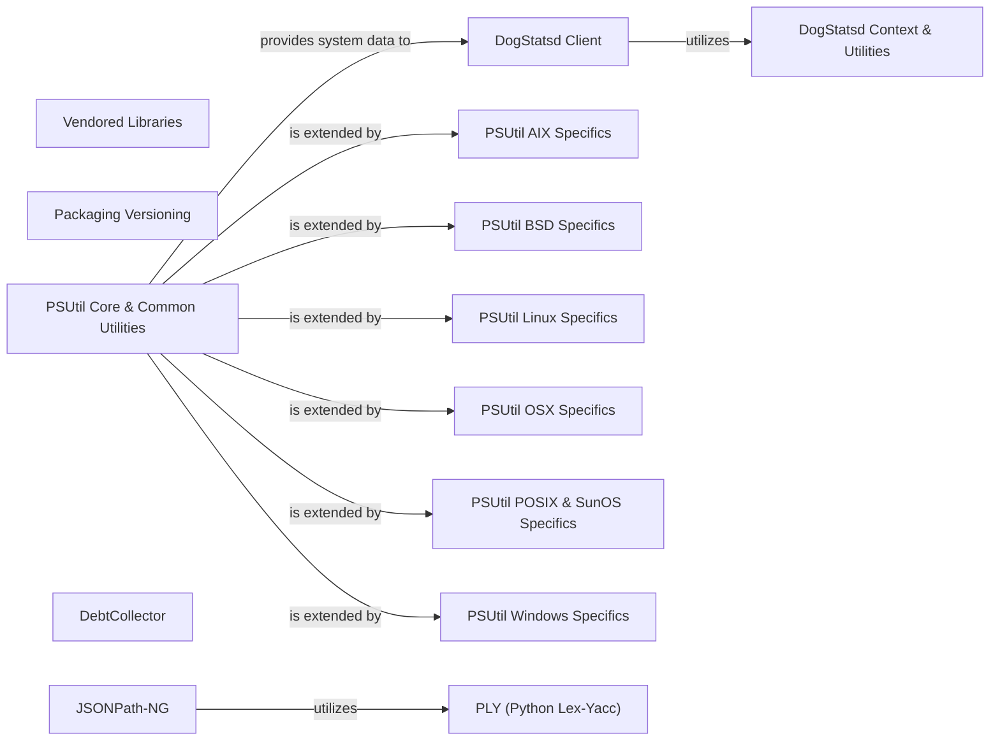

## Component Details

The Vendored Libraries component in dd-trace-py encapsulates third-party Python libraries directly integrated into the project. This approach ensures consistent behavior, avoids external dependency conflicts, and provides specific functionalities like DogStatsd client for metrics collection, robust version parsing and comparison (PEP 440 compliant), comprehensive system and process information retrieval (psutil, with OS-specific implementations), deprecation management, and advanced JSONPath expression parsing. These vendored components are crucial for the core tracing and monitoring capabilities, offering stable and controlled access to essential external functionalities.

### Vendored Libraries
Contains third-party Python libraries that are vendored directly into the dd-trace-py project to ensure compatibility, stability, and avoid external dependency conflicts.

**Related Classes/Methods**:

- `ddtrace.vendor.dogstatsd.base.DogStatsd` (full file reference)
- `ddtrace.vendor.packaging.version` (full file reference)
- `ddtrace.vendor.psutil` (full file reference)

### DogStatsd Client
Manages the sending of metrics, events, and service checks to a DogStatsD agent. It handles buffering, flushing, and network communication, including support for UDP and UDS sockets. It also incorporates telemetry and container ID detection.

**Related Classes/Methods**:

- <a href="https://github.com/DataDog/dd-trace-py/blob/master/ddtrace/internal/dogstatsd.py#L9-L29" target="_blank" rel="noopener noreferrer">`ddtrace.internal.dogstatsd:get_dogstatsd_client` (9:29)</a>
- `ddtrace.vendor.dogstatsd.base.DogStatsd` (full file reference)
- `ddtrace.vendor.dogstatsd.base.DogStatsd:__init__` (full file reference)
- `ddtrace.vendor.dogstatsd.base.DogStatsd:enable_background_sender` (full file reference)
- `ddtrace.vendor.dogstatsd.base.DogStatsd:_stop_flush_thread` (full file reference)
- `ddtrace.vendor.dogstatsd.base.DogStatsd:__enter__` (full file reference)
- `ddtrace.vendor.dogstatsd.base.DogStatsd:__exit__` (full file reference)
- `ddtrace.vendor.dogstatsd.base.DogStatsd:disable_buffering` (full file reference)
- `ddtrace.vendor.dogstatsd.base.DogStatsd:get_socket` (full file reference)
- `ddtrace.vendor.dogstatsd.base.DogStatsd:_get_uds_socket` (full file reference)
- `ddtrace.vendor.dogstatsd.base.DogStatsd:_get_udp_socket` (full file reference)
- `ddtrace.vendor.dogstatsd.base.DogStatsd:open_buffer` (full file reference)
- `ddtrace.vendor.dogstatsd.base.DogStatsd:close_buffer` (full file reference)
- `ddtrace.vendor.dogstatsd.base.DogStatsd:flush` (full file reference)
- `ddtrace.vendor.dogstatsd.base.DogStatsd:gauge` (full file reference)
- `ddtrace.vendor.dogstatsd.base.DogStatsd:increment` (full file reference)
- `ddtrace.vendor.dogstatsd.base.DogStatsd:decrement` (full file reference)
- `ddtrace.vendor.dogstatsd.base.DogStatsd:histogram` (full file reference)
- `ddtrace.vendor.dogstatsd.base.DogStatsd:distribution` (full file reference)
- `ddtrace.vendor.dogstatsd.base.DogStatsd:timing` (full file reference)
- `ddtrace.vendor.dogstatsd.base.DogStatsd:set` (full file reference)
- `ddtrace.vendor.dogstatsd.base.DogStatsd:_report` (full file reference)
- `ddtrace.vendor.dogstatsd.base.DogStatsd:_flush_telemetry` (full file reference)
- `ddtrace.vendor.dogstatsd.base.DogStatsd:_send_to_server` (full file reference)
- `ddtrace.vendor.dogstatsd.base.DogStatsd:_xmit_packet_with_telemetry` (full file reference)
- `ddtrace.vendor.dogstatsd.base.DogStatsd:_xmit_packet` (full file reference)
- `ddtrace.vendor.dogstatsd.base.DogStatsd:_send_to_buffer` (full file reference)
- `ddtrace.vendor.dogstatsd.base.DogStatsd:event` (full file reference)
- `ddtrace.vendor.dogstatsd.base.DogStatsd:service_check` (full file reference)
- `ddtrace.vendor.dogstatsd.base.DogStatsd:_sender_main_loop` (full file reference)
- `ddtrace.vendor.dogstatsd.base.DogStatsd:wait_for_pending` (full file reference)

### DogStatsd Context & Utilities
Provides utility classes for DogStatsd, including context managers for timed and distributed metrics, and container ID resolution.

**Related Classes/Methods**:

- <a href="https://github.com/DataDog/dd-trace-py/blob/master/ddtrace/vendor/dogstatsd/container.py#L16-L57" target="_blank" rel="noopener noreferrer">`ddtrace.vendor.dogstatsd.container.ContainerID` (16:57)</a>
- <a href="https://github.com/DataDog/dd-trace-py/blob/master/ddtrace/vendor/dogstatsd/container.py#L35-L36" target="_blank" rel="noopener noreferrer">`ddtrace.vendor.dogstatsd.container.ContainerID:__init__` (35:36)</a>
- <a href="https://github.com/DataDog/dd-trace-py/blob/master/ddtrace/vendor/dogstatsd/container.py#L38-L57" target="_blank" rel="noopener noreferrer">`ddtrace.vendor.dogstatsd.container.ContainerID:_read_container_id` (38:57)</a>
- <a href="https://github.com/DataDog/dd-trace-py/blob/master/ddtrace/vendor/dogstatsd/context.py#L17-L77" target="_blank" rel="noopener noreferrer">`ddtrace.vendor.dogstatsd.context.TimedContextManagerDecorator` (17:77)</a>
- <a href="https://github.com/DataDog/dd-trace-py/blob/master/ddtrace/vendor/dogstatsd/context.py#L32-L54" target="_blank" rel="noopener noreferrer">`ddtrace.vendor.dogstatsd.context.TimedContextManagerDecorator:__call__` (32:54)</a>
- <a href="https://github.com/DataDog/dd-trace-py/blob/master/ddtrace/vendor/dogstatsd/context.py#L62-L64" target="_blank" rel="noopener noreferrer">`ddtrace.vendor.dogstatsd.context.TimedContextManagerDecorator:__exit__` (62:64)</a>
- <a href="https://github.com/DataDog/dd-trace-py/blob/master/ddtrace/vendor/dogstatsd/context.py#L73-L74" target="_blank" rel="noopener noreferrer">`ddtrace.vendor.dogstatsd.context.TimedContextManagerDecorator:start` (73:74)</a>
- <a href="https://github.com/DataDog/dd-trace-py/blob/master/ddtrace/vendor/dogstatsd/context.py#L76-L77" target="_blank" rel="noopener noreferrer">`ddtrace.vendor.dogstatsd.context.TimedContextManagerDecorator:stop` (76:77)</a>
- <a href="https://github.com/DataDog/dd-trace-py/blob/master/ddtrace/vendor/dogstatsd/context.py#L86-L88" target="_blank" rel="noopener noreferrer">`ddtrace.vendor.dogstatsd.context.DistributedContextManagerDecorator:__init__` (86:88)</a>
- <a href="https://github.com/DataDog/dd-trace-py/blob/master/ddtrace/vendor/dogstatsd/route.py#L18-L40" target="_blank" rel="noopener noreferrer">`ddtrace.vendor.dogstatsd.route:get_default_route` (18:40)</a>

### Packaging Versioning
Handles parsing, comparison, and compatibility checks for software versions based on PEP 440.

**Related Classes/Methods**:

- <a href="https://github.com/DataDog/dd-trace-py/blob/master/ddtrace/_monkey.py#L190-L203" target="_blank" rel="noopener noreferrer">`ddtrace._monkey:is_version_compatible` (190:203)</a>
- `ddtrace.vendor.packaging.specifiers.Specifier` (full file reference)
- `ddtrace.vendor.packaging.specifiers.Specifier:__init__` (full file reference)
- `ddtrace.vendor.packaging.specifiers.Specifier:_canonical_spec` (full file reference)
- `ddtrace.vendor.packaging.specifiers.Specifier:__eq__` (full file reference)
- `ddtrace.vendor.packaging.specifiers.Specifier:_compare_compatible` (full file reference)
- `ddtrace.vendor.packaging.specifiers.Specifier:_compare_equal` (full file reference)
- `ddtrace.vendor.packaging.specifiers.Specifier:_compare_not_equal` (full file reference)
- `ddtrace.vendor.packaging.specifiers.Specifier:__contains__` (full file reference)
- `ddtrace.vendor.packaging.specifiers.Specifier:contains` (full file reference)
- `ddtrace.vendor.packaging.specifiers.Specifier:filter` (full file reference)
- `ddtrace.vendor.packaging.specifiers.SpecifierSet` (full file reference)
- `ddtrace.vendor.packaging.specifiers.SpecifierSet:__and__` (full file reference)
- `ddtrace.vendor.packaging.specifiers.SpecifierSet:__eq__` (full file reference)
- `ddtrace.vendor.packaging.specifiers.SpecifierSet:__contains__` (full file reference)
- `ddtrace.vendor.packaging.specifiers.SpecifierSet:filter` (full file reference)
- <a href="https://github.com/DataDog/dd-trace-py/blob/master/ddtrace/vendor/packaging/version.py#L24-L33" target="_blank" rel="noopener noreferrer">`ddtrace.vendor.packaging.version:parse` (24:33)</a>
- <a href="https://github.com/DataDog/dd-trace-py/blob/master/ddtrace/vendor/packaging/version.py#L47-L48" target="_blank" rel="noopener noreferrer">`ddtrace.vendor.packaging.version._BaseVersion:__lt__` (47:48)</a>
- <a href="https://github.com/DataDog/dd-trace-py/blob/master/ddtrace/vendor/packaging/version.py#L50-L51" target="_blank" rel="noopener noreferrer">`ddtrace.vendor.packaging.version._BaseVersion:__le__` (50:51)</a>
- <a href="https://github.com/DataDog/dd-trace-py/blob/master/ddtrace/vendor/packaging/version.py#L53-L54" target="_blank" rel="noopener noreferrer">`ddtrace.vendor.packaging.version._BaseVersion:__eq__` (53:54)</a>
- <a href="https://github.com/DataDog/dd-trace-py/blob/master/ddtrace/vendor/packaging/version.py#L56-L57" target="_blank" rel="noopener noreferrer">`ddtrace.vendor.packaging.version._BaseVersion:__ge__` (56:57)</a>
- <a href="https://github.com/DataDog/dd-trace-py/blob/master/ddtrace/vendor/packaging/version.py#L59-L60" target="_blank" rel="noopener noreferrer">`ddtrace.vendor.packaging.version._BaseVersion:__gt__` (59:60)</a>
- <a href="https://github.com/DataDog/dd-trace-py/blob/master/ddtrace/vendor/packaging/version.py#L62-L63" target="_blank" rel="noopener noreferrer">`ddtrace.vendor.packaging.version._BaseVersion:__ne__` (62:63)</a>
- <a href="https://github.com/DataDog/dd-trace-py/blob/master/ddtrace/vendor/packaging/version.py#L74-L76" target="_blank" rel="noopener noreferrer">`ddtrace.vendor.packaging.version.LegacyVersion:__init__` (74:76)</a>
- <a href="https://github.com/DataDog/dd-trace-py/blob/master/ddtrace/vendor/packaging/version.py#L155-L179" target="_blank" rel="noopener noreferrer">`ddtrace.vendor.packaging.version:_legacy_cmpkey` (155:179)</a>
- <a href="https://github.com/DataDog/dd-trace-py/blob/master/ddtrace/vendor/packaging/version.py#L223-L256" target="_blank" rel="noopener noreferrer">`ddtrace.vendor.packaging.version.Version:__init__` (223:256)</a>

### PSUtil Core & Common Utilities
Provides common utilities and base classes for the psutil library, including error handling, data structures, and general system information retrieval.

**Related Classes/Methods**:

- <a href="https://github.com/DataDog/dd-trace-py/blob/master/ddtrace/settings/profiling.py#L22-L46" target="_blank" rel="noopener noreferrer">`ddtrace.settings.profiling:_derive_default_heap_sample_size` (22:46)</a>
- <a href="https://github.com/DataDog/dd-trace-py/blob/master/ddtrace/vendor/psutil/setup.py#L26-L39" target="_blank" rel="noopener noreferrer">`ddtrace.vendor.psutil.setup:silenced_output` (26:39)</a>
- <a href="https://github.com/DataDog/dd-trace-py/blob/master/ddtrace/vendor/psutil/setup.py#L42-L227" target="_blank" rel="noopener noreferrer">`ddtrace.vendor.psutil.setup:get_extensions` (42:227)</a>
- <a href="https://github.com/DataDog/dd-trace-py/blob/master/ddtrace/vendor/psutil/_common.py#L465-L481" target="_blank" rel="noopener noreferrer">`ddtrace.vendor.psutil._common:conn_to_ntuple` (465:481)</a>
- <a href="https://github.com/DataDog/dd-trace-py/blob/master/ddtrace/vendor/psutil/_common.py#L532-L569" target="_blank" rel="noopener noreferrer">`ddtrace.vendor.psutil._common._WrapNumbers:run` (532:569)</a>
- <a href="https://github.com/DataDog/dd-trace-py/blob/master/ddtrace/vendor/psutil/_common.py#L589-L595" target="_blank" rel="noopener noreferrer">`ddtrace.vendor.psutil._common:wrap_numbers` (589:595)</a>
- `ddtrace.vendor.psutil.__init__.NoSuchProcess:__init__` (full file reference)
- `ddtrace.vendor.psutil.__init__.ZombieProcess:__init__` (full file reference)
- `ddtrace.vendor.psutil.__init__.AccessDenied:__init__` (full file reference)
- `ddtrace.vendor.psutil.__init__.TimeoutExpired:__init__` (full file reference)
- `ddtrace.vendor.psutil.__init__:_assert_pid_not_reused` (full file reference)
- `ddtrace.vendor.psutil.__init__.Process:__init__` (full file reference)
- `ddtrace.vendor.psutil.__init__.Process:_init` (full file reference)
- `ddtrace.vendor.psutil.__init__.Process:__str__` (full file reference)
- `ddtrace.vendor.psutil.__init__.Process:as_dict` (full file reference)
- `ddtrace.vendor.psutil.__init__.Process:parent` (full file reference)
- `ddtrace.vendor.psutil.__init__.Process:parents` (full file reference)
- `ddtrace.vendor.psutil.__init__.Process:is_running` (full file reference)
- `ddtrace.vendor.psutil.__init__.Process:name` (full file reference)
- `ddtrace.vendor.psutil.__init__.Process:exe` (full file reference)
- `ddtrace.vendor.psutil.__init__.Process:username` (full file reference)
- `ddtrace.vendor.psutil.__init__.Process:nice` (full file reference)
- `ddtrace.vendor.psutil.__init__.Process:children` (full file reference)
- `ddtrace.vendor.psutil.__init__.Process:cpu_percent` (full file reference)
- `ddtrace.vendor.psutil.__init__.Process:memory_info_ex` (full file reference)
- `ddtrace.vendor.psutil.__init__.Process:memory_percent` (full file reference)
- `ddtrace.vendor.psutil.__init__.Process:send_signal` (full file reference)
- `ddtrace.vendor.psutil.__init__.Process:suspend` (full file reference)
- `ddtrace.vendor.psutil.__init__.Process:resume` (full file reference)
- `ddtrace.vendor.psutil.__init__.Process:terminate` (full file reference)
- `ddtrace.vendor.psutil.__init__.Process:kill` (full file reference)
- `ddtrace.vendor.psutil.__init__.Popen:__init__` (full file reference)
- `ddtrace.vendor.psutil.__init__.Popen:__exit__` (full file reference)
- `ddtrace.vendor.psutil.__init__.Popen:wait` (full file reference)
- `ddtrace.vendor.psutil.__init__:pid_exists` (full file reference)
- `ddtrace.vendor.psutil.__init__:process_iter` (full file reference)
- `ddtrace.vendor.psutil.__init__:wait_procs` (full file reference)
- `ddtrace.vendor.psutil.__init__:_cpu_busy_time` (full file reference)
- `ddtrace.vendor.psutil.__init__:cpu_percent` (full file reference)
- `ddtrace.vendor.psutil.__init__:cpu_times_percent` (full file reference)
- `ddtrace.vendor.psutil.__init__:test` (full file reference)

### PSUtil AIX Specifics
Implements AIX-specific system and process information retrieval for psutil.

**Related Classes/Methods**:

- <a href="https://github.com/DataDog/dd-trace-py/blob/master/ddtrace/vendor/psutil/_psaix.py#L110-L113" target="_blank" rel="noopener noreferrer">`ddtrace.vendor.psutil._psaix:virtual_memory` (110:113)</a>
- <a href="https://github.com/DataDog/dd-trace-py/blob/master/ddtrace/vendor/psutil/_psaix.py#L129-L132" target="_blank" rel="noopener noreferrer">`ddtrace.vendor.psutil._psaix:cpu_times` (129:132)</a>
- <a href="https://github.com/DataDog/dd-trace-py/blob/master/ddtrace/vendor/psutil/_psaix.py#L135-L138" target="_blank" rel="noopener noreferrer">`ddtrace.vendor.psutil._psaix:per_cpu_times` (135:138)</a>
- <a href="https://github.com/DataDog/dd-trace-py/blob/master/ddtrace/vendor/psutil/_psaix.py#L311-L329" target="_blank" rel="noopener noreferrer">`ddtrace.vendor.psutil._psaix:wrap_exceptions` (311:329)</a>
- <a href="https://github.com/DataDog/dd-trace-py/blob/master/ddtrace/vendor/psutil/_psaix.py#L369-L393" target="_blank" rel="noopener noreferrer">`ddtrace.vendor.psutil._psaix.Process:exe` (369:393)</a>
- <a href="https://github.com/DataDog/dd-trace-py/blob/master/ddtrace/vendor/psutil/_psaix.py#L404-L405" target="_blank" rel="noopener noreferrer">`ddtrace.vendor.psutil._psaix.Process:create_time` (404:405)</a>
- <a href="https://github.com/DataDog/dd-trace-py/blob/master/ddtrace/vendor/psutil/_psaix.py#L408-L409" target="_blank" rel="noopener noreferrer">`ddtrace.vendor.psutil._psaix.Process:num_threads` (408:409)</a>
- <a href="https://github.com/DataDog/dd-trace-py/blob/master/ddtrace/vendor/psutil/_psaix.py#L430-L440" target="_blank" rel="noopener noreferrer">`ddtrace.vendor.psutil._psaix.Process:connections` (430:440)</a>
- <a href="https://github.com/DataDog/dd-trace-py/blob/master/ddtrace/vendor/psutil/_psaix.py#L451-L453" target="_blank" rel="noopener noreferrer">`ddtrace.vendor.psutil._psaix.Process:ppid` (451:453)</a>
- <a href="https://github.com/DataDog/dd-trace-py/blob/master/ddtrace/vendor/psutil/_psaix.py#L456-L458" target="_blank" rel="noopener noreferrer">`ddtrace.vendor.psutil._psaix.Process:uids` (456:458)</a>
- <a href="https://github.com/DataDog/dd-trace-py/blob/master/ddtrace/vendor/psutil/_psaix.py#L461-L463" target="_blank" rel="noopener noreferrer">`ddtrace.vendor.psutil._psaix.Process:gids` (461:463)</a>
- <a href="https://github.com/DataDog/dd-trace-py/blob/master/ddtrace/vendor/psutil/_psaix.py#L471-L479" target="_blank" rel="noopener noreferrer">`ddtrace.vendor.psutil._psaix.Process:terminal` (471:479)</a>
- <a href="https://github.com/DataDog/dd-trace-py/blob/master/ddtrace/vendor/psutil/_psaix.py#L492-L496" target="_blank" rel="noopener noreferrer">`ddtrace.vendor.psutil._psaix.Process:memory_info` (492:496)</a>
- <a href="https://github.com/DataDog/dd-trace-py/blob/master/ddtrace/vendor/psutil/_psaix.py#L501-L504" target="_blank" rel="noopener noreferrer">`ddtrace.vendor.psutil._psaix.Process:status` (501:504)</a>

### PSUtil BSD Specifics
Implements BSD-specific system and process information retrieval for psutil.

**Related Classes/Methods**:

- <a href="https://github.com/DataDog/dd-trace-py/blob/master/ddtrace/vendor/psutil/_psbsd.py#L187-L204" target="_blank" rel="noopener noreferrer">`ddtrace.vendor.psutil._psbsd:virtual_memory` (187:204)</a>
- <a href="https://github.com/DataDog/dd-trace-py/blob/master/ddtrace/vendor/psutil/_psbsd.py#L219-L222" target="_blank" rel="noopener noreferrer">`ddtrace.vendor.psutil._psbsd:cpu_times` (219:222)</a>
- <a href="https://github.com/DataDog/dd-trace-py/blob/master/ddtrace/vendor/psutil/_psbsd.py#L374-L406" target="_blank" rel="noopener noreferrer">`ddtrace.vendor.psutil._psbsd:net_connections` (374:406)</a>
- <a href="https://github.com/DataDog/dd-trace-py/blob/master/ddtrace/vendor/psutil/_psbsd.py#L506-L514" target="_blank" rel="noopener noreferrer">`ddtrace.vendor.psutil._psbsd:_pid_0_exists` (506:514)</a>
- <a href="https://github.com/DataDog/dd-trace-py/blob/master/ddtrace/vendor/psutil/_psbsd.py#L517-L524" target="_blank" rel="noopener noreferrer">`ddtrace.vendor.psutil._psbsd:pids` (517:524)</a>
- <a href="https://github.com/DataDog/dd-trace-py/blob/master/ddtrace/vendor/psutil/_psbsd.py#L549-L571" target="_blank" rel="noopener noreferrer">`ddtrace.vendor.psutil._psbsd:wrap_exceptions` (549:571)</a>
- <a href="https://github.com/DataDog/dd-trace-py/blob/master/ddtrace/vendor/psutil/_psbsd.py#L575-L588" target="_blank" rel="noopener noreferrer">`ddtrace.vendor.psutil._psbsd:wrap_exceptions_procfs` (575:588)</a>
- <a href="https://github.com/DataDog/dd-trace-py/blob/master/ddtrace/vendor/psutil/_psbsd.py#L622-L624" target="_blank" rel="noopener noreferrer">`ddtrace.vendor.psutil._psbsd.Process:name` (622:624)</a>
- <a href="https://github.com/DataDog/dd-trace-py/blob/master/ddtrace/vendor/psutil/_psbsd.py#L627-L646" target="_blank" rel="noopener noreferrer">`ddtrace.vendor.psutil._psbsd.Process:exe` (627:646)</a>
- <a href="https://github.com/DataDog/dd-trace-py/blob/master/ddtrace/vendor/psutil/_psbsd.py#L649-L672" target="_blank" rel="noopener noreferrer">`ddtrace.vendor.psutil._psbsd.Process:cmdline` (649:672)</a>
- <a href="https://github.com/DataDog/dd-trace-py/blob/master/ddtrace/vendor/psutil/_psbsd.py#L675-L681" target="_blank" rel="noopener noreferrer">`ddtrace.vendor.psutil._psbsd.Process:terminal` (675:681)</a>
- <a href="https://github.com/DataDog/dd-trace-py/blob/master/ddtrace/vendor/psutil/_psbsd.py#L684-L686" target="_blank" rel="noopener noreferrer">`ddtrace.vendor.psutil._psbsd.Process:ppid` (684:686)</a>
- <a href="https://github.com/DataDog/dd-trace-py/blob/master/ddtrace/vendor/psutil/_psbsd.py#L689-L694" target="_blank" rel="noopener noreferrer">`ddtrace.vendor.psutil._psbsd.Process:uids` (689:694)</a>
- <a href="https://github.com/DataDog/dd-trace-py/blob/master/ddtrace/vendor/psutil/_psbsd.py#L697-L702" target="_blank" rel="noopener noreferrer">`ddtrace.vendor.psutil._psbsd.Process:gids` (697:702)</a>
- <a href="https://github.com/DataDog/dd-trace-py/blob/master/ddtrace/vendor/psutil/_psbsd.py#L705-L711" target="_blank" rel="noopener noreferrer">`ddtrace.vendor.psutil._psbsd.Process:cpu_times` (705:711)</a>
- <a href="https://github.com/DataDog/dd-trace-py/blob/master/ddtrace/vendor/psutil/_psbsd.py#L719-L726" target="_blank" rel="noopener noreferrer">`ddtrace.vendor.psutil._psbsd.Process:memory_info` (719:726)</a>
- <a href="https://github.com/DataDog/dd-trace-py/blob/master/ddtrace/vendor/psutil/_psbsd.py#L731-L732" target="_blank" rel="noopener noreferrer">`ddtrace.vendor.psutil._psbsd.Process:create_time` (731:732)</a>
- <a href="https://github.com/DataDog/dd-trace-py/blob/master/ddtrace/vendor/psutil/_psbsd.py#L735-L740" target="_blank" rel="noopener noreferrer">`ddtrace.vendor.psutil._psbsd.Process:num_threads` (735:740)</a>
- <a href="https://github.com/DataDog/dd-trace-py/blob/master/ddtrace/vendor/psutil/_psbsd.py#L743-L747" target="_blank" rel="noopener noreferrer">`ddtrace.vendor.psutil._psbsd.Process:num_ctx_switches` (743:747)</a>
- <a href="https://github.com/DataDog/dd-trace-py/blob/master/ddtrace/vendor/psutil/_psbsd.py#L750-L759" target="_blank" rel="noopener noreferrer">`ddtrace.vendor.psutil._psbsd.Process:threads` (750:759)</a>
- <a href="https://github.com/DataDog/dd-trace-py/blob/master/ddtrace/vendor/psutil/_psbsd.py#L762-L793" target="_blank" rel="noopener noreferrer">`ddtrace.vendor.psutil._psbsd.Process:connections` (762:793)</a>
- <a href="https://github.com/DataDog/dd-trace-py/blob/master/ddtrace/vendor/psutil/_psbsd.py#L808-L811" target="_blank" rel="noopener noreferrer">`ddtrace.vendor.psutil._psbsd.Process:status` (808:811)</a>
- <a href="https://github.com/DataDog/dd-trace-py/blob/master/ddtrace/vendor/psutil/_psbsd.py#L814-L820" target="_blank" rel="noopener noreferrer">`ddtrace.vendor.psutil._psbsd.Process:io_counters` (814:820)</a>

### PSUtil Linux Specifics
Implements Linux-specific system and process information retrieval for psutil, including detailed network, disk, and sensor data.

**Related Classes/Methods**:

- <a href="https://github.com/DataDog/dd-trace-py/blob/master/ddtrace/vendor/psutil/_pslinux.py#L377-L496" target="_blank" rel="noopener noreferrer">`ddtrace.vendor.psutil._pslinux:virtual_memory` (377:496)</a>
- <a href="https://github.com/DataDog/dd-trace-py/blob/master/ddtrace/vendor/psutil/_pslinux.py#L557-L570" target="_blank" rel="noopener noreferrer">`ddtrace.vendor.psutil._pslinux:cpu_times` (557:570)</a>
- <a href="https://github.com/DataDog/dd-trace-py/blob/master/ddtrace/vendor/psutil/_pslinux.py#L573-L590" target="_blank" rel="noopener noreferrer">`ddtrace.vendor.psutil._pslinux:per_cpu_times` (573:590)</a>
- <a href="https://github.com/DataDog/dd-trace-py/blob/master/ddtrace/vendor/psutil/_pslinux.py#L778-L798" target="_blank" rel="noopener noreferrer">`ddtrace.vendor.psutil._pslinux.Connections:get_proc_inodes` (778:798)</a>
- <a href="https://github.com/DataDog/dd-trace-py/blob/master/ddtrace/vendor/psutil/_pslinux.py#L800-L814" target="_blank" rel="noopener noreferrer">`ddtrace.vendor.psutil._pslinux.Connections:get_all_inodes` (800:814)</a>
- <a href="https://github.com/DataDog/dd-trace-py/blob/master/ddtrace/vendor/psutil/_pslinux.py#L872-L909" target="_blank" rel="noopener noreferrer">`ddtrace.vendor.psutil._pslinux.Connections:process_inet` (872:909)</a>
- <a href="https://github.com/DataDog/dd-trace-py/blob/master/ddtrace/vendor/psutil/_pslinux.py#L949-L979" target="_blank" rel="noopener noreferrer">`ddtrace.vendor.psutil._pslinux.Connections:retrieve` (949:979)</a>
- <a href="https://github.com/DataDog/dd-trace-py/blob/master/ddtrace/vendor/psutil/_pslinux.py#L985-L987" target="_blank" rel="noopener noreferrer">`ddtrace.vendor.psutil._pslinux:net_connections` (985:987)</a>
- `ddtrace.vendor.psutil._pslinux:net_if_stats` (full file reference)
- `ddtrace.vendor.psutil._pslinux:disk_io_counters` (full file reference)
- `ddtrace.vendor.psutil._pslinux:sensors_temperatures` (full file reference)
- `ddtrace.vendor.psutil._pslinux:sensors_fans` (full file reference)
- `ddtrace.vendor.psutil._pslinux:sensors_battery` (full file reference)
- `ddtrace.vendor.psutil._pslinux:pid_exists` (full file reference)
- `ddtrace.vendor.psutil._pslinux:ppid_map` (full file reference)
- `ddtrace.vendor.psutil._pslinux.Process:name` (full file reference)
- `ddtrace.vendor.psutil._pslinux.Process:exe` (full file reference)
- `ddtrace.vendor.psutil._pslinux.Process:terminal` (full file reference)
- <a href="https://github.com/DataDog/dd-trace-py/blob/master/ddtrace/vendor/psutil/_pslinux.py#L557-L570" target="_blank" rel="noopener noreferrer">`ddtrace.vendor.psutil._pslinux.Process:cpu_times` (557:570)</a>
- `ddtrace.vendor.psutil._pslinux.Process:cpu_num` (full file reference)
- `ddtrace.vendor.psutil._pslinux.Process:create_time` (full file reference)
- `ddtrace.vendor.psutil._pslinux.Process:memory_info` (full file reference)
- `ddtrace.vendor.psutil._pslinux.Process:cwd` (full file reference)
- `ddtrace.vendor.psutil._pslinux.Process:num_ctx_switches` (full file reference)
- `ddtrace.vendor.psutil._pslinux.Process:num_threads` (full file reference)
- `ddtrace.vendor.psutil._pslinux.Process:threads` (full file reference)
- `ddtrace.vendor.psutil._pslinux.Process:status` (full file reference)
- `ddtrace.vendor.psutil._pslinux.Process:open_files` (full file reference)
- `ddtrace.vendor.psutil._pslinux.Process:connections` (full file reference)
- `ddtrace.vendor.psutil._pslinux.Process:ppid` (full file reference)
- `ddtrace.vendor.psutil._pslinux.Process:uids` (full file reference)
- `ddtrace.vendor.psutil._pslinux.Process:gids` (full file reference)

### PSUtil OSX Specifics
Implements OSX-specific system and process information retrieval for psutil.

**Related Classes/Methods**:

- <a href="https://github.com/DataDog/dd-trace-py/blob/master/ddtrace/vendor/psutil/_psosx.py#L116-L130" target="_blank" rel="noopener noreferrer">`ddtrace.vendor.psutil._psosx:virtual_memory` (116:130)</a>
- <a href="https://github.com/DataDog/dd-trace-py/blob/master/ddtrace/vendor/psutil/_psosx.py#L145-L148" target="_blank" rel="noopener noreferrer">`ddtrace.vendor.psutil._psosx:cpu_times` (145:148)</a>
- <a href="https://github.com/DataDog/dd-trace-py/blob/master/ddtrace/vendor/psutil/_psosx.py#L151-L158" target="_blank" rel="noopener noreferrer">`ddtrace.vendor.psutil._psosx:per_cpu_times` (151:158)</a>
- <a href="https://github.com/DataDog/dd-trace-py/blob/master/ddtrace/vendor/psutil/_psosx.py#L244-L259" target="_blank" rel="noopener noreferrer">`ddtrace.vendor.psutil._psosx:net_connections` (244:259)</a>
- <a href="https://github.com/DataDog/dd-trace-py/blob/master/ddtrace/vendor/psutil/_psosx.py#L312-L325" target="_blank" rel="noopener noreferrer">`ddtrace.vendor.psutil._psosx:pids` (312:325)</a>
- <a href="https://github.com/DataDog/dd-trace-py/blob/master/ddtrace/vendor/psutil/_psosx.py#L394-L399" target="_blank" rel="noopener noreferrer">`ddtrace.vendor.psutil._psosx.Process:_get_pidtaskinfo` (394:399)</a>
- <a href="https://github.com/DataDog/dd-trace-py/blob/master/ddtrace/vendor/psutil/_psosx.py#L410-L412" target="_blank" rel="noopener noreferrer">`ddtrace.vendor.psutil._psosx.Process:name` (410:412)</a>
- <a href="https://github.com/DataDog/dd-trace-py/blob/master/ddtrace/vendor/psutil/_psosx.py#L415-L417" target="_blank" rel="noopener noreferrer">`ddtrace.vendor.psutil._psosx.Process:exe` (415:417)</a>
- <a href="https://github.com/DataDog/dd-trace-py/blob/master/ddtrace/vendor/psutil/_psosx.py#L420-L422" target="_blank" rel="noopener noreferrer">`ddtrace.vendor.psutil._psosx.Process:cmdline` (420:422)</a>
- <a href="https://github.com/DataDog/dd-trace-py/blob/master/ddtrace/vendor/psutil/_psosx.py#L425-L427" target="_blank" rel="noopener noreferrer">`ddtrace.vendor.psutil._psosx.Process:environ` (425:427)</a>
- <a href="https://github.com/DataDog/dd-trace-py/blob/master/ddtrace/vendor/psutil/_psosx.py#L430-L432" target="_blank" rel="noopener noreferrer">`ddtrace.vendor.psutil._psosx.Process:ppid` (430:432)</a>
- <a href="https://github.com/DataDog/dd-trace-py/blob/master/ddtrace/vendor/psutil/_psosx.py#L435-L437" target="_blank" rel="noopener noreferrer">`ddtrace.vendor.psutil._psosx.Process:cwd` (435:437)</a>
- <a href="https://github.com/DataDog/dd-trace-py/blob/master/ddtrace/vendor/psutil/_psosx.py#L440-L445" target="_blank" rel="noopener noreferrer">`ddtrace.vendor.psutil._psosx.Process:uids` (440:445)</a>
- <a href="https://github.com/DataDog/dd-trace-py/blob/master/ddtrace/vendor/psutil/_psosx.py#L448-L453" target="_blank" rel="noopener noreferrer">`ddtrace.vendor.psutil._psosx.Process:gids` (448:453)</a>
- <a href="https://github.com/DataDog/dd-trace-py/blob/master/ddtrace/vendor/psutil/_psosx.py#L456-L462" target="_blank" rel="noopener noreferrer">`ddtrace.vendor.psutil._psosx.Process:terminal` (456:462)</a>
- <a href="https://github.com/DataDog/dd-trace-py/blob/master/ddtrace/vendor/psutil/_psosx.py#L465-L472" target="_blank" rel="noopener noreferrer">`ddtrace.vendor.psutil._psosx.Process:memory_info` (465:472)</a>
- <a href="https://github.com/DataDog/dd-trace-py/blob/master/ddtrace/vendor/psutil/_psosx.py#L475-L478" target="_blank" rel="noopener noreferrer">`ddtrace.vendor.psutil._psosx.Process:memory_full_info` (475:478)</a>
- <a href="https://github.com/DataDog/dd-trace-py/blob/master/ddtrace/vendor/psutil/_psosx.py#L481-L487" target="_blank" rel="noopener noreferrer">`ddtrace.vendor.psutil._psosx.Process:cpu_times` (481:487)</a>
- <a href="https://github.com/DataDog/dd-trace-py/blob/master/ddtrace/vendor/psutil/_psosx.py#L490-L491" target="_blank" rel="noopener noreferrer">`ddtrace.vendor.psutil._psosx.Process:create_time` (490:491)</a>
- <a href="https://github.com/DataDog/dd-trace-py/blob/master/ddtrace/vendor/psutil/_psosx.py#L494-L499" target="_blank" rel="noopener noreferrer">`ddtrace.vendor.psutil._psosx.Process:num_ctx_switches` (494:499)</a>
- <a href="https://github.com/DataDog/dd-trace-py/blob/master/ddtrace/vendor/psutil/_psosx.py#L502-L503" target="_blank" rel="noopener noreferrer">`ddtrace.vendor.psutil._psosx.Process:num_threads` (502:503)</a>
- <a href="https://github.com/DataDog/dd-trace-py/blob/master/ddtrace/vendor/psutil/_psosx.py#L506-L516" target="_blank" rel="noopener noreferrer">`ddtrace.vendor.psutil._psosx.Process:open_files` (506:516)</a>
- <a href="https://github.com/DataDog/dd-trace-py/blob/master/ddtrace/vendor/psutil/_psosx.py#L519-L532" target="_blank" rel="noopener noreferrer">`ddtrace.vendor.psutil._psosx.Process:connections` (519:532)</a>
- <a href="https://github.com/DataDog/dd-trace-py/blob/master/ddtrace/vendor/psutil/_psosx.py#L535-L539" target="_blank" rel="noopener noreferrer">`ddtrace.vendor.psutil._psosx.Process:num_fds` (535:539)</a>
- <a href="https://github.com/DataDog/dd-trace-py/blob/master/ddtrace/vendor/psutil/_psosx.py#L546-L548" target="_blank" rel="noopener noreferrer">`ddtrace.vendor.psutil._psosx.Process:nice_get` (546:548)</a>
- <a href="https://github.com/DataDog/dd-trace-py/blob/master/ddtrace/vendor/psutil/_psosx.py#L551-L553" target="_blank" rel="noopener noreferrer">`ddtrace.vendor.psutil._psosx.Process:nice_set` (551:553)</a>
- <a href="https://github.com/DataDog/dd-trace-py/blob/master/ddtrace/vendor/psutil/_psosx.py#L556-L559" target="_blank" rel="noopener noreferrer">`ddtrace.vendor.psutil._psosx.Process:status` (556:559)</a>

### PSUtil POSIX & SunOS Specifics
Implements POSIX and SunOS-specific system and process information retrieval for psutil.

**Related Classes/Methods**:

- <a href="https://github.com/DataDog/dd-trace-py/blob/master/ddtrace/vendor/psutil/_psposix.py#L54-L114" target="_blank" rel="noopener noreferrer">`ddtrace.vendor.psutil._psposix:wait_pid` (54:114)</a>
- <a href="https://github.com/DataDog/dd-trace-py/blob/master/ddtrace/vendor/psutil/_pssunos.py#L126-L134" target="_blank" rel="noopener noreferrer">`ddtrace.vendor.psutil._pssunos:virtual_memory` (126:134)</a>
- <a href="https://github.com/DataDog/dd-trace-py/blob/master/ddtrace/vendor/psutil/_pssunos.py#L175-L178" target="_blank" rel="noopener noreferrer">`ddtrace.vendor.psutil._pssunos:cpu_times` (175:178)</a>
- <a href="https://github.com/DataDog/dd-trace-py/blob/master/ddtrace/vendor/psutil/_pssunos.py#L181-L184" target="_blank" rel="noopener noreferrer">`ddtrace.vendor.psutil._pssunos:per_cpu_times` (181:184)</a>
- <a href="https://github.com/DataDog/dd-trace-py/blob/master/ddtrace/vendor/psutil/_pssunos.py#L340-L365" target="_blank" rel="noopener noreferrer">`ddtrace.vendor.psutil._pssunos:wrap_exceptions` (340:365)</a>
- <a href="https://github.com/DataDog/dd-trace-py/blob/master/ddtrace/vendor/psutil/_pssunos.py#L413-L415" target="_blank" rel="noopener noreferrer">`ddtrace.vendor.psutil._pssunos.Process:name` (413:415)</a>
- <a href="https://github.com/DataDog/dd-trace-py/blob/master/ddtrace/vendor/psutil/_pssunos.py#L418-L428" target="_blank" rel="noopener noreferrer">`ddtrace.vendor.psutil._pssunos.Process:exe` (418:428)</a>
- <a href="https://github.com/DataDog/dd-trace-py/blob/master/ddtrace/vendor/psutil/_pssunos.py#L431-L432" target="_blank" rel="noopener noreferrer">`ddtrace.vendor.psutil._pssunos.Process:cmdline` (431:432)</a>
- <a href="https://github.com/DataDog/dd-trace-py/blob/master/ddtrace/vendor/psutil/_pssunos.py#L439-L440" target="_blank" rel="noopener noreferrer">`ddtrace.vendor.psutil._pssunos.Process:create_time` (439:440)</a>
- <a href="https://github.com/DataDog/dd-trace-py/blob/master/ddtrace/vendor/psutil/_pssunos.py#L443-L444" target="_blank" rel="noopener noreferrer">`ddtrace.vendor.psutil._pssunos.Process:num_threads` (443:444)</a>
- <a href="https://github.com/DataDog/dd-trace-py/blob/master/ddtrace/vendor/psutil/_pssunos.py#L447-L451" target="_blank" rel="noopener noreferrer">`ddtrace.vendor.psutil._pssunos.Process:nice_get` (447:451)</a>
- <a href="https://github.com/DataDog/dd-trace-py/blob/master/ddtrace/vendor/psutil/_pssunos.py#L464-L466" target="_blank" rel="noopener noreferrer">`ddtrace.vendor.psutil._pssunos.Process:ppid` (464:466)</a>
- <a href="https://github.com/DataDog/dd-trace-py/blob/master/ddtrace/vendor/psutil/_pssunos.py#L469-L476" target="_blank" rel="noopener noreferrer">`ddtrace.vendor.psutil._pssunos.Process:uids` (469:476)</a>
- <a href="https://github.com/DataDog/dd-trace-py/blob/master/ddtrace/vendor/psutil/_pssunos.py#L479-L486" target="_blank" rel="noopener noreferrer">`ddtrace.vendor.psutil._pssunos.Process:gids` (479:486)</a>
- <a href="https://github.com/DataDog/dd-trace-py/blob/master/ddtrace/vendor/psutil/_pssunos.py#L511-L525" target="_blank" rel="noopener noreferrer">`ddtrace.vendor.psutil._pssunos.Process:terminal` (511:525)</a>
- <a href="https://github.com/DataDog/dd-trace-py/blob/master/ddtrace/vendor/psutil/_pssunos.py#L541-L545" target="_blank" rel="noopener noreferrer">`ddtrace.vendor.psutil._pssunos.Process:memory_info` (541:545)</a>
- <a href="https://github.com/DataDog/dd-trace-py/blob/master/ddtrace/vendor/psutil/_pssunos.py#L550-L553" target="_blank" rel="noopener noreferrer">`ddtrace.vendor.psutil._pssunos.Process:status` (550:553)</a>
- <a href="https://github.com/DataDog/dd-trace-py/blob/master/ddtrace/vendor/psutil/_pssunos.py#L556-L586" target="_blank" rel="noopener noreferrer">`ddtrace.vendor.psutil._pssunos.Process:threads` (556:586)</a>
- <a href="https://github.com/DataDog/dd-trace-py/blob/master/ddtrace/vendor/psutil/_pssunos.py#L589-L607" target="_blank" rel="noopener noreferrer">`ddtrace.vendor.psutil._pssunos.Process:open_files` (589:607)</a>
- <a href="https://github.com/DataDog/dd-trace-py/blob/master/ddtrace/vendor/psutil/_pssunos.py#L642-L657" target="_blank" rel="noopener noreferrer">`ddtrace.vendor.psutil._pssunos.Process:connections` (642:657)</a>
- <a href="https://github.com/DataDog/dd-trace-py/blob/master/ddtrace/vendor/psutil/_pssunos.py#L663-L707" target="_blank" rel="noopener noreferrer">`ddtrace.vendor.psutil._pssunos.Process:memory_maps` (663:707)</a>

### PSUtil Windows Specifics
Implements Windows-specific system and process information retrieval for psutil, including Windows service management.

**Related Classes/Methods**:

- <a href="https://github.com/DataDog/dd-trace-py/blob/master/ddtrace/vendor/psutil/_pswindows.py#L256-L266" target="_blank" rel="noopener noreferrer">`ddtrace.vendor.psutil._pswindows:virtual_memory` (256:266)</a>
- <a href="https://github.com/DataDog/dd-trace-py/blob/master/ddtrace/vendor/psutil/_pswindows.py#L310-L318" target="_blank" rel="noopener noreferrer">`ddtrace.vendor.psutil._pswindows:cpu_times` (310:318)</a>
- <a href="https://github.com/DataDog/dd-trace-py/blob/master/ddtrace/vendor/psutil/_pswindows.py#L321-L327" target="_blank" rel="noopener noreferrer">`ddtrace.vendor.psutil._pswindows:per_cpu_times` (321:327)</a>
- <a href="https://github.com/DataDog/dd-trace-py/blob/master/ddtrace/vendor/psutil/_pswindows.py#L397-L409" target="_blank" rel="noopener noreferrer">`ddtrace.vendor.psutil._pswindows:net_if_stats` (397:409)</a>
- <a href="https://github.com/DataDog/dd-trace-py/blob/master/ddtrace/vendor/psutil/_pswindows.py#L412-L417" target="_blank" rel="noopener noreferrer">`ddtrace.vendor.psutil._pswindows:net_io_counters` (412:417)</a>
- <a href="https://github.com/DataDog/dd-trace-py/blob/master/ddtrace/vendor/psutil/_pswindows.py#L420-L427" target="_blank" rel="noopener noreferrer">`ddtrace.vendor.psutil._pswindows:net_if_addrs` (420:427)</a>
- <a href="https://github.com/DataDog/dd-trace-py/blob/master/ddtrace/vendor/psutil/_pswindows.py#L477-L486" target="_blank" rel="noopener noreferrer">`ddtrace.vendor.psutil._pswindows:users` (477:486)</a>
- <a href="https://github.com/DataDog/dd-trace-py/blob/master/ddtrace/vendor/psutil/_pswindows.py#L494-L497" target="_blank" rel="noopener noreferrer">`ddtrace.vendor.psutil._pswindows:win_service_iter` (494:497)</a>
- <a href="https://github.com/DataDog/dd-trace-py/blob/master/ddtrace/vendor/psutil/_pswindows.py#L500-L504" target="_blank" rel="noopener noreferrer">`ddtrace.vendor.psutil._pswindows:win_service_get` (500:504)</a>
- <a href="https://github.com/DataDog/dd-trace-py/blob/master/ddtrace/vendor/psutil/_pswindows.py#L519-L520" target="_blank" rel="noopener noreferrer">`ddtrace.vendor.psutil._pswindows.WindowsService:__repr__` (519:520)</a>
- <a href="https://github.com/DataDog/dd-trace-py/blob/master/ddtrace/vendor/psutil/_pswindows.py#L532-L541" target="_blank" rel="noopener noreferrer">`ddtrace.vendor.psutil._pswindows.WindowsService:_query_config` (532:541)</a>
- <a href="https://github.com/DataDog/dd-trace-py/blob/master/ddtrace/vendor/psutil/_pswindows.py#L543-L548" target="_blank" rel="noopener noreferrer">`ddtrace.vendor.psutil._pswindows.WindowsService:_query_status` (543:548)</a>
- <a href="https://github.com/DataDog/dd-trace-py/blob/master/ddtrace/vendor/psutil/_pswindows.py#L551-L569" target="_blank" rel="noopener noreferrer">`ddtrace.vendor.psutil._pswindows.WindowsService:_wrap_exceptions` (551:569)</a>
- <a href="https://github.com/DataDog/dd-trace-py/blob/master/ddtrace/vendor/psutil/_pswindows.py#L586-L590" target="_blank" rel="noopener noreferrer">`ddtrace.vendor.psutil._pswindows.WindowsService:binpath` (586:590)</a>
- <a href="https://github.com/DataDog/dd-trace-py/blob/master/ddtrace/vendor/psutil/_pswindows.py#L592-L594" target="_blank" rel="noopener noreferrer">`ddtrace.vendor.psutil._pswindows.WindowsService:username` (592:594)</a>
- <a href="https://github.com/DataDog/dd-trace-py/blob/master/ddtrace/vendor/psutil/_pswindows.py#L596-L600" target="_blank" rel="noopener noreferrer">`ddtrace.vendor.psutil._pswindows.WindowsService:start_type` (596:600)</a>
- <a href="https://github.com/DataDog/dd-trace-py/blob/master/ddtrace/vendor/psutil/_pswindows.py#L604-L608" target="_blank" rel="noopener noreferrer">`ddtrace.vendor.psutil._pswindows.WindowsService:pid` (604:608)</a>
- <a href="https://github.com/DataDog/dd-trace-py/blob/master/ddtrace/vendor/psutil/_pswindows.py#L610-L612" target="_blank" rel="noopener noreferrer">`ddtrace.vendor.psutil._pswindows.WindowsService:status` (610:612)</a>
- <a href="https://github.com/DataDog/dd-trace-py/blob/master/ddtrace/vendor/psutil/_pswindows.py#L614-L616" target="_blank" rel="noopener noreferrer">`ddtrace.vendor.psutil._pswindows.WindowsService:description` (614:616)</a>
- <a href="https://github.com/DataDog/dd-trace-py/blob/master/ddtrace/vendor/psutil/_pswindows.py#L620-L629" target="_blank" rel="noopener noreferrer">`ddtrace.vendor.psutil._pswindows.WindowsService:as_dict` (620:629)</a>
- <a href="https://github.com/DataDog/dd-trace-py/blob/master/ddtrace/vendor/psutil/_pswindows.py#L692-L699" target="_blank" rel="noopener noreferrer">`ddtrace.vendor.psutil._pswindows:convert_oserror` (692:699)</a>
- <a href="https://github.com/DataDog/dd-trace-py/blob/master/ddtrace/vendor/psutil/_pswindows.py#L702-L710" target="_blank" rel="noopener noreferrer">`ddtrace.vendor.psutil._pswindows:wrap_exceptions` (702:710)</a>
- <a href="https://github.com/DataDog/dd-trace-py/blob/master/ddtrace/vendor/psutil/_pswindows.py#L768-L784" target="_blank" rel="noopener noreferrer">`ddtrace.vendor.psutil._pswindows.Process:name` (768:784)</a>
- <a href="https://github.com/DataDog/dd-trace-py/blob/master/ddtrace/vendor/psutil/_pswindows.py#L787-L799" target="_blank" rel="noopener noreferrer">`ddtrace.vendor.psutil._pswindows.Process:exe` (787:799)</a>
- <a href="https://github.com/DataDog/dd-trace-py/blob/master/ddtrace/vendor/psutil/_pswindows.py#L803-L819" target="_blank" rel="noopener noreferrer">`ddtrace.vendor.psutil._pswindows.Process:cmdline` (803:819)</a>
- <a href="https://github.com/DataDog/dd-trace-py/blob/master/ddtrace/vendor/psutil/_pswindows.py#L823-L827" target="_blank" rel="noopener noreferrer">`ddtrace.vendor.psutil._pswindows.Process:environ` (823:827)</a>
- <a href="https://github.com/DataDog/dd-trace-py/blob/master/ddtrace/vendor/psutil/_pswindows.py#L835-L855" target="_blank" rel="noopener noreferrer">`ddtrace.vendor.psutil._pswindows.Process:_get_raw_meminfo` (835:855)</a>
- <a href="https://github.com/DataDog/dd-trace-py/blob/master/ddtrace/vendor/psutil/_pswindows.py#L858-L865" target="_blank" rel="noopener noreferrer">`ddtrace.vendor.psutil._pswindows.Process:memory_info` (858:865)</a>
- <a href="https://github.com/DataDog/dd-trace-py/blob/master/ddtrace/vendor/psutil/_pswindows.py#L868-L872" target="_blank" rel="noopener noreferrer">`ddtrace.vendor.psutil._pswindows.Process:memory_full_info` (868:872)</a>
- <a href="https://github.com/DataDog/dd-trace-py/blob/master/ddtrace/vendor/psutil/_pswindows.py#L874-L888" target="_blank" rel="noopener noreferrer">`ddtrace.vendor.psutil._pswindows.Process:memory_maps` (874:888)</a>
- <a href="https://github.com/DataDog/dd-trace-py/blob/master/ddtrace/vendor/psutil/_pswindows.py#L942-L946" target="_blank" rel="noopener noreferrer">`ddtrace.vendor.psutil._pswindows.Process:username` (942:946)</a>
- <a href="https://github.com/DataDog/dd-trace-py/blob/master/ddtrace/vendor/psutil/_pswindows.py#L949-L958" target="_blank" rel="noopener noreferrer">`ddtrace.vendor.psutil._pswindows.Process:create_time` (949:958)</a>
- <a href="https://github.com/DataDog/dd-trace-py/blob/master/ddtrace/vendor/psutil/_pswindows.py#L961-L962" target="_blank" rel="noopener noreferrer">`ddtrace.vendor.psutil._pswindows.Process:num_threads` (961:962)</a>
- <a href="https://github.com/DataDog/dd-trace-py/blob/master/ddtrace/vendor/psutil/_pswindows.py#L974-L984" target="_blank" rel="noopener noreferrer">`ddtrace.vendor.psutil._pswindows.Process:cpu_times` (974:984)</a>
- <a href="https://github.com/DataDog/dd-trace-py/blob/master/ddtrace/vendor/psutil/_pswindows.py#L996-L998" target="_blank" rel="noopener noreferrer">`ddtrace.vendor.psutil._pswindows.Process:cwd` (996:998)</a>
- `ddtrace.vendor.psutil._pswindows.Process:open_files` (full file reference)
- `ddtrace.vendor.psutil._pswindows.Process:connections` (full file reference)
- `ddtrace.vendor.psutil._pswindows.Process:nice_get` (full file reference)
- `ddtrace.vendor.psutil._pswindows.Process:io_counters` (full file reference)
- `ddtrace.vendor.psutil._pswindows.Process:cpu_affinity_get` (full file reference)
- `ddtrace.vendor.psutil._pswindows.Process:cpu_affinity_set` (full file reference)
- `ddtrace.vendor.psutil._pswindows.Process:num_handles` (full file reference)
- `ddtrace.vendor.psutil._pswindows.Process:num_ctx_switches` (full file reference)

### DebtCollector
A vendored library used for managing deprecations within the dd-trace-py project, providing utilities to issue warnings for deprecated functionalities.

**Related Classes/Methods**:

- `ddtrace.vendor.debtcollector` (full file reference)

### JSONPath-NG
A vendored library for parsing and evaluating JSONPath expressions, used for navigating and extracting data from JSON structures.

**Related Classes/Methods**:

- `ddtrace.vendor.jsonpath_ng` (full file reference)
- `ddtrace.vendor.jsonpath_ng.jsonpath` (full file reference)
- `ddtrace.vendor.jsonpath_ng.parser` (full file reference)
- `ddtrace.vendor.jsonpath_ng.lexer` (full file reference)
- `ddtrace.vendor.jsonpath_ng.exceptions` (full file reference)

### PLY (Python Lex-Yacc)
A vendored library that provides Lex and Yacc (parser generator) functionality for Python, likely used internally by other vendored libraries like JSONPath-NG for parsing tasks.

**Related Classes/Methods**:

- `ddtrace.vendor.ply` (full file reference)
- <a href="https://github.com/DataDog/dd-trace-py/blob/master/ddtrace/vendor/ply/lex.py#L862-L1000" target="_blank" rel="noopener noreferrer">`ddtrace.vendor.ply.lex` (862:1000)</a>
- `ddtrace.vendor.ply.yacc` (full file reference)

### [FAQ](https://github.com/CodeBoarding/GeneratedOnBoardings/tree/main?tab=readme-ov-file#faq)