```mermaid
graph LR
    Tracing_Core["Tracing Core"]
    Instrumentation_Configuration["Instrumentation & Configuration"]
    Application_Security_AppSec_IAST["Application Security (AppSec) & IAST"]
    LLM_Observability_LLMObs_["LLM Observability (LLMObs)"]
    CI_Visibility_CIVisibility_["CI Visibility (CIVisibility)"]
    Live_Debugging_Profiling["Live Debugging & Profiling"]
    Data_Streams_Error_Tracking["Data Streams & Error Tracking"]
    Internal_Event_Telemetry_System["Internal Event & Telemetry System"]
    Remote_Configuration["Remote Configuration"]
    Vendored_Libraries["Vendored Libraries"]
    Tracing_Core -- "processes spans for" --> Application_Security_AppSec_IAST
    Application_Security_AppSec_IAST -- "enriches spans in" --> Tracing_Core
    Tracing_Core -- "processes spans for" --> LLM_Observability_LLMObs_
    LLM_Observability_LLMObs_ -- "creates spans in" --> Tracing_Core
    Tracing_Core -- "processes spans for" --> CI_Visibility_CIVisibility_
    CI_Visibility_CIVisibility_ -- "manages spans in" --> Tracing_Core
    Tracing_Core -- "provides context to" --> Live_Debugging_Profiling
    Live_Debugging_Profiling -- "creates spans in" --> Tracing_Core
    Tracing_Core -- "uses spans from" --> Data_Streams_Error_Tracking
    Data_Streams_Error_Tracking -- "sets checkpoints on" --> Tracing_Core
    Tracing_Core -- "dispatches events to" --> Internal_Event_Telemetry_System
    Internal_Event_Telemetry_System -- "receives events from" --> Tracing_Core
    Tracing_Core -- "reads configuration from" --> Instrumentation_Configuration
    Instrumentation_Configuration -- "configures" --> Tracing_Core
    Application_Security_AppSec_IAST -- "registers handlers with" --> Internal_Event_Telemetry_System
    Internal_Event_Telemetry_System -- "dispatches events to" --> Application_Security_AppSec_IAST
    Application_Security_AppSec_IAST -- "receives updates from" --> Remote_Configuration
    Remote_Configuration -- "updates rules for" --> Application_Security_AppSec_IAST
    Application_Security_AppSec_IAST -- "reports metrics to" --> Internal_Event_Telemetry_System
    Internal_Event_Telemetry_System -- "receives data from" --> Application_Security_AppSec_IAST
    LLM_Observability_LLMObs_ -- "dispatches events to" --> Internal_Event_Telemetry_System
    Internal_Event_Telemetry_System -- "notifies" --> LLM_Observability_LLMObs_
    LLM_Observability_LLMObs_ -- "reports metrics to" --> Internal_Event_Telemetry_System
    Internal_Event_Telemetry_System -- "receives data from" --> LLM_Observability_LLMObs_
    CI_Visibility_CIVisibility_ -- "registers handlers with" --> Internal_Event_Telemetry_System
    Internal_Event_Telemetry_System -- "dispatches events to" --> CI_Visibility_CIVisibility_
    CI_Visibility_CIVisibility_ -- "reports metrics to" --> Internal_Event_Telemetry_System
    Internal_Event_Telemetry_System -- "receives data from" --> CI_Visibility_CIVisibility_
    Live_Debugging_Profiling -- "registers for events with" --> Internal_Event_Telemetry_System
    Internal_Event_Telemetry_System -- "dispatches events to" --> Live_Debugging_Profiling
    Live_Debugging_Profiling -- "reports status to" --> Internal_Event_Telemetry_System
    Internal_Event_Telemetry_System -- "receives telemetry from" --> Live_Debugging_Profiling
    Live_Debugging_Profiling -- "receives configurations from" --> Remote_Configuration
    Remote_Configuration -- "provides configurations to" --> Live_Debugging_Profiling
    Live_Debugging_Profiling -- "performs instrumentation via" --> Instrumentation_Configuration
    Instrumentation_Configuration -- "provides instrumentation for" --> Live_Debugging_Profiling
    Data_Streams_Error_Tracking -- "listens for events from" --> Internal_Event_Telemetry_System
    Internal_Event_Telemetry_System -- "dispatches events to" --> Data_Streams_Error_Tracking
    Data_Streams_Error_Tracking -- "reports metrics to" --> Internal_Event_Telemetry_System
    Internal_Event_Telemetry_System -- "receives telemetry from" --> Data_Streams_Error_Tracking
    Data_Streams_Error_Tracking -- "injects bytecode via" --> Instrumentation_Configuration
    Instrumentation_Configuration -- "provides bytecode injection for" --> Data_Streams_Error_Tracking
    Internal_Event_Telemetry_System -- "reports configuration to" --> Instrumentation_Configuration
    Instrumentation_Configuration -- "provides configuration for" --> Internal_Event_Telemetry_System
    Remote_Configuration -- "dispatches updates to" --> Internal_Event_Telemetry_System
    Internal_Event_Telemetry_System -- "notifies" --> Remote_Configuration
    Remote_Configuration -- "triggers changes in" --> Instrumentation_Configuration
    Instrumentation_Configuration -- "provides patching for" --> Remote_Configuration
    Vendored_Libraries -- "uses" --> Internal_Event_Telemetry_System
    Internal_Event_Telemetry_System -- "provides metrics to" --> Vendored_Libraries
    Vendored_Libraries -- "uses" --> Application_Security_AppSec_IAST
    Application_Security_AppSec_IAST -- "provides functionality to" --> Vendored_Libraries
    click Tracing_Core href "https://github.com/CodeBoarding/GeneratedOnBoardings/blob/main//dd-trace-py/Tracing Core.md" "Details"
    click Instrumentation_Configuration href "https://github.com/CodeBoarding/GeneratedOnBoardings/blob/main//dd-trace-py/Instrumentation & Configuration.md" "Details"
    click Application_Security_AppSec_IAST href "https://github.com/CodeBoarding/GeneratedOnBoardings/blob/main//dd-trace-py/Application Security (AppSec) & IAST.md" "Details"
    click LLM_Observability_LLMObs_ href "https://github.com/CodeBoarding/GeneratedOnBoardings/blob/main//dd-trace-py/LLM Observability (LLMObs).md" "Details"
    click CI_Visibility_CIVisibility_ href "https://github.com/CodeBoarding/GeneratedOnBoardings/blob/main//dd-trace-py/CI Visibility (CIVisibility).md" "Details"
    click Live_Debugging_Profiling href "https://github.com/CodeBoarding/GeneratedOnBoardings/blob/main//dd-trace-py/Live Debugging & Profiling.md" "Details"
    click Data_Streams_Error_Tracking href "https://github.com/CodeBoarding/GeneratedOnBoardings/blob/main//dd-trace-py/Data Streams & Error Tracking.md" "Details"
    click Internal_Event_Telemetry_System href "https://github.com/CodeBoarding/GeneratedOnBoardings/blob/main//dd-trace-py/Internal Event & Telemetry System.md" "Details"
    click Remote_Configuration href "https://github.com/CodeBoarding/GeneratedOnBoardings/blob/main//dd-trace-py/Remote Configuration.md" "Details"
    click Vendored_Libraries href "https://github.com/CodeBoarding/GeneratedOnBoardings/blob/main//dd-trace-py/Vendored Libraries.md" "Details"
```

## Component Details

The dd-trace-py project provides comprehensive observability for Python applications, primarily focusing on distributed tracing. Its main flow involves instrumenting application code to generate traces and spans, enriching them with various features like security, LLM monitoring, and CI visibility, and then sending this telemetry data to a Datadog agent. The system is highly modular, with a central tracing core supported by an internal event hub, configuration management, and dynamic instrumentation capabilities, allowing for flexible and extensible monitoring.

### Tracing Core
The foundational component responsible for creating, managing, and finalizing distributed traces and spans, including context propagation, sampling, and writing to the agent.

**Related Classes/Methods**:

- <a href="https://github.com/DataDog/dd-trace-py/blob/master/ddtrace/_trace/tracer.py#L153-L968" target="_blank" rel="noopener noreferrer">`ddtrace._trace.tracer.Tracer` (153:968)</a>
- <a href="https://github.com/DataDog/dd-trace-py/blob/master/ddtrace/_trace/span.py#L108-L809" target="_blank" rel="noopener noreferrer">`ddtrace._trace.span.Span` (108:809)</a>
- <a href="https://github.com/DataDog/dd-trace-py/blob/master/ddtrace/_trace/context.py#L42-L302" target="_blank" rel="noopener noreferrer">`ddtrace._trace.context.Context` (42:302)</a>
- <a href="https://github.com/DataDog/dd-trace-py/blob/master/ddtrace/_trace/provider.py#L23-L78" target="_blank" rel="noopener noreferrer">`ddtrace._trace.provider.BaseContextProvider` (23:78)</a>
- `ddtrace._trace.processor.SpanProcessor` (full file reference)
- `ddtrace._trace.processor.SpanAggregator` (full file reference)
- `ddtrace.internal.writer.TraceWriter` (full file reference)
- `ddtrace.internal.writer.AgentWriter` (full file reference)
- `ddtrace.internal.writer.HTTPWriter` (full file reference)

### Instrumentation & Configuration
Manages the dynamic injection of tracing logic into application code and provides a centralized system for configuring the tracer's behavior and features.

**Related Classes/Methods**:

- <a href="https://github.com/DataDog/dd-trace-py/blob/master/ddtrace/_monkey.py#L365-L400" target="_blank" rel="noopener noreferrer">`ddtrace._monkey.patch` (365:400)</a>
- <a href="https://github.com/DataDog/dd-trace-py/blob/master/ddtrace/internal/module.py#L449-L706" target="_blank" rel="noopener noreferrer">`ddtrace.internal.module.ModuleWatchdog` (449:706)</a>
- `ddtrace.internal.bytecode_injection` (full file reference)
- <a href="https://github.com/DataDog/dd-trace-py/blob/master/ddtrace/settings/_config.py#L393-L868" target="_blank" rel="noopener noreferrer">`ddtrace.settings._config.Config` (393:868)</a>
- <a href="https://github.com/DataDog/dd-trace-py/blob/master/ddtrace/settings/integration.py#L12-L142" target="_blank" rel="noopener noreferrer">`ddtrace.settings.integration.IntegrationConfig` (12:142)</a>
- <a href="https://github.com/DataDog/dd-trace-py/blob/master/ddtrace/settings/asm.py#L62-L291" target="_blank" rel="noopener noreferrer">`ddtrace.settings.asm.ASMConfig` (62:291)</a>
- `ddtrace.contrib.internal.trace_utils` (full file reference)
- `ddtrace.propagation.http.HTTPPropagator` (full file reference)
- `ddtrace.contrib.dbapi` (full file reference)

### Application Security (AppSec) & IAST
Provides runtime application security features like Web Application Firewall (WAF) for threat detection and blocking, and Interactive Application Security Testing (IAST) for vulnerability identification, integrating with the tracing core.

**Related Classes/Methods**:

- <a href="https://github.com/DataDog/dd-trace-py/blob/master/ddtrace/appsec/_processor.py#L76-L371" target="_blank" rel="noopener noreferrer">`ddtrace.appsec._processor.AppSecSpanProcessor` (76:371)</a>
- `ddtrace.appsec._iast` (full file reference)
- `ddtrace.appsec._asm_request_context` (full file reference)
- `ddtrace.appsec._ddwaf.waf` (full file reference)
- `ddtrace.appsec._metrics` (full file reference)
- `ddtrace.appsec._trace_utils` (full file reference)
- `ddtrace.appsec._remoteconfiguration` (full file reference)

### LLM Observability (LLMObs)
Offers specialized tracing and monitoring for interactions with Large Language Models, including input/output tracking, token usage, and evaluation metrics.

**Related Classes/Methods**:

- `ddtrace.llmobs._llmobs.LLMObs` (full file reference)
- `ddtrace.llmobs._integrations` (full file reference)
- `ddtrace.llmobs._writer` (full file reference)
- `ddtrace.llmobs._evaluators` (full file reference)

### CI Visibility (CIVisibility)
Integrates with CI/CD pipelines to provide detailed insights into test execution, including test session, module, and suite tracking, code coverage, and intelligent test skipping.

**Related Classes/Methods**:

- `ddtrace.internal.ci_visibility.recorder.CIVisibility` (full file reference)
- `ddtrace.contrib.internal.pytest` (full file reference)
- `ddtrace.internal.ci_visibility.git_client` (full file reference)
- `ddtrace.internal.ci_visibility.coverage` (full file reference)

### Live Debugging & Profiling
Provides capabilities for dynamic code instrumentation, capturing runtime data, logs, and metrics, and collects detailed performance profiles (e.g., CPU, memory) to identify bottlenecks.

**Related Classes/Methods**:

- <a href="https://github.com/DataDog/dd-trace-py/blob/master/ddtrace/debugging/_debugger.py#L189-L600" target="_blank" rel="noopener noreferrer">`ddtrace.debugging._debugger.Debugger` (189:600)</a>
- `ddtrace.debugging._probe.registry` (full file reference)
- `ddtrace.debugging._signal.collector` (full file reference)
- <a href="https://github.com/DataDog/dd-trace-py/blob/master/ddtrace/debugging/_uploader.py#L30-L147" target="_blank" rel="noopener noreferrer">`ddtrace.debugging._uploader.LogsIntakeUploaderV1` (30:147)</a>
- <a href="https://github.com/DataDog/dd-trace-py/blob/master/ddtrace/debugging/_exception/replay.py#L222-L344" target="_blank" rel="noopener noreferrer">`ddtrace.debugging._exception.replay.SpanExceptionHandler` (222:344)</a>
- <a href="https://github.com/DataDog/dd-trace-py/blob/master/ddtrace/profiling/profiler.py#L35-L99" target="_blank" rel="noopener noreferrer">`ddtrace.profiling.profiler.Profiler` (35:99)</a>
- `ddtrace.profiling.collector` (full file reference)
- `ddtrace.profiling.scheduler` (full file reference)

### Data Streams & Error Tracking
Provides end-to-end visibility and latency tracking for data flowing through distributed messaging systems and captures and reports handled exceptions for error analysis.

**Related Classes/Methods**:

- <a href="https://github.com/DataDog/dd-trace-py/blob/master/ddtrace/internal/datastreams/processor.py#L118-L408" target="_blank" rel="noopener noreferrer">`ddtrace.internal.datastreams.processor.DataStreamsProcessor` (118:408)</a>
- `ddtrace.data_streams` (full file reference)
- <a href="https://github.com/DataDog/dd-trace-py/blob/master/ddtrace/errortracking/_handled_exceptions/collector.py#L37-L124" target="_blank" rel="noopener noreferrer">`ddtrace.errortracking._handled_exceptions.collector.HandledExceptionCollector` (37:124)</a>
- `ddtrace.errortracking._handled_exceptions.bytecode_reporting` (full file reference)

### Internal Event & Telemetry System
A central publish-subscribe mechanism for internal communication and a system for collecting and reporting internal operational metrics, configurations, and errors of the tracer itself.

**Related Classes/Methods**:

- `ddtrace.internal.core.event_hub.EventHub` (full file reference)
- <a href="https://github.com/DataDog/dd-trace-py/blob/master/ddtrace/internal/telemetry/writer.py#L137-L720" target="_blank" rel="noopener noreferrer">`ddtrace.internal.telemetry.writer.TelemetryWriter` (137:720)</a>
- `ddtrace.internal.telemetry.data` (full file reference)
- `ddtrace.internal.telemetry.logging` (full file reference)

### Remote Configuration
Facilitates dynamic updates to the tracer's configuration from a remote source, enabling features like real-time AppSec rule updates or dynamic sampling adjustments.

**Related Classes/Methods**:

- <a href="https://github.com/DataDog/dd-trace-py/blob/master/ddtrace/internal/remoteconfig/worker.py#L22-L201" target="_blank" rel="noopener noreferrer">`ddtrace.internal.remoteconfig.worker.RemoteConfigPoller` (22:201)</a>
- `ddtrace.internal.remoteconfig.client` (full file reference)
- `ddtrace.internal.remoteconfig._subscribers` (full file reference)

### Vendored Libraries
Contains third-party Python libraries that are vendored directly into the dd-trace-py project to ensure compatibility, stability, and avoid external dependency conflicts.

**Related Classes/Methods**:

- `ddtrace.vendor.dogstatsd.base.DogStatsd` (full file reference)
- `ddtrace.vendor.packaging.version` (full file reference)
- `ddtrace.vendor.psutil` (full file reference)

### [FAQ](https://github.com/CodeBoarding/GeneratedOnBoardings/tree/main?tab=readme-ov-file#faq)