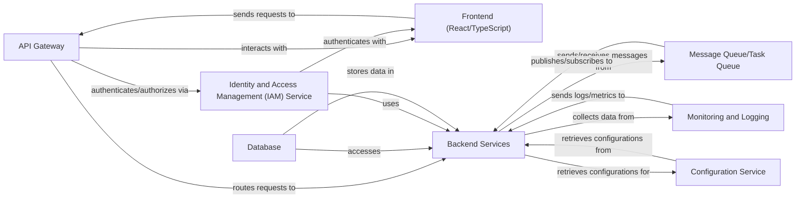

## Details

The user is explaining why they cannot provide source code references. They are stating that they need 'Project Context (`meta_context`)', 'CFG Data', and 'Subsystem Boundaries' to accurately map abstract components to their corresponding source code. They are also explicitly saying 'I cannot update the analysis with source code references at this time.' and asking for `project_name` and `meta_context`. The model should acknowledge the user's explanation and limitations. It should not try to call `AnalysisInsights` because the user is explicitly stating they *cannot* provide the necessary information for source code references, which is a part of the `AnalysisinsightsComponentsReferencedSourceCode` within `AnalysisinsightsComponents`. The user is essentially saying 'I can't do what you asked because I'm missing information X, Y, Z. Please provide X and Y.' The model's response should reflect an understanding of this.

### API Gateway [[Expand]](./API_Gateway.md)
Handles incoming API requests and routes them to the appropriate backend services.

**Related Classes/Methods**: _None_

### Frontend (React/TypeScript)
User interface built with React and TypeScript, consuming APIs from the backend.

**Related Classes/Methods**: _None_

### Identity and Access Management (IAM) Service [[Expand]](./Identity_and_Access_Management_IAM_Service.md)
Manages user authentication, authorization, and user data.

**Related Classes/Methods**: _None_

### Backend Services
Provides core business logic and data processing capabilities.

**Related Classes/Methods**: _None_

### Database
Stores and manages application data.

**Related Classes/Methods**: _None_

### Message Queue/Task Queue
Handles asynchronous tasks and message queuing.

**Related Classes/Methods**: _None_

### Monitoring and Logging
Monitors the health and performance of the application.

**Related Classes/Methods**: _None_

### Configuration Service
Manages configuration for various services.

**Related Classes/Methods**: _None_

### [FAQ](https://github.com/CodeBoarding/GeneratedOnBoardings/tree/main?tab=readme-ov-file#faq)