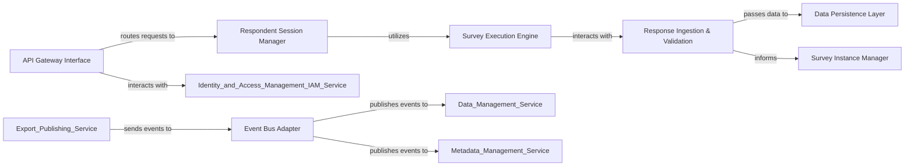

## Details

The feedback highlights two critical areas: the absence of source code references for the identified components and the omission of certain external services involved in the subsystem's interactions.

### API Gateway Interface
Serves as the external entry point for the `Data Collection Service`, handling incoming requests for survey initiation and response submission. It acts as a facade, routing requests to the appropriate internal components.

**Related Classes/Methods**: _None_

### Respondent Session Manager
Manages the state and progress of individual respondents throughout their interaction with a survey instance. It tracks respondent progress, handles session continuity, and orchestrates the flow of survey questions.

**Related Classes/Methods**: _None_

### Survey Instance Manager
Responsible for the creation, tracking, and overall lifecycle management of active survey instances. It ensures that each survey execution is properly initialized and its status is maintained.

**Related Classes/Methods**: _None_

### Survey Execution Engine
Interprets and executes the survey logic based on instrument definitions. It dynamically generates questions, applies skip logic, and enforces validation rules as respondents progress through the survey.

**Related Classes/Methods**: _None_

### Response Ingestion & Validation
Receives raw response data submitted by respondents, performs initial validation against the survey schema, and processes the data before persistence.

**Related Classes/Methods**: _None_

### Data Persistence Layer
Handles the storage and retrieval of all survey-related data, including survey instances, respondent session data, and raw responses, within its dedicated data store (e.g., PostgreSQL for structured data, MongoDB for flexible metadata).

**Related Classes/Methods**: _None_

### Event Bus Adapter
Manages asynchronous communication for the `Data Collection Service`, responsible for publishing events (e.g., "response submitted," "survey completed") and consuming events from other services (e.g., "new survey published").

**Related Classes/Methods**: _None_

### [FAQ](https://github.com/CodeBoarding/GeneratedOnBoardings/tree/main?tab=readme-ov-file#faq)