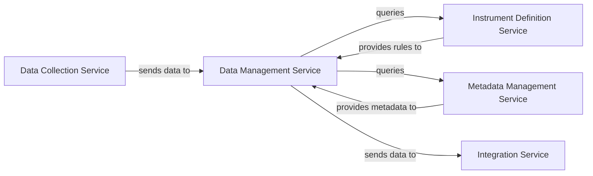

## Details

Abstract components and their relations based on the provided overview.

### Data Management Service [[Expand]](./Data_Management_Service.md)
The core component responsible for the ingestion, comprehensive validation, transformation, and secure storage of collected survey data. It ensures data quality and integrity by applying rules and metadata obtained from other services.

**Related Classes/Methods**: _None_

### Data Collection Service [[Expand]](./Data_Collection_Service.md)
Serves as the primary entry point for raw survey data into the system. It collects and forwards this data to the Data Management Service for processing.

**Related Classes/Methods**: _None_

### Instrument Definition Service
Manages and provides the structural definitions of survey instruments, including question types, response formats, and specific validation rules. These definitions are crucial for the Data Management Service to perform data validation.

**Related Classes/Methods**: _None_

### Metadata Management Service
Stores and provides DDI (Data Documentation Initiative) metadata, which is vital for the comprehensive validation, transformation, and contextual understanding of the survey data within the Data Management Service.

**Related Classes/Methods**: _None_

### Integration Service [[Expand]](./Integration_Service.md)
Facilitates the export of processed and validated survey data from the Data Management Service to various external systems or downstream processes.

**Related Classes/Methods**: _None_

### [FAQ](https://github.com/CodeBoarding/GeneratedOnBoardings/tree/main?tab=readme-ov-file#faq)