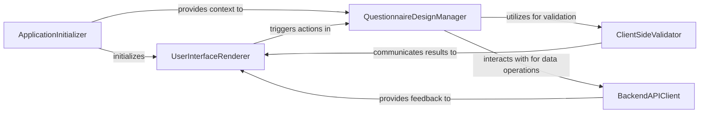

## Details

Abstract components and their relationships for a frontend application, where source code references are not available.

### ApplicationInitializer
The main entry point and bootstrapping component for the frontend application. It is responsible for setting up the global application state, configuring the primary UI layout, initializing routing, and orchestrating the initial loading of other core frontend components.

**Related Classes/Methods**: _None_

### UserInterfaceRenderer
Renders all graphical user interface elements (e.g., forms, tables, navigation, data visualizations). It manages the presentation state, captures user interactions (clicks, input), and translates them into application events or commands for processing by other components.

**Related Classes/Methods**: _None_

### QuestionnaireDesignManager
Manages the core business logic for creating, editing, deleting, and organizing DDI design elements (e.g., questions, variables, sections, instrument flows). It acts as the orchestrator for design-related operations, ensuring adherence to DDI standards and business rules.

**Related Classes/Methods**: _None_

### ClientSideValidator
Performs real-time, client-side validation of DDI design elements and the overall questionnaire structure against predefined rules and constraints. It provides immediate feedback to the user, improving data quality and user experience before submission to backend services.

**Related Classes/Methods**: _None_

### BackendAPIClient
Provides an abstract interface for the frontend to interact with backend data persistence and business logic services. It handles the communication (e.g., via RESTful API calls) for saving, loading, and managing DDI design data and collected data. This component acts as a proxy to the actual backend microservices.

**Related Classes/Methods**: _None_

### [FAQ](https://github.com/CodeBoarding/GeneratedOnBoardings/tree/main?tab=readme-ov-file#faq)