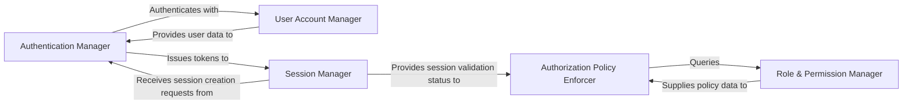

## Details

One paragraph explaining the functionality which is represented by this graph. What the main flow is and what is its purpose.

### Authentication Manager
Handles user login processes, validates credentials (e.g., username/password), and issues authentication tokens (e.g., JWTs) upon successful verification. It is the primary entry point for user identity verification.

**Related Classes/Methods**: _None_

### Authorization Policy Enforcer
Evaluates incoming requests against defined access policies and user permissions to determine if a user or service is authorized to perform a specific action or access a particular resource. It acts as the decision point for access control.

**Related Classes/Methods**: _None_

### User Account Manager
Manages the lifecycle of user accounts, including registration, profile management, password resets, and account status (e.g., active, locked). It serves as the authoritative source for user data.

**Related Classes/Methods**: _None_

### Role & Permission Manager
Defines, stores, and manages roles (collections of permissions) and individual permissions. It handles the assignment of these roles and permissions to users or groups.

**Related Classes/Methods**: _None_

### Session Manager
Manages active user sessions, including token validation, session expiry, and token revocation. It ensures the ongoing validity of authenticated sessions.

**Related Classes/Methods**: _None_

### [FAQ](https://github.com/CodeBoarding/GeneratedOnBoardings/tree/main?tab=readme-ov-file#faq)