```mermaid
graph LR
    API_Gateway["API Gateway"]
    Identity_and_Access_Management_IAM_Service["Identity and Access Management (IAM) Service"]
    Questionnaire_Management_Service["Questionnaire Management Service"]
    ddi_designer["ddi-designer"]
    Data_Collection_Service["Data Collection Service"]
    Metadata_Service["Metadata Service"]
    Data_Management_Service["Data Management Service"]
    Integration_Service["Integration Service"]
    API_Gateway -- "routes requests to" --> Questionnaire_Management_Service
    API_Gateway -- "routes requests to" --> Data_Collection_Service
    Identity_and_Access_Management_IAM_Service -- "provides authentication/authorization to" --> API_Gateway
    Identity_and_Access_Management_IAM_Service -- "provides authentication/authorization to" --> Integration_Service
    Questionnaire_Management_Service -- "stores questionnaire definitions in" --> Metadata_Service
    Questionnaire_Management_Service -- "provides questionnaire definitions to" --> Data_Collection_Service
    ddi_designer -- "provides DDI definitions to" --> Integration_Service
    ddi_designer -- "stores DDI definitions in" --> Metadata_Service
    Data_Collection_Service -- "stores collected data in" --> Data_Management_Service
    Metadata_Service -- "provides DDI definitions to" --> Integration_Service
    Data_Management_Service -- "provides data for export to" --> Integration_Service
    Integration_Service -- "imports/exports data with" --> Data_Management_Service
    click API_Gateway href "https://github.com/CodeBoarding/GeneratedOnBoardings/blob/main/ddi-designer/API_Gateway.md" "Details"
    click Identity_and_Access_Management_IAM_Service href "https://github.com/CodeBoarding/GeneratedOnBoardings/blob/main/ddi-designer/Identity_and_Access_Management_IAM_Service.md" "Details"
    click Questionnaire_Management_Service href "https://github.com/CodeBoarding/GeneratedOnBoardings/blob/main/ddi-designer/Questionnaire_Management_Service.md" "Details"
    click Data_Collection_Service href "https://github.com/CodeBoarding/GeneratedOnBoardings/blob/main/ddi-designer/Data_Collection_Service.md" "Details"
    click Metadata_Service href "https://github.com/CodeBoarding/GeneratedOnBoardings/blob/main/ddi-designer/Metadata_Service.md" "Details"
    click Data_Management_Service href "https://github.com/CodeBoarding/GeneratedOnBoardings/blob/main/ddi-designer/Data_Management_Service.md" "Details"
    click Integration_Service href "https://github.com/CodeBoarding/GeneratedOnBoardings/blob/main/ddi-designer/Integration_Service.md" "Details"
```

## Details

One paragraph explaining the functionality which is represented by this graph. What the main flow is and what is its purpose.

### API Gateway [[Expand]](./API_Gateway.md)
Acts as the single entry point for all client requests, routing them to the appropriate microservices, handling authentication, rate limiting, and load balancing.

**Related Classes/Methods**: _None_

### Identity and Access Management (IAM) Service [[Expand]](./Identity_and_Access_Management_IAM_Service.md)
Manages user identities, authentication (e.g., OAuth2, JWT), and authorization policies across all services.

**Related Classes/Methods**: _None_

### Questionnaire Management Service [[Expand]](./Questionnaire_Management_Service.md)
Provides functionalities for designing, versioning, publishing, and managing statistical questionnaires. It interacts with the Metadata Service to store questionnaire definitions.

**Related Classes/Methods**: _None_

### ddi-designer
A specialized component (likely a frontend application or a dedicated backend service) focused on creating and managing Data Definition Interface (DDI) specifications, which are then used by other services like the Integration Service.

**Related Classes/Methods**: _None_

### Data Collection Service [[Expand]](./Data_Collection_Service.md)
Manages the process of data collection, including survey administration, data entry, and initial validation based on published questionnaires. It stores collected raw data.

**Related Classes/Methods**: _None_

### Metadata Service [[Expand]](./Metadata_Service.md)
Central repository for all metadata, including DDI definitions, questionnaire structures, data schemas, and integration configurations. It provides metadata to other services.

**Related Classes/Methods**: _None_

### Data Management Service [[Expand]](./Data_Management_Service.md)
Responsible for the long-term storage, retrieval, transformation, and quality assurance of collected statistical data. It provides APIs for data access and analysis.

**Related Classes/Methods**: _None_

### Integration Service [[Expand]](./Integration_Service.md)
Manages external integrations, enabling seamless data import from and export to other systems and platforms. It handles data format conversions, communication protocols, and relies on DDI definitions for structured data exchange.

**Related Classes/Methods**: _None_

### [FAQ](https://github.com/CodeBoarding/GeneratedOnBoardings/tree/main?tab=readme-ov-file#faq)