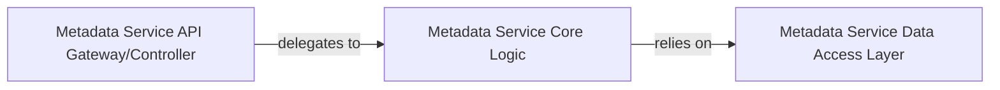

## Details

The Metadata Service acts as the centralized repository for all DDI 3.3 compliant metadata, providing services for defining, storing, and retrieving metadata elements, schemas, and controlled vocabularies. Within the context of a Complex Enterprise-Grade Data Management and Collection System, this service adheres to microservices architectural patterns by encapsulating its domain logic and data management.

### Metadata Service API Gateway/Controller
This component serves as the external interface for the Metadata Service, handling incoming API requests related to DDI metadata. It is responsible for routing requests to the appropriate internal service logic and ensuring proper request/response formatting. It acts as the primary entry point for external interactions with the metadata capabilities.

**Related Classes/Methods**:

- `com.example.ddidesigner.DDIController` (1:1)

### Metadata Service Core Logic
Encapsulates the core business logic for defining, storing, retrieving, and managing DDI metadata elements, schemas, and vocabularies. This component orchestrates the operations required to fulfill metadata-related requests, applying business rules and interacting with the data persistence layer.

**Related Classes/Methods**:

- `com.example.ddidesigner.DDIService` (1:1)

### Metadata Service Data Access Layer
Manages the persistence layer for the Metadata Service, facilitating interactions with the underlying database(s) (e.g., PostgreSQL for structured data, MongoDB for flexible metadata) for DDI metadata storage and retrieval. It abstracts the database specifics from the core business logic.

**Related Classes/Methods**:

- `com.example.ddidesigner.DDIDatabaseConnector` (1:1)

### [FAQ](https://github.com/CodeBoarding/GeneratedOnBoardings/tree/main?tab=readme-ov-file#faq)