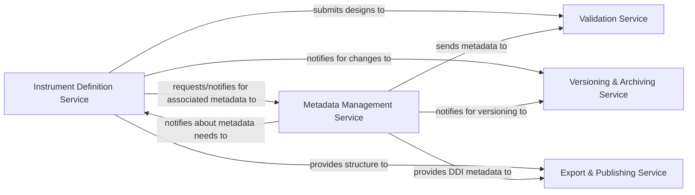

## Details

Analysis of the Questionnaire Management Service components and their relationships, noting the absence of discoverable source code references.

### Instrument Definition Service
This is the core component responsible for the design and definition of survey instruments, questions, and conditional logic. It manages the creation, modification, and deletion of the structural and logical elements of questionnaires.

**Related Classes/Methods**: _None_

### Versioning & Archiving Service
Directly addresses the versioning aspect of the Questionnaire Management Service. It is responsible for tracking changes, managing versions, enabling reverts, and archiving completed designs.

**Related Classes/Methods**: _None_

### Export & Publishing Service
Handles the publication aspect, making finalized questionnaires available. This includes generating DDI-compliant outputs and managing publication workflows.

**Related Classes/Methods**: _None_

### Metadata Management Service
A crucial supporting component that ensures all questionnaire elements are richly annotated. It is responsible for defining, storing, and retrieving DDI-specific metadata for instruments and questions, integral to the design and publication process.

**Related Classes/Methods**: _None_

### Validation Service
Ensures the quality and compliance of the designed questionnaires, which is an inherent part of managing their lifecycle. It validates instrument designs and metadata against DDI standards and business rules.

**Related Classes/Methods**: _None_

### [FAQ](https://github.com/CodeBoarding/GeneratedOnBoardings/tree/main?tab=readme-ov-file#faq)