```mermaid
graph LR
    Frontend_Application["Frontend Application"]
    API_Gateway["API Gateway"]
    Identity_and_Access_Management_IAM_Service["Identity and Access Management (IAM) Service"]
    Questionnaire_Management_Service["Questionnaire Management Service"]
    Data_Collection_Service["Data Collection Service"]
    Metadata_Service["Metadata Service"]
    Data_Management_Service["Data Management Service"]
    Integration_Service["Integration Service"]
    Frontend_Application -- "interacts with" --> API_Gateway
    API_Gateway -- "delegates authentication to" --> Identity_and_Access_Management_IAM_Service
    API_Gateway -- "routes requests to" --> Questionnaire_Management_Service
    API_Gateway -- "routes requests to" --> Data_Collection_Service
    API_Gateway -- "routes requests to" --> Metadata_Service
    API_Gateway -- "routes requests to" --> Data_Management_Service
    API_Gateway -- "routes requests to" --> Integration_Service
    Questionnaire_Management_Service -- "consumes metadata from" --> Metadata_Service
    Questionnaire_Management_Service -- "relies on" --> Identity_and_Access_Management_IAM_Service
    Data_Collection_Service -- "sends data to" --> Data_Management_Service
    Data_Collection_Service -- "relies on" --> Identity_and_Access_Management_IAM_Service
    Metadata_Service -- "relies on" --> Identity_and_Access_Management_IAM_Service
    Data_Management_Service -- "uses metadata from" --> Metadata_Service
    Data_Management_Service -- "relies on" --> Identity_and_Access_Management_IAM_Service
    Integration_Service -- "sends data to" --> Data_Management_Service
    Integration_Service -- "receives data from" --> Data_Management_Service
    Integration_Service -- "relies on" --> Identity_and_Access_Management_IAM_Service
    click Frontend_Application href "https://github.com/CodeBoarding/GeneratedOnBoardings/blob/main/ddi-designer/Frontend_Application.md" "Details"
    click API_Gateway href "https://github.com/CodeBoarding/GeneratedOnBoardings/blob/main/ddi-designer/API_Gateway.md" "Details"
    click Identity_and_Access_Management_IAM_Service href "https://github.com/CodeBoarding/GeneratedOnBoardings/blob/main/ddi-designer/Identity_and_Access_Management_IAM_Service.md" "Details"
    click Questionnaire_Management_Service href "https://github.com/CodeBoarding/GeneratedOnBoardings/blob/main/ddi-designer/Questionnaire_Management_Service.md" "Details"
    click Data_Collection_Service href "https://github.com/CodeBoarding/GeneratedOnBoardings/blob/main/ddi-designer/Data_Collection_Service.md" "Details"
    click Metadata_Service href "https://github.com/CodeBoarding/GeneratedOnBoardings/blob/main/ddi-designer/Metadata_Service.md" "Details"
    click Data_Management_Service href "https://github.com/CodeBoarding/GeneratedOnBoardings/blob/main/ddi-designer/Data_Management_Service.md" "Details"
    click Integration_Service href "https://github.com/CodeBoarding/GeneratedOnBoardings/blob/main/ddi-designer/Integration_Service.md" "Details"
```

## Details

One paragraph explaining the functionality which is represented by this graph. What the main flow is and what is its purpose.

### Frontend Application [[Expand]](./Frontend_Application.md)
The user interface for designing questionnaires, collecting data, and managing metadata. It provides the interactive experience for users to create, edit, and manage survey instruments and view collected data.

**Related Classes/Methods**: _None_

### API Gateway [[Expand]](./API_Gateway.md)
Acts as the single entry point for all external requests into the microservices ecosystem. It handles request routing, load balancing, and authentication (delegating to IAM).

**Related Classes/Methods**: _None_

### Identity and Access Management (IAM) Service [[Expand]](./Identity_and_Access_Management_IAM_Service.md)
Manages user authentication, authorization, and access control across all services, ensuring only authorized users can perform specific actions.

**Related Classes/Methods**: _None_

### Questionnaire Management Service [[Expand]](./Questionnaire_Management_Service.md)
Manages the complete lifecycle of questionnaires, including their design, versioning, and publication, handling the definition of survey instruments, questions, and conditional logic.

**Related Classes/Methods**: _None_

### Data Collection Service [[Expand]](./Data_Collection_Service.md)
Facilitates the execution of surveys and the collection of raw response data from various sources, managing survey instances and respondent interactions.

**Related Classes/Methods**: _None_

### Metadata Service [[Expand]](./Metadata_Service.md)
Acts as the centralized repository for all DDI 3.3 compliant metadata, providing services for defining, storing, and retrieving metadata elements, schemas, and controlled vocabularies.

**Related Classes/Methods**: _None_

### Data Management Service [[Expand]](./Data_Management_Service.md)
Handles the ingestion, comprehensive validation, transformation, and secure storage of collected survey data, ensuring data quality and integrity.

**Related Classes/Methods**: _None_

### Integration Service [[Expand]](./Integration_Service.md)
Manages external integrations, enabling seamless data import and export with other systems and platforms, handling data format conversions and communication protocols.

**Related Classes/Methods**: _None_

### [FAQ](https://github.com/CodeBoarding/GeneratedOnBoardings/tree/main?tab=readme-ov-file#faq)