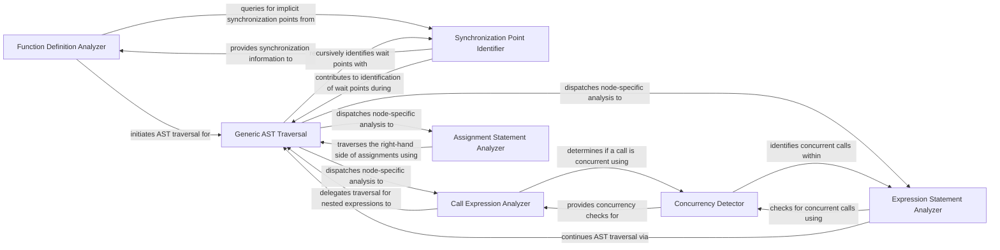

## Details

The `AST Instrumentation & Analysis` subsystem is responsible for statically analyzing the Abstract Syntax Tree (AST) of decorated functions within the `deco` library. Its primary boundary is defined by its focus on identifying concurrent calls, implicit synchronization points, and data dependencies directly from the source code's structure. This subsystem's core functionality is encapsulated within the `deco.astutil` module.

### Function Definition Analyzer
Serves as the entry point for initiating the static analysis of a decorated function's Abstract Syntax Tree (AST). It orchestrates the initial traversal and high-level identification of concurrency-related elements.

**Related Classes/Methods**:

- <a href="https://github.com/alex-sherman/deco/blob/master/deco/astutil.py#L154-L158" target="_blank" rel="noopener noreferrer">`deco.astutil.visit_FunctionDef`:154-158</a>

### Generic AST Traversal
Provides the foundational mechanism for recursively traversing the AST nodes. It dispatches control to specific `visit_` methods for detailed, node-type-specific analysis, ensuring comprehensive coverage of the function's structure.

**Related Classes/Methods**:

- <a href="https://github.com/alex-sherman/deco/blob/master/deco/astutil.py#L73-L76" target="_blank" rel="noopener noreferrer">`deco.astutil.generic_visit`:73-76</a>

### Concurrency Detector
Determines whether a specific function call expression within the AST represents a concurrent operation. This component guides the parallelization decisions by flagging calls that can or should be executed in parallel.

**Related Classes/Methods**:

- <a href="https://github.com/alex-sherman/deco/blob/master/deco/astutil.py#L54-L55" target="_blank" rel="noopener noreferrer">`deco.astutil.is_concurrent_call`:54-55</a>

### Synchronization Point Identifier
Identifies and extracts information about implicit synchronization points (e.g., `await` or `wait` constructs, or inferred synchronization needs) within the AST. This is critical for managing the flow of concurrent execution and ensuring data consistency.

**Related Classes/Methods**:

- <a href="https://github.com/alex-sherman/deco/blob/master/deco/astutil.py#L64-L65" target="_blank" rel="noopener noreferrer">`deco.astutil.get_waits`:64-65</a>

### Call Expression Analyzer
Specifically handles the analysis of `ast.Call` nodes. It leverages the `Concurrency Detector` to identify concurrent calls and delegates further traversal of nested expressions to the `Generic AST Traversal`.

**Related Classes/Methods**:

- <a href="https://github.com/alex-sherman/deco/blob/master/deco/astutil.py#L67-L71" target="_blank" rel="noopener noreferrer">`deco.astutil.visit_Call`:67-71</a>

### Expression Statement Analyzer
Processes `ast.Expr` nodes, which often encapsulate function calls. It uses the `Concurrency Detector` to check for concurrent calls within these expressions and continues AST traversal via `Generic AST Traversal`.

**Related Classes/Methods**:

- <a href="https://github.com/alex-sherman/deco/blob/master/deco/astutil.py#L84-L112" target="_blank" rel="noopener noreferrer">`deco.astutil.visit_Expr`:84-112</a>

### Assignment Statement Analyzer
Analyzes `ast.Assign` nodes to understand data flow and dependencies. This is crucial for identifying potential race conditions or data hazards in a concurrent environment, using `Generic AST Traversal` for the right-hand side of assignments.

**Related Classes/Methods**:

- <a href="https://github.com/alex-sherman/deco/blob/master/deco/astutil.py#L136-L152" target="_blank" rel="noopener noreferrer">`deco.astutil.visit_Assign`:136-152</a>

### [FAQ](https://github.com/CodeBoarding/GeneratedOnBoardings/tree/main?tab=readme-ov-file#faq)