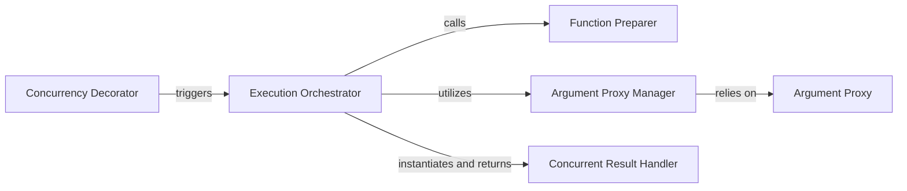

## Details

The Concurrency Decorator subsystem is central to the deco project, providing a high-level abstraction for parallel execution through the @concurrent decorator. It embodies the Decorator and Facade patterns, simplifying the initiation and management of concurrent operations.

### Concurrency Decorator [[Expand]](./Concurrency_Decorator.md)
The primary user-facing interface, acting as a facade via the @concurrent decorator to simplify parallel execution. It's the entry point for initiating concurrent operations, marking functions for parallelization.

**Related Classes/Methods**:

- <a href="https://github.com/alex-sherman/deco/blob/master/deco/conc.py#L65-L150" target="_blank" rel="noopener noreferrer">`deco.conc.concurrent`:65-150</a>

### Execution Orchestrator
Encapsulates the core orchestration logic for concurrent execution. This method is invoked when a function decorated with @concurrent is called, managing the entire concurrent operation from argument preparation to initiating asynchronous execution.

**Related Classes/Methods**:

- <a href="https://github.com/alex-sherman/deco/blob/master/deco/conc.py#L118-L130" target="_blank" rel="noopener noreferrer">`deco.conc.__call__`:118-130</a>

### Function Preparer
Responsible for preparing the decorated function for concurrent execution, ensuring it's in a suitable state for parallel processing.

**Related Classes/Methods**:

- <a href="https://github.com/alex-sherman/deco/blob/master/deco/conc.py#L106-L110" target="_blank" rel="noopener noreferrer">`deco.conc.setFunction`:106-110</a>

### Argument Proxy Manager
Manages and transforms function arguments by converting them into proxy objects, facilitating safe and efficient data transfer across process boundaries.

**Related Classes/Methods**:

- <a href="https://github.com/alex-sherman/deco/blob/master/deco/conc.py#L98-L104" target="_blank" rel="noopener noreferrer">`deco.conc.replaceWithProxies`:98-104</a>

### Argument Proxy
Represents the actual wrapper or proxy object for individual arguments, enabling their serialization and deserialization for inter-process communication.

**Related Classes/Methods**:

- <a href="https://github.com/alex-sherman/deco/blob/master/deco/conc.py#L15-L33" target="_blank" rel="noopener noreferrer">`deco.conc.argProxy`:15-33</a>

### Concurrent Result Handler
Serves as a placeholder for the eventual outcome of a concurrent operation, enabling non-blocking operations and allowing the main thread to continue execution while results are computed asynchronously.

**Related Classes/Methods**:

- <a href="https://github.com/alex-sherman/deco/blob/master/deco/conc.py#L154-L162" target="_blank" rel="noopener noreferrer">`deco.conc.ConcurrentResult`:154-162</a>

### [FAQ](https://github.com/CodeBoarding/GeneratedOnBoardings/tree/main?tab=readme-ov-file#faq)