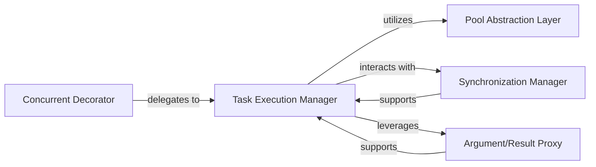

## Details

The `deco.conc` subsystem provides a robust framework for managing concurrent operations, primarily leveraging Python's multiprocessing capabilities. The `Concurrent Decorator` acts as the primary entry point, setting up the concurrent execution context. It delegates the core task processing to the `Task Execution Manager`, which orchestrates the submission and lifecycle of tasks. The `Pool Abstraction Layer` provides a unified interface to underlying multiprocessing pools, abstracting away the complexities of process management. Implicit synchronization and data consistency across parallel tasks are handled by the `Synchronization Manager`. Finally, the `Argument/Result Proxy` ensures seamless data transfer between processes by managing serialization and deserialization of arguments and results. This architecture promotes a clear separation of concerns, enabling efficient and manageable concurrent programming.

### Concurrent Decorator
Serves as the high-level entry point and primary decorator for initiating custom concurrent operations. It sets up the necessary context and orchestrates the environment for functions to be executed in parallel, embodying the Facade and Decorator patterns.

**Related Classes/Methods**:

- <a href="https://github.com/alex-sherman/deco/blob/master/deco/conc.py#L70-L75" target="_blank" rel="noopener noreferrer">`deco.conc._custom_concurrent`:70-75</a>

### Task Execution Manager
Responsible for the core logic of processing tasks within the concurrent environment. It directly interacts with the underlying multiprocessing pool to manage task submission, distribution, and lifecycle, acting as the primary Task/Job Executor.

**Related Classes/Methods**:

- <a href="https://github.com/alex-sherman/deco/blob/master/deco/conc.py#L132-L134" target="_blank" rel="noopener noreferrer">`deco.conc.apply_operations`:132-134</a>

### Pool Abstraction Layer
Provides an abstract interface to the raw `multiprocessing.pool` or similar parallel execution environments. It handles the low-level details of process management, resource pooling, and task queuing, abstracting these complexities from higher-level components.

**Related Classes/Methods**:

- <a href="https://github.com/alex-sherman/deco/blob/master/deco/conc.py#L65-L150" target="_blank" rel="noopener noreferrer">`deco.conc.concurrent`:65-150</a>

### Synchronization Manager
Manages the implicit synchronization mechanisms required for coordinating parallel tasks. This includes handling data consistency, ensuring proper ordering of operations, and managing shared state across processes without explicit user intervention.

**Related Classes/Methods**:

- <a href="https://github.com/alex-sherman/deco/blob/master/deco/conc.py#L36-L62" target="_blank" rel="noopener noreferrer">`deco.conc.synchronized`:36-62</a>

### Argument/Result Proxy
Facilitates the seamless transfer of arguments to and results from parallel processes. It handles the serialization, deserialization, and marshalling of data across process boundaries, abstracting the complexities of inter-process communication.

**Related Classes/Methods**:

- <a href="https://github.com/alex-sherman/deco/blob/master/deco/conc.py#L15-L33" target="_blank" rel="noopener noreferrer">`deco.conc.argProxy`:15-33</a>

### [FAQ](https://github.com/CodeBoarding/GeneratedOnBoardings/tree/main?tab=readme-ov-file#faq)