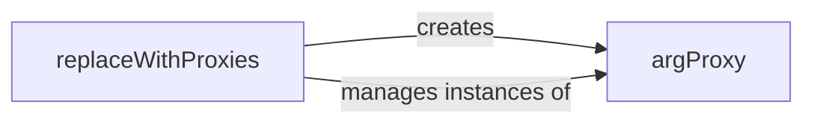

## Details

The `deco` subsystem facilitates seamless inter-process argument handling through a proxying mechanism. The `replaceWithProxies` component serves as the entry point, responsible for identifying complex data structures (dictionaries and lists) within function arguments that require remote access. Upon identification, `replaceWithProxies` orchestrates the creation of `argProxy` instances, which encapsulate the original arguments. These `argProxy` objects then manage the serialization and deserialization of the arguments, allowing worker processes to interact with them as if they were local. This architecture ensures efficient and transparent data transfer and manipulation across process boundaries, abstracting the complexities of distributed argument management.

### replaceWithProxies
This component acts as the high-level orchestrator for preparing data for inter-process transfer. It identifies which function arguments require proxying (specifically dictionaries and lists), manages the overall process of replacing original arguments with their proxy representations, and ensures data is in a transferrable format. It serves as a Facade, simplifying the complex proxying mechanism for the rest of the system.

**Related Classes/Methods**: _None_

### argProxy
This component is responsible for the creation, management, and core logic of the actual proxy objects. It encapsulates the serialization of an argument when it leaves the originating process and its deserialization when accessed by a worker process. It handles the underlying mechanics of data transfer and access for individual arguments, embodying the "Argument/Result Proxy/Wrapper" pattern.

**Related Classes/Methods**: _None_

### [FAQ](https://github.com/CodeBoarding/GeneratedOnBoardings/tree/main?tab=readme-ov-file#faq)