```mermaid
graph LR
    Concurrency_Decorator["Concurrency Decorator"]
    AST_Instrumentation_Analysis["AST Instrumentation & Analysis"]
    Concurrent_Task_Execution_Engine["Concurrent Task Execution Engine"]
    Asynchronous_Result_Management["Asynchronous Result Management"]
    Inter_Process_Data_Proxy_Serialization["Inter-Process Data Proxy & Serialization"]
    Concurrency_Decorator -- "Initiates analysis" --> AST_Instrumentation_Analysis
    Concurrency_Decorator -- "Triggers runtime execution" --> Concurrent_Task_Execution_Engine
    AST_Instrumentation_Analysis -- "Provides task definitions" --> Concurrent_Task_Execution_Engine
    AST_Instrumentation_Analysis -- "Informs about synchronization requirements" --> Asynchronous_Result_Management
    Concurrent_Task_Execution_Engine -- "Produces raw results" --> Asynchronous_Result_Management
    Concurrent_Task_Execution_Engine -- "Exchanges proxied data" --> Inter_Process_Data_Proxy_Serialization
    Inter_Process_Data_Proxy_Serialization -- "Prepares results for management" --> Asynchronous_Result_Management
    Asynchronous_Result_Management -- "Returns final results" --> Concurrency_Decorator
    click Concurrency_Decorator href "https://github.com/CodeBoarding/GeneratedOnBoardings/blob/main/deco/Concurrency_Decorator.md" "Details"
    click AST_Instrumentation_Analysis href "https://github.com/CodeBoarding/GeneratedOnBoardings/blob/main/deco/AST_Instrumentation_Analysis.md" "Details"
    click Concurrent_Task_Execution_Engine href "https://github.com/CodeBoarding/GeneratedOnBoardings/blob/main/deco/Concurrent_Task_Execution_Engine.md" "Details"
    click Inter_Process_Data_Proxy_Serialization href "https://github.com/CodeBoarding/GeneratedOnBoardings/blob/main/deco/Inter_Process_Data_Proxy_Serialization.md" "Details"
```

## Details

The `deco` project implements an automatic parallelization framework centered around a `Concurrency Decorator`. This decorator orchestrates the entire process, starting with `AST Instrumentation & Analysis` to statically identify parallelizable operations and synchronization points within decorated functions. The insights from this analysis guide the `Concurrent Task Execution Engine`, which manages the actual multiprocessing. `Inter-Process Data Proxy & Serialization` ensures efficient data exchange between the main and worker processes. `Asynchronous Result Management` then handles the collection, processing, and implicit synchronization of results, leveraging the synchronization requirements identified during AST analysis, before returning the final outcomes to the `Concurrency Decorator`. This architecture ensures a seamless transition from decorated function definition to parallel execution with automated result handling and synchronization.

### Concurrency Decorator [[Expand]](./Concurrency_Decorator.md)
The primary user-facing interface, acting as a facade via the `@concurrent` decorator to simplify parallel execution. It's the entry point for initiating concurrent operations.

**Related Classes/Methods**:

- <a href="https://github.com/alex-sherman/deco/blob/master/deco/conc.py#L65-L150" target="_blank" rel="noopener noreferrer">`deco.conc.concurrent`:65-150</a>
- <a href="https://github.com/alex-sherman/deco/blob/master/deco/conc.py#L118-L130" target="_blank" rel="noopener noreferrer">`deco.conc.__call__`:118-130</a>

### AST Instrumentation & Analysis [[Expand]](./AST_Instrumentation_Analysis.md)
Statically analyzes the AST of decorated functions to identify concurrent calls, implicit synchronization points, and data dependencies, crucial for automatic parallelization.

**Related Classes/Methods**:

- <a href="https://github.com/alex-sherman/deco/blob/master/deco/astutil.py#L154-L158" target="_blank" rel="noopener noreferrer">`deco.astutil.visit_FunctionDef`:154-158</a>
- <a href="https://github.com/alex-sherman/deco/blob/master/deco/astutil.py#L64-L65" target="_blank" rel="noopener noreferrer">`deco.astutil.get_waits`:64-65</a>
- <a href="https://github.com/alex-sherman/deco/blob/master/deco/astutil.py#L54-L55" target="_blank" rel="noopener noreferrer">`deco.astutil.is_concurrent_call`:54-55</a>
- <a href="https://github.com/alex-sherman/deco/blob/master/deco/astutil.py#L73-L76" target="_blank" rel="noopener noreferrer">`deco.astutil.generic_visit`:73-76</a>

### Concurrent Task Execution Engine [[Expand]](./Concurrent_Task_Execution_Engine.md)
The core component managing the submission and lifecycle of tasks to a multiprocessing pool, leveraging Python's `multiprocessing.pool` for parallel execution.

**Related Classes/Methods**:

- <a href="https://github.com/alex-sherman/deco/blob/master/deco/conc.py#L70-L75" target="_blank" rel="noopener noreferrer">`deco.conc._custom_concurrent`:70-75</a>
- <a href="https://github.com/alex-sherman/deco/blob/master/deco/conc.py#L132-L134" target="_blank" rel="noopener noreferrer">`deco.conc.apply_operations`:132-134</a>

### Asynchronous Result Management
Handles asynchronous results from concurrent operations, providing mechanisms for retrieval and implicit synchronization by blocking until results are available, ensuring data consistency.

**Related Classes/Methods**:

- <a href="https://github.com/alex-sherman/deco/blob/master/deco/conc.py#L154-L162" target="_blank" rel="noopener noreferrer">`deco.conc.ConcurrentResult`:154-162</a>
- <a href="https://github.com/alex-sherman/deco/blob/master/deco/conc.py#L161-L162" target="_blank" rel="noopener noreferrer">`deco.conc.result`:161-162</a>
- <a href="https://github.com/alex-sherman/deco/blob/master/deco/conc.py#L136-L150" target="_blank" rel="noopener noreferrer">`deco.conc.wait`:136-150</a>
- <a href="https://github.com/alex-sherman/deco/blob/master/deco/conc.py#L158-L159" target="_blank" rel="noopener noreferrer">`deco.conc.get`:158-159</a>

### Inter-Process Data Proxy & Serialization [[Expand]](./Inter_Process_Data_Proxy_Serialization.md)
Facilitates seamless and efficient data transfer (arguments and results) between the main process and worker processes using proxy objects and managing serialization/deserialization.

**Related Classes/Methods**:

- <a href="https://github.com/alex-sherman/deco/blob/master/deco/conc.py#L98-L104" target="_blank" rel="noopener noreferrer">`deco.conc.replaceWithProxies`:98-104</a>
- <a href="https://github.com/alex-sherman/deco/blob/master/deco/conc.py#L15-L33" target="_blank" rel="noopener noreferrer">`deco.conc.argProxy`:15-33</a>

### [FAQ](https://github.com/CodeBoarding/GeneratedOnBoardings/tree/main?tab=readme-ov-file#faq)