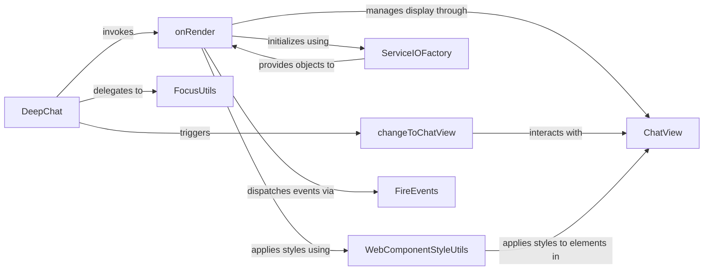

## Details

The DeepChat Core Orchestrator subsystem is centered around the DeepChat component, which acts as the primary control unit for the entire DeepChat UI. This subsystem is responsible for managing the chat lifecycle, configuration, UI coordination, and orchestrating integrations with various services.

### DeepChat
The core orchestrator, acting as the primary entry point and central control unit for the entire DeepChat UI component. It handles lifecycle management, configuration, UI coordination, and serves as the main programmatic interface for developers.

**Related Classes/Methods**:

- <a href="https://github.com/OvidijusParsiunas/deep-chat/blob/main/example-servers/nextjs/pages-router/pages/index.tsx#L14-L16" target="_blank" rel="noopener noreferrer">`DeepChat`:14-16</a>

### onRender
Initiates the initial rendering and setup of the chat interface, including establishing service connections and applying styles.

**Related Classes/Methods**:

- <a href="https://github.com/OvidijusParsiunas/deep-chat/blob/main/component/src/deepChat.ts#L236-L261" target="_blank" rel="noopener noreferrer">`onRender`:236-261</a>

### changeToChatView
Triggers visual transitions and updates to the main chat view, ensuring a dynamic and responsive user interface.

**Related Classes/Methods**:

- <a href="https://github.com/OvidijusParsiunas/deep-chat/blob/main/component/src/deepChat.ts#L230-L233" target="_blank" rel="noopener noreferrer">`changeToChatView`:230-233</a>

### ServiceIOFactory
Delegates the creation and management of backend service integration objects, abstracting the complexities of various API connections. This is crucial for the "strong API Integration capabilities."

**Related Classes/Methods**:

- <a href="https://github.com/OvidijusParsiunas/deep-chat/blob/main/component/src/services/serviceIOFactory.ts#L44-L174" target="_blank" rel="noopener noreferrer">`ServiceIOFactory`:44-174</a>

### ChatView
Directs the construction and display of chat messages and input controls, forming the visual core of the chat interface.

**Related Classes/Methods**:

- <a href="https://github.com/OvidijusParsiunas/deep-chat/blob/main/component/src/views/chat/chatView.ts#L9-L25" target="_blank" rel="noopener noreferrer">`ChatView`:9-25</a>

### WebComponentStyleUtils
Applies component-specific and default styling, ensuring visual consistency and customization options for the UI component.

**Related Classes/Methods**:

- <a href="https://github.com/OvidijusParsiunas/deep-chat/blob/main/component/src/utils/webComponent/webComponentStyleUtils.ts#L5-L49" target="_blank" rel="noopener noreferrer">`WebComponentStyleUtils`:5-49</a>

### FireEvents
Dispatches lifecycle and interaction events to external listeners, enabling extensibility and integration with other parts of an application.

**Related Classes/Methods**:

- <a href="https://github.com/OvidijusParsiunas/deep-chat/blob/main/component/src/utils/events/fireEvents.ts#L6-L38" target="_blank" rel="noopener noreferrer">`FireEvents`:6-38</a>

### FocusUtils
Delegates the management of input focus for enhanced user experience, particularly important in interactive chat interfaces.

**Related Classes/Methods**:

- <a href="https://github.com/OvidijusParsiunas/deep-chat/blob/main/component/src/views/chat/input/textInput/focusUtils.ts#L4-L21" target="_blank" rel="noopener noreferrer">`FocusUtils`:4-21</a>

### [FAQ](https://github.com/CodeBoarding/GeneratedOnBoardings/tree/main?tab=readme-ov-file#faq)