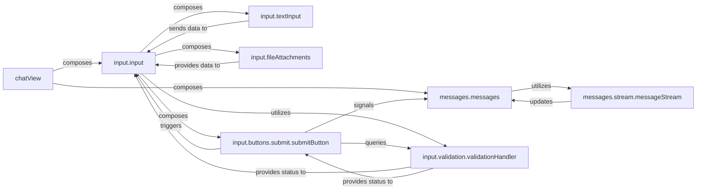

## Details

The `chatView` serves as the central orchestrator, composing the `input.input` and `messages.messages` components to form the complete chat interface. The `input.input` component manages all user input, integrating `input.textInput` for text entry, `input.fileAttachments` for file handling, and `input.buttons.submit.submitButton` for message submission. Input validation is handled by `input.validation.validationHandler`, which is utilized by `input.input` and queried by `input.buttons.submit.submitButton`. Upon submission, `input.buttons.submit.submitButton` signals `messages.messages` to display the new message. The `messages.messages` component is responsible for rendering and managing all chat messages, including dynamic updates from `messages.stream.messageStream` for real-time content. This architecture ensures a clear separation of concerns between input handling and message display, orchestrated by the main chat view.

### chatView
The top-level orchestrator and container for the entire chat user interface. It initializes and integrates the input area and the message display area, providing the complete chat experience.

**Related Classes/Methods**:

- <a href="https://github.com/OvidijusParsiunas/deep-chat/blob/main/component/src/views/chat/chatView.ts#L9-L25" target="_blank" rel="noopener noreferrer">`chatView`:9-25</a>

### input.input
Acts as the central manager for all user input functionalities. It coordinates the various input elements such as text entry, file attachments, and action buttons, handling their data flow and events.

**Related Classes/Methods**:

- <a href="https://github.com/OvidijusParsiunas/deep-chat/blob/main/component/src/views/chat/input/input.ts#L31-L117" target="_blank" rel="noopener noreferrer">`input.input`:31-117</a>

### messages.messages
The core component for rendering, managing, and displaying all types of chat messages (text, media, errors, loading states). It handles the visual presentation, scrolling, and overall lifecycle of messages within the chat history, including persistence and speech functionalities.

**Related Classes/Methods**:

- <a href="https://github.com/OvidijusParsiunas/deep-chat/blob/main/component/src/views/chat/messages/messages.ts" target="_blank" rel="noopener noreferrer">`messages.messages`</a>

### input.textInput
Provides the primary text entry field for users to type messages. It manages text input events and content.

**Related Classes/Methods**:

- <a href="https://github.com/OvidijusParsiunas/deep-chat/blob/main/component/src/views/chat/input/input.ts" target="_blank" rel="noopener noreferrer">`input.textInput`</a>

### input.fileAttachments
Manages the user interface and logic for attaching files, including drag-and-drop functionality, file selection, and displaying attached file previews.

**Related Classes/Methods**:

- <a href="https://github.com/OvidijusParsiunas/deep-chat/blob/main/component/src/views/chat/input/input.ts" target="_blank" rel="noopener noreferrer">`input.fileAttachments`</a>

### input.buttons.submit.submitButton
Controls the submission of user messages and files. It manages its interactive state (e.g., enabled/disabled, loading indicator) based on input validity and submission status.

**Related Classes/Methods**:

- <a href="https://github.com/OvidijusParsiunas/deep-chat/blob/main/component/src/views/chat/input/buttons/submit/submitButton.ts" target="_blank" rel="noopener noreferrer">`input.buttons.submit.submitButton`</a>

### input.validation.validationHandler
Encapsulates the logic for validating user input (e.g., text length, file types, file sizes) before a message is submitted.

**Related Classes/Methods**:

- <a href="https://github.com/OvidijusParsiunas/deep-chat/blob/main/component/src/views/chat/input/validation/validationHandler.ts" target="_blank" rel="noopener noreferrer">`input.validation.validationHandler`</a>

### messages.stream.messageStream
Specifically handles the dynamic, real-time updates and rendering of messages that are streamed from external sources (e.g., AI model responses), ensuring a smooth and continuous display.

**Related Classes/Methods**:

- <a href="https://github.com/OvidijusParsiunas/deep-chat/blob/main/component/src/views/chat/messages/stream/messageStream.ts" target="_blank" rel="noopener noreferrer">`messages.stream.messageStream`</a>

### [FAQ](https://github.com/CodeBoarding/GeneratedOnBoardings/tree/main?tab=readme-ov-file#faq)