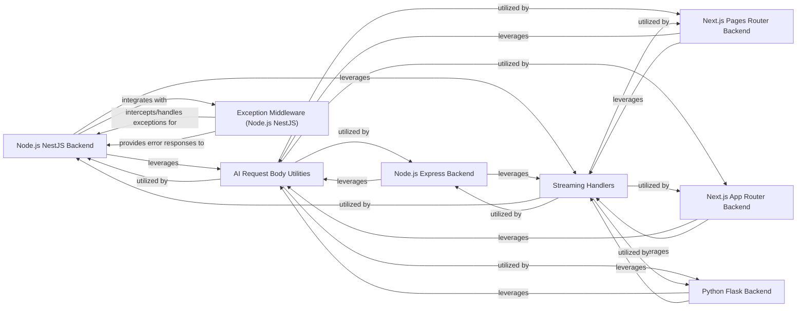

## Details

The DeepChat project's backend architecture is designed to be highly flexible, supporting various frameworks and programming languages to handle AI service integrations. At its core, the system comprises distinct backend implementations for Node.js (NestJS and Express), Next.js (Pages Router and App Router), and Python Flask. These backend components serve as the primary interface for DeepChat, receiving user requests and orchestrating interactions with external AI APIs.

A critical aspect of this architecture is the `AI Request Body Utilities` component, which centralizes the logic for standardizing data formats sent to diverse AI services. This ensures consistency and simplifies the integration of new AI models. Complementing this, the `Streaming Handlers` component is responsible for managing and delivering real-time conversational responses back to the DeepChat client, enabling dynamic and interactive user experiences.

For robust error management, particularly within the Node.js NestJS environment, the `Exception Middleware` component intercepts and handles exceptions arising from AI API interactions, ensuring graceful error reporting to the DeepChat frontend. This modular design allows for easy extension and maintenance, with clear interaction pathways between the backend frameworks and the shared utility and streaming components.

### Node.js NestJS Backend
Provides API endpoints and service logic for DeepChat using the NestJS framework, handling incoming requests and orchestrating interactions with AI services.

**Related Classes/Methods**:

- <a href="https://github.com/OvidijusParsiunas/deep-chat/blob/main/example-servers/node/nestjs/src/app.controller.ts" target="_blank" rel="noopener noreferrer">`app.controller.ts`</a>
- <a href="https://github.com/OvidijusParsiunas/deep-chat/blob/main/example-servers/node/nestjs/src/services" target="_blank" rel="noopener noreferrer">`services`</a>

### Node.js Express Backend
Provides API endpoints and service logic for DeepChat using the Express framework, serving as a direct interface for DeepChat's requests.

**Related Classes/Methods**:

- <a href="https://github.com/OvidijusParsiunas/deep-chat/blob/main/example-servers/node/express/src/app.ts" target="_blank" rel="noopener noreferrer">`app.ts`</a>
- <a href="https://github.com/OvidijusParsiunas/deep-chat/blob/main/example-servers/node/express/src/services" target="_blank" rel="noopener noreferrer">`services`</a>

### Next.js Pages Router Backend
Defines API routes for DeepChat integration within a Next.js Pages Router application, acting as the serverless backend for DeepChat.

**Related Classes/Methods**:

- <a href="https://github.com/OvidijusParsiunas/deep-chat/blob/main/component/src/webModel/webModel.ts#L264-L276" target="_blank" rel="noopener noreferrer">`api`:264-276</a>

### Next.js App Router Backend
Defines API routes for DeepChat integration within a Next.js App Router application, providing a modern Next.js backend for DeepChat.

**Related Classes/Methods**:

- <a href="https://github.com/OvidijusParsiunas/deep-chat/blob/main/component/src/webModel/webModel.ts#L264-L276" target="_blank" rel="noopener noreferrer">`api`:264-276</a>

### Python Flask Backend
Provides API endpoints and service logic for DeepChat using the Python Flask framework, demonstrating a Python-based backend integration.

**Related Classes/Methods**:

- <a href="https://github.com/OvidijusParsiunas/deep-chat/blob/main/example-servers/python/flask/src/app.py" target="_blank" rel="noopener noreferrer">`app.py`</a>
- <a href="https://github.com/OvidijusParsiunas/deep-chat/blob/main/example-servers/python/flask/src/services" target="_blank" rel="noopener noreferrer">`services`</a>

### AI Request Body Utilities
Contains common utility functions across different backend frameworks for standardizing data formats sent to external AI APIs, ensuring consistent request structures.

**Related Classes/Methods**:

- <a href="https://github.com/OvidijusParsiunas/deep-chat/blob/main/example-servers/node/nestjs/src/services/openAI.ts#L10-L24" target="_blank" rel="noopener noreferrer">`createChatBody`:10-24</a>
- <a href="https://github.com/OvidijusParsiunas/deep-chat/blob/main/example-servers/node/nestjs/src/services/huggingFace.ts#L29-L36" target="_blank" rel="noopener noreferrer">`createConversationBody`:29-36</a>
- <a href="https://github.com/OvidijusParsiunas/deep-chat/blob/main/example-servers/node/nestjs/src/services/huggingFace.ts#L52-L65" target="_blank" rel="noopener noreferrer">`sendFile`:52-65</a>
- <a href="https://github.com/OvidijusParsiunas/deep-chat/blob/main/example-servers/node/nestjs/src/services/huggingFace.ts" target="_blank" rel="noopener noreferrer">`huggingFace.ts:createConversationBody`</a>
- <a href="https://github.com/OvidijusParsiunas/deep-chat/blob/main/example-servers/nextjs/pages-router/utils/openAIChatBody.ts" target="_blank" rel="noopener noreferrer">`openAIChatBody.ts:createReqChatBody`</a>
- <a href="https://github.com/OvidijusParsiunas/deep-chat/blob/main/example-servers/python/flask/src/services/openAI.py" target="_blank" rel="noopener noreferrer">`openAI.py:create_chat_body`</a>

### Streaming Handlers
Components responsible for managing and sending streaming responses back to the DeepChat client, crucial for real-time conversational experiences.

**Related Classes/Methods**:

- <a href="https://github.com/OvidijusParsiunas/deep-chat/blob/main/example-servers/node/nestjs/src/services/custom.ts#L15-L25" target="_blank" rel="noopener noreferrer">`chatStream`:15-25</a>
- <a href="https://github.com/OvidijusParsiunas/deep-chat/blob/main/example-servers/node/nestjs/src/services/custom.ts#L27-L39" target="_blank" rel="noopener noreferrer">`sendStream`:27-39</a>
- <a href="https://github.com/OvidijusParsiunas/deep-chat/blob/main/example-servers/node/nestjs/src/services/custom.ts" target="_blank" rel="noopener noreferrer">`custom.ts:chatStream`</a>
- <a href="https://github.com/OvidijusParsiunas/deep-chat/blob/main/example-servers/node/nestjs/src/services/custom.ts" target="_blank" rel="noopener noreferrer">`custom.ts:sendStream`</a>
- <a href="https://github.com/OvidijusParsiunas/deep-chat/blob/main/example-servers/nextjs/pages-router/pages/api/custom/chat-stream.ts" target="_blank" rel="noopener noreferrer">`chat-stream.ts:handler`</a>
- <a href="https://github.com/OvidijusParsiunas/deep-chat/blob/main/example-servers/python/flask/src/services/custom.py" target="_blank" rel="noopener noreferrer">`custom.py:chat_stream`</a>
- <a href="https://github.com/OvidijusParsiunas/deep-chat/blob/main/example-servers/python/flask/src/services/custom.py" target="_blank" rel="noopener noreferrer">`custom.py:send_stream`</a>

### Exception Middleware (Node.js NestJS)
Specific error handling components for the NestJS implementation, ensuring robust error reporting from AI API interactions to DeepChat.

**Related Classes/Methods**:

- <a href="https://github.com/OvidijusParsiunas/deep-chat/blob/main/example-servers/node/nestjs/src/utils/cohereExceptionMiddleware.ts#L4-L18" target="_blank" rel="noopener noreferrer">`CohereExceptionMiddleware`:4-18</a>
- <a href="https://github.com/OvidijusParsiunas/deep-chat/blob/main/example-servers/node/nestjs/src/utils/openAIExceptionMiddleware.ts#L4-L18" target="_blank" rel="noopener noreferrer">`OpenAIExceptionMiddleware`:4-18</a>

### [FAQ](https://github.com/CodeBoarding/GeneratedOnBoardings/tree/main?tab=readme-ov-file#faq)