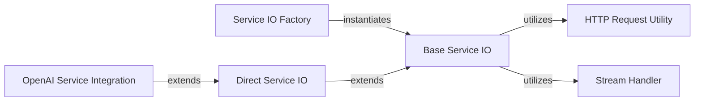

## Details

The `deep-chat` project's service integration subsystem provides a robust and extensible framework for connecting to various AI services. At its core, the `Service IO Factory` orchestrates the creation of service-specific I/O handlers, all built upon the abstract `Base Service IO`. This base class defines common API interaction patterns and leverages the `HTTP Request Utility` for network communication and the `Stream Handler` for managing real-time data flows. Concrete implementations, such as `Direct Service IO` for simpler API key authentications and `OpenAI Service Integration` (e.g., `OpenAIChatIO`) for specific service logic, extend this foundational structure, ensuring a consistent and maintainable approach to integrating diverse AI capabilities.

### Service IO Factory
The central factory responsible for creating instances of various service-specific I/O handlers. It abstracts the instantiation logic, providing the correct service integration based on the application's configuration. This component acts as the primary orchestrator for selecting and initializing the appropriate service connector.

**Related Classes/Methods**:

- <a href="https://github.com/OvidijusParsiunas/deep-chat/blob/main/component/src/services/serviceIOFactory.ts#L44-L174" target="_blank" rel="noopener noreferrer">`serviceIOFactory`:44-174</a>

### Base Service IO
An abstract base class that provides a foundational layer for all service I/O operations. It defines common methods for API calls, key verification, and file type handling, serving as a consistent interface and reusable logic for concrete service integrations.

**Related Classes/Methods**:

- <a href="https://github.com/OvidijusParsiunas/deep-chat/blob/main/component/src/services/utils/baseServiceIO.ts#L29-L167" target="_blank" rel="noopener noreferrer">`baseServiceIO`:29-167</a>

### Direct Service IO
A concrete implementation of `Base Service IO` specifically designed to handle direct API key authentication and connection settings for simpler service integrations. It streamlines the process for services that do not require complex authentication flows.

**Related Classes/Methods**:

- <a href="https://github.com/OvidijusParsiunas/deep-chat/blob/main/component/src/services/utils/directServiceIO.ts#L10-L60" target="_blank" rel="noopener noreferrer">`directServiceIO`:10-60</a>

### OpenAI Service Integration
A dedicated concrete class for integrating with the OpenAI service, exemplified by `OpenAIChatIO`. It implements service-specific logic for request construction, endpoint handling, response parsing, and data formatting. This component exemplifies the pattern for all other specific AI service integrations (e.g., HuggingfaceIO, CohereIO, GeminiIO), each handling its respective API.

**Related Classes/Methods**:

- <a href="https://github.com/OvidijusParsiunas/deep-chat/blob/main/component/src/services/openAI/openAIChatIO.ts#L23-L214" target="_blank" rel="noopener noreferrer">`OpenAIChatIO`:23-214</a>

### HTTP Request Utility
A fundamental utility component responsible for executing HTTP requests. It encapsulates the core network communication logic, providing a standardized way for service integration components to interact with external APIs.

**Related Classes/Methods**:

- <a href="https://github.com/OvidijusParsiunas/deep-chat/blob/main/component/src/utils/HTTP/HTTPRequest.ts#L14-L112" target="_blank" rel="noopener noreferrer">`HTTPRequest`:14-112</a>

### Stream Handler
A utility component designed for managing and processing data streams. This is particularly crucial for handling real-time or continuous data flows, such as streaming responses from AI services.

**Related Classes/Methods**:

- <a href="https://github.com/OvidijusParsiunas/deep-chat/blob/main/example-servers/node/nestjs/src/services/custom.ts#L15-L25" target="_blank" rel="noopener noreferrer">`Stream`:15-25</a>

### [FAQ](https://github.com/CodeBoarding/GeneratedOnBoardings/tree/main?tab=readme-ov-file#faq)