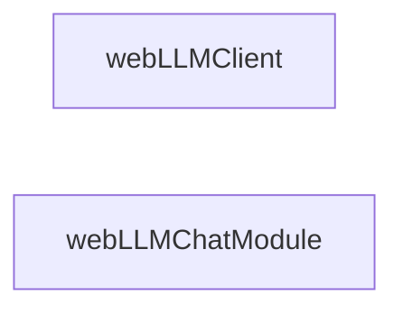

## Details

Analysis of webLLMClient and webLLMChatModule within the deep-chat project, focusing on identifying their source code locations and defining their roles and interactions.

### webLLMClient
Handles client-side operations for WebLLM.

**Related Classes/Methods**: _None_

### webLLMChatModule
Manages chat-related functionalities for WebLLM.

**Related Classes/Methods**: _None_

### [FAQ](https://github.com/CodeBoarding/GeneratedOnBoardings/tree/main?tab=readme-ov-file#faq)