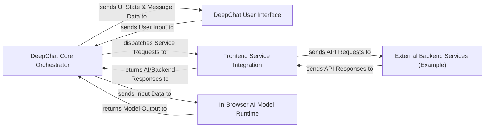

## Details

The DeepChat architecture is centered around the DeepChat Core Orchestrator, which acts as the central hub for all chat-related operations. User interactions originate from the DeepChat User Interface, which captures input and displays messages, maintaining a dynamic dialogue with the orchestrator. For AI processing, the orchestrator can either dispatch requests to the Frontend Service Integration for communication with various external AI/backend services (e.g., OpenAI, Hugging Face), or, if configured, send input directly to the In-Browser AI Model Runtime for client-side inference. The External Backend Services (Example) component represents illustrative server-side implementations that can interact with the Frontend Service Integration, demonstrating how DeepChat can integrate with custom backend logic and external AI APIs. This modular design allows for flexible deployment and integration with diverse AI models and backend infrastructures.

### DeepChat Core Orchestrator [[Expand]](./DeepChat_Core_Orchestrator.md)
The central component managing the entire chat lifecycle, configuration, and coordination between UI, services, and internal logic. It's the primary entry point for developers to configure and interact with the DeepChat component.

**Related Classes/Methods**:

- <a href="https://github.com/OvidijusParsiunas/deep-chat/blob/main/component/src/deepChat.ts#L49-L266" target="_blank" rel="noopener noreferrer">`component.src.deepChat.DeepChat`:49-266</a>

### DeepChat User Interface [[Expand]](./DeepChat_User_Interface.md)
Handles all aspects of the chat user interface, including rendering messages, managing the input area, and processing user interactions (text input, file uploads, media buttons).

**Related Classes/Methods**:

- <a href="https://github.com/OvidijusParsiunas/deep-chat/blob/main/component/src/views/chat/chatView.ts" target="_blank" rel="noopener noreferrer">`component.src.views.chat.chatView`</a>
- <a href="https://github.com/OvidijusParsiunas/deep-chat/blob/main/component/src/views/chat/input/input.ts" target="_blank" rel="noopener noreferrer">`component.src.views.chat.input.input`</a>
- <a href="https://github.com/OvidijusParsiunas/deep-chat/blob/main/component/src/views/chat/input/textInput" target="_blank" rel="noopener noreferrer">`component.src.views.chat.input.textInput`</a>
- <a href="https://github.com/OvidijusParsiunas/deep-chat/blob/main/component/src/views/chat/input/fileAttachments" target="_blank" rel="noopener noreferrer">`component.src.views.chat.input.fileAttachments`</a>
- <a href="https://github.com/OvidijusParsiunas/deep-chat/blob/main/component/src/views/chat/input/buttons/microphone" target="_blank" rel="noopener noreferrer">`component.src.views.chat.input.buttons.microphone`</a>
- <a href="https://github.com/OvidijusParsiunas/deep-chat/blob/main/component/src/views/chat/input/buttons/camera" target="_blank" rel="noopener noreferrer">`component.src.views.chat.input.buttons.camera`</a>
- <a href="https://github.com/OvidijusParsiunas/deep-chat/blob/main/component/src/views/chat/input/validation" target="_blank" rel="noopener noreferrer">`component.src.views.chat.input.validation`</a>
- <a href="https://github.com/OvidijusParsiunas/deep-chat/blob/main/component/src/views/chat/messages/messages.ts" target="_blank" rel="noopener noreferrer">`component.src.views.chat.messages.messages`</a>
- <a href="https://github.com/OvidijusParsiunas/deep-chat/blob/main/component/src/views/chat/messages/stream" target="_blank" rel="noopener noreferrer">`component.src.views.chat.messages.stream`</a>
- <a href="https://github.com/OvidijusParsiunas/deep-chat/blob/main/component/src/views/chat/messages/history" target="_blank" rel="noopener noreferrer">`component.src.views.chat.messages.history`</a>
- <a href="https://github.com/OvidijusParsiunas/deep-chat/blob/main/component/src/views/chat/messages/browserStorage" target="_blank" rel="noopener noreferrer">`component.src.views.chat.messages.browserStorage`</a>
- <a href="https://github.com/OvidijusParsiunas/deep-chat/blob/main/component/src/views/chat/messages/textToSpeech" target="_blank" rel="noopener noreferrer">`component.src.views.chat.messages.textToSpeech`</a>

### Frontend Service Integration [[Expand]](./Frontend_Service_Integration.md)
Manages communication with various external AI/backend services directly from the frontend. It abstracts service-specific API calls and handles data formatting for different AI providers.

**Related Classes/Methods**:

- <a href="https://github.com/OvidijusParsiunas/deep-chat/blob/main/component/src/services/serviceIOFactory.ts" target="_blank" rel="noopener noreferrer">`component.src.services.serviceIOFactory`</a>
- <a href="https://github.com/OvidijusParsiunas/deep-chat/blob/main/component/src/services/utils/baseServiceIO.ts" target="_blank" rel="noopener noreferrer">`component.src.services.utils.baseServiceIO`</a>
- <a href="https://github.com/OvidijusParsiunas/deep-chat/blob/main/component/src/services/utils/directServiceIO.ts" target="_blank" rel="noopener noreferrer">`component.src.services.utils.directServiceIO`</a>
- <a href="https://github.com/OvidijusParsiunas/deep-chat/blob/main/component/src/services/openAI" target="_blank" rel="noopener noreferrer">`component.src.services.openAI`</a>
- <a href="https://github.com/OvidijusParsiunas/deep-chat/blob/main/component/src/services/huggingFace" target="_blank" rel="noopener noreferrer">`component.src.services.huggingFace`</a>
- <a href="https://github.com/OvidijusParsiunas/deep-chat/blob/main/component/src/services/cohere" target="_blank" rel="noopener noreferrer">`component.src.services.cohere`</a>
- <a href="https://github.com/OvidijusParsiunas/deep-chat/blob/main/component/src/services/stabilityAI" target="_blank" rel="noopener noreferrer">`component.src.services.stabilityAI`</a>
- <a href="https://github.com/OvidijusParsiunas/deep-chat/blob/main/component/src/services/azure" target="_blank" rel="noopener noreferrer">`component.src.services.azure`</a>
- <a href="https://github.com/OvidijusParsiunas/deep-chat/blob/main/component/src/services/ollama" target="_blank" rel="noopener noreferrer">`component.src.services.ollama`</a>
- <a href="https://github.com/OvidijusParsiunas/deep-chat/blob/main/component/src/services/gemini" target="_blank" rel="noopener noreferrer">`component.src.services.gemini`</a>
- <a href="https://github.com/OvidijusParsiunas/deep-chat/blob/main/component/src/services/mistral" target="_blank" rel="noopener noreferrer">`component.src.services.mistral`</a>
- <a href="https://github.com/OvidijusParsiunas/deep-chat/blob/main/component/src/services/assemblyAI" target="_blank" rel="noopener noreferrer">`component.src.services.assemblyAI`</a>
- <a href="https://github.com/OvidijusParsiunas/deep-chat/blob/main/component/src/services/kimi" target="_blank" rel="noopener noreferrer">`component.src.services.kimi`</a>
- <a href="https://github.com/OvidijusParsiunas/deep-chat/blob/main/component/src/services/qwen" target="_blank" rel="noopener noreferrer">`component.src.services.qwen`</a>
- <a href="https://github.com/OvidijusParsiunas/deep-chat/blob/main/component/src/services/deepSeek" target="_blank" rel="noopener noreferrer">`component.src.services.deepSeek`</a>

### In-Browser AI Model Runtime [[Expand]](./In_Browser_AI_Model_Runtime.md)
Enables the loading, initialization, and execution of AI models directly within the user's browser, facilitating client-side inference without external API calls.

**Related Classes/Methods**:

- <a href="https://github.com/OvidijusParsiunas/deep-chat/blob/main/component/src/webModel/webModel.ts" target="_blank" rel="noopener noreferrer">`component.src.webModel.webModel`</a>
- <a href="https://github.com/OvidijusParsiunas/deep-chat/blob/main/component/src/types/webModel/webLLM" target="_blank" rel="noopener noreferrer">`component.src.types.webModel.webLLM`</a>

### External Backend Services (Example) [[Expand]](./External_Backend_Services_Example_.md)
Illustrative backend API endpoints and service logic for different frameworks (Node.js, Next.js, Python Flask) that demonstrate how a custom backend can receive requests from DeepChat, interact with external AI APIs, and send responses back. These are external to the core DeepChat component.

**Related Classes/Methods**:

- <a href="https://github.com/OvidijusParsiunas/deep-chat/blob/main/example-servers/node/nestjs/src/app.controller.ts" target="_blank" rel="noopener noreferrer">`example-servers.node.nestjs.src.app.controller`</a>
- <a href="https://github.com/OvidijusParsiunas/deep-chat/blob/main/example-servers/node/express/src/app.ts" target="_blank" rel="noopener noreferrer">`example-servers.node.express.src.app.routes`</a>
- <a href="https://github.com/OvidijusParsiunas/deep-chat/blob/main/example-servers/nextjs/pages-router/pages/api" target="_blank" rel="noopener noreferrer">`example-servers.nextjs.pages-router.pages.api`</a>
- <a href="https://github.com/OvidijusParsiunas/deep-chat/blob/main/example-servers/nextjs/app-router/app/api" target="_blank" rel="noopener noreferrer">`example-servers.nextjs.app-router.app.api`</a>
- <a href="https://github.com/OvidijusParsiunas/deep-chat/blob/main/example-servers/python/flask/src/app.py" target="_blank" rel="noopener noreferrer">`example-servers.python.flask.src.app`</a>
- <a href="https://github.com/OvidijusParsiunas/deep-chat/blob/main/example-servers/node/nestjs/src/services" target="_blank" rel="noopener noreferrer">`example-servers.node.nestjs.src.services`</a>
- <a href="https://github.com/OvidijusParsiunas/deep-chat/blob/main/example-servers/node/express/src/services" target="_blank" rel="noopener noreferrer">`example-servers.node.express.src.services`</a>
- <a href="https://github.com/OvidijusParsiunas/deep-chat/blob/main/example-servers/python/flask/src/services" target="_blank" rel="noopener noreferrer">`example-servers.python.flask.src.services`</a>

### [FAQ](https://github.com/CodeBoarding/GeneratedOnBoardings/tree/main?tab=readme-ov-file#faq)