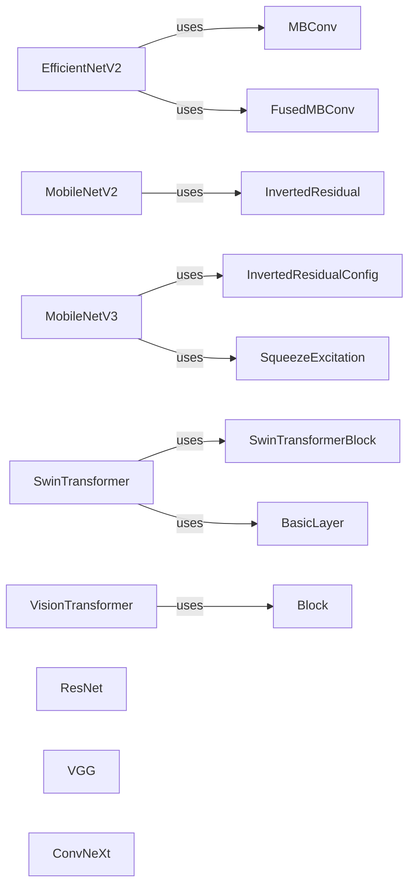

## Component Details

The Image Classification Models component provides a diverse set of pre-built and customizable deep learning models for image classification tasks, implemented in both TensorFlow and PyTorch. It encompasses various architectures, including EfficientNetV2, MobileNetV2/V3, Swin Transformer, Vision Transformer, ResNet, VGG, ConvNeXt, DenseNet, ShuffleNetV2, and RegNet. These models are designed to extract features from input images and predict the corresponding class labels. The component offers flexibility in model selection and customization to suit different image classification needs.

### EfficientNetV2
EfficientNetV2 is a convolutional neural network architecture that utilizes a combination of MBConv and FusedMBConv blocks to achieve high accuracy and efficiency. It defines the overall network structure and forward pass, optimizing for both performance and computational cost. The architecture is available in both TensorFlow and PyTorch implementations.
- **Related Classes/Methods**: `deep-learning-for-image-processing.tensorflow_classification.Test11_efficientnetV2.model.EfficientNetV2`, `deep-learning-for-image-processing.pytorch_classification.Test11_efficientnetV2.model.EfficientNetV2`, `deep-learning-for-image-processing.pytorch_classification.model_complexity.model.EfficientNetV2`

### MobileNetV2
MobileNetV2 is a lightweight convolutional neural network architecture designed for mobile and resource-constrained environments. It employs inverted residual blocks with linear bottlenecks to efficiently extract features from images. The architecture is available in both TensorFlow and PyTorch implementations.
- **Related Classes/Methods**: `deep-learning-for-image-processing.tensorflow_classification.ConfusionMatrix.model.MobileNetV2`, `deep-learning-for-image-processing.tensorflow_classification.Test6_mobilenet.model_v2.MobileNetV2`, `deep-learning-for-image-processing.pytorch_classification.ConfusionMatrix.model.MobileNetV2`, `deep-learning-for-image-processing.pytorch_classification.Test6_mobilenet.model_v2.MobileNetV2`

### MobileNetV3
MobileNetV3 is an evolution of MobileNetV2, incorporating squeeze and excitation layers and h-swish activation functions to further improve accuracy and efficiency. It is designed for mobile and resource-constrained environments and is available in both TensorFlow and PyTorch implementations.
- **Related Classes/Methods**: `deep-learning-for-image-processing.tensorflow_classification.Test6_mobilenet.model_v3.MobileNetV3`, `deep-learning-for-image-processing.pytorch_classification.Test6_mobilenet.model_v3.MobileNetV3`

### SwinTransformer
Swin Transformer is a hierarchical Transformer architecture that uses shifted windows to enable efficient self-attention computation on image patches. It is designed for image classification and other vision tasks and is available in both TensorFlow and PyTorch implementations.
- **Related Classes/Methods**: `deep-learning-for-image-processing.tensorflow_classification.swin_transformer.model.SwinTransformer`, `deep-learning-for-image-processing.pytorch_classification.swin_transformer.model.SwinTransformer`, `deep-learning-for-image-processing.pytorch_classification.grad_cam.swin_model.SwinTransformer`

### VisionTransformer
Vision Transformer (ViT) applies the Transformer architecture directly to image patches, treating them as tokens. It achieves competitive performance on image classification tasks and is available in both TensorFlow and PyTorch implementations.
- **Related Classes/Methods**: `deep-learning-for-image-processing.tensorflow_classification.vision_transformer.vit_model.VisionTransformer`, `deep-learning-for-image-processing.pytorch_classification.vision_transformer.vit_model.VisionTransformer`, `deep-learning-for-image-processing.pytorch_classification.grad_cam.vit_model.VisionTransformer`

### ResNet
ResNet (Residual Network) is a deep convolutional neural network architecture that uses residual connections to alleviate the vanishing gradient problem and enable training of very deep networks. It is available in various depths (e.g., ResNet34, ResNet50, ResNet101) and is implemented in both TensorFlow and PyTorch.
- **Related Classes/Methods**: `deep-learning-for-image-processing.tensorflow_classification.Test5_resnet.subclassed_model.ResNet`, `deep-learning-for-image-processing.tensorflow_classification.Test5_resnet.model`, `deep-learning-for-image-processing.pytorch_classification.Test5_resnet.model.ResNet`, `deep-learning-for-image-processing.pytorch_classification.analyze_weights_featuremap.resnet_model.ResNet`

### VGG
VGG (Visual Geometry Group) is a deep convolutional neural network architecture characterized by its simplicity and use of small convolutional filters. It is implemented in both TensorFlow and PyTorch.
- **Related Classes/Methods**: `deep-learning-for-image-processing.tensorflow_classification.Test3_vgg.model`, `deep-learning-for-image-processing.pytorch_classification.Test3_vggnet.model.VGG`

### ConvNeXt
ConvNeXt is a modern convolutional neural network architecture inspired by Transformers. It combines the strengths of both convolutional and Transformer-based models and is implemented in both TensorFlow and PyTorch.
- **Related Classes/Methods**: `deep-learning-for-image-processing.tensorflow_classification.ConvNeXt.model.ConvNeXt`, `deep-learning-for-image-processing.pytorch_classification.ConvNeXt.model.ConvNeXt`
