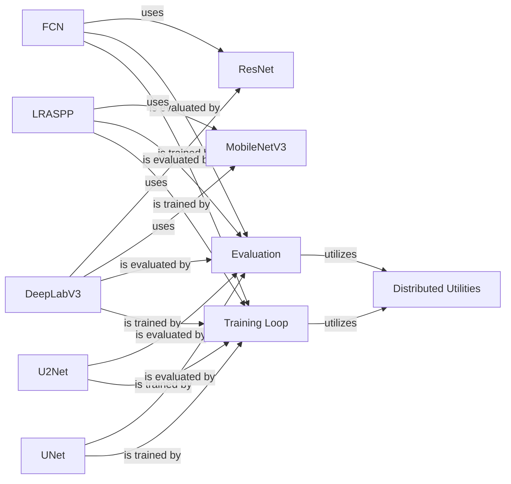

## Component Details

The Image Segmentation Models component provides a suite of deep learning models for pixel-level image classification, along with training and evaluation utilities. It encompasses various architectures like UNet, DeepLabV3, LRASPP, FCN, and U2Net, each tailored for specific segmentation tasks or computational constraints. The component also includes modules for distributed training and loss calculation, enabling efficient training and evaluation of these models on large datasets.

### UNet
The UNet component implements the U-Net architecture, a convolutional neural network designed for image segmentation. It features a contracting path for downsampling and an expansive path for upsampling, connected by skip connections to preserve fine-grained details. The UNet is a foundational model for various image segmentation tasks.
- **Related Classes/Methods**: `deep-learning-for-image-processing.pytorch_segmentation.unet.src.unet.UNet`, `deep-learning-for-image-processing.pytorch_segmentation.unet.src.unet.Down`, `deep-learning-for-image-processing.pytorch_segmentation.unet.src.unet.Up`

### DeepLabV3
The DeepLabV3 component implements the DeepLabV3 architecture, which utilizes atrous convolutions and spatial pyramid pooling (ASPP) to capture multi-scale contextual information for semantic image segmentation. It supports ResNet and MobileNetV3 backbones, offering flexibility in terms of accuracy and computational efficiency.
- **Related Classes/Methods**: `deep-learning-for-image-processing.pytorch_segmentation.deeplab_v3.src.deeplabv3_model.ASPP`, `deep-learning-for-image-processing.pytorch_segmentation.deeplab_v3.src.deeplabv3_model.DeepLabHead`, `deep-learning-for-image-processing.pytorch_segmentation.deeplab_v3.src.deeplabv3_model`

### LRASPP
The LRASPP component implements the LRASPP architecture, a lightweight variant of ASPP designed for mobile devices. It uses MobileNetV3 as a backbone and is optimized for efficient semantic image segmentation on resource-constrained platforms.
- **Related Classes/Methods**: `deep-learning-for-image-processing.pytorch_segmentation.lraspp.src.lraspp_model.LRASPP`

### FCN
The FCN component implements the Fully Convolutional Network (FCN) architecture for semantic image segmentation. It replaces fully connected layers with convolutional layers and uses a ResNet backbone to extract features. FCNs enable end-to-end pixel-wise prediction.
- **Related Classes/Methods**: `deep-learning-for-image-processing.pytorch_segmentation.fcn.src.fcn_model`

### U2Net
The U2Net component implements the U2Net architecture for salient object detection. It employs a nested U-structure to capture multi-scale features, enabling the model to effectively identify and segment salient objects in images.
- **Related Classes/Methods**: `deep-learning-for-image-processing.pytorch_segmentation.u2net.src.model.U2Net`, `deep-learning-for-image-processing.pytorch_segmentation.u2net.src.model.RSU`, `deep-learning-for-image-processing.pytorch_segmentation.u2net.src.model.RSU4F`

### MobileNetV3
The MobileNetV3 component implements the MobileNetV3 architecture, a lightweight convolutional neural network optimized for mobile devices. It serves as a backbone for DeepLabV3 and LRASPP, providing efficient feature extraction capabilities.
- **Related Classes/Methods**: `deep-learning-for-image-processing.pytorch_segmentation.deeplab_v3.src.mobilenet_backbone.MobileNetV3`, `deep-learning-for-image-processing.pytorch_segmentation.deeplab_v3.src.mobilenet_backbone.InvertedResidualConfig`, `deep-learning-for-image-processing.pytorch_segmentation.deeplab_v3.src.mobilenet_backbone.InvertedResidual`, `deep-learning-for-image-processing.pytorch_segmentation.deeplab_v3.src.mobilenet_backbone.SqueezeExcitation`, `deep-learning-for-image-processing.pytorch_segmentation.lraspp.src.mobilenet_backbone.MobileNetV3`, `deep-learning-for-image-processing.pytorch_segmentation.lraspp.src.mobilenet_backbone.InvertedResidualConfig`, `deep-learning-for-image-processing.pytorch_segmentation.lraspp.src.mobilenet_backbone.InvertedResidual`, `deep-learning-for-image-processing.pytorch_segmentation.lraspp.src.mobilenet_backbone.SqueezeExcitation`

### ResNet
The ResNet component implements the ResNet architecture, a deep residual network. It serves as a backbone for DeepLabV3 and FCN, providing powerful feature extraction capabilities for image segmentation tasks.
- **Related Classes/Methods**: `deep-learning-for-image-processing.pytorch_segmentation.deeplab_v3.src.resnet_backbone.ResNet`, `deep-learning-for-image-processing.pytorch_segmentation.deeplab_v3.src.resnet_backbone.Bottleneck`, `deep-learning-for-image-processing.pytorch_segmentation.fcn.src.backbone.ResNet`, `deep-learning-for-image-processing.pytorch_segmentation.fcn.src.backbone.Bottleneck`

### Training Loop
The Training Loop component encapsulates the training process for the image segmentation models. It includes the `train_one_epoch` function, which iterates over the training dataset, performs forward and backward passes, and updates the model parameters. It also uses `distributed_utils` for distributed training and `dice_coefficient_loss` for loss calculation.
- **Related Classes/Methods**: `deep-learning-for-image-processing.pytorch_segmentation.unet.train_utils.train_and_eval`, `deep-learning-for-image-processing.pytorch_segmentation.deeplab_v3.train_utils.train_and_eval`, `deep-learning-for-image-processing.pytorch_segmentation.lraspp.train_utils.train_and_eval`, `deep-learning-for-image-processing.pytorch_segmentation.u2net.train_utils.train_and_eval`, `deep-learning-for-image-processing.pytorch_segmentation.fcn.train_utils.train_and_eval`

### Evaluation
The Evaluation component provides functionality to evaluate the trained models on validation datasets. It includes the `evaluate` function, which calculates metrics such as dice coefficient, mean absolute error, or F1 score to assess the model's performance.
- **Related Classes/Methods**: `deep-learning-for-image-processing.pytorch_segmentation.unet.train_utils.train_and_eval`, `deep-learning-for-image-processing.pytorch_segmentation.deeplab_v3.train_utils.train_and_eval`, `deep-learning-for-image-processing.pytorch_segmentation.lraspp.train_utils.train_and_eval`, `deep-learning-for-image-processing.pytorch_segmentation.u2net.train_utils.train_and_eval`, `deep-learning-for-image-processing.pytorch_segmentation.fcn.train_utils.train_and_eval`

### Distributed Utilities
The Distributed Utilities component provides utility functions for distributed training. It includes functions for initializing distributed mode, getting world size and rank, and saving on the master process. These utilities facilitate training models on multiple GPUs or machines.
- **Related Classes/Methods**: `deep-learning-for-image-processing.pytorch_segmentation.unet.train_utils.distributed_utils`, `deep-learning-for-image-processing.pytorch_segmentation.deeplab_v3.train_utils.distributed_utils`, `deep-learning-for-image-processing.pytorch_segmentation.lraspp.train_utils.distributed_utils`, `deep-learning-for-image-processing.pytorch_segmentation.u2net.train_utils.distributed_utils`, `deep-learning-for-image-processing.pytorch_segmentation.fcn.train_utils.distributed_utils`
